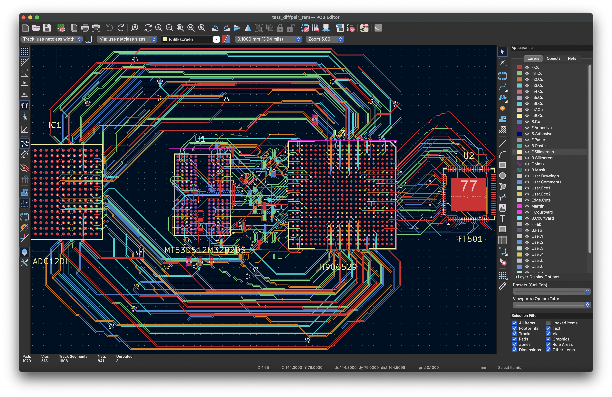
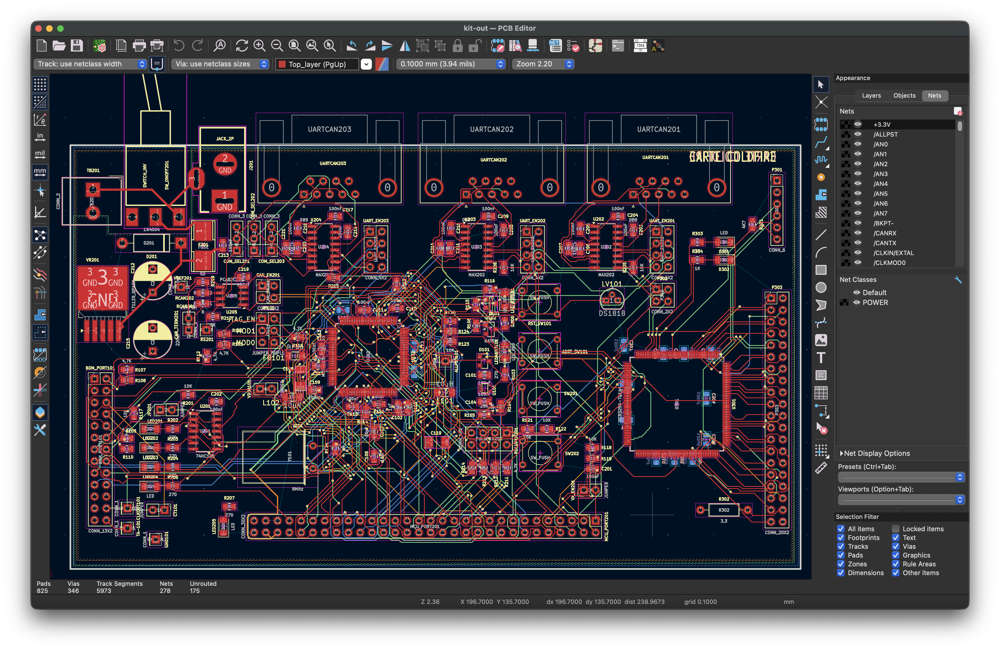

# KiCad PCB Grid Router

A fast Rust-accelerated A* autorouter for KiCad PCB files using integer grid coordinates. Routes nets between existing stub endpoints with multi-layer support and automatic via placement.





## Features

- **Grid-based A* pathfinding** with Rust acceleration (~10x faster than Python)
- **Octilinear routing** - Horizontal, vertical, and 45-degree diagonal moves
- **Multi-layer routing** with automatic via insertion
- **Differential pair routing** with pose-based A* and Dubins path heuristic for orientation-aware centerline routing
- **Rip-up and reroute** - When routing fails, automatically rips up blocking routes and retries with progressive N+1 strategy (tries 1 blocker, then 2, up to configurable max). Re-analyzes blocking tracks after each failure for better recovery. Also triggers rip-up when quick probes detect blocking early, before attempting full routes.
- **Blocking analysis** - Shows which previously-routed nets are blocking when routes fail
- **Stub layer switching** - Optimization that moves stubs to different layers to avoid vias when source/target are on different layers. Works for both differential pairs and single-ended nets. Finds compatible swap pairs (two nets that can exchange layers to help each other) or moves stubs solo when safe. Tries multiple swap options (source/source, target/target, source/target, target/source) to find valid combinations. Validates that stub endpoints won't be too close to other stubs on the destination layer.
- **Batch routing** with incremental obstacle caching (~7x speedup)
- **Net ordering strategies** - MPS (crossing conflicts with diff pairs treated as units, shorter routes first using BGA-aware distance; uses segment intersection with MST for non-BGA boards), inside-out (BGA), or original order
- **MPS layer swap** - When MPS detects crossing conflicts (nets in Round 2+), attempts layer swaps to eliminate same-layer crossings. Tries swapping both the conflicting Round 2 unit and Round 1 unit. Re-runs MPS after swaps to verify conflict resolution
- **BGA exclusion zones** - Auto-detected from footprints, prevents vias under BGAs
- **Stub proximity avoidance** - Penalizes routes near unrouted stubs
- **Track proximity avoidance** - Penalizes routes near previously routed tracks on the same layer, encouraging spread-out routing
- **Vertical track alignment** - Attracts tracks on different layers to stack vertically (on top of each other), consolidating routing corridors and leaving more room for through-hole vias
- **Adaptive setback angles** - Evaluates 9 setback angles (0°, ±max/4, ±max/2, ±3max/4, ±max) and selects the one that maximizes separation from neighboring stub endpoints, improving routing success when stubs are tightly spaced. Uses 0° when clearance to the nearest stub is sufficient (≥2× spacing), only angling away when stubs are too close
- **U-turn prevention** - Prevents differential pair routes from making U-turns (>180° cumulative turn)
- **GND via placement** - Automatically places GND vias adjacent to differential pair signal vias for return current paths. The Rust router checks clearance and determines optimal placement (ahead or behind signal vias)
- **Target swap optimization** - For swappable nets (e.g., memory lanes), uses Hungarian algorithm to find optimal source-to-target assignments that minimize crossings. Works for both differential pairs and single-ended nets
- **Schematic synchronization** - When `--schematic-dir` is specified, updates KiCad schematic files with any pad swaps (target swaps or polarity swaps) to keep schematics in sync with PCB. Handles multi-unit symbols correctly by updating all schematic files containing the lib_symbol. Disabled by default
- **Chip boundary crossing detection** - Uses chip boundary "unrolling" to accurately detect route crossings for MPS ordering and target swap optimization
- **Turn cost penalty** - Penalizes direction changes during routing to encourage straighter paths with fewer wiggles
- **Length matching** - Adds trombone-style meanders to match route lengths within groups (e.g., DDR4 byte lanes). Auto-groups DQ/DQS nets by byte lane. Per-bump clearance checking with automatic amplitude reduction to avoid conflicts with other traces. Supports multi-layer routes with vias. Calculates via barrel length from board stackup for accurate length matching that matches KiCad's measurements. Includes stub via barrel lengths (BGA pad vias) using actual stub-layer-to-pad-layer distance
- **Multi-point routing** - Routes nets with 3+ pads using an MST-based 3-phase approach: (1) compute MST between all pads and route the longest edge, (2) apply length matching, (3) route remaining MST edges in length order (longest first). This ensures length-matched routes are clean 2-point paths while connecting all pads optimally
- **Impedance-controlled routing** - Specify target impedance (e.g., 50Ω single-ended, 100Ω differential) and track widths are automatically calculated per layer from the board stackup. Uses IPC-2141 formulas for microstrip (outer layers) and stripline (inner layers). Widths adjust automatically when switching layers via vias to maintain target impedance
- **Power net routing** - Route power nets (GND, VCC, etc.) with wider tracks than signal nets. Specify patterns and corresponding widths (e.g., `--power-nets "*GND*" "*VCC*" --power-nets-widths 0.4 0.5`). First matching pattern determines width for each net. Obstacle clearances automatically adjust for wider power traces
- **Power/ground plane via connections** - Automatically places vias to connect SMD pads to inner-layer copper planes. Supports multiple nets in one run (e.g., GND and VCC planes). Smart via placement tries pad center first, then spirals outward with A* routing to pads. Optional blocker rip-up removes interfering nets to maximize via placement, with automatic re-routing of ripped nets
- **Multi-net plane layers** - Multiple power nets can share a single copper layer using Voronoi partitioning. Each net's vias get their own non-overlapping zone polygon. MST-based routing connects all vias of each net, with routes sampled as additional Voronoi seeds to ensure connected zones. Retries with net reordering when edges fail to route. Displays plane resistance and max current capacity (IPC-2152) for each polygon

## Quick Start

### 1. Build the Rust Router

```bash
python build_router.py
```

To clean all build artifacts and compiled libraries:
```bash
python build_router.py --clean
```

**Note:** The router automatically checks that the Rust library version matches `Cargo.toml` on startup. If there's a version mismatch, it rebuilds automatically.

### 2. Route Nets

```bash
# Route specific nets (using --nets option)
python route.py kicad_files/input.kicad_pcb kicad_files/output.kicad_pcb --nets "Net-(U2A-DATA_0)" "Net-(U2A-DATA_1)"

# Route with wildcard patterns
python route.py kicad_files/input.kicad_pcb kicad_files/output.kicad_pcb --nets "Net-(U2A-DATA_*)"

# Route all nets on a component (auto-excludes GND/VCC/VDD/unconnected)
python route.py kicad_files/input.kicad_pcb kicad_files/output.kicad_pcb --component U1

# Route specific patterns on a component (no auto-exclusion)
python route.py kicad_files/input.kicad_pcb kicad_files/output.kicad_pcb --nets "/DDAT*" --component U1

# Route ALL nets on a component including power (use "*" pattern)
python route.py kicad_files/input.kicad_pcb kicad_files/output.kicad_pcb --nets "*" --component U1

# Route differential pairs (use route_diff.py)
python route_diff.py kicad_files/input.kicad_pcb kicad_files/output.kicad_pcb --nets "*lvds*" --no-bga-zones

# Route with wider tracks for power nets
python route.py kicad_files/input.kicad_pcb kicad_files/output.kicad_pcb --nets "Net*" \
  --power-nets "*GND*" "*VCC*" "+3.3V" --power-nets-widths 0.4 0.5 0.3 --track-width 0.2
```

### 3. Create Power/Ground Planes

```bash
# Create GND zone on B.Cu with via connections to all GND pads
python route_plane.py kicad_files/input.kicad_pcb kicad_files/output.kicad_pcb --net GND --plane-layer B.Cu

# Create multiple planes at once (each net paired with corresponding plane layer)
python route_plane.py kicad_files/input.kicad_pcb kicad_files/output.kicad_pcb --net GND +3.3V --plane-layer In1.Cu In2.Cu

# Create VCC plane with larger vias
python route_plane.py kicad_files/input.kicad_pcb kicad_files/output.kicad_pcb --net VCC --plane-layer In2.Cu --via-size 0.5 --via-drill 0.4

# Rip up blocking nets and automatically re-route them
python route_plane.py kicad_files/input.kicad_pcb kicad_files/output.kicad_pcb --net GND +3.3V --plane-layer In1.Cu In2.Cu --rip-blocker-nets --reroute-ripped-nets

# Multiple nets sharing same layer via Voronoi partitioning (use | separator)
python route_plane.py kicad_files/input.kicad_pcb kicad_files/output.kicad_pcb --net GND "VA19|VA11" --plane-layer In4.Cu In5.Cu

# Dry run to see what would be placed
python route_plane.py kicad_files/input.kicad_pcb kicad_files/output.kicad_pcb --net GND --plane-layer B.Cu --dry-run
```

### 4. Verify Results

```bash
# Check for DRC violations
python check_drc.py kicad_files/output.kicad_pcb --clearance 0.1

# Check connectivity for specific nets
python check_connected.py kicad_files/output.kicad_pcb --nets "*DATA*"

# Check connectivity for all nets on a component
python check_connected.py kicad_files/output.kicad_pcb --component U1
```

### 5. Full Integration Test

Run the complete pipeline (QFN/BGA fanout → routing → DRC → connectivity) on the test board:

```bash
# Run all stages (fanout, routing, checks)
python test_fanout_and_route.py --all

# Quick mode (reduced scope for faster testing)
python test_fanout_and_route.py --all --quick

# Unbuffered output (useful for real-time logging)
python test_fanout_and_route.py --all -u

# Run only specific stages
python test_fanout_and_route.py --ftdi --lvds    # Only FTDI and LVDS routing
python test_fanout_and_route.py --ram --planes   # Only RAM routing and planes

# Run only DRC/connectivity checks (no routing)
python test_fanout_and_route.py --onlychecks --ftdi --lvds --ram
```

Options:
- `--all` - Run all stages: fanout, ftdi, lvds, ram, planes, and checks
- `--quick` - Run quick test with reduced routing (fewer nets per stage)
- `--fanout` - Run fanout tests (QFN and BGA fanout)
- `--ftdi` - Run FTDI single-ended routing tests
- `--lvds` - Run LVDS differential pair routing tests
- `--ram` - Run DDR RAM routing tests
- `--planes` - Run power/ground plane routing tests
- `--checks` - Run DRC and connectivity checks after routing (skipped in --quick mode)
- `--onlychecks` - Run only checks, skip all routing stages (requires stage flags like --ftdi to specify which checks)
- `-u, --unbuffered` - Run python commands with unbuffered output

Note: By default, no stages run. Use `--all` to run everything, or specify individual stages.

This script demonstrates a real-world workflow:
1. QFN fanout for U2 (ADC interface)
2. BGA fanout for FTDI (U3), ADC (IC1), FPGA (U3), and DDR (U1)
3. Single-ended routing (FTDI data lanes with swappable targets)
4. Differential pair routing (LVDS with length matching)
5. DDR routing (DQS/CK diff pairs + DQ data lanes with auto byte-lane grouping)
6. DRC and connectivity verification after each stage

### 6. Pad-to-Pad Routing Test

Route directly between pads without fanout (for boards with standard through-hole or SMD pads):

```bash
python test_kit_route.py

# Quick mode (only /IRQ* and /AN* nets)
python test_kit_route.py --quick

# Unbuffered output (useful for real-time logging)
python test_kit_route.py -u
```

This script routes nets on the kit-dev-coldfire-xilinx board directly from pads, demonstrating routing without BGA fanout.

## Documentation

| Document | Description |
|----------|-------------|
| [Routing Architecture](docs/routing-architecture.md) | Module structure, obstacle maps, A* algorithm |
| [Configuration](docs/configuration.md) | Command-line options, GridRouteConfig parameters |
| [Differential Pairs](docs/differential-pairs.md) | P/N pairing, polarity swaps, via handling |
| [Net Ordering](docs/net-ordering.md) | MPS algorithm, inside-out ordering, strategy comparison |
| [Power/Ground Planes](docs/route-plane.md) | Copper zones with automatic via placement |
| [Utilities](docs/utilities.md) | DRC checker, connectivity checker, fanout generators, layer switcher |
| [BGA Fanout](bga_fanout/README.md) | BGA escape routing generator |
| [QFN Fanout](qfn_fanout/README.md) | QFN/QFP escape routing generator |
| [Rust Router](rust_router/README.md) | Building and using the Rust A* module |
| [Visualizer](pygame_visualizer/README.md) | Real-time A* visualization with PyGame |

## Project Structure

```
KiCadRoutingTools/
├── route.py                  # Main CLI - single-ended routing
├── route_diff.py             # Main CLI - differential pair routing
├── route_plane.py            # Main CLI - power/ground plane via connections
├── plane_io.py               # Plane I/O utilities (zone extraction, output writing)
├── plane_obstacle_builder.py # Obstacle map building for plane via placement
├── plane_blocker_detection.py # Blocker detection and rip-up for plane vias
├── plane_zone_geometry.py    # Voronoi zone computation for multi-net layers
├── plane_resistance.py       # Plane resistance and current capacity calculations
├── plane_create_helpers.py   # Helper functions for create_plane
├── routing_config.py         # GridRouteConfig, GridCoord, DiffPair classes
├── routing_state.py          # RoutingState class - tracks routing progress
├── routing_context.py        # Helper functions for obstacle building
├── routing_common.py         # Shared utilities for route.py and route_diff.py
├── routing_utils.py          # Shared utilities (pos_key, etc.)
├── obstacle_map.py           # Obstacle map building functions
├── obstacle_cache.py         # Net obstacle caching for incremental builds
├── obstacle_costs.py         # Stub/track proximity cost calculations
│
├── diff_pair_loop.py         # Differential pair routing loop
├── single_ended_loop.py      # Single-ended routing loop
├── reroute_loop.py           # Reroute queue processing
├── phase3_routing.py         # Phase 3 multi-point tap routing
├── diff_pair_routing.py      # Diff pair A* routing implementation
├── single_ended_routing.py   # Single-ended A* routing implementation
│
├── net_ordering.py           # MPS, inside-out, and original ordering
├── net_queries.py            # Net queries (diff pairs, MPS, endpoints)
├── connectivity.py           # Stub endpoints, connected groups
├── layer_swap_optimization.py # Upfront layer swap optimization
├── layer_swap_fallback.py    # Fallback layer swap on failure
├── stub_layer_switching.py   # Stub layer swap utilities
├── mps_layer_swap.py         # MPS-aware layer swap for crossing conflicts
├── polarity_swap.py          # P/N polarity swap handling
├── target_swap.py            # Target assignment optimization
├── rip_up_reroute.py         # Rip-up and reroute logic
├── blocking_analysis.py      # Analyze blocking nets
├── length_matching.py        # Length matching with trombone meanders
│
├── kicad_parser.py           # KiCad .kicad_pcb file parser
├── kicad_writer.py           # KiCad S-expression generator
├── output_writer.py          # Route output and swap application
├── route_modification.py     # Add/remove routes from PCB data
├── schematic_updater.py      # Update .kicad_sch files with pad swaps
├── chip_boundary.py          # Chip boundary detection
├── geometry_utils.py         # Shared geometry calculations
├── impedance.py              # Impedance calculation (microstrip/stripline formulas)
├── memory_debug.py           # Memory usage statistics
│
├── check_drc.py              # DRC violation checker
├── check_connected.py        # Connectivity checker
├── bga_fanout.py             # BGA fanout CLI wrapper
├── bga_fanout/               # BGA fanout package
│   ├── __init__.py           # Main fanout logic and public API
│   ├── types.py              # Track, BGAGrid, FanoutRoute, Channel, DiffPairPads
│   ├── escape.py             # Escape channel finding and assignment
│   ├── reroute.py            # Collision resolution and rerouting
│   ├── layer_balance.py      # Layer rebalancing for even distribution
│   ├── layer_assignment.py   # Layer assignment for collision avoidance
│   ├── tracks.py             # Track generation and collision detection
│   ├── geometry.py           # 45° stub and jog calculations
│   ├── collision.py          # Low-level collision detection utilities
│   ├── grid.py               # BGA grid analysis
│   ├── diff_pair.py          # Differential pair detection
│   └── constants.py          # Configuration constants
├── qfn_fanout.py             # QFN/QFP fanout CLI wrapper
├── qfn_fanout/               # QFN/QFP fanout package
│   ├── __init__.py           # Main fanout logic and public API
│   ├── layout.py             # Layout analysis functions
│   ├── geometry.py           # Stub position calculations
│   └── types.py              # QFNLayout, PadInfo, FanoutStub
├── switch_to_layer.py        # Move net segments to a different layer
├── list_nets.py              # List nets on a component
├── build_router.py           # Rust module build script (--clean to remove artifacts)
├── startup_checks.py         # Startup checks (Python deps, Rust library version)
├── test_fanout_and_route.py  # Full integration test (fanout + route)
├── test_kit_route.py         # Pad-to-pad routing test (no fanout)
│
├── rust_router/              # Rust A* implementation
├── pygame_visualizer/        # Real-time visualization
└── docs/                     # Documentation
```

## Module Overview

### Core Routing

| Module | Purpose |
|--------|---------|
| `route.py` | CLI for single-ended routing |
| `route_diff.py` | CLI for differential pair routing |
| `route_plane.py` | CLI for power/ground plane via connections |
| `routing_config.py` | Configuration dataclasses (`GridRouteConfig`, `GridCoord`, `DiffPair`) |
| `routing_state.py` | `RoutingState` class tracking progress, results, and PCB modifications |
| `routing_context.py` | Helper functions for building obstacles and recording success |
| `routing_common.py` | Shared utilities for route.py and route_diff.py (BGA zones, net resolution, length matching) |
| `routing_utils.py` | Shared utilities (`pos_key`, `build_layer_map`, `POSITION_DECIMALS`) |
| `obstacle_map.py` | Obstacle map building from PCB data |
| `obstacle_cache.py` | Net obstacle caching for incremental obstacle map builds |
| `obstacle_costs.py` | Stub and track proximity cost calculations |
| `geometry_utils.py` | Shared geometry calculations (point-to-segment distance, segment intersection) |

### Routing Loops

| Module | Purpose |
|--------|---------|
| `diff_pair_loop.py` | Main loop for routing differential pairs |
| `single_ended_loop.py` | Main loop for routing single-ended nets |
| `reroute_loop.py` | Processes reroute queue for failed routes |
| `phase3_routing.py` | Phase 3 multi-point tap routing (connects remaining pads after length matching) |
| `diff_pair_routing.py` | Differential pair A* with centerline + offset and GND vias |
| `single_ended_routing.py` | Single-ended net A* routing |

### Net Analysis

| Module | Purpose |
|--------|---------|
| `net_ordering.py` | MPS, inside-out, and original net ordering strategies |
| `net_queries.py` | Net queries (diff pair detection, MPS ordering, chip pad positions) |
| `connectivity.py` | Stub endpoints, connected groups, multi-point net detection |

### Optimization

| Module | Purpose |
|--------|---------|
| `layer_swap_optimization.py` | Upfront layer swap optimization before routing |
| `layer_swap_fallback.py` | Try layer swap when route fails |
| `stub_layer_switching.py` | Low-level stub layer swap utilities |
| `mps_layer_swap.py` | MPS-aware layer swap for crossing conflicts |
| `polarity_swap.py` | P/N polarity swap for differential pairs |
| `target_swap.py` | Hungarian algorithm for optimal target assignment |
| `rip_up_reroute.py` | Rip-up blocking routes and retry |
| `blocking_analysis.py` | Analyze which nets are blocking |
| `length_matching.py` | Length matching with trombone-style meanders |

### I/O and Utilities

| Module | Purpose |
|--------|---------|
| `kicad_parser.py` | KiCad .kicad_pcb file parser (extracts stackup with Er, thickness) |
| `kicad_writer.py` | KiCad S-expression generator |
| `output_writer.py` | Write routed output with swaps and debug geometry |
| `route_modification.py` | Add/remove routes from PCB data structure |
| `schematic_updater.py` | Update .kicad_sch files with pad swaps from routing |
| `impedance.py` | Impedance calculations (microstrip/stripline, width from target Z) |
| `memory_debug.py` | Memory usage statistics and debugging |

## Performance

Integration test results (`test_fanout_and_route.py`):

| Stage | Nets | Time | Iterations |
|-------|------|------|------------|
| FTDI single-ended | 47/47 | 8.6s | 319K |
| LVDS diff pairs (batch 1) | 28/28 | 29.7s | 10.2M |
| LVDS diff pairs (batch 2) | 28/28 | 28.0s | 12.0M |
| DDR diff pairs | 5/5 | 0.3s | 25K |
| DDR single-ended | 51/51 | 6.2s | 565K |

Rust acceleration provides ~10x speedup vs pure Python.

## Common Options

### Single-Ended Routing (route.py)

```bash
python route.py kicad_files/input.kicad_pcb kicad_files/output.kicad_pcb --nets "Net-*" [OPTIONS]

# Net selection
--nets "pattern" ...    # Net names or wildcard patterns to route
--component U1          # Route all nets on U1 (auto-excludes GND/VCC/VDD/unconnected unless --nets given)

# Geometry
--track-width 0.1       # Track width (mm), ignored if --impedance specified
--impedance 50          # Target single-ended impedance (ohms), calculates width per layer from stackup
--clearance 0.1         # Track clearance (mm)
--via-size 0.3          # Via diameter (mm)
--via-drill 0.2         # Via drill (mm)

# Power net routing (wider tracks for power/ground)
--power-nets "*GND*" "*VCC*"  # Glob patterns for power nets
--power-nets-widths 0.4 0.5   # Widths in mm for each pattern (must match --power-nets length)

# Algorithm
--grid-step 0.1         # Grid resolution (mm)
--via-cost 50           # Via penalty (grid steps)
--max-iterations 200000      # A* iteration limit
--max-probe-iterations 5000  # Quick probe per direction to detect stuck routes
--heuristic-weight 1.9       # A* greediness (>1 = faster)
--turn-cost 1000             # Penalty for direction changes (straighter paths)
--max-ripup 3                # Max blockers to rip up at once (1-N progressive)
--routing-clearance-margin 1.0   # Multiplier on track-via clearance (1.0 = min DRC, default)
--hole-to-hole-clearance 0.2 # Minimum drill hole edge-to-edge clearance (mm)
--board-edge-clearance 0.0   # Clearance from board edge (0 = use track clearance)

# Strategy
--ordering mps          # mps | inside_out | original
--layers F.Cu In1.Cu In2.Cu B.Cu
--no-bga-zones          # Allow routing through all BGA areas
--no-bga-zones U1 U3    # Allow routing through specific BGAs only (or all if none given)

# Proximity penalties
--stub-proximity-radius 2.0  # Radius around stubs to penalize (mm)
--stub-proximity-cost 0.2    # Cost penalty near stubs (mm equivalent)
--bga-proximity-radius 7.0  # Radius around BGA edges to penalize (mm)
--bga-proximity-cost 0.2     # Cost penalty near BGA edges (mm equivalent)
--track-proximity-distance 2.0  # Radius around routed tracks to penalize (mm, same layer)
--track-proximity-cost 0.2   # Cost penalty near routed tracks (mm equivalent)
--vertical-attraction-radius 1.0  # Radius for cross-layer track attraction (mm)
--vertical-attraction-cost 0.1    # Cost bonus for aligning with tracks on other layers (mm)

# Layer optimization
--no-stub-layer-swap    # Disable stub layer switching

# Target swap optimization
--swappable-nets "*rx*"  # Glob patterns for nets that can have targets swapped
--schematic-dir /path/to/kicad  # Optional: sync pad swaps to .kicad_sch files (disabled by default)
                                # Updates lib_symbols in ALL files containing the symbol
--crossing-penalty 1000  # Penalty for crossing assignments (default: 1000)
--no-crossing-layer-check  # Count crossings regardless of layer (default: same-layer only)
--mps-reverse-rounds     # Route most-conflicting MPS groups first (instead of least)
--mps-layer-swap         # Try layer swaps to resolve MPS crossing conflicts
--mps-segment-intersection  # Force segment intersection method for MPS (auto when no BGAs)

# Length matching (for DDR4 DQ/DQS signals)
--length-match-group auto       # Auto-group DDR4 nets by byte lane (DQ0-7+DQS0, DQ8-15+DQS1, etc)
--length-match-group "pattern1" "pattern2"  # Manual grouping by net patterns
--length-match-tolerance 0.1    # Acceptable length variance within group (mm)
--meander-amplitude 1.0         # Height of meanders perpendicular to trace (mm)

# Debug
--verbose               # Print detailed diagnostic output
--debug-lines           # Output debug geometry on User layers
--skip-routing          # Skip routing, only do swaps and write debug info
--debug-memory          # Print memory usage statistics during routing
```

### Differential Pair Routing (route_diff.py)

```bash
python route_diff.py kicad_files/input.kicad_pcb kicad_files/output.kicad_pcb --nets "*lvds*" [OPTIONS]

# All nets specified with --nets are treated as differential pairs (P/N naming convention)

# Diff pair specific options
--impedance 100         # Target differential impedance (ohms), calculates width per layer from stackup
--diff-pair-gap 0.101   # P-N gap (mm), also used as spacing for impedance calculation
--diff-pair-centerline-setback  # Setback distance (default: 2x P-N spacing)
--min-turning-radius 0.2      # Min turn radius (mm)
--max-turn-angle 180          # Max cumulative turn (degrees, prevents U-turns)
--max-setback-angle 45        # Max angle for setback search (degrees)
--direction backward    # Route from target to source
--no-gnd-vias           # Disable GND via placement (enabled by default)
--diff-chamfer-extra 1.5      # Chamfer multiplier for diff pair meanders (>1 avoids P/N crossings)
--diff-pair-intra-match       # Match P/N lengths within each diff pair (meander shorter track)

# Layer optimization
--no-stub-layer-swap    # Disable stub layer switching
--can-swap-to-top-layer # Allow swapping stubs to F.Cu (off by default)

# Target/polarity swap with schematic sync
--swappable-nets "*rx*"  # Glob patterns for nets that can have targets swapped
--schematic-dir /path/to/kicad  # Optional: sync pad swaps to .kicad_sch files (disabled by default)
                                # Syncs target swaps (P1_P<->P2_P, P1_N<->P2_N) and polarity swaps (P<->N)
                                # Updates ALL schematic files containing the lib_symbol

# All other options from route.py also apply (geometry, strategy, proximity, length matching, etc.)
```

### Power/Ground Plane Via Connections (route_plane.py)

```bash
python route_plane.py kicad_files/input.kicad_pcb kicad_files/output.kicad_pcb --net GND --plane-layer B.Cu [OPTIONS]

# Required (can specify multiple nets/plane layers)
--net, -n GND VCC           # Net name(s) for planes (e.g., GND VCC +3.3V)
                            # Use | to share a layer: "VA19|VA11" creates Voronoi-partitioned zones
--plane-layer, -p In1.Cu In2.Cu  # Plane layer(s), one per net (or one per net group)

# Via/trace geometry
--via-size 0.3          # Via outer diameter (mm)
--via-drill 0.2         # Via drill size (mm)
--track-width 0.2       # Track width for via-to-pad connections (mm)
--clearance 0.1         # Clearance (mm)

# Zone options
--zone-clearance 0.2    # Zone clearance from other copper (mm)
--min-thickness 0.1     # Minimum zone copper thickness (mm)

# Algorithm
--grid-step 0.1         # Grid resolution (mm)
--max-search-radius 10.0  # Max radius to search for valid via position (mm)
--max-via-reuse-radius 1.0  # Max radius to prefer reusing existing via (mm)
--hole-to-hole-clearance 0.2  # Minimum drill hole clearance (mm)
--layers, -l F.Cu In1.Cu In2.Cu B.Cu  # All copper layers for routing and via span
--board-edge-clearance 0.5  # Zone clearance from board edge (mm)

# Multi-net plane layers (Voronoi partitioning)
--plane-proximity-radius 2.0  # Proximity radius for routing around other nets' vias (mm)
--plane-proximity-cost 5.0    # Proximity cost for routing around other nets' vias
--plane-track-via-clearance 0.8  # Clearance from MST track center to other nets' via centers (mm)
--voronoi-seed-interval 2.0   # Sample interval for seed points along connection routes (mm)
--plane-max-iterations 200000 # Max A* iterations for plane connection routing

# Blocker rip-up
--rip-blocker-nets      # Rip up nets blocking via placement
--max-rip-nets 3        # Max blocker nets to rip up per pad (default: 3)
--reroute-ripped-nets   # Automatically re-route ripped nets after via placement

# Debug
--dry-run               # Analyze without writing output
--verbose, -v           # Print detailed debug messages
--debug-lines           # Draw MST routes on User.1, User.2, etc. per net
```

Features:
- **Multi-net support** - Process multiple nets in one run (e.g., GND and VCC planes)
- **Voronoi partitioning** - Multiple nets can share a single plane layer using `|` separator (e.g., `"VA19|VA11"`). Each net's vias get non-overlapping zone polygons. MST edges are routed between all vias using A* pathfinding, with routes sampled as Voronoi seeds to ensure connected zones. Retries with failed nets first (up to 5 iterations)
- **Automatic pad classification** - Identifies SMD pads needing vias vs through-hole/zone-layer pads
- **Smart via placement** - Places vias at pad center when possible, spirals outward when blocked
- **A* trace routing** - Routes traces from offset vias to pads, avoiding all copper layers
- **Via reuse with fallback** - Prefers nearby vias within reuse radius, falls back to farther vias if placement fails
- **Blocker rip-up** - When via placement/routing fails, identifies blocking nets and temporarily removes them, then retries
- **Automatic re-routing** - Optionally re-routes ripped nets after all plane vias are placed
- **Zone creation** - Creates copper pour zone or uses existing zone if present
- **Resistance analysis** - Calculates and displays approximate plane resistance and maximum current capacity (IPC-2152) for each polygon. For multi-net layers, uses the longest MST route path length; for single-net layers, uses the bounding box diagonal. Samples polygon width perpendicular to the current path to estimate effective cross-section. Assumes 1 oz copper and 10°C temperature rise

See [Power/Ground Planes](docs/route-plane.md) for detailed documentation.

## Requirements

- Python 3.7+
- numpy (`pip3 install numpy`)
- scipy (`pip3 install scipy`) - used for optimal target assignment and Voronoi partitioning
- shapely (`pip3 install shapely`) - used for polygon union in multi-net plane layers
- Rust toolchain (for building the router module)
- pygame-ce (optional, for visualizer: `pip3 install pygame-ce`)

## Limitations

- No push-and-shove (routes around obstacles, doesn't move them)
- Layer swaps not supported for multi-point nets (3+ pads)
- No blind or burried vias
- No teardrops

## License

MIT License
