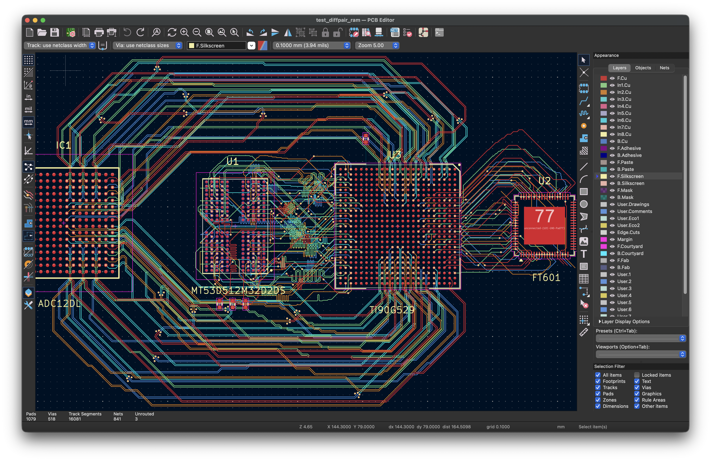
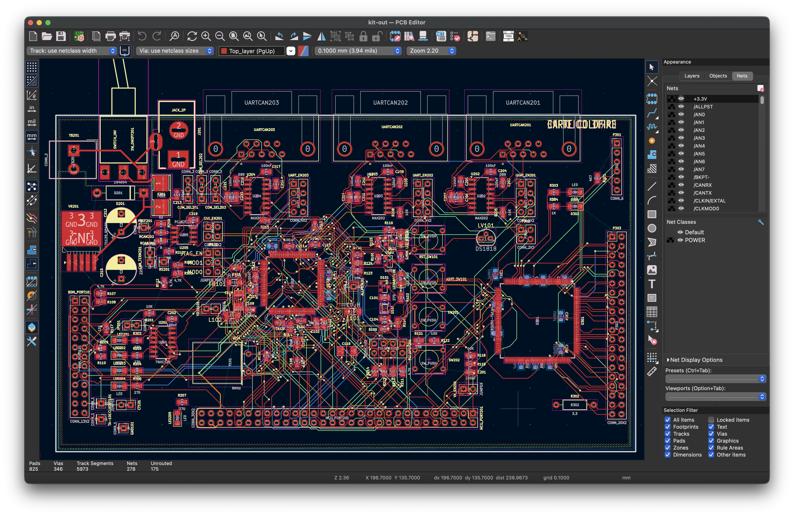
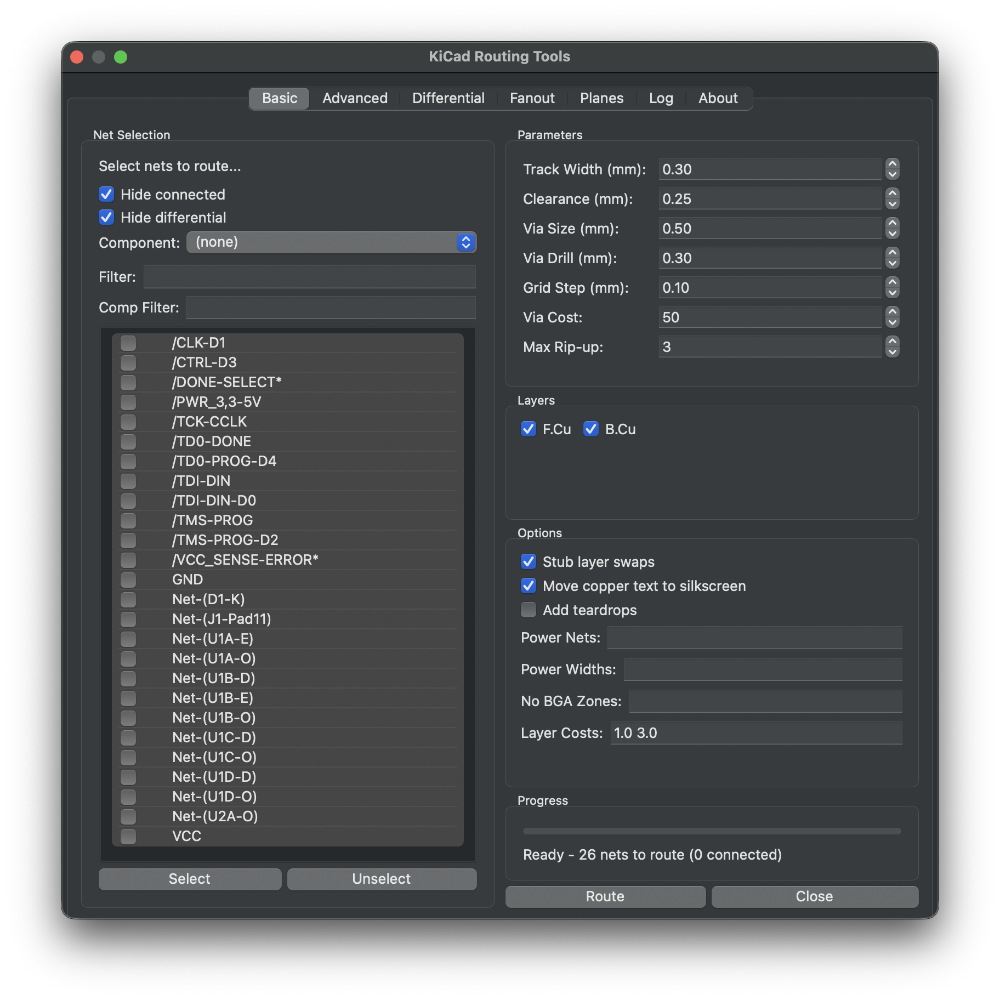
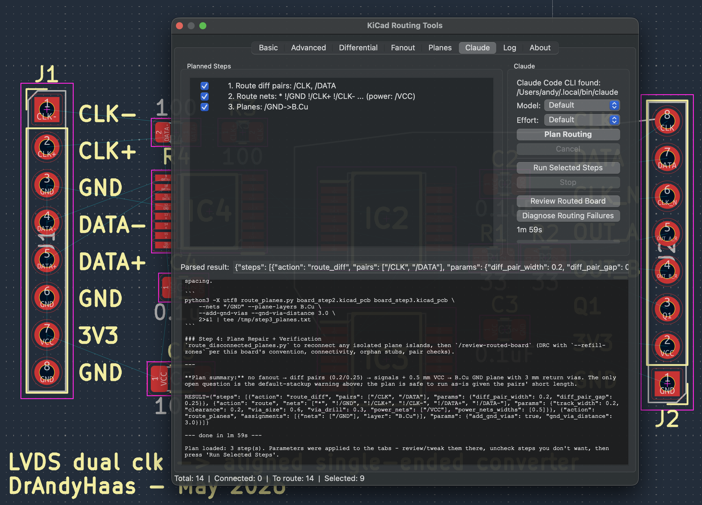

<p align="center">
  
</p>

# KiCad Routing Tools

A fast Rust-accelerated A* autorouter for KiCad PCB files. Compatible with **KiCad 9 and KiCad 10**. Available as both a **KiCad Plugin** with full GUI and a **Command-Line Interface** for scripting and automation.

<p align="center">
  
  
</p>

## Contents

- [Features](#features)
- [Quick Start](#quick-start)
- [KiCad Plugin](#kicad-plugin) — GUI, the AI **Claude tab**, installation
- [Command-Line Interface](#command-line-interface) — routing, planes, verification
- [Documentation](#documentation) — full guide for every feature
- [Project Structure](#project-structure) & [Module Overview](#module-overview)
- [Performance](#performance)
- [Command Reference](#command-reference) — options per tool (full list: `--help` / [configuration.md](docs/configuration.md))
- [Requirements](#requirements) · [Limitations](#limitations) · [License](#license)

## Features

Fast, grid-based A\* routing with a native Rust core (~10× faster than pure Python): octilinear (H/V/45°) multi-layer routing with automatic vias, and batch routing with incremental obstacle caching. Highlights below link to the full deep-dive docs.

**Core routing**
- Rust-accelerated A\* pathfinding, multi-layer with automatic via insertion
- [Rip-up and reroute](docs/rip-up-reroute.md) — progressive N+1 blocker analysis, ripped-corridor avoidance
- [Net ordering strategies](docs/net-ordering.md) — MPS (crossing-aware), inside-out, or original, with MPS layer swaps
- Stub layer switching, vertical track alignment, turn-cost straightening
- Board-edge (Edge.Cuts arcs/cutouts), keep-out rule areas, and auto BGA exclusion zones — see [Configuration](docs/configuration.md)
- Direction-aware stub / BGA / track [proximity penalties](docs/configuration.md)

**Differential pairs** — see [Differential Pairs](docs/differential-pairs.md)
- Pose-based A\* with a Dubins heuristic and adaptive setback angles for orientation-aware centerlines
- Bare-pad, multi-point (3+ terminals), and hybrid (coupled middle + single-ended legs) routing
- Automatic polarity resolution (opt-in pad swaps), U-turn prevention, GND return-via placement
- Electrically-short legs auto-defer to single-ended; per-layer [impedance-controlled](docs/differential-pairs.md) widths

**Power & planes** — see [Plane Routing](docs/route-plane.md) and [Power Nets](docs/power-nets.md)
- [Wider power-net routing](docs/power-nets.md) with automatic neck-down at fine-pitch pads
- Plane via connections and multi-net Voronoi plane layers with resistance / max-current reporting
- Disconnected-plane-region repair (region joins + pad taps) and GND return-via placement

**Signal integrity**
- [Length matching](docs/length-matching.md) — trombone meanders, auto DQ/DQS grouping, via-barrel aware
- [Time matching](docs/length-matching.md#time-matching) — propagation delay, microstrip vs stripline
- [Bus routing](docs/bus-routing.md), plus [guide corridors and keep-out zones](docs/configuration.md) drawn on a User layer

**Placement, fanout & optimization**
- [Placement optimization](docs/placement-optimization.md) for routability, before routing
- BGA / QFN fanout with decoupling-cap placement cleanup, Hungarian target-swap, and schematic sync

**Cleanup & verification** — see [Utilities](docs/utilities.md)
- Post-route copper cleanup reconciled against the connectivity model (no orphaned or ripped-and-not-restored copper), with gap-snap connectors
- **KiCad-oracle reconnect** — routes the exact links KiCad's own DRC reports as unconnected
- Checkers for DRC, connectivity, orphan stubs, copper hygiene (`check_weird.py`), and pad geometry

**Interfaces**
- Full [KiCad plugin GUI](#kicad-plugin) (KiCad 9 & 10) and a scriptable [CLI](#command-line-interface)
- [AI assistance](docs/claude-skills.md) — a **Claude tab** that plans an entire routing workflow, per-field "Ask Claude" helpers, and datasheet-driven power / high-speed / diff-pair analysis
- Optional [real-time PyGame visualizer](pygame_visualizer/README.md) (`route.py --visualize`)

## Quick Start

### 1. Get the Code

```bash
# Clone with git
git clone https://github.com/drandyhaas/KiCadRoutingTools.git
cd KiCadRoutingTools
```

Or [download the ZIP](https://github.com/drandyhaas/KiCadRoutingTools/archive/refs/heads/main.zip) and extract it.

### 2. Install the Rust Router

```bash
python build_router.py
```

By default this downloads a prebuilt binary for your OS from the project's
[GitHub Releases](https://github.com/drandyhaas/KiCadRoutingTools/releases) —
**no Rust toolchain required**. Prebuilts are published for:

- Linux x86_64
- macOS arm64 (Apple Silicon)
- macOS x86_64 (Intel)
- Windows x86_64

If a prebuilt isn't available for your platform (e.g. Linux arm64) or the
download fails, the script falls back to building locally with cargo.

#### Building from source (optional)

If you'd rather build locally — or you're on a platform without a prebuilt —
install Rust from [rustup.rs](https://rustup.rs/):

```bash
# macOS / Linux
curl --proto '=https' --tlsv1.2 -sSf https://sh.rustup.rs | sh

# Windows: Download and run rustup-init.exe from https://rustup.rs/
```

After installation, restart your terminal or run `source ~/.cargo/env`, then:

```bash
python build_router.py --from-source     # build locally instead of downloading
python build_router.py --tag v0.15.0     # download a specific release
python build_router.py --clean           # remove all build artifacts
```

### 3. Choose Your Interface

**Option A: KiCad Plugin (Recommended for interactive use)**

```bash
# Install the plugin
python install_plugin.py

# Then in KiCad: Tools → External Plugins → KiCadRoutingTools
```

**Option B: Claude Code (AI-assisted routing)**

Use [Claude Code](https://claude.ai/claude-code) to analyze your PCB and generate a routing plan:

```
> /plan-pcb-routing kicad_files/my_board.kicad_pcb
```

Claude will:
- Analyze your board structure and identify components needing fanout (BGA/QFN/PGA)
- Detect differential pairs and DDR signals requiring length matching
- Identify power/ground nets and recommend plane vs trace routing
- Assess signal speeds and recommend GND return via placement
- Generate a step-by-step routing plan with explanations
- Run the commands and verify results

Other useful skills:
```
> /find-high-speed-nets kicad_files/my_board.kicad_pcb       # Identify high-speed nets via datasheet lookup
> /analyze-power-nets kicad_files/my_board.kicad_pcb         # Identify power nets and track widths
> /identify-diff-pairs kicad_files/my_board.kicad_pcb        # Find diff pairs by pin function, recommend gap/impedance
> /recommend-stackup kicad_files/my_board.kicad_pcb          # Stackup advice for impedance/time-matching accuracy
> /diagnose-routing-failures my_board.kicad_pcb /tmp/route_output.txt  # Root-cause failed routes, get a retry command
> /review-routed-board my_board_routed.kicad_pcb             # Post-route QA: DRC, connectivity, length match, GND vias
```

See [Claude Skills](docs/claude-skills.md) for what each skill does and how they fit together.

All of these are also available inside KiCad without leaving the plugin - see [AI assistance in the plugin](#ai-assistance-claude-tab) below.

**Option C: Manual Command Line (For scripting and automation)**

```bash
# Optionally optimize an existing placement for routability (before routing)
python place_optimize.py my_board.kicad_pcb --max-displacement 3

# Fan out a BGA, then tidy decoupling caps off the new vias (issue #130)
python bga_fanout.py my_board.kicad_pcb -c U1 -o fanned.kicad_pcb --clearance 0.1
python place_fanout_clearance.py fanned.kicad_pcb capclean.kicad_pcb --clearance 0.1

# Route all nets
python route.py my_board.kicad_pcb

# Route differential pairs
python route_diff.py my_board.kicad_pcb --nets "*lvds*"

# Create power planes
python route_planes.py my_board.kicad_pcb --nets GND --plane-layers B.Cu
```

---

## KiCad Plugin

The plugin provides a full graphical interface for all routing features, running directly within KiCad 9 or 10.

<p align="center">
  
</p>

### AI assistance (Claude tab)

<p align="center">
  
</p>

With [Claude Code](https://claude.ai/claude-code) installed, the routing dialog gains AI assistance throughout (the plugin spawns `claude` headless, streams a live transcript, and fills GUI controls from the results):

- **Claude tab** - *Plan Routing* runs `/plan-pcb-routing`: the plan fills the parameter fields across the tabs and appears as a checkable step list, which *Run Selected Steps* executes sequentially in-process on the live board with per-step status marks. *Review Routed Board* and *Diagnose Routing Failures* give post-route QA and failure root-causing. Model and effort dropdowns control every AI run and persist with the dialog settings.
- **Save / Load a plan** - *Save…* writes the generated step list to a JSON file; *Load…* reads one back and runs it with **no Claude call** — handy for replaying a workflow that worked on another board. A recorded stress-test chain converts to a loadable plan too (`tests/stress/manifest_to_plan.py <board>/redo_commands.sh plan.json`).
- **Per-field "Ask Claude" buttons** - power nets/widths (Basic tab), stackup check (Layers), differential-pair verification by pin function (Differential tab), net-to-plane layer mappings and GND return via distance (Planes tab).

The full button-to-skill map is in [Claude Skills - Plugin GUI Integration](docs/claude-skills.md#plugin-gui-integration). Datasheet-based skills use web lookups and take a few minutes; every run shows a live transcript with cancel.

### Installation

Three ways to install:

**A. KiCad Plugin and Content Manager (PCM)** — the recommended path for end users. Open the PCM from the KiCad main window, find *KiCad Routing Tools*, and click Install. (The package is in the process of being added to the official repository; once accepted, this will be available out-of-the-box.) On first launch, the plugin checks the Python packages listed in `requirements.txt` (currently `scipy` and `shapely` — KiCad already bundles `numpy`) and offers a one-click pip install for any that are missing into KiCad's Python.

**B. PCM "Install from File…" using the release zip** — works today, before the package lands in the official repository. Each [GitHub Release](https://github.com/drandyhaas/KiCadRoutingTools/releases) ships a ready-to-install PCM package zip named `KiCadRoutingTools-<version>.zip` (a single cross-platform archive bundling the prebuilt Rust binaries for all platforms — **not** the auto-generated "Source code (zip)"). To install it:

1. From the Release's *Assets*, download `KiCadRoutingTools-<version>.zip` (e.g. `KiCadRoutingTools-0.15.13.zip`).
2. In KiCad, open **Plugin and Content Manager** from the main window.
3. Click **Install from File…** (bottom of the PCM dialog) and select the downloaded zip.
4. Click **Apply Pending Changes**, then restart KiCad if prompted.

The plugin appears under *Tools → External Plugins* in the PCB Editor. The same first-launch `scipy`/`shapely` dependency check described in (A) applies. This path keeps the plugin manageable from the PCM (you can update or uninstall it there), unlike the manual install below.

**C. Manual install from source** — for development or for using the CLI tools as well:

```bash
# Install the plugin (copies to KiCad plugins directory)
python install_plugin.py

# For development: create symlink instead of copying
python install_plugin.py --symlink

# Remove the plugin
python install_plugin.py --uninstall
```

The installer automatically detects your KiCad installation directory (supports KiCad 9.0 and 10.0):
- **macOS**: `~/Documents/KiCad/<version>/3rdparty/plugins/`
- **Linux**: `~/.local/share/kicad/<version>/3rdparty/plugins/`
- **Windows**: `~/Documents/KiCad/<version>/3rdparty/plugins/`

If you previously installed this plugin through the Plugin & Content Manager, that copy sits next to the local install and would shadow it on `sys.path` (causing stale-code errors). The installer detects any such PCM copy and moves it aside to `<kicad-base>/disabled_pcm_plugins/<version>/`, leaving it recoverable. Pass `--keep-pcm` to skip this.

### Releasing a new version (maintainers)

The full release flow — version bump, GitHub Release, and the merge request to the official KiCad PCM repository — is documented step by step in **[docs/release-pipeline.md](docs/release-pipeline.md)**.

Short version:

1. Bump `VERSION` and the `versions[]` entry in `metadata.json`.
2. `git tag v0.15.6 && git push --tags` — CI builds all 4 platform binaries, packages a single `KiCadRoutingTools-<ver>.zip` (the PCM validator rejects duplicate version strings, so we ship one cross-platform zip), patches `metadata.json` with real sha256/size values, and attaches everything to the GitHub Release.
3. Append the new version to the metadata file in your fork of `gitlab.com/kicad/addons/metadata` and open an MR. See the docs page for the exact commands.

To build a zip locally for testing:

```bash
python package_pcm.py --binary-dir ./path/to/release/artifacts
```

### Usage

1. Open KiCad (9.0 or later)
2. Open a PCB in Pcbnew
3. *(Optional)* Select one or more nets in the PCB editor first — for example by
   clicking tracks/pads, or right-clicking a track and choosing
   **Select → All Tracks in Net**. Any nets you have selected are automatically
   pre-checked for routing when the plugin opens.
4. Go to **Tools → External Plugins → KiCadRoutingTools**
5. Configure routing parameters and select (or adjust) the nets to route
6. Click **Route** to run the router

### Plugin Tabs

**Basic Tab:**
- Net selection with filtering and component filtering
- Nets selected in the PCB editor before opening the plugin are pre-checked automatically (also applies to the Fanout, Planes, and Differential tabs)
- Option to separate nets by net class (organizes into tabs per class)
- Track width, clearance, via size/drill from net class or manual override
- Layer selection with per-layer cost multipliers
- Options: stub layer swaps, copper text moving, teardrops, power net widths, no-BGA zones
- **Guide corridor** - draw a polyline on a User layer (e.g. `User.1`) and tick "Follow User-layer guide path" to route the selected nets along it (waypoints, avoiding obstacles, packed non-overlapping)
- **Keepout zones** - draw one or more closed polygons on a User layer (e.g. `User.2`) and tick "Keep out of User-layer polygon(s)" to keep routed tracks out of those areas (hard keepout, all routed nets)
- **Clear guide/keepout layers** - optional "Clear guide layer after routing" / "Clear keepout layer after routing" checkboxes (unchecked by default) delete the drawn guide/keepout graphics from their User layer after a successful route, so you can draw fresh ones for the next run

**Advanced Tab:**
- Swappable nets configuration for target swap optimization
- Routing parameters: iterations, heuristic weight, rip-up, probe iterations
- MPS ordering options, direction control, length matching
- Proximity settings: BGA, stub, track, via proximity costs
- Debug options

**Differential Tab:**
- Differential pair selection with filtering
- Pair gap, turning radius, setback angle configuration
- Options: polarity fix, GND vias, intra-pair length matching

**Fanout Tab:**
- BGA fanout with exit margin, escape direction, differential pair support
- Under-pad escape option for dense, fully-populated BGAs the channel router can't escape (issue #122) — see [BGA Fanout](bga_fanout/README.md#escape-methods)
- "Optimize decoupling cap placement" option (off by default) — after fanout, nudges decoupling caps off foreign-net fanout vias and toward same-net balls (issue #130) — see [Placement](placement/README.md#place_fanout_clearancepy--decoupling-cap-clearance-repair-issue-130)
- QFN fanout with extension length configuration
- Net selection for fanout operations

**Planes Tab:**
- Net-to-layer assignment for power/ground planes
- Create planes with via connections to SMD pads
- Repair disconnected plane regions
- GND return via placement near signal vias
- Via size/drill, track width, clearance configuration

**Log Tab:**
- Real-time routing output display
- Color-coded messages (errors, warnings, success)

**About Tab:**
- Version information and credits

**General Features:**
- Settings persistence (parameters and selections preserved between sessions)
- Cancel button to stop routing operations mid-progress
- Results applied directly to the open PCB in KiCad

---

## Command-Line Interface

### Net Pattern Syntax

All `--nets` options support fnmatch-style wildcards and exclusion patterns:

| Pattern | Description |
|---------|-------------|
| `*` | All nets |
| `*DATA*` | Nets containing "DATA" |
| `/*` | Nets starting with "/" (hierarchical) |
| `Net-(U1-*)` | Nets matching "Net-(U1-...)" |
| `!GND` | Exclude net named "GND" |
| `!*VCC*` | Exclude nets containing "VCC" |
| `"*" "!GND" "!VCC"` | All nets except GND and VCC |

**Notes:**
- Exclusion patterns (starting with `!`) remove matching nets from the result
- Order matters: include patterns add nets, exclude patterns remove them
- Nets starting with "unconnected-" are automatically excluded
- Use quotes around patterns with special characters

### Route Nets

```bash
# Route all nets (default) - outputs to input_routed.kicad_pcb
python route.py kicad_files/input.kicad_pcb

# Route all nets, overwrite input file
python route.py kicad_files/input.kicad_pcb --overwrite

# Route all nets to a specific output file
python route.py kicad_files/input.kicad_pcb kicad_files/output.kicad_pcb

# Route specific nets (using --nets option)
python route.py kicad_files/input.kicad_pcb kicad_files/output.kicad_pcb --nets "Net-(U2A-DATA_0)" "Net-(U2A-DATA_1)"

# Route with wildcard patterns
python route.py kicad_files/input.kicad_pcb kicad_files/output.kicad_pcb --nets "Net-(U2A-DATA_*)"

# Route all nets on a component (auto-excludes GND/VCC/VDD/unconnected)
python route.py kicad_files/input.kicad_pcb kicad_files/output.kicad_pcb --component U1

# Route specific patterns on a component (no auto-exclusion)
python route.py kicad_files/input.kicad_pcb kicad_files/output.kicad_pcb --nets "/DDAT*" --component U1

# Route ALL nets on a component including power (use "*" pattern)
python route.py kicad_files/input.kicad_pcb kicad_files/output.kicad_pcb --nets "*" --component U1

# Route all nets except GND and VCC (exclusion patterns with ! prefix)
python route.py kicad_files/input.kicad_pcb kicad_files/output.kicad_pcb --nets "*" "!GND" "!VCC"

# Route differential pairs (use route_diff.py)
python route_diff.py kicad_files/input.kicad_pcb kicad_files/output.kicad_pcb --nets "*lvds*" --no-bga-zones

# Route with wider tracks for power nets
python route.py kicad_files/input.kicad_pcb kicad_files/output.kicad_pcb --nets "Net*" \
  --power-nets "*GND*" "*VCC*" "+3.3V" --power-nets-widths 0.4 0.5 0.3 --track-width 0.2

# Typical workflow: create GND plane first, then route all signals
python route_planes.py kicad_files/flat_hierarchy.kicad_pcb --nets GND --plane-layers B.Cu
python route.py kicad_files/flat_hierarchy_routed.kicad_pcb --overwrite
```

### 3. Create Power/Ground Planes

```bash
# Create GND zone on B.Cu with via connections to all GND pads (outputs to input_routed.kicad_pcb)
python route_planes.py kicad_files/input.kicad_pcb --nets GND --plane-layers B.Cu

# Create GND zone, overwrite input file
python route_planes.py kicad_files/input.kicad_pcb --overwrite --nets GND --plane-layers B.Cu

# Create GND zone to specific output file
python route_planes.py kicad_files/input.kicad_pcb kicad_files/output.kicad_pcb --nets GND --plane-layers B.Cu

# Create multiple planes at once (each net paired with corresponding plane layer)
python route_planes.py kicad_files/input.kicad_pcb --nets GND +3.3V --plane-layers In1.Cu In2.Cu

# Create VCC plane with larger vias
python route_planes.py kicad_files/input.kicad_pcb --nets VCC --plane-layers In2.Cu --via-size 0.5 --via-drill 0.4

# Rip up blocking nets and automatically re-route them
python route_planes.py kicad_files/input.kicad_pcb --nets GND +3.3V --plane-layers In1.Cu In2.Cu --rip-blocker-nets --reroute-ripped-nets

# Multiple nets sharing same layer via Voronoi partitioning (use | separator)
python route_planes.py kicad_files/input.kicad_pcb --nets GND "VA19|VA11" --plane-layers In4.Cu In5.Cu

# Dry run to see what would be placed
python route_planes.py kicad_files/input.kicad_pcb --nets GND --plane-layers B.Cu --dry-run
```

### 3b. Repair Disconnected Plane Regions

After creating power planes, regions may become split by vias and traces from other nets. Use `route_disconnected_planes.py` to reconnect them:

```bash
# Auto-detect all zones in PCB and repair disconnected regions (outputs to input_routed.kicad_pcb)
python route_disconnected_planes.py kicad_files/input.kicad_pcb

# Auto-detect all zones, overwrite input
python route_disconnected_planes.py kicad_files/input.kicad_pcb --overwrite

# Auto-detect all zones to specific output file
python route_disconnected_planes.py kicad_files/input.kicad_pcb kicad_files/output.kicad_pcb

# Specific nets and layers
python route_disconnected_planes.py kicad_files/input.kicad_pcb --nets GND --plane-layers B.Cu

# Customize track width and clearance
python route_disconnected_planes.py kicad_files/input.kicad_pcb kicad_files/output.kicad_pcb \
    --track-width 0.5 --clearance 0.2
```

### 4. Verify Results

```bash
# Check for DRC violations. With no -c, grades at the clearance the routing
# steps wrote into the sibling .kicad_pro (the smallest clearance any step
# actually used); falls back to 0.2mm if there's no project. Pass -c to override.
python check_drc.py kicad_files/output.kicad_pcb

# Cross-check with KiCad's own DRC engine (requires KiCad; --refill-zones avoids
# bogus zone-clearance errors from stale pours - see tests/README.md for details)
kicad-cli pcb drc --refill-zones --format json -o drc.json kicad_files/output.kicad_pcb

# Check connectivity (detects unrouted nets, broken routes, and T-junctions)
python check_connected.py kicad_files/output.kicad_pcb

# Check connectivity for specific nets
python check_connected.py kicad_files/output.kicad_pcb --nets "*DATA*"

# Check connectivity for all nets on a component
python check_connected.py kicad_files/output.kicad_pcb --component U1

# Only check routed nets (skip unrouted net detection)
python check_connected.py kicad_files/output.kicad_pcb --routed-only

# Check for orphan stubs (dead-end traces with no pad/via/trace at the loose end).
# Connection is judged by actual copper extent (via radius, pad size, trace
# half-width), so T-junction taps and copper-overlap joints are not miscounted.
python check_orphan_stubs.py kicad_files/output.kicad_pcb

# Pad-geometry sanity check: flags same-footprint, different-net pads whose copper
# overlaps (a short). A non-zero result almost always means a pad's rotation/size
# is modelled wrong - the usual cause is a QFN/QFP/BGA placed at a non-orthogonal
# angle. The fanout tools run this automatically on their component first; run it
# yourself before fanout (or board-wide) as a standalone check:
python check_pads.py kicad_files/board.kicad_pcb                 # whole board, per footprint
python check_pads.py kicad_files/board.kicad_pcb --component U23 # one footprint
python check_pads.py kicad_files/board.kicad_pcb --cross-footprint  # also across parts

# Flag long non-orthonormal tracks. An on-grid router emits only 0/45/90-degree
# segments; the only legitimate non-orthonormal segment is a short (<=1 grid cell)
# terminal connector to an off-grid pad/ball. Anything longer is a routing defect
# (it can cut diagonally across foreign copper). qfn_fanout escape stubs are
# excluded automatically; bga_fanout's short stub-end jogs clear the 0.25mm default.
python check_orthonormal.py kicad_files/output.kicad_pcb

# Copper hygiene (read-only): dangling stubs, same-net soft joints, redundant
# cycles, and removable / stacked / floating copper the routing left behind.
python check_weird.py kicad_files/output.kicad_pcb
```

See [Utilities](docs/utilities.md) for every checker and its options.

### 5. Power Net Analysis

Use the `/analyze-power-nets` skill to identify power nets and get track width recommendations:

```
# Ask Claude to analyze your board with datasheet lookup
/analyze-power-nets kicad_files/my_board.kicad_pcb
```

The skill:
1. Auto-classifies obvious components (resistors, capacitors, inductors, etc.)
2. Uses WebSearch to look up datasheets for unknown components (ICs, connectors, transistors)
3. Classifies each component's role (power source, current sink, pass-through, shunt)
4. Traces power paths from sinks to sources
5. Generates ready-to-use `--power-nets` configurations

See [Power Net Analysis](docs/power-nets.md) for detailed documentation.

### 6. High-Speed Net Analysis

Use the `/find-high-speed-nets` skill to identify high-speed nets and get GND return via recommendations:

```
# Ask Claude to analyze signal speeds with datasheet lookup
/find-high-speed-nets kicad_files/my_board.kicad_pcb
```

The skill:
1. Pre-classifies nets by name patterns (DDR, USB, SPI, CLK, etc.)
2. Pre-classifies components by footprint (FPGA, DDR, PHY, etc.)
3. Uses WebSearch to look up datasheets for ICs and extract max clock rates and rise times
4. Traces high-speed signals through series passives (termination resistors, AC coupling caps)
5. Generates a speed classification (ultra-high/high/medium/low) with recommended `--gnd-via-distance`

The `/plan-pcb-routing` skill includes a lightweight version of this analysis (net name and
footprint pattern matching only, no datasheet lookup) and automatically includes a GND return
via step when GND planes are present. Run `/find-high-speed-nets` first for more accurate
recommendations based on actual component specifications.

### 7. Integration Tests

```bash
# Run full integration test (fanout + routing + checks)
python tests/test_fanout_and_route.py --all

# Quick mode for faster testing
python tests/test_fanout_and_route.py --all --quick
```

See [tests/README.md](tests/README.md) for detailed documentation of all test scripts.

## Documentation

| Document | Description |
|----------|-------------|
| [Routing Architecture](docs/routing-architecture.md) | Module structure, obstacle maps, A* algorithm |
| [Python API](docs/python-api.md) | Using the modules as a library: parser, writer, modification, config, net analysis, impedance — with runnable examples |
| [Configuration](docs/configuration.md) | Command-line options, GridRouteConfig parameters |
| [Differential Pairs](docs/differential-pairs.md) | P/N pairing, polarity swaps, via handling |
| [Net Ordering](docs/net-ordering.md) | MPS algorithm, inside-out ordering, strategy comparison |
| [Rip-Up and Reroute](docs/rip-up-reroute.md) | Blocking analysis, progressive N+1 escalation, reroute loop |
| [Length Matching](docs/length-matching.md) | Trombone meanders, via barrel lengths, DDR auto-grouping, time matching |
| [Bus Routing](docs/bus-routing.md) | Bus detection, middle-out ordering, neighbor attraction |
| [Guide Corridor](docs/configuration.md#guide-corridor-options-preferred-route) | User-layer guide paths, waypoints, best-effort following |
| [Power/Ground Planes](docs/route-plane.md) | Copper zones with automatic via placement |
| [Utilities](docs/utilities.md) | DRC checker, connectivity checker, fanout generators, layer switcher, DRC-settings fixer |
| [BGA Fanout](bga_fanout/README.md) | BGA escape routing generator |
| [QFN Fanout](qfn_fanout/README.md) | QFN/QFP escape routing generator |
| [Rust Router](rust_router/README.md) | Building and using the Rust A* module |
| [Visualizer](pygame_visualizer/README.md) | Real-time A* visualization with PyGame |
| [Power Net Analysis](docs/power-nets.md) | Power net detection, AI analysis, track width guidelines |
| [Claude Skills](docs/claude-skills.md) | All nine AI skills: routing plans, power/high-speed/diff-pair analysis, stackup, plane mappings, failure diagnosis, board review |
| [Placement](placement/README.md) | Placement optimization for routability |
| [Integration Tests](tests/README.md) | Test scripts and performance benchmarks |
| [Release Pipeline](docs/release-pipeline.md) | How to tag a release and submit it to the KiCad PCM (maintainers) |

## Project Structure

```
KiCadRoutingTools/
├── place_optimize.py         # Main CLI - placement optimization (quench)
├── place_route_loop.py       # Main CLI - router-in-the-loop placement repair
├── route.py                  # Main CLI - single-ended routing
├── route_diff.py             # Main CLI - differential pair routing
├── route_planes.py           # Main CLI - power/ground plane via connections
├── route_disconnected_planes.py  # CLI - repair disconnected plane regions
├── plane_io.py               # Plane I/O utilities (zone extraction, output writing)
├── plane_obstacle_builder.py # Obstacle map building for plane via placement
├── plane_blocker_detection.py # Blocker detection and rip-up for plane vias
├── plane_zone_geometry.py    # Voronoi zone computation for multi-net layers
├── plane_resistance.py       # Plane resistance and current capacity calculations
├── plane_region_connector.py # Detect and route between disconnected plane regions
├── routing_config.py         # GridRouteConfig, GridCoord, DiffPair classes
├── routing_defaults.py       # Default routing parameter values
├── routing_exceptions.py     # Routing exception classes
├── routing_state.py          # RoutingState class - tracks routing progress
├── routing_context.py        # Helper functions for obstacle building
├── routing_common.py         # Shared utilities for route.py and route_diff.py
├── routing_utils.py          # Shared utilities (pos_key, etc.)
├── obstacle_map.py           # Obstacle map building functions
├── obstacle_cache.py         # Net obstacle caching for incremental builds
├── obstacle_costs.py         # Stub/track proximity cost calculations
├── bresenham_utils.py        # Bresenham line-walking utilities for grid operations
│
├── diff_pair_loop.py         # Differential pair routing loop
├── single_ended_loop.py      # Single-ended routing loop
├── reroute_loop.py           # Reroute queue processing
├── phase3_routing.py         # Phase 3 multi-point tap routing
├── diff_pair_routing.py      # Diff pair A* routing implementation
├── single_ended_routing.py   # Single-ended A* routing implementation
│
├── net_ordering.py           # MPS, inside-out, and original ordering
├── net_queries.py            # Net queries (diff pairs, MPS, endpoints)
├── connectivity.py           # Stub endpoints, connected groups
├── layer_swap_optimization.py # Upfront layer swap optimization
├── layer_swap_fallback.py    # Fallback layer swap on failure
├── stub_layer_switching.py   # Stub layer swap utilities
├── mps_layer_swap.py         # MPS-aware layer swap for crossing conflicts
├── polarity_swap.py          # P/N polarity swap handling
├── target_swap.py            # Target assignment optimization
├── rip_up_reroute.py         # Rip-up and reroute logic
├── blocking_analysis.py      # Analyze blocking nets
├── length_matching.py        # Length matching with trombone meanders
│
├── kicad_parser.py           # KiCad .kicad_pcb file parser
├── kicad_writer.py           # KiCad S-expression generator
├── output_writer.py          # Route output and swap application
├── pcb_modification.py       # Add/remove routes from PCB data
├── schematic_updater.py      # Update .kicad_sch files with pad swaps
├── chip_boundary.py          # Chip boundary detection
├── geometry_utils.py         # Shared geometry calculations
├── impedance.py              # Impedance calculation (microstrip/stripline formulas)
├── memory_debug.py           # Memory usage statistics
│
├── check_drc.py              # DRC violation checker
├── check_connected.py        # Connectivity checker (with T-junction detection)
├── check_orphan_stubs.py     # Orphan stub detector
├── check_cycles.py           # Redundant-loop (cycle) + overlapping-via checker
├── fix_kicad_drc_settings.py # Make .kicad_pro DRC constraints consistent with the routed floors (clearance, track/via/drill, hole, edge; courtyard/mask/footprint noise)
├── bga_fanout.py             # BGA fanout CLI wrapper
├── bga_fanout/               # BGA fanout package
│   ├── __init__.py           # Main fanout logic and public API
│   ├── types.py              # Track, BGAGrid, FanoutRoute, Channel, DiffPairPads
│   ├── escape.py             # Escape channel finding and assignment
│   ├── reroute.py            # Collision resolution and rerouting
│   ├── layer_balance.py      # Layer rebalancing for even distribution
│   ├── layer_assignment.py   # Layer assignment for collision avoidance
│   ├── tracks.py             # Track generation and collision detection
│   ├── geometry.py           # 45° stub and jog calculations
│   ├── collision.py          # Low-level collision detection utilities
│   ├── grid.py               # BGA grid analysis
│   ├── diff_pair.py          # Differential pair detection
│   └── constants.py          # Configuration constants
├── qfn_fanout.py             # QFN/QFP fanout CLI wrapper
├── qfn_fanout/               # QFN/QFP fanout package
│   ├── __init__.py           # Main fanout logic and public API
│   ├── layout.py             # Layout analysis functions
│   ├── geometry.py           # Stub position calculations
│   └── types.py              # QFNLayout, PadInfo, FanoutStub
├── list_nets.py              # List nets on a component
├── build_router.py           # Rust module build script (--clean to remove artifacts)
├── startup_checks.py         # Startup checks (Python deps, Rust library version)
│
├── tests/                    # Integration tests
│   ├── test_fanout_and_route.py  # Full integration test (fanout + route)
│   ├── test_kit_route.py         # Pad-to-pad routing test (no fanout)
│   ├── test_flat_hierarchy.py    # 2-layer board with GND plane test
│   ├── test_interf_u.py          # 2-layer board with non-rectangular outline test
│   ├── test_sonde_u.py           # Wide track routing test
│   ├── run_utils.py              # Shared test utilities
│   └── stress/                   # Real-world-board stress-test harness (run_queue.sh) — see tests/README.md
│
├── rust_router/              # Rust A* implementation
├── pygame_visualizer/        # Real-time visualization
├── kicad_routing_plugin/     # KiCad ActionPlugin
│   ├── action_plugin.py      # ActionPlugin entry point
│   ├── swig_gui.py           # Main routing dialog (Basic/Advanced tabs)
│   ├── differential_gui.py   # Differential pair routing tab
│   ├── fanout_gui.py         # BGA/QFN fanout tab and net selection panel
│   ├── planes_gui.py         # Power/ground planes tab
│   ├── claude_gui.py         # Claude tab (spawns claude headless, streams transcript)
│   ├── claude_plan.py        # Claude tab routing-plan orchestration
│   ├── board_swaps.py        # Shared board pad/net swap helpers
│   ├── deps_check.py         # Plugin dependency checks
│   ├── about_tab.py          # About tab with version info
│   ├── gui_utils.py          # Shared GUI utilities
│   └── settings_persistence.py  # Save/restore dialog settings between sessions
├── placement/               # Component placement
│   ├── quench.py            # Placement optimizer
│   ├── fanout_clearance.py  # Fanout clearance evaluation
│   ├── parser.py            # Courtyard boundary extraction
│   ├── writer.py            # Footprint position modification
│   └── utility.py           # Shared placement utilities
├── install_plugin.py         # Plugin installer script
├── docs/                     # Documentation
└── .claude/skills/           # Claude Code skills
    ├── analyze-power-nets/   # AI-powered power net analysis skill
    ├── find-high-speed-nets/ # AI-powered high-speed net identification skill
    ├── plan-pcb-routing/     # AI-powered routing plan generation skill (orchestrates the others)
    ├── identify-diff-pairs/  # Datasheet-based diff pair detection skill
    ├── recommend-stackup/    # Stackup review/recommendation skill
    ├── recommend-plane-mappings/  # Net-to-plane-layer assignment skill
    ├── diagnose-routing-failures/  # Failure root-cause and retry skill
    ├── review-routed-board/  # Post-route QA and sign-off skill
    └── stress-test-router/   # Batch stress-test on real-world boards + issue filing (dev/QA)
```

## Module Overview

One-line summaries below; the [Python API documentation](docs/python-api.md)
has full per-module references (signatures, dataclass fields, gotchas) with
runnable examples.

### Core Routing

| Module | Purpose |
|--------|---------|
| `route.py` | CLI for single-ended routing |
| `route_diff.py` | CLI for differential pair routing |
| `route_planes.py` | CLI for power/ground plane via connections |
| `route_disconnected_planes.py` | CLI for repairing disconnected plane regions |
| `routing_config.py` | Configuration dataclasses (`GridRouteConfig`, `GridCoord`, `DiffPair`) |
| `routing_state.py` | `RoutingState` class tracking progress, results, and PCB modifications |
| `routing_context.py` | Helper functions for building obstacles and recording success |
| `routing_common.py` | Shared utilities for route.py and route_diff.py (BGA zones, net resolution, length matching) |
| `routing_utils.py` | Shared utilities (`build_layer_map`, `iter_pad_blocked_cells`) |
| `obstacle_map.py` | Obstacle map building from PCB data |
| `obstacle_cache.py` | Net obstacle caching for incremental obstacle map builds |
| `obstacle_costs.py` | Stub and track proximity cost calculations |
| `bresenham_utils.py` | Bresenham line-walking utilities for grid-based segment operations |
| `geometry_utils.py` | Shared geometry calculations (point-to-segment distance, segment intersection, UnionFind) |
| `routing_constants.py` | Shared constants (default layer stack, power net patterns, tolerances) |
| `terminal_colors.py` | ANSI color codes for terminal output |

### Routing Loops

| Module | Purpose |
|--------|---------|
| `diff_pair_loop.py` | Main loop for routing differential pairs |
| `single_ended_loop.py` | Main loop for routing single-ended nets |
| `reroute_loop.py` | Processes reroute queue for failed routes |
| `phase3_routing.py` | Phase 3 multi-point tap routing (connects remaining pads after length matching) |
| `diff_pair_routing.py` | Differential pair A* with centerline + offset and GND vias |
| `single_ended_routing.py` | Single-ended net A* routing |

### Net Analysis

| Module | Purpose |
|--------|---------|
| `net_ordering.py` | MPS, inside-out, and original net ordering strategies |
| `net_queries.py` | Net queries (diff pair detection, MPS ordering, power net detection, chip pad positions) |
| `connectivity.py` | Stub endpoints, connected groups, multi-point net detection |

Key functions in `net_queries.py`:
- `identify_power_nets(pcb, patterns, widths)` - Pattern-based power net detection for `--power-nets` CLI option
- `compute_mps_net_ordering(pcb, net_ids)` - MPS algorithm for optimal net ordering
- `find_differential_pairs(pcb, patterns)` - Detect P/N pairs from net names (suffix-style aware: `+`/`-` nets only pair with each other, never with `_P`/`_N` nets sharing the same base name)

Key functions in `analyze_power_paths.py` (used by `/analyze-power-nets` skill):
- `analyze_pcb(filepath)` - Load PCB and extract components for analysis
- `get_components_needing_analysis(components)` - Get components requiring AI classification
- `classify_component(components, ref, role, current_ma, notes)` - Set component classification
- `trace_power_paths(pcb, components)` - Trace current from sinks to sources
- `get_power_net_recommendations(pcb, components, paths)` - Get recommended track widths

### Optimization

| Module | Purpose |
|--------|---------|
| `layer_swap_optimization.py` | Upfront layer swap optimization before routing |
| `layer_swap_fallback.py` | Try layer swap when route fails |
| `stub_layer_switching.py` | Low-level stub layer swap utilities |
| `mps_layer_swap.py` | MPS-aware layer swap for crossing conflicts |
| `polarity_swap.py` | P/N polarity swap for differential pairs |
| `target_swap.py` | Hungarian algorithm for optimal target assignment |
| `rip_up_reroute.py` | Rip-up blocking routes and retry |
| `blocking_analysis.py` | Analyze which nets are blocking |
| `length_matching.py` | Length matching with trombone-style meanders |

### I/O and Utilities

| Module | Purpose |
|--------|---------|
| `kicad_parser.py` | KiCad .kicad_pcb file parser (extracts stackup, footprint values, pintypes) |
| `kicad_writer.py` | KiCad S-expression generator |
| `output_writer.py` | Write routed output with swaps and debug geometry |
| `pcb_modification.py` | Add/remove routes from PCB data structure |
| `schematic_updater.py` | Update .kicad_sch files with pad swaps from routing |
| `impedance.py` | Impedance calculations (microstrip/stripline, width from target Z) |
| `memory_debug.py` | Memory usage statistics and debugging |

## Performance

Integration test results (`tests/test_fanout_and_route.py`):

| Stage | Nets | Time | Iterations |
|-------|------|------|------------|
| FTDI single-ended | 47/47 | 8.6s | 319K |
| LVDS diff pairs (batch 1) | 28/28 | 29.7s | 10.2M |
| LVDS diff pairs (batch 2) | 28/28 | 28.0s | 12.0M |
| DDR diff pairs | 5/5 | 0.3s | 25K |
| DDR single-ended | 51/51 | 6.2s | 565K |

Rust acceleration provides ~10x speedup vs pure Python.

## Command Reference

Every tool prints its full option list with `--help`, and **[docs/configuration.md](docs/configuration.md)** is the single source of truth for the flags — defaults, guidance, and which tool each applies to. The tool-specific guides go deeper on their area:

| Tool | Purpose | Guide |
|------|---------|-------|
| `route.py` | Single-ended routing | [Configuration](docs/configuration.md) |
| `route_diff.py` | Differential-pair routing | [Differential Pairs](docs/differential-pairs.md) |
| `route_planes.py` | Power/ground plane via connections | [Plane Routing](docs/route-plane.md) |
| `route_disconnected_planes.py` | Plane region repair + pad taps | [Plane Routing](docs/route-plane.md) |
| `bga_fanout.py` / `qfn_fanout.py` | BGA / QFN escape fanout | [BGA](bga_fanout/README.md) · [QFN](qfn_fanout/README.md) · [Utilities](docs/utilities.md) |
| `place_fanout_clearance.py` | Move decoupling caps off fanout vias | [Utilities](docs/utilities.md) |
| `place_optimize.py` | Placement for routability | [Placement Optimization](docs/placement-optimization.md) |
| `check_*.py` | DRC / connectivity / hygiene / pad checks | [Utilities](docs/utilities.md) |

```bash
# Full option list for any tool
python route.py --help

# A typical chain: GND plane, then signals, then differential pairs
python route_planes.py board.kicad_pcb board.kicad_pcb --nets GND --plane-layers B.Cu
python route.py board.kicad_pcb -O --nets "*" "!GND"
python route_diff.py board.kicad_pcb -O --nets "*_P" "*_N" --diff-pair-gap 0.15
```

The shared option groups — geometry, power-net widths, algorithm/strategy, proximity penalties, length/time matching, post-route DRC settings, and debug layers — apply across the routing CLIs and are documented in full in [Configuration](docs/configuration.md).

## Requirements

- Python 3.9+ (prebuilt binaries are abi3-py39; 3.7+ only if building from source)
- numpy (`pip3 install numpy`)
- scipy (`pip3 install scipy`) - used for optimal target assignment and Voronoi partitioning
- shapely (`pip3 install shapely`) - used for polygon union in multi-net plane layers
- Rust toolchain — only needed if you build the router from source (`python build_router.py --from-source`); not required when using the prebuilt binary
- pygame-ce (optional, for visualizer: `pip3 install pygame-ce`)

## Limitations

- No push-and-shove (routes around obstacles, doesn't move them)
- No layer swaps of stubs for multipoint nets (3+ pads)
- No blind or buried vias
- No coarse grid assignment before detailed routing to plan overall topology
- No via cost or other parameter learning/tuning
- No design rules by region/area support

## License

MIT License

