# awx -- the K-bus chain (#622)

Routing a fanned-out bus between two BGAs: one PLAN decides both ends of
every net, the FANOUT lays exactly the plan's moves and reports what it
could not, the BRAID routes the lanes in a corridor of two pages, and a
refused lane is negotiated rather than left open.

    bash chain_k.sh TAG 15 28 41            # -> tmp/TAG_k<K>.kicad_pcb, graded
    python3 make_bench.py BOARD SRC DST OUT # another array pair, from any board
    bash pose_gate.sh BOARD SRC DST 15 28   # the same pair in every pose
    modal run awx/modal_k.py --arms awx/arms.example.json   # a sweep, one container per arm

(We have no idea what `awx` stands for. The name predates every note
that mentions it.)

## Where it stands

The bench is `fb_t2q_fresh`: an H3 BGA `U1` to a DDR3 `DU1`, routed over
the coherent K-ladder. Byte-deterministic, 0 DRC at the routed 0.1 mm
floor, and identical under translation, turn-over and quarter rotation
(the pose gate).

Two arms are current, and **a number is meaningless without its arm**:

| | K15 | K28 | K35 | K41 | K51 |
|---|---|---|---|---|---|
| reference arm (one-pass plan) | 14 | 36 | 69 | 86 | -- |
| joint-solve arm | -- | -- | **58** | **80** | 137 |
| best complete K51 ever (`replan.py`) | | | | | 107 |
| **human** | 22 | 46 | **58** | **70** | **81** (48 nets; 85 over 51) |

- **reference arm**: `SRC_ROUNDS=0 SEL_RETRY=6 EXACT_LANE=1
  DST_FACE_ASK=1 DST_WALK=3 SF_SWIM=30 BRAID_EXIT_GUARD=1
  BRAID_SWIM_HOLD=1`
- **joint-solve arm**: the above plus `SEL_XING=2 SF_EQUIV=2
  SF_JUDGE=braid BRAID_ONE_DIVE=5 DST_RESIDUE=3
  DST_RESIDUE_POOL=displaced DST_RESIDUE_CANDS=4
  BRAID_ALT_SOLVER=cpsat BRAID_CPSAT_DET=40`

The human's numbers come from `human_at_k.py`, scoped to the same
coherent net set the chain routes.

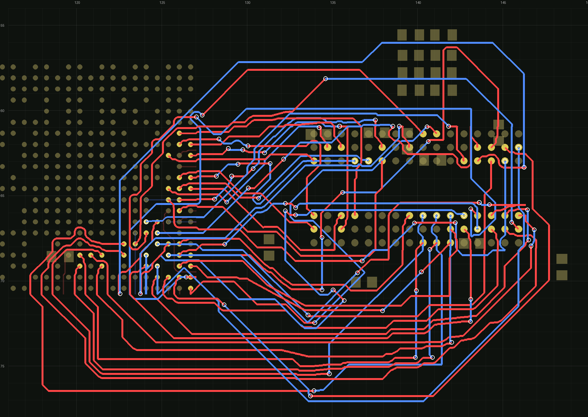

*K41: the corridor from `U1` (left) to `DU1` (right) -- front lanes red,
back lanes blue, every lane in its band, the far-face exits riding round
the destination's east face.*

### The gap is FLOOR, not realization, and crossings do not set it

`ledger_cal.py BOARD K` splits every net's vias into the **DP floor**
(the layer changes its real crossings force, everyone else fixed) and
its **slack** (realization waste). On K51:

| board | crossings | vias | DP floor | slack |
|---|---|---|---|---|
| baseline | 392 | 136 | 130 | 6 |
| pattern seed | 275 | 100 | 96 | 4 |
| pattern + seat repair | 360 | 104 | 98 | 6 |
| **human** | **338** | **80** | **74** | **6** |

1. **Slack is ~6 vias on every board measured, the human's included.**
   The router turns a plan into copper as tightly as the human does, so
   the whole deficit is the PLAN. It also caps every realization-side
   idea at about 6 vias -- `collapse_dives.py` saved 2 on the baseline
   (137 -> 135, 0 open 0 DRC) and found nothing on the pattern arm. Note
  it re-lays a ripped lane, so it must use the BRAID's track and
  clearance: laying at its own 0.1/0.1 put 30 segments of thinner copper
  into the board and reported a bigger saving than it had earned.
2. **Crossing COUNT does not set the floor.** The human has MORE
   crossings than our best plan (338 against 275) and a floor of 74
   against 96 -- 0.22 layer changes per crossing where we pay 0.35.
   What sets the floor is how the crossings are STRUCTURED: which
   partner is on which layer at each crossing, and what end layers a
   lane must hold. **The mechanism is open and is TODO 1.**

`cut_ledger.py` (the Maley cut-capacity check on a plan before any lane
is routed) says **every cut fits** -- capacity 84-100 lanes against a
load of 2-7 even in the escape fields. Space is not the constraint at
either end; order and structure are.

## The chain

1. **`coherent_nets.py K`** -- the first K routable nets of the coherent
   ladder (`k_ladder_coherent.txt`: whole rivers, tightest first; a
   prefix never splits a river).
2. **`fanout_from_plan.py OUT K --board=BASE`** -- one loop over the
   plan and both fanouts.
   - `plan_state` reads the board as it is: the legal escape menus at
     both ends (`escape_moves.py`), the launch points, each tooth's
     layer and vias, the taut-path buses.
   - The destination is chosen against those teeth (`select_moves.py`),
     the source refined against that destination
     (`plan_ends.refine_source`), and the refinement REALIZED by
     `source_realize.py` with the production engine, audited per
     dimension (face, gap along the face, layer, kind).
   - **Feedback**: a move the engine did not lay exactly leaves that
     net's menu (`banned`, keyed by `source_realize.move_sig`) and the
     round re-plans. The engine is the authority on what is possible.
   - The plan is judged by `plan_ends.judged_cost` -- the vias its own
     model implies plus the ride round both arrays at `VIA_MM` per via,
     inside the corridors the braid will actually form.
3. **`braid.py --board FO --dest DU1 --nets ... --out STEM`** --
   corridors from the geometry (`corridor.py`), a spine per corridor,
   launch and target orders from the lanes' offsets, the two-page
   schedule (`schedule.py`), and every lane routed by the real router
   inside its band (`connect.py`, `topo_strings.py`). Up to six attempts
   widen the launch pitch; the best is kept. A refused lane gets a wider
   last call, then a BLOCKER-DIRECTED RIP (the router's blocked frontier
   attributed to this run's lanes, a min-cut probe naming the cut set,
   victims re-laid or negotiated one level down). What is still refused
   is reported and left open.
4. **`grade_k.py BOARD NETS`** -- connectivity scoped to the run's nets,
   whole-board DRC at the routed floor, and the via census.

`chain_k.sh` runs a **flow frame** first (`flow_frame.py`): the pair is
turned by the quarter turn that points source-to-destination along +x,
every stage runs on that file, and the result is turned back -- so a
pair dropped at any of the four angles is the identical computation.

## The ingredients, in pictures

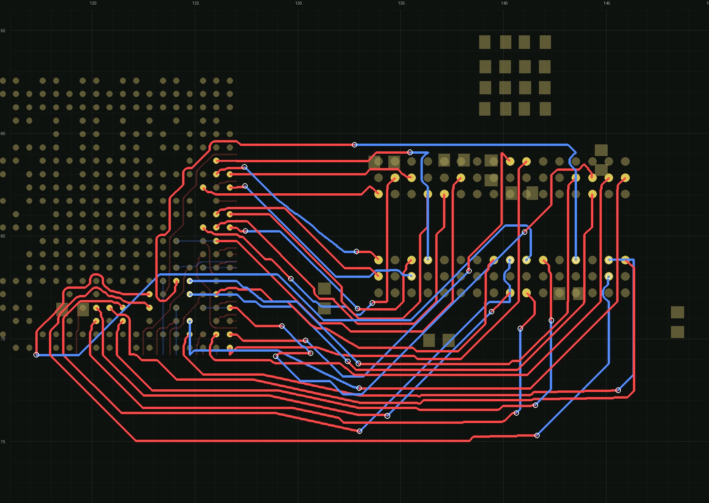

*K28: two pages. A front lane and a back lane cross for free; a page
lane keeps its layer through the schedule region and pays a via only
where its tooth or berth is on the other layer. The board shown is 38
vias for 28 nets; the reference arm is 36 today.*

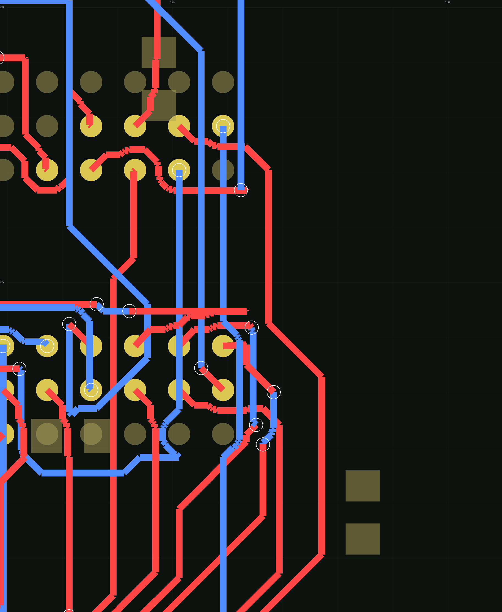

*Far-face exits: a berth on the destination's far face is a side exit of
the main corridor whose leg lies beyond the array and whose jog runs
back along the stub's own line -- not a corridor of its own through the
ball field.*

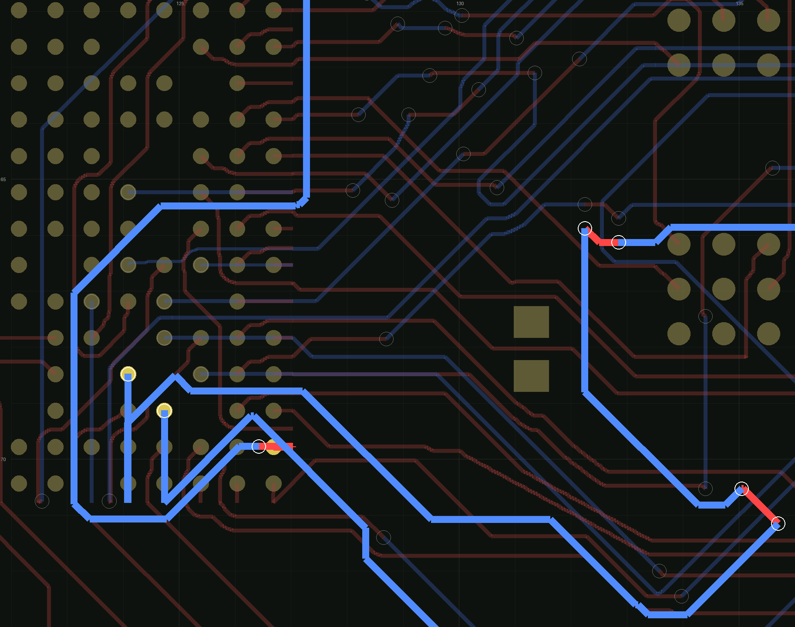

*The blocker-directed rip: SBA2 (highlighted) was refused at the last
call, boxed by lanes routed before it. Its blocked frontier named the
lanes on it, the min-cut probe found the cheapest crossing set, SCKE1
was ripped, SBA2 routed, SCKE1 refused and negotiated in turn by
ripping SA8 -- every lane routed, K41 complete. This is the mechanism
that first completed K41 and K51.*

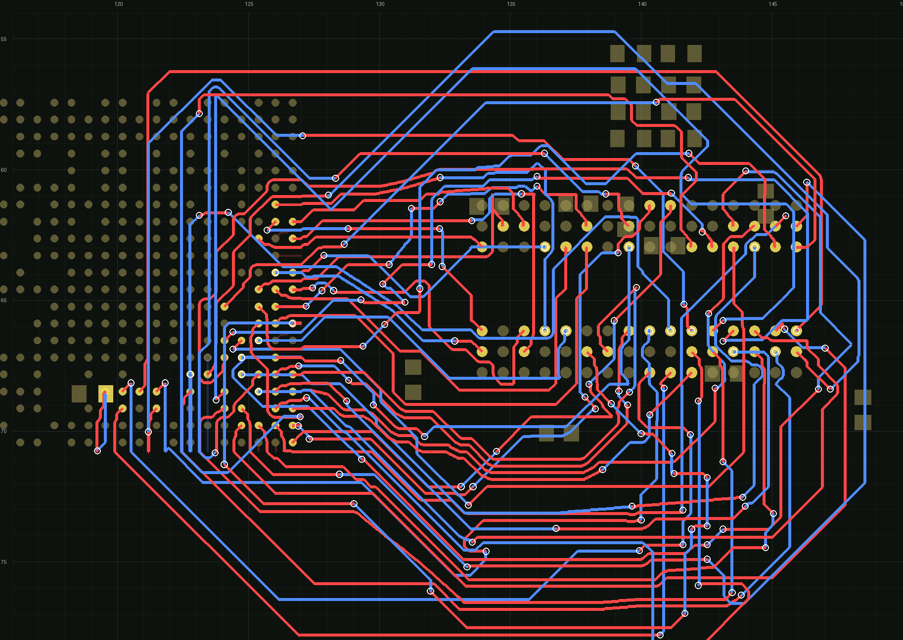

*K51: 48 routable nets, complete. The board shown is an early 141-via
one; the joint-solve arm is 137 and the best complete K51 measured is
107. The vias are the work.*

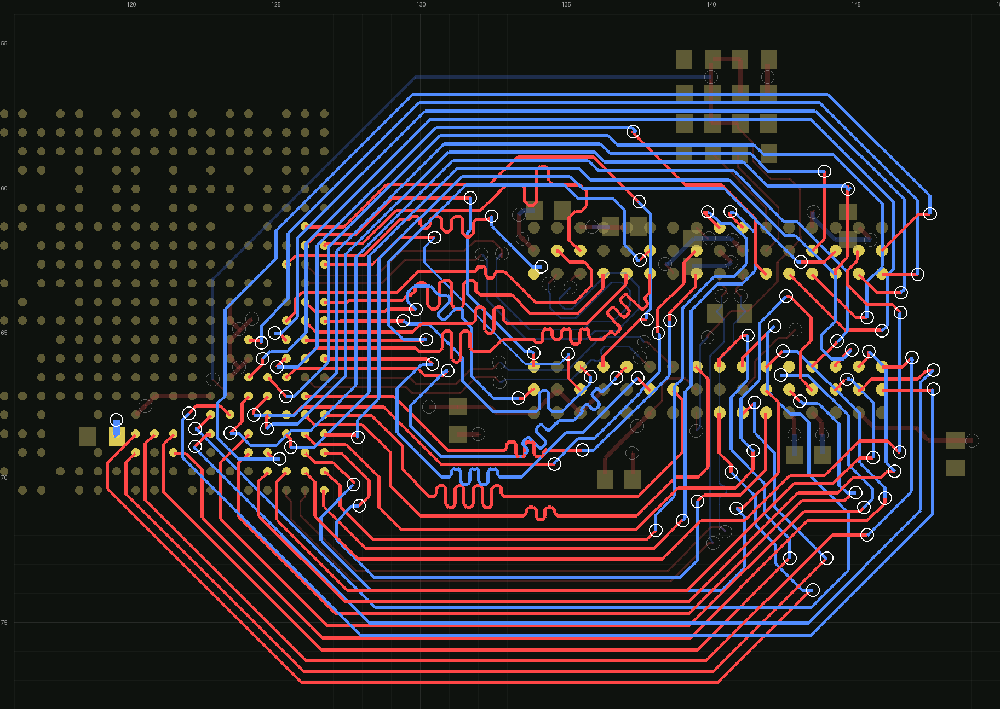

*The same 48 nets as the human routed them (`allwinner_h3_ddr3`, the
original board): 81 vias, most nets on ONE layer between their two
escape vias, the address rides nested round the destination, the data
lanes meandered to length. A benchmark to approach, not a pose to
match. `ledger_cal.py` says its realization slack is 6 vias -- the same
as ours -- so what this picture shows that ours does not is a better
PLAN, not tidier copper.*

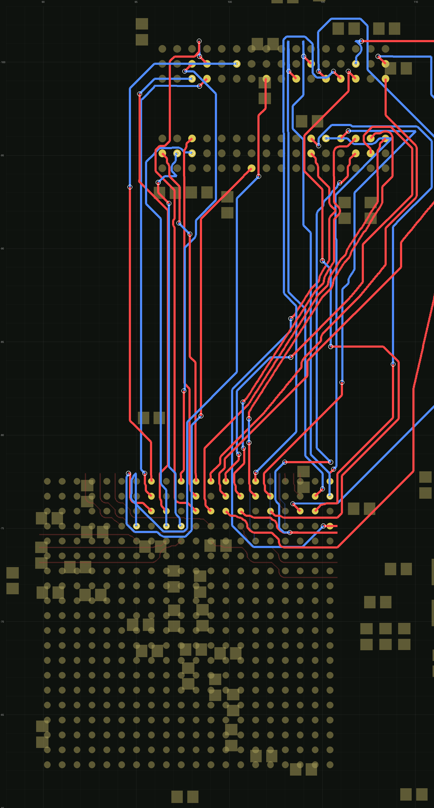

*The zynq article (`make_bench.py --two-layer`): the corridor runs north
from the Zynq to the DDR3, berths on three faces. Complete at 55 vias,
but 17 of 28 in-band -- the gap a second board shows (TODO 8).*

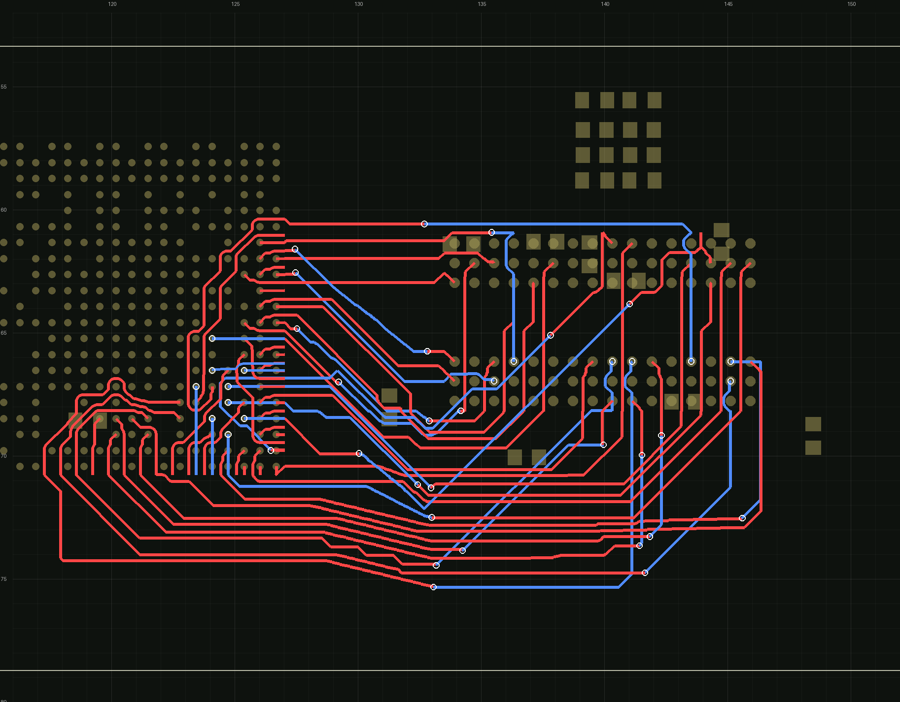 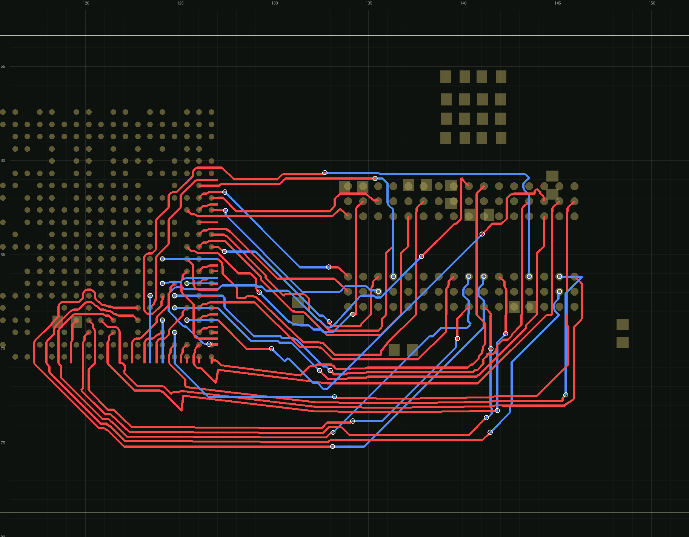

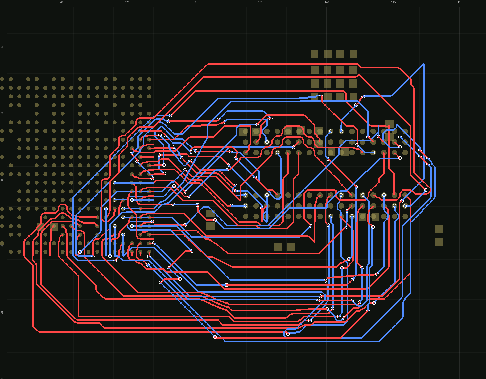 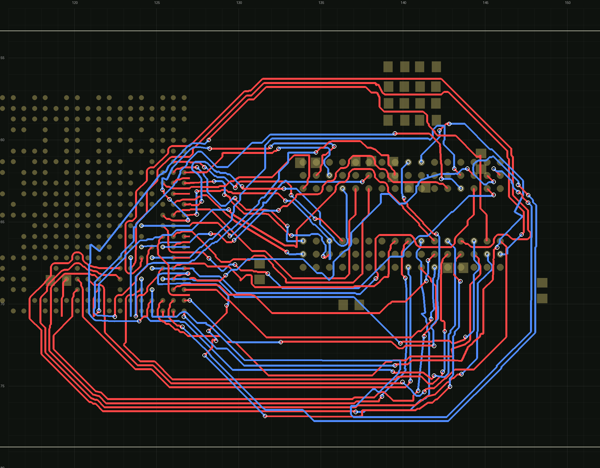

*The pack (`pack_board.py`, 4 s, opt-in `BRAID_PACK=1`): 1574 -> 875
segments at K28, every lane, 0 open, 0 DRC, the vias exactly where they
were. Before, the bottom river is a fan of router staircases; after, it
is horizontal lanes with 45-degree jogs. K41 goes 2258 -> 1843. What the
segments BUY is still unmeasured (TODO 11). At K41 the far-face rides
round the top and east become grid legs and the source's wraps nested
chamfers; what stays off the grid is the 6-degree fan from the source's
south row and two coupled corners at the passives.*

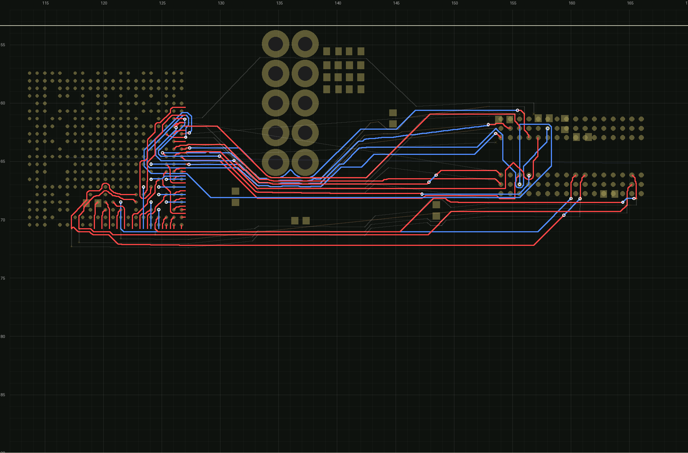 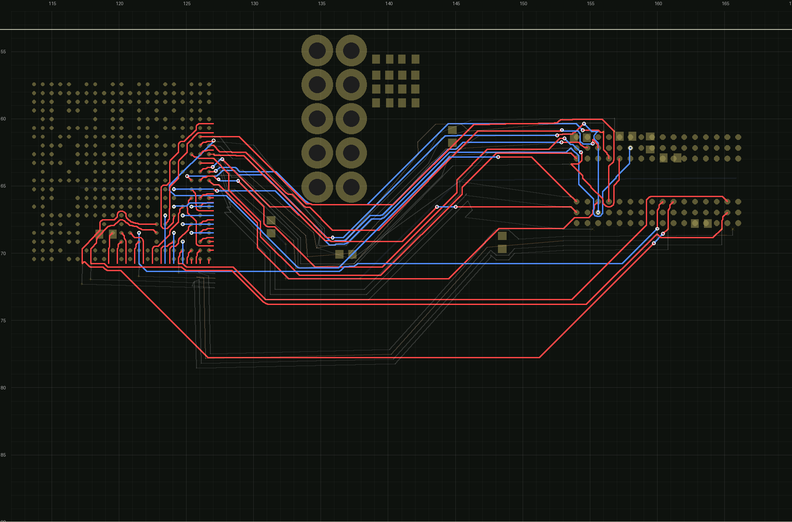

*The spine. With a straight chord the frame runs through the header and
the lanes are squeezed under it one by one (24 vias, 899 segments). With
the relaxed medial spine -- the default -- the ribbon rounds the part in
45-degree legs, lanes a pitch apart through the bend (26 vias, 692
segments).*

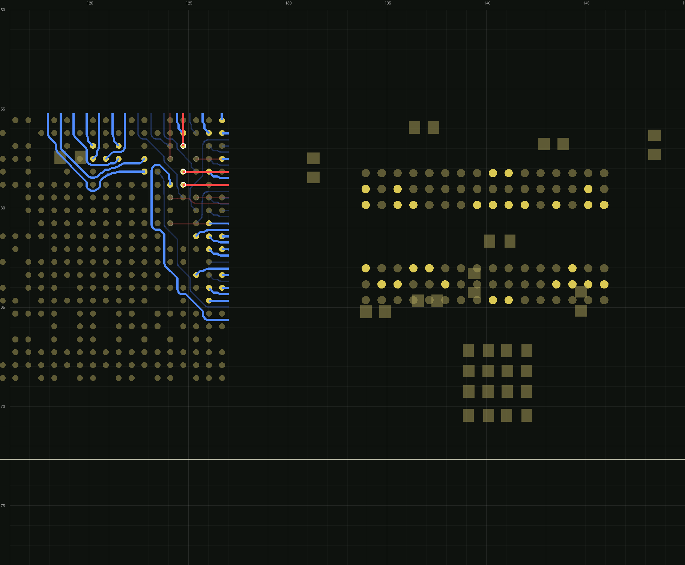

*The mirror article: the fanned bench flipped through its plane -- every
part on the other face, every stub on the other layer, y mirrored,
self-verified. Every isometry grades as the control to the via and the
segment, which took the selector and the braid each running a pair in
the pair's own canonical frame.*

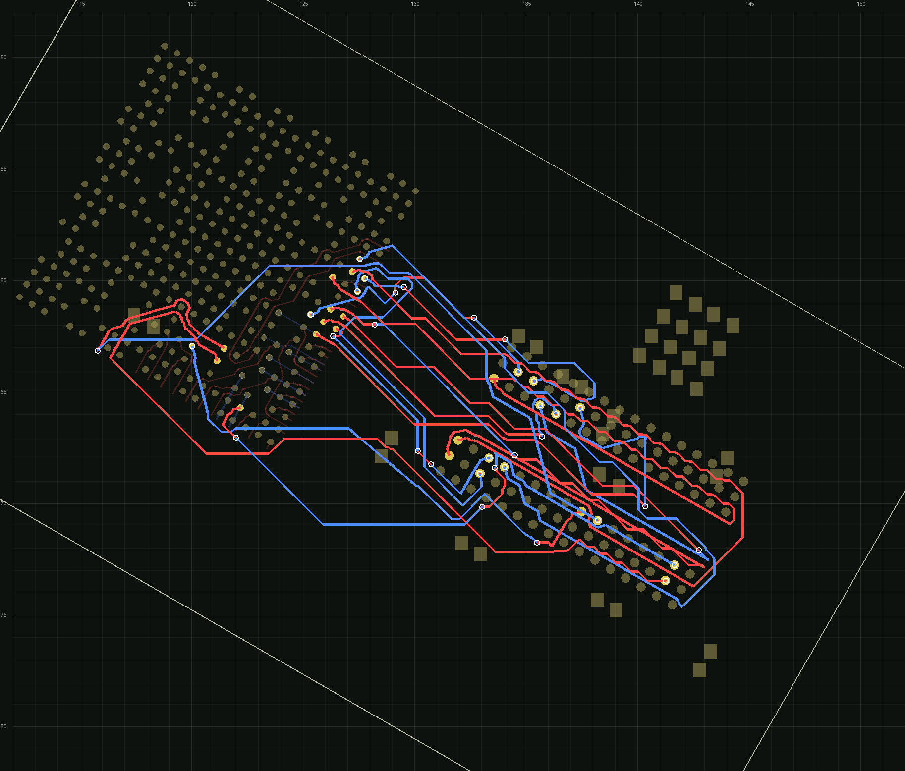

*A 30-degree rotation: complete, but 33 vias and 6 of 15 in-band. The
plan's faces are compass directions and the router's lattice is
octilinear, so a non-orthogonal pose is outside both models today
(TODO 9).*

## The tools

| | |
|---|---|
| `chain_k.sh` | the chain; `grade_k.py`, `via_census.py` grade it |
| `fanout_from_plan.py` | the planner and both fanouts |
| `braid.py` | the router: corridors, schedule, lanes, rip |
| `select_moves.py`, `escape_moves.py`, `plan_ends.py` | menus, greedy choice, plan cost |
| `source_realize.py` | realize a source plan with the production engine; `blockers_of` names what stands in a tooth's way |
| `schedule.py`, `corridor.py`, `sched_first.py` | pages, corridors, the schedule-first planner |
| `connect.py`, `topo_strings.py`, `taut_fast.py` | the real router and the taut relaxation |
| `replan.py` | the ROUTE as the judge; re-plans the ends the braid paid for |
| `pack.py`, `pack_board.py` | every lane a taut string against its neighbour |
| **`ledger_cal.py`** | **per net: DP floor vs slack. The instrument that says whether to work on the plan or the realization** |
| `human_at_k.py` | the human's vias for a coherent K set. **Mind the label**: `coherent_nets(51)` returns 48 nets, so "K51" is a 48-net problem -- the human is 81 over those 48 and 85 over the full 51. Both are right; ours route 48 |
| `census_vs_human.py` | per-net vias/copper/layers against the human, and where each via sits |
| `collapse_dives.py` | collapse short dives on a routed board (2 vias each) |
| `cut_ledger.py` | Maley cut capacity of a plan, before any lane is routed |
| `wall_probe.py`, `copper_same.py`, `cmp_copper.py` | track-level wall census, set-compare copper |
| `make_bench.py`, `rotate_board.py`, `mirror_board.py`, `bend_bench.py`, `channel_bench.py` | build an article from any board, and its poses |
| `pose_gate.sh` | the chain over FF / BF / FB / BB / R90 / R180 / R270 |
| `modal_k.py` | fan a sweep onto Modal, one container per (arm, K) |

## One source for every routing number

Audited 2026-09-12, after a swimmer was found priced five different ways
and `collapse_dives` was found re-laying at the wrong track AND the wrong
via size. Every routing quantity now has exactly one home:

| quantity | the one source | value | who reads it |
|---|---|---|---|
| braid lane track | `topo_strings.TRACK` | 0.127 | braid (`= ts.TRACK`), pack, cut_ledger, collapse_dives, replan, fanout |
| braid hug clearance | `braid.CLEAR` | 0.105 | braid, pack, cut_ledger, collapse_dives |
| spec clearance | `topo_strings.SPEC_CLEAR` | 0.1 | topo_strings |
| via size / drill | `braid.VIA_SIZE` / `VIA_DRILL` | 0.25 / 0.15 | braid, cut_ledger, replan, fanout, collapse_dives |
| **swimmer price** | **`prices.SWIM`** | one number, five sites | plan_ends, braid x3, sched_first |
| `DIRS`, `LAYERS` | `escape_moves` | | fanout, source_realize, sched_first, replan |

**The board carries TWO track widths on purpose.** The fanout's stubs are
laid by the production engine at its own 0.1 / 0.1
(`source_realize.FAN_TRACK` / `FAN_CLEAR`) -- 23 segments on a K51 board
-- and the braid's lanes at 0.127 / 0.105 -- 2530. A tool that rips a
braid lane and re-lays it must use the BRAID's numbers; `collapse_dives`
used its own 0.1 / 0.1 and 0.45 / 0.25 and so put thinner copper and
oversized vias into the board, which also inflated its reported saving
(137 -> 133 claimed, 137 -> 135 real).

**`braid.CLEAR` (0.105) and `topo_strings.SPEC_CLEAR` (0.1) are different
quantities** -- the spec, and the spec plus 5 um so a hug does not sit
exactly on it. They were both called `CLEAR` until this audit. Do not
import one where the other is meant.

Names that LOOK shared and are not: `TOL`, `STEP`, `MARGIN`, `CAP`,
`PROX_TRACK`, `HW_COL` -- different local quantities that happen to
share a generic name or a number. Leave them alone.

## Measuring honestly

Every one of these cost a session to learn.

- **A board with open nets has artificially LOW vias.** An unrouted net
  lays no copper. Only 0-open boards compare. (`fa` K41 once read 67
  vias -- better than the human -- with 3 nets open.)
- **A single K is not a result.** Run-to-run spread on one board is
  +-2..3 vias. Judge on K28 AND K35 AND K41 together, and include K51
  before claiming "worse on none".
- **K15 and K28 first.** Higher K only once those are great. Nearly
  every richer planner wins at one K and loses at another.
- **Quote the arm with the number**, or it cannot be compared.
- **`BRAID_CPSAT_DET` is not optional.** Without it CP-SAT stops on wall
  clock across 4 workers and the same input gives 80 / 82 / 85 / 80.
- **Verify every new flag byte-identical with the flag OFF** before
  reading anything off it.
- **The probe must use the chain's own env and board.** `DST_WALK` and
  `DST_FACE_ASK` change the MENU; a probe run without them measures a
  different problem (measured: 45 berths seated vs the chain's 34).
- **THERE ARE NO CLOCKS. Every budget is in WORK, and that is a rule,
  not a preference.** A clock budget does not make a slow machine answer
  later, it makes it answer DIFFERENTLY. Measured: two identical cloud
  runs of the K35 baseline -- same image, same env -- came back **72
  vias / 1436 segs and 58 / 1840**, because a container is ~2x slower
  than the laptop (K51 1330-1574 s against 600-900) and five wall-clock
  budgets that never bind locally bound there. That was also the likely
  source of the "knife edge" +-2..3 via spread under load.
  So: every search loop is capped in **judge calls**
  (`fanout_from_plan.PLAN_CALLS`; `DST_RESIDUE_CALLS`,
  `DST_SEARCH_CALLS`, `SRC_REPLAN_CALLS`, `SF_REPAIR_CALLS`), HiGHS is
  capped in **nodes** (`BRAID_MILP_NODES`, or a stage's own `nodes`) and
  CP-SAT in **deterministic time** (`interleave_search` +
  `max_deterministic_time`, always on -- `_milp_solve`'s `time_limit`
  parameter is accepted and IGNORED). `py_router` was already clean.
  **Do not add a `time_limit`, a `max_time_in_seconds` or a
  `time.time()` guard that decides an output.**
- **Modal is a different numeric era.** The cloud image pins numpy,
  scipy, ortools, shapely and grid_router to the local versions but runs
  python 3.13 against the local 3.14, and the baseline ladder comes back
  72 / 76+1open / 118+2open against the local 58 / 80 / 137. Cloud
  numbers compare ONLY to cloud numbers.
- **Look at the renders.** `../py_router/route_render.py`; the copper is
  the plan.

## What the human does

Two vias per net, at the ENDS, on a constant layer -- `census_vs_human.py`
shows it as `DS` or `DD` on nearly every net. Our excess is at the ends
too, but piled: at K51, SBA1 `DDDDDDSS` (+6), SA1 `DSSSSS` (+4), SCS1
`DDDDDS` (+4) carry 14 of the 23-via deficit between them, with near
double path length (SA1 61.4 mm against 30.9). Five nets beat the human
by crossing the field on F with zero vias.

The human's berth order gives 68 crossings at K41 against our 250, and a
longest crossing-free chain of 29 against our 21 -- but see the floor
finding above before treating crossings as the objective.

## What the 2026-09-12 audit changed

Ten parallel audits over everything this branch adds. The defects are
fixed and in the log; what matters here is which RECORDED CONCLUSIONS
they invalidate, because those are the ones that would otherwise be
believed forever:

- **"The berth chooser accepts nothing" was never a null result.**
  `_alts5` stage A pinned a moving net's as-laid lane vias into the
  objective, so every candidate was charged the vias it would stop
  paying as well as its own. Only a move flipping a swimmer could win.
  Every source and berth arm judged through it was measured under a
  systematic bias.
- **`SPLIT_BLOCKS` was never measured.** `NEST_IN`, `NEST_STEP` and
  `BAND_LPITCH` were used and defined nowhere in any commit, so the band
  path raised NameError on the first band exit. Its recorded verdict
  ("complete, general, lost") is void -- it is a crash.
- **`SEL_XLAYER`'s verdict is void too**: that arm ran through a
  `zip(placed_nets, placed_legs)` desync pairing a trial leg with a
  stale net.
- **The joint solve had no compatibility constraints at all.**
  `plan['alt_excl']` was nested under `if xing:`, and `DST_XING` is 0 by
  default -- so every recorded `DST_RESIDUE=3` result was produced by a
  solve free to pick two berths that cannot both be laid.
- **The DRC feedback could not see a pad short**, so a pass could print
  "every berth laid as planned" on a shorted board.
- **"The human's vias are at the ENDS" could not be falsified**: the
  census's MID class did not exist (it was nearest-of-two). With it
  implemented, several of the human's vias are mid-field.
- **`grade_k` graded a crashed checker as clean**, and missed a net with
  no copper at all -- an arm that DROPPED a net scored as a via win.
  Re-graded every headline board with the strict tool: all unchanged, so
  no recorded number was actually wrong.
- **The judge's answer depended on the machine's core count** -- pool
  workers inherited each other's level-5 seeds, and at a 30-node budget
  the seed is the answer. Same class as the clock rule, different hat.

Two lessons worth keeping: an instrument that cannot measure must FAIL,
never report clean; and a knob measured negative through a broken path
has not been measured.

## Settled -- do not re-run these

| arm | verdict |
|---|---|
| `BRAID_SOLVER=cpsat` (plain solves) | **never** -- K41 98. `BRAID_ALT_SOLVER=cpsat` (choice solves) is the good one |
| `BRAID_VIA_ROOM_REFUSED=2` | breaks K51 (3 open / 30 DRC). Default 0 |
| `SEL_XLAYER=1` | crossings WORSE (K41 196 -> 301) -- but that arm ran through a `zip` desync pairing trial legs with stale nets, so the verdict is **not evidence**; unmeasured |
| `DST_XING` per-candidate | pairwise deltas are not additive; the pairwise MILP form fixes the bug and still beats nothing |
| `DST_XING_SCREEN` | helps nothing, alone or with the pattern seed |
| `SEL_CONTEND` / `DST_CONTEND` | fail in both placements, at every weight |
| `DST_WALK_OFF` (off-array walk) | built, general, loses |
| optimising the SWIMMER count | anti-correlated with vias on 3 of 4 benches; a swimmer costs ~1 via |
| `DST_SEED_ORDER` = `perp` / `arc` / `win` / `dp` | one global order round the array loses at every bench; the face carries topology AND partitions the monotone run |
| `DST_ASK_BAN=1` | an ask the engine answered a layer/kind away is not repeated: INERT on the pattern arm (18 bans, identical copper), harmful on the baseline (K35 58 -> 66; K51 0 open -> 5 open + 23 DRC) |
| `SRC_REPLAN=1` | names a better tooth, the one-net re-fan cannot lay it; superseded by `SRC_REFAN_JOINT` |
| `BRAID_EXACT_PAGES=1` | the two pages by exact MILP instead of the LIS greedy: never won a chain |
| `SWIM_CHANGES=1` | a swimmer priced by the braid's implied changes: unmeasured on a chain |
| `SPLIT_BLOCKS=1` | **verdict VOID** -- it raised NameError on the first band exit (NEST_IN/NEST_STEP/BAND_LPITCH undefined) so it was never measured. Fixed 0912; unmeasured |
| the wave schedule, `refine_sides`, the source chooser | reverted (the wave never existed on take5; it is in the bundle) |
| `group_pages`, `plan_nest`, `improve_k`, `channel_shift` | dropped with take4 (bundle: `~/Downloads/bus/bus622-take4.bundle`) |

Opt-in and kept, all present here: `replan.py` (the route as the judge),
`DST_WALK=k`, `SRC_CLIMB=k`, `pack.py`. The re-berth backstop was a take4
file and is in the bundle only.

## TODO

1. **Why the human's floor is lower per crossing.** The objective. We
   pay 0.35 layer changes per crossing, the human 0.22. Find the
   structural property (end-layer agreement? crossing parity along a
   lane? partner layer at the crossing?) and score plans by it. Score
   with `ledger_cal.py`, not with crossing counts.
2. **K51 completion on the pattern arm.** `DST_SEED=pattern` gives 104
   vias against the baseline's 137 with chain 25 / slack +3, but ships 2
   open (SDQ12, SDQ5). The failure is a berth boxed in by its
   neighbours' stubs, not a lack of room (`cut_ledger` says every cut
   fits).
3. **The pattern seed loses at K35/K41** (69 vs 58, 88 vs 80) where
   there is capacity to spare. Either gate it on slack, or find what it
   gives up when it is not needed.
4. **The berth menu is the binding constraint on the joint solve.** Each
   net has ~26 distinct berths and the solve is offered 4, pre-filtered
   by `vias + ride`. Raising the cap to 8 quintuples the model (97k ->
   505k rows) because every candidate is instantiated as a whole lane.
   Column generation (one column = one lane, priced by a shortest path)
   is the standard fix and does NOT inherit the compact LP's useless
   bound (47.75 against an integer 102.62).
5. **Solver budget against quality.** CP-SAT proves the 550k-row cap-8
   instances optimal in 180-310 s, which is 7x over the time edict.
   Measure the incumbent at a short `BRAID_CPSAT_DET` before buying any
   approximate solver. `BRAID_CPSAT_REPAIR` (hint repair) is built and
   unmeasured.
6. **`DST_ASK_BAN`** -- an ask the engine answered a layer/kind/face
   away is not asked again. Built, default off. First measurement is
   negative (K35 66 against 58); finish the ladder before deciding.
7. **The corpus A/B for the production changes, then the PR to main.**
   Audited 2026-09-12; the list was FIVE and is really this. Everything
   here changes copper on boards that have nothing to do with this
   chain, and a change that moves copper but is not on the list is the
   one nobody thinks to measure.
   - **`KICAD_SEG_DIST_EXACT`** (`single_ended_routing`) -- default ON,
     every route on every board. The maths is verified exact (3,008
     cases against brute force: it is never larger than the truth, max
     deviation 1.1e-16), so it cannot admit close copper. But it tightens
     a boolean gate `d >= clr + w/2` at ~10 sites in `pcb_modification`
     -- smoothing, dangling-bridge repair, re-bend, stub trim,
     castellated retract, via nudge -- so those passes now DECLINE moves
     they used to accept. Fewer sub-clearance grazes, possibly more
     repairs left undone; only the A/B can say which dominates.
   - the pad keep-out's sub-cell offset quantised (`routing_utils`, both
     obstacle stampers, every route)
   - `plane_fill_model` cell rounding -- changes which fill cell a
     pour-direct stub taps, on every board with planes and #678
     pour-served balls. CLAUDE.md: a plane/oracle change cannot be judged
     by one replay pair.
   - `bga_fanout/escape.py` tie-breaks -- escape direction and channel
     choice on EVERY BGA/QFN fanout
   - the `underpad` ordering/quantisation family (`depth()`, `CELL_EPS`,
     the keep-out raster rounding whose own comment measures "244
     boundary cells stamped differently") -- reorders Phase A's claim
     sequence, which decides which ball claims each rim gap, on every
     under-pad fanout
   - `rotate_frame.to_axis_aligned_frame` -- every non-orthogonal BGA/QFN
     board. This one is a FIX (main saw pours and outline in the
     un-rotated frame) but it is a copper-changing fix.
   - `_foreign_seg_arr_trust` -- weakens a shared cache's staleness
     digest. The invariant holds today; a future in-window copper edit
     would route against phantom copper with nothing to catch it.
   - the back-side BGA fanned as the front's mirror, and the fanout's
     plan-follow (`escape_dir_hints`, which also owes a GUI call site and
     a `FLAG_PARAMS` entry -- the Class-2 drift CLAUDE.md forbids)
8. **The second bench's in-band gap.** zynq_ad9364 at K28: 0 open, 55
   vias, but 17 of 28 in band. The leg rules were tuned on ONE bench.
   Fix `flow_frame.py turn` first -- the article does not run through
   `chain_k.sh` today.
9. **Poses off the axes.** R30 and R45 break the plan's compass faces
   and need a trigonometric turn of the file.
10. **A better routing order.** Lanes are laid sequentially and every
    refusal the rip repairs is a sequential loss. Most-constrained-first
    is the reference.
11. **The packing's purpose is unmeasured.** `BRAID_PACK=1` ships 0 open
    0 DRC with vias unchanged and far fewer segments; nobody has
    measured what the segments buy.
12. **The source is frozen.** Every chain arm runs `SRC_ROUNDS=0`, so
    U1's teeth are the bench's own fanout and the source disagreement
    with the human is an INPUT, not a result. The joint source re-fan is
    built (`SRC_REFAN_JOINT=1`) and only pays at K51, where the blocking
    net is in the run.
13. **Tooling.** Promote the session probes into `awx/` with a line each
    here; add the flag-off parity gate that the hand check does today.
14. **Re-express the two `*_TIME` stage knobs in nodes.**
    `BRAID_L5_ALT_TIME` and `BRAID_L5_JUDGE_TIME` now reach an IGNORED
    parameter, so setting them does nothing. They are still the natural
    place to say how hard a stage should try; say it in nodes.

## What this adds to `py_router`

**`KICAD_SEG_DIST_EXACT` (default ON, and it changes EVERY board).**
`single_ended_routing._seg_foreign_seg_dist` used to sample our segment
every 0.02 mm and measure each sample to the foreign segments, so its
minimum was always >= the truth. The minimum distance between two
segments is attained at an endpoint of one of them unless they properly
cross, so four point-to-segment distances over the foreign segments give
the exact value -- smaller or equal, never larger, so the router sees
obstacles a hair earlier and can only become MORE conservative.
Profiled at 27,900 calls / 25 s of a 149 s K41 braid. This is the one
change here that is not scoped to the awx chain, and it owes the corpus
A/B (TODO 7) before it reaches main. `KICAD_SEG_DIST_EXACT=0` restores
the sampled sweep.

`generate_bga_fanout(..., escape_dir_hints=...)`: a per-pad planned
escape keyed by board-frame pad position -- a bare FACE (`'down'`) or a
FULL MOVE (`{'face', 'exit', 'layer', 'kind', 'site'}`). The under-pad
engine follows a full move in its plan-follow phase
(`underpad._follow_plan`): planned balls leave the generic phases, their
via sites are reserved first, every ball is routed to its EXACT move
deepest-first, a ball whose exact move is blocked negotiates (its
blockers among the same call's escapes are found on a pre-commit
occupancy snapshot, ripped, the ball laid, the blockers re-laid, and the
state kept only if the count of balls landed as asked rises), and what
is still short degrades along the least damaging dimension: nearest free
gaps first, then the other layer/kind, then any face. Every ball's
outcome is reported per dimension in `pcb_data._fanout_plan_report`.
