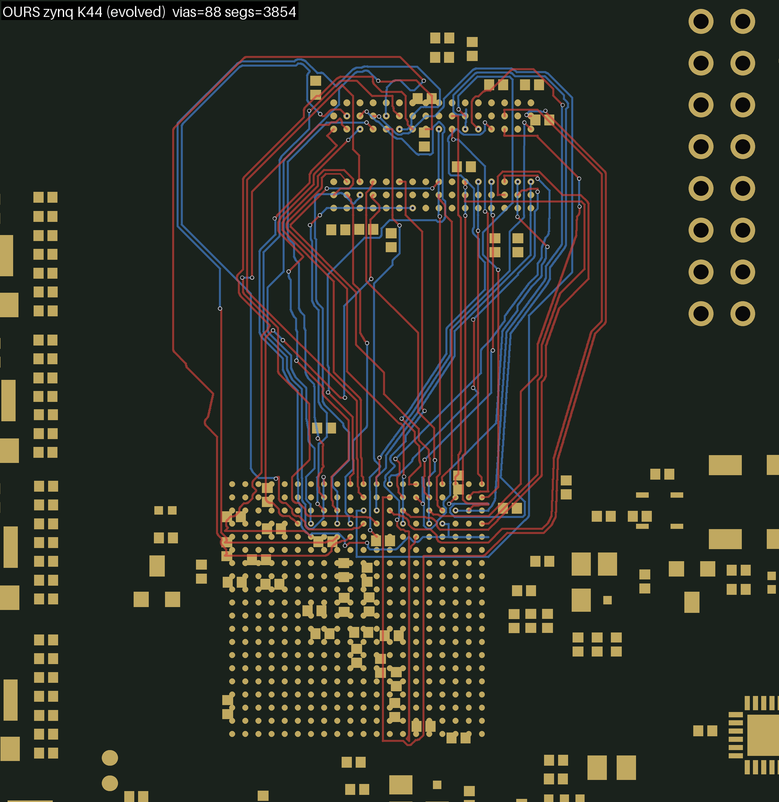
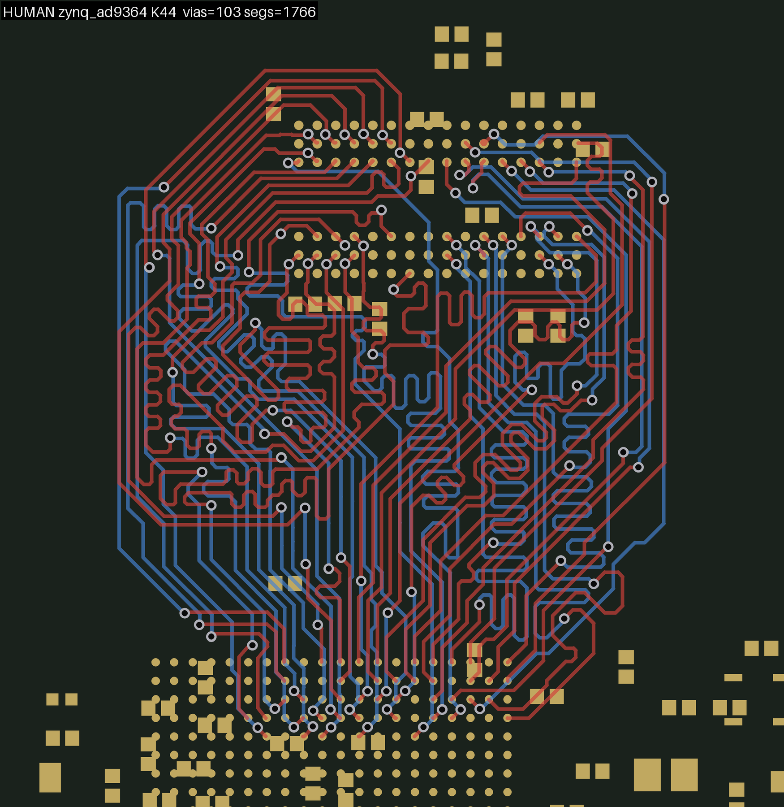

# awx -- the K-bus chain and its evolution (#622)

Routing a fanned-out bus between two BGAs. One PLAN decides both ends of
every net, the FANOUT lays exactly the plan's moves and reports what it
could not, the BRAID routes the lanes in a corridor of two pages -- and
then a POPULATION of routed boards evolves: each world descends by
probing single moves with the real router as the judge, jumps to nearby
worlds, and exchanges ends with the others, until the best board is a
local optimum of every move the menus offer. The records on every rung
came from that evolution.

    bash chain_k.sh TAG 28 41 51                      # the chain: -> tmp/TAG_k<K>.kicad_pcb, graded
    python3 evolve.py TAG 51 --seeds=STEM,... --pop=4 --gens=3 \
            --descend="--rounds=2 --worst=6 --probes=2 --min-vias=2 --coupled=census --grade=inproc --par=4"
    python3 replan.py STEM 51 --from=STEM --out=OUT --mode=incremental --apply=strip ...   # one descent
    python3 evolve_movie.py TAG 51 --gif                # the movie of a run
    python3 make_bench.py BOARD SRC DST OUT             # another array pair, from any board
    bash pose_gate.sh BOARD SRC DST 15 28               # the same pair in every pose

Run everything under the chain's own environment, `PLAN_PAGES=1
PLAN_JUDGE=count PLAN_JUDGE_LEN=lane`. (We have no idea what `awx`
stands for. The name predates every note that mentions it.)

## Where it stands

The bench is `fb_t2q_fresh`: an H3 BGA `U1` to a DDR3 `DU1`, routed over
the coherent K-ladder (`coherent_nets` counts whole rivers, so "K51" is a
48-net problem). Every board below is 0 open, 0 DRC at the routed 0.1 mm
floor, graded independently (`grade_k.py`), and carries the same
out-of-run nets as the reference boards. `tmp/records/` holds each one
with its fanout board and sidecars.

| | K15 | K28 | K35 | K41 | K51 |
|---|---|---|---|---|---|
| the chain alone (the portfolio's best arm) | 16 | 34 | 60 | 74 | 98 |
| **the evolution (2026-09-18/19)** | **14** | **34** | **56** | **64** | **83** |
| human | 22 | 46 | 58 | 70 | **81** |
| how the record was found | a jump world descended | the chain; nothing improved it | a jump world from the 58, descended | the 74 arm descended to 67, that to 64 | an open-net arm descended to 91, then 91 -> 87 -> 85 -> 83 with the climb menus |
| evolution time, this laptop | 2 min | 2 min (the chain) | 7 min | 12 min | 35 min |

**K15, K28, K35 and K41 beat the human; K51 is two vias short of it.**
The chain-alone row reproduces exactly after the rebase onto main
(2026-09-19; "What this adds to `py_router`" below has the run).
The 83 carries two grazes of 7 and 8 um under 0.1 on B.Cu -- the
grid-quantisation class the chain's `--clearance-margin 0.1` filters, as
`check_drc` documents -- and the 85 (`tmp/records/k51_85_climbs`) is the
last board clean with no margin at all. 83 is the local optimum of every
single-net move class with the climb menus, at descent thresholds of
three and two lane vias: five generations of descents, near jumps and
crossovers at K51 over two runs stood nothing, and the last run
(`tmp/ev51f`) ended with four distinct 83s -- every jump and crossover
world descended back to 83.

**The second article: zynq** (2026-09-19). `zynq_ad9364` from the
stress corpus (set 4), the Zynq `U1` (CLG400) to its DDR3 `U2`, built by
`make_bench.py --two-layer` in 15 s: 46 pair nets, two refused at the
source, 44 in seven rivers, checkpoints 9 18 26 32 38 42 44. The human
routed this bus on F and B only (the inner layers are planes; 103 vias
over the same 44 nets, every one F-to-B), so the two-layer article is a
fair comparison. The pair points -y, so the chain runs it through one
quarter turn of the flow frame; the frame article (`zynqF`) grades
identically at every rung, and the evolution runs on that.

| | K9 | K18 | K26 | K32 | K38 | K42 | K44 |
|---|---|---|---|---|---|---|---|
| the chain alone | 14 | 16 | 39 | 54 | 68 | 90 | 105 |
| **the evolution** | **12** | 16 | **34** | **50** | **59** | **71** | **88** |
| human | 25 | 45 | 57 | 74 | 86 | 97 | 103 |
| chain wall, this laptop | 33 s | 1 min | 2 min | 3 min | 5 min | 6 min | 8 min |

All 0 open, 0 DRC at 0.1 mm. Below the human at every rung but the
top, where the chain is two over and the evolution fifteen under. The
evolution row: K9/K18/K26/K32 by the population as the H3 ladder runs
it (pop 3, two generations, K9 one; K18 gained nothing), K38 by both the
population (a near-jump world descended) and the descent alone,
K42/K44 by the descent alone carrying `--length=1 --worst=8` (three
rounds: 90 -> 77 -> 71, 105 -> 97 -> 95), then a K44 population seeded
from the 95 (pop 4, two generations, length rule on, 53 min): every
descent of the 95 null, the CROSSOVER of the 95 with the chain's 105
(seven of their fourteen differing ends) descended 108 -> 93, that 93
descended to 89, and a near jump from the 93 (two nets) descended
101 -> 88. Population at the end 88 / 89 / 93 / 95; the 88 is
`tmp/records/zynq_k44_88_pop` (its board-frame copy beside it). The length tie rule -- an equal-via board that
shortens the copper stands -- is what let the K38 descent take nine
vias in one round where the same round without it took four. Where the
human's board never puts more than four vias on a net (one net), the
chain's K44 carries seven nets at four and three at six -- the
multi-divers the descent exists for. Two defects the article shows that
the H3 bench cannot: a net the main spine cannot reach is split into a
one-net corridor and planned onto a FAR-FACE source tooth (a channel
escape through seventeen rows of the Zynq, then straight back: DQ12 at
K38, DQ13 at K44, ~24 mm of hairpin each, priced by the count judge as
a via saved), and at K42 the whole bus becomes one 42-net corridor with
eleven in-band refusals. Renders: `tmp/zynq/img/`.

Two rules the router keeps. **It is general**: no net, face, board or
part name anywhere in the code; every rule is geometric. **It is an
autorouter**: the human's boards are tests, never seeds. The one test
that used the human's ends (their ends, our braid, then our descent)
reached 79, below the human's own 81 -- which is how it was learned that
the gap at K51 is the ENDS, not the realization, and that the human's
ends differ from our menus only in the climb classes. The descent's
menus carry those classes now (`DST_CLIMB=2` in descents, `SRC_CLIMB=4`
in jumps); the CP-SAT plan cannot use them, the route-judged descent can.

**A number is meaningless without its arm, and cloud numbers are a
different measurement from local ones.** CP-SAT stops the plan solve at
platform-dependent feasible points, so a chain on Modal starts from a
different plan than the same chain here. Compare cloud to cloud, local
to local.

**The source stub trim and the served-under-the-part rule** (2026-09-19,
the second pass over the zynq article). Two things the article asked for,
each general:

* **The source stub trim** (`braid.note_source_joint`, on by default;
  `SRC_TRIM_REACH=0` turns it off) is the source-side mirror of the berth
  trim: at write time every lane is walked from its tooth, every vertex
  projected onto the net's own stub chain, and the deepest splice that
  shortens the copper and grades no worse on the net's scoped DRC stands
  -- the stub's dead tail and the lane's backtrack go, one cross segment
  joins them. Vias never change. Measured, the trim on: zynq K38 68 = 68
  vias with DQ12 58 -> 37 mm, K44 105 = 105 (six lanes, -20 mm); H3 K28
  34 = 34 (SA1 -3.4 mm), K35 60 = 60 (SDQ10 + SDQ13 -28 mm), K41 74 = 74
  (-13 mm), K51 98 = 98 (SBA1 + SDQ11 + SDQ13 -57 mm). A dead-copper
  audit of every board finds no dangling tail at either end -- the berth
  trim is complete on these boards; what it does not catch is a lane that
  never touches its stub again (DQ13 at K44 climbs six millimetres up the
  far face before turning back, and the 3.6 mm splice the trim found took
  5 mm, not 20).
* **The served-under-the-part rule** (`py_router`, `KICAD_FANOUT_SKIP_UNDER=1`,
  `bga_fanout.escape.under_part_candidates`): a ball whose net's every
  off-footprint pad lies inside the ball field -- a ZQ resistor or a
  decoupling cap on the far side, straight under it -- gets no escape
  stub; its connection is a via at the ball and a short far-side track.
  The H3 bench's `SZQ` (ball V10 to R6.2, 0.09 mm away on B.Cu, drawn a
  2.4 mm stub toward the edge) is the case; on the corpus H3 board the
  switch drops exactly that stub and touches no bus net. It rides #472's
  deferral plumbing, so the balls stay routable through the route steps'
  zone exemption. Opt-in: the always-on form is a fanout-laid pad drop
  (via at the ball, track to the pad), not built. A bench rebuilt with it
  loses `SZQ` from the K51 ladder, which is right: it is not a bus net.

**The pack, made to work on a finished board** (2026-09-19, Andy: "I
see easy shorter paths", then "still slack in the outer lanes"). Six
things were wrong, in the order they surfaced:

* An evolved board's `.pack.json` is the LAST PROBE braid's sidecar, and
  a probe lays one lane and its coupled set -- on the K44 record the
  packer saw one corridor with one lane of 44. The whole-board mode
  (`pack_board.py BOARD --fanout BOARD_fo --nets ... --src U1 --passes 4`)
  packs every lane of the run, one corridor per lane, the passes
  repeated so each sees the room the last one left.
* The FOLLOW force -- each lane snapped into the tube of the lane packed
  before it -- copies that lane's jogs, and from the wall inward the outer
  lanes copy the router's still-ragged inner ones: the K18 bundle read as
  a wave. Four passes with the follow grew K18's lanes 392.6 -> 394.8 mm;
  taut (`PK_FOLLOW=0`, the whole-board default) they went to 386 and bend
  together at the cap pads.
* A via moved by its lane was checked against copper only; the hole-to-
  hole rule (net-agnostic, 0.25 mm here = 0.40 centre to centre for these
  vias against copper's 0.355) is now a disc per drilled pad and per
  other via in the via world, read off the board.
* "Routed minus fanout" is not the lane on an evolved board: the derive
  step keeps lane fragments as the berth's copper, so WE and A3 came out
  in pieces with fanout-matched gaps and were skipped. The lane is now
  everything outside the two STUB CHAINS -- the copper reachable from a
  pad through fanout-matched segments only -- with the chains' tips as
  its ends, taken at their exact coordinates (the packer chains on four
  decimals; a rounded 80.070 never met its 80.0703).
* A run that meets its via inside the annulus reads as a break: a tiny
  gap (WE: 22 um) is snapped onto the centre, a larger one bridged with a
  link -- not snapped, since moving one end of a 2.1 mm segment by 0.106
  mm tilted it into a foreign via's clearance (K32 DQ8 vs DQ14). A 35 um
  duplicate whose both ends lie on the chain (A0) is dropped as a loop;
  112 lanes had come back "unchained" over it.
* The grade is the gate: a scoped DRC before any edit and after the
  passes, and every lane a new violation names goes back to the copper
  it came with. The emitter's own piece validation had let a re-emitted
  end into a via's clearance.

* Two more, from the renders: a kink -- the any-angle repair replaces
  an unclear grid leg by the string's chords between its ends, and an
  elbow whose SECOND leg was unclear keeps its first, a 45-degree leg to
  the corner and a jog back (K44 BA2, 2.5 mm out and 0.79 back where the
  string ran straight). A vertex the path doubles back at now goes when
  the chord past it is clear (`_unkink`; 23 -> 6 sharp turns at K44).
  And the source trim runs again on the finished board before the pack
  (its splice, its DRC), because a board the evolution assembled from
  probes carries backtracks no braid saw whole: 34 mm at K44.

| K | 9 | 18 | 26 | 32 | 38 | 42 | 44 |
|---|---|---|---|---|---|---|---|
| lanes, mm (best -> trimmed + taut pack) | 185 -> 181 | 393 -> 383 | 662 -> 630 | 801 -> 769 | 954 -> 915 | 1054 -> 996 | 1203 -> 1104 |
| run copper, mm | 221 -> 217 | 468 -> 458 | 774 -> 736 | 971 -> 940 | 1171 -> 1121 | 1300 -> 1235 | 1477 -> 1350 |

Vias unchanged on every rung, 0 open, 0 DRC with and without the
margin, every lane packed.

* **The coupled re-lay** (`--relay`, on; before the pack): a splice the
  trim refused because another lane of the run stands between the stub
  and the backtrack is tried again with that lane LIFTED, and the lifted
  lane is then routed anew between its own two tips by the production
  router (`connect`, the chain's config) on the board as it stands. It
  is kept only when the pair's copper is shorter, no lifted lane gained
  a via, and the scoped DRC over the nets involved names nothing new;
  else every piece goes back. 1.2-1.4 s an attempt. On this article it
  keeps nothing: A13's neighbour DQS1_N comes back from the router with
  four vias where it had two, and is refused.
* **Why the south tooth needed no re-lay.** DQ13's 11 mm backtrack at
  K44 was walled by A10 -- but by A10's own HAIRPIN, one row over: its
  far-face stub and its lane straight back, both crossing DQ13's splice
  line. A10's own trim removes exactly that, and the pre-pass had asked
  DQ13 first, in ladder order. The pre-pass now runs in ROUNDS, the stub
  chains walked again on the board as it stands each round (a chain
  walked once still describes the tail a splice cut, and the next round
  books the saving twice), until a round splices nothing: DQ13 goes in
  round two, 22.5 mm, and round three finds nothing. 56 s for the whole
  K44 pack, the rounds' scoped DRC calls being most of it.
* What a lane keeps after all that is its wrap: a lane that goes the long
  way round its bundle at the same via count is invisible to the chain's
  judge, which prices vias and never copper.

## How it works, end to end

**The chain** (`chain_k.sh`) makes the seeds. `coherent_nets.py K` picks
the first K routable nets of the coherent ladder (`k_ladder_coherent.txt`:
whole rivers, tightest first). `flow_frame.py` turns the pair by the
quarter turn that points source to destination along +x and turns the
result back, so any of the four poses is the same computation.
`fanout_from_plan.py` plans both ends of every net with one CP-SAT
(`pages_first.py`: a destination move, a source move and a page per net,
two crossing-free chains, a swimmer priced at 100) and realises the plan
with the production fanout engine in a realise-and-confirm loop (a move
the engine did not lay as asked leaves the menu and the round re-plans).
Two fanout arms (`SRC_REFAN_JOINT` 0 and 1) and two braid arms per fanout
board (the sidecar's pages-first marker on and off) give four routed
boards; `pick_braid` keeps the best by (open, vias). Deduplicated by
copper, all four are the population's seeds -- the K51 record's lineage
began in an arm with two nets open.

**The braid** (`braid.py`) routes a fanout board: corridors from the
geometry (`corridor.py`), a relaxed spine per corridor, launch and target
orders from the lanes' offsets, the two-page schedule (`schedule.py`),
every lane routed by the production grid router inside its band
(`connect.py`, the Rust A* behind it). A refused lane climbs a rescue
ladder -- its band widened, both layers opened, then a free window --
and what is still refused gets a blocker-directed rip: the router's
blocked frontier attributed to this run's lanes, a min-cut probe naming
the cut set, victims re-laid or negotiated one level down.

**A world** is a fanout board with its plan sidecar and the routed board
with its braid record, graded `(open nets, DRC, vias)`. **The evolution**
(`evolve.py`) keeps a population of them and runs three operators, each
one subprocess:

* **descend** (`replan.py`): the route as the judge. Each round takes the
  worst nets -- refused ones, then those carrying the most lane vias
  (`--min-vias`, two at the frontier) -- and for each ranks its other
  classes at both ends by the plan model, screens them with an engine
  dry run, and PROBES the survivors: the net and its COUPLED SET (the
  lanes its new end conflicts with, the lanes the braid's own census
  says walled it, the co-moved berths) are stripped to their fanout
  copper, the moved end is re-fanned by the engine, the set is braided
  alone in the frozen field, and the board is graded. A probe that
  grades strictly better STANDS, and in incremental mode its board IS
  the board the next net is probed on. The round ends by deriving the
  next fanout board from the routed one (its lanes stripped) so the
  standing ends are exactly the laid ones. Monotone by construction.
* **jump** (`replan --perturb=N`): a few random nets moved to random
  other classes through the same probes, the landing taken whatever its
  grade. Lands a move or two away, routed.
* **cross** (`replan --cross=STEM_B`): B's ends asked for on A's board
  for a random half of the nets whose ends differ, one probe each, taken
  where they leave no net open. Population members differ in a handful
  of ends (2-10 of 41 at K41), so this is a few probes.

Every new jump and crossover world is descended in the same generation
before it is judged ("jump, then evolve to its local minimum, then
judge"); selection is elitist on exact grades, deduplicated by copper; a
world whose descent gained nothing is CLOSED and never descended again;
and every probe, engine screen and CP-SAT solve is memoised so the same
question on the same copper is read back. Descents run their probes on
resident worker processes (`--par=N`).

## The descent, in detail (`replan.py`)

    python3 replan.py STEM K --from=STEM --out=OUT --mode=incremental --apply=strip \
        --rounds=2 --worst=6 --probes=2 --min-vias=2 --coupled=census --grade=inproc --par=4

| | |
|---|---|
| `--from=STEM` | the world: `STEM_fo.kicad_pcb` (+ `.plan.json`) and `STEM.kicad_pcb` (+ `.log`, `.pack.json`, `.census.json`) |
| `--worst=N`, `--min-vias=V` | the nets probed each round: refused first, then the N with the most lane vias (at least V; their vias off the board minus their ends' vias) |
| `--probes=P` | candidates probed per end (the top P of the ranked, screened menu); joint tooth-and-berth pairs are probed too |
| `--coupled=census` | the re-lay set: the end's conflicts + the braid's blocker census + co-moves |
| `--mode=incremental --apply=strip` | a standing probe's board is the next board; the round's fanout board is DERIVED from the routed board by stripping the lanes (the re-fan apply was unfaithful) |
| `--grade=inproc` | the checks in-process; a probe's grade is SCOPED to the nets it changed when the reference board is DRC-clean (same answer, less than half the time) |
| `--par=N` | N resident probe workers (`probe_worker.py`): each holds the round's Board and applies the parent's advances; one net's candidates are probed N at a time, the engine screens too |
| `--perturb=N --seed=S` | the near jump; `--perturb-tries` candidates per net |
| `--cross=STEM_B --cross-frac=F --seed=S` | the probe crossover |
| env `DST_CLIMB`, `SRC_CLIMB` | the climb classes in the menus (the descent runs `DST_CLIMB=2`; the chain's solve cannot afford them) |
| env `PROBE_LADDER` | `open` (default): a probe braid's rescue ladder starts at the rung that opens both layers; `full` is the full braid's ladder |
| env `PROBE_MEMO`, `PROBE_MEMO_DIR`, `PROBE_MEMO_CODE` | the memo (`tmp/memo/k<K>/{probe,screen,closed}`), keyed on copper, move, code hash and knob hash; `0` off; a pinned code hash carries the memo across an edit known not to change copper |

A probe's log line says what the engine laid (exact / in class / another
class -- a substitute the engine lays instead of the ask is probed as the
ask from then on), what was re-laid with it, and the whole-board grade
against the reference: `STANDS`, `rejected`, or `unjudged` (the local
braid refused a lane with everything else frozen, which is not a verdict
on the move). A move the engine will not lay is banned at that net for
the run.

## The population (`evolve.py`)

    python3 evolve.py TAG K --seeds=STEM[,STEM...] [--pop=4] [--gens=3] [--jumps=2] [--cross=1]
        [--jobs=1] [--jump=near] [--jump-nets=2] [--cross-mode=probe]
        [--descend="..."] [--descend-env="DST_CLIMB=2"] [--jump-env="DST_CLIMB=2 SRC_CLIMB=4"] [--seed=N]

Seeds are chain stems (`STEM_fo_k<K>` + `STEM_k<K>`, every portfolio arm
imported) or replan stems. Each generation: every population member
descends; `--jumps` near jumps and `--cross` crossovers land; the new
worlds descend; selection. Outputs `tmp/TAG/g<N>/...`, `tmp/TAG/best_k<K>`
whenever the best changes, the ledger `tmp/TAG/evolve_k<K>.json`.

`evolve_movie.py TAG K [--view X0,Y0,X1,Y1] [--gif] [--verify]` films a run
from its ledger: one canvas per generation, the population row, each
descent under its parent, jump and crossover worlds with lineage arrows,
per-probe steps with the copper that changed lit and ghosted, a lineage
ribbon. `--runs TAG,... --descents DIR,...` films several runs and
standalone descents as one continuous evolution, worlds identified by
their copper; `tmp/movie/k51_day.mp4` is the whole K51 lineage 98 -> 83.

`--jobs` runs operators side by side; on this 8 GB machine one job with
four workers is the budget (a worker is 300-450 MB, and six workers with
two parents got a run killed for memory), so a laptop population runs
`--jobs=1 --par=4`. Each operator is the shape of a cloud container.

## Speed, measured (this laptop: 8 cores, 8 GB)

| | now | before (2026-09-18 morning) |
|---|---|---|
| one probe, serial | 3.7 s | 7-9 s |
| the K51 null descent, 31 probes | 50 s with four workers, 120 s in one process, 5 s warm from the memo | 216 s |
| the K41 descent 67 -> 64, 55 probes | 77 s with four workers, 205 s in one process, 13 s warm | 440 s |
| a jump | 20-60 s, landing a few vias away | -- |
| a crossover | 14-36 s, landing near the parents | -- |
| the chain, K41 / K51 | 124 s / ~345 s | 147 s / 372 s |
| a two-generation K41 population | 1241 s | 5430 s |
| a two-generation K51 population | 1028 s (550 + 475) | 7503 s for three |

What made it, each checked for identical verdict lines on the K51 null
descent and the same standing moves on the K41 descent:

* **The memo** (`probe_memo.py`): a probe's verdict is a function of the
  copper of every net outside its coupled set, the fanout copper the set
  keeps, the move and co-moves, the code (a hash over every `.py` of
  `awx/` and `py_router/` and the router binary) and the knobs. A hit is
  read back with the boards the original probe wrote; screens and closed
  worlds the same way. Warm re-descents are seconds.
* **Resident workers** (`probe_worker.py`): the braid called in-process
  (`braid.run`), the round's Board built once per worker, N candidates
  of one net probed at once. Utilisation with four workers is 52-60
  percent (a menu of about five is a wave of four then one).
* **The scoped grade**: on a DRC-clean board every new violation
  involves a changed net, so the DRC and connectivity checks run over
  the coupled set only; the fanout board's graze check and the realize
  gate the same way, in-process. 0.56 -> 0.25 s a grade, same answer.
* **The probe ladder starts where it lands**: over 436 probe braids,
  lanes landed on the ladder's first two rungs 16 and 16 times and on
  the third (both layers open) 355 times, and a rung costs 0.06-0.33 s
  whether it lands or not. Probes start at the third rung.
* **A CP-SAT solve read back instead of run** (`solve_memo.py`): the
  plan solver is deterministic, so the model's text plus its parameters
  is an exact key; a hit is replayed through the caller's solver with
  every variable fixed. A fanout arm 35 s cold, 12 s warm; the chain's
  second arm shares all four solves with the first.
* Smaller: probe braids skip the smoother (`smooth_board.py` smooths the
  final board once, byte-identical to the braid's own); lane spans cached
  on each move; four of a probe's twelve board parses gone; sidecars
  copied rather than re-scanned inside a probe; `taut_fast` chunks its
  Hausdorff and freezes a string past 5,000 points (one diverged string
  once asked for 26 GB).

Where a probe's 3.7 s goes now: the braid about 2 s (Rust A* and Rust
obstacle stamps a third each of that, the corridor band strips and the
Python map build the rest), the engine's re-fan and realize about 0.3 s
(the fanout engine's cost is stamping its occupancy grid, not its
under-pad search, which is 5 ms a call), the scoped grade 0.25 s, board
parses and writes the remainder.

## Differential pairs (2026-09-20)

A DDR bus is its pairs as much as its vias: the strobes (SDQS0/1) and the
clock (SCK) must run COUPLED, and the ladder never carried them. They are
in now, opt-in: `BRAID_PAIRS=1 PLAN_PAIRS=1`, on the pair bench
`fb_t2q_pairs` (`fb_t2q_fresh` plus the six pair nets in their rivers,
checkpoints in `fb_t2q_pairs.ladder.txt`; K34 = the old K28 + the DQS legs,
K36 = + SCK). A pairs run of the chain needs `BASE=fb_t2q_pairs.kicad_pcb`
as well: `chain_k.sh` defaults to the fresh bench, and a pairs run on it
grades against the wrong list. Off, everything is byte-identical (checked
by copper comparison on the recorded K34 braid and by the ladder: K28 34,
K41 74).

**The pair router, and a pair's copper is protected** (`braid.route_pairs_free`,
the last resort of the planned flow below). A pair is routed by the
production pair router (`connect_pair` ->
`route_diff_pair_with_obstacles`: one centreline, P and N generated either
side of it), free of any band in a 6 mm window when it comes to that, with
only the singles' EXIT STUBS reserved (a millimetre in front of every tooth
and berth, `BRAID_PAIR_EXIT_RESERVE`; without it a pair laid across a tooth
row sealed SA4 into its tooth). Its copper joins the base copper, so the
corridors plan and route the singles around it and no rescue, rip or re-lay
touches it; the output project records the legs as protected nets (#521).
Each pair lands in under a second. **A pair is never routed as singles**:
one it cannot couple is refused, both legs open and named.

**The plan knows a pair** (`pairs.py`, `pages_first.py`,
`fanout_from_plan.py`): one member per pair with midpoint ends and the room
of two slots (`Corridor.lane_w`, `pair_floor`); in the CP-SAT, both legs take
moves of ONE face and ONE layer with neighbouring exits at BOTH ends, with
NOTHING of another net between them (SDQS1's teeth 0.96 mm apart with two
teeth between, on a 0.32 mm comb, passed the reach alone) and ONE
HANDEDNESS at both ends (`pairs.hand`: which side of travel P lies on;
arriving at a berth is against its escape -- SCK's teeth P-west leaving
south with berths P-west entered from the south was the router's "polarity
mismatch cannot be resolved"); a held berth standing between a pair is
freed before a re-solve, or the re-solve is infeasible and the greedy
choice, which knows no pairs, stands. The braid judge prices a bad pair end
at `PLAN_PAIR_BAD_W` (50 vias): without it the source residue round judged
the pair's moved teeth worse by count and reverted them. `pairs.harmonise`
is the post-fix on a plan chosen one leg at a time. A ball with a pad of
its OWN net under it on the other layer (a back-side termination the
placement step moved under a clock ball) takes no via-in-pad escape and is
served by a TIE VIA at the ball on the shipped fanout board
(`tie_vias_under`; inside the destination loop the audit read it as an
unasked via-in-pad berth and re-planned eight passes).

**Two more benches (2026-09-20 evening).** The ZYNQ article (`BASE=tmp/zynq/
zynqF.kicad_pcb DEST=U2`, K44 carries both DQS pairs as legs; CK stays out,
its R20 is 4 mm from the balls). Two rules came from it: a PAIR leg's move must have
ROOM for the pair at its exit (`pair_exit_clear`: the ray past the exit for
1.2 mm clear on the leg's own line and on ONE side, where the partner
runs -- C105, a back-side cap 0.6 mm behind DQS0's tooth, refused every
pose), and when a pair has NO neighbouring combination at an end, one
face and one layer is accepted and the router's approach converges the
legs after the comb (`connect._appr`: each leg runs on along its escape
until the two can converge at 30 degrees without touching anything --
DQS0's P ball is an outer-column ball with two tooth moves, both boxed).
The SYNTHETIC bench (`synth_bus.py --pairs N`, `synth_ladder.py --batch
pairs`: two pairs among sixteen, balls neighbouring at both ends; the
interleave pattern has none and runs as the control): sorted 0 vias
either way, the pairs coupled 0.80 at the pair pitch against 0.00 as
singles; blocks 22 vias against 16, coupled 0.88 / 0.85 against 0.56 /
0.29 (the census's pitch is now the mode among PAIR-LIKE distances, so
two legs a ball pitch apart read as 0.00, not 0.92).

**A pair's termination is a waypoint (2026-09-20, late).** A two-pad part
with one pad on P and the other on N -- the zynq's R20 on CK, 4 mm from
U1's balls -- is a place the pair PASSES THROUGH, as the human takes it
(four segment ends on its pad). `coherent_nets.admissible` admits such a
net (its ends are still the two arrays), `make_bench.pair_nets` selects by
the same rule (the bench rebuilt as `tmp/zynq/zynqCK`, 47 nets), and
`braid._route_pair_legs` routes the pair in legs, teeth -> the part's pads
-> berths, each leg by the same router, the pads leaving square to the
part on the side of the next stop (a slanted direction had the router's
connector graze the partner's pad by 0.03 mm). A part UNDER the balls is
not a waypoint: the tie via serves it. And the pairs' ORDER is retried: a
pair refused because the pairs before it took its room (K47: DQS1 walled
by DQS0's copper, the free window exhausted at 20000 cells) is tried first
in a new order, and the order landing the most pairs, then the fewest
vias, stands.

**THE PAIR IS PART OF THE PLAN (2026-09-20, latest; `BRAID_PAIRS_PLANNED`,
default on).** Andy: "we need the diff pair to be part of the planning."
Every pair is a corridor member -- its slot, page and dives are the one
plan's -- and after the plan each pair is routed FIRST inside its own
planned band (`route_pair_lane` with the slack ladder `BRAID_PAIR_SLACKS`
0.6, 1.2 mm), the other members' planned lanes reserved except at the
FAN-IN (within `BRAID_PAIR_FANIN` 2.5 mm of the pair's ends only their
1 mm exit stubs: the lanes there are born on the tooth's layer and cross in
front of the pair's teeth, and a pair's pose needs room no single needs),
its dive zones wider than a single's (`BRAID_PAIR_DIVE_EXTRA` 0.6 mm each
side of a planned change: two barrels side by side), a refusal with no
frontier -- the router's own intra-pair check on the pose it chose --
retried with straight approaches twice and three times as long, the
converging approach bent onto the planned lane when the tips lie far apart
along a comb, then free in a window, then free of the plan
(`route_pairs_free`) as the last resort; a pair through a termination part by
its legs; the pairs' order retried. Its copper is protected and the same
plan routes the singles round it (`route_pairs_planned`, the corridor
skips protected members). Measured on the chain:

| chain | in the plan | human |
|---|---|---|
| H3 K36 | **84**, 0 open | 62 |
| zynq K44 | **100**, 0 open | 103 |
| zynq K47 (CK) | 111, 1 open (WE) | 109 |

Every pair coupled in every run (K36 0.54 / 0.89 / 0.64, K44 0.85 /
0.84, K47 CK 0.76 through R20 / 0.83 / 0.85). On
K47 both DQS pairs land only by the last resort, so their copper is not
in the singles' plan and one single stays open. Pairs off is byte-identical to the recorded K34 braid.

**THE ECONOMY'S GUARD, THE JOINT RE-LAY AND THE COMB DISCIPLINE (2026-09-20,
Andy's magenta route).** Andy drew the obvious route for K36's SBA1 over the
render: the chain had it at 0 vias and 44.7 mm -- round the outside of the
DDR and back up under its balls to its own dogbone via -- where 2 vias and
20 mm, or 0 vias and 22 mm, were there. Two defects, both general:
the ECON RE-LAY (the post-completion pass that rips a heavy lane and keeps
a re-lay with fewer vias) accepted fewer vias AT ANY LENGTH (SBA1 2 -> 0
for +24 mm; SDQ0 5 -> 3 for +20 mm; K28's SA1 the same 21 -> 45 mm, and
the recorded 34 contains it), and SA0, refused in its band and routed at
the LAST CALL with an open search, had hugged the DDR's comb 0.2 mm in
front of SBA1's berth, so the way in from above was taken. Three rules:

- `BRAID_ECON_MM_PER_VIA` (6 mm; 0 = the old rule): a re-lay may buy a
  via with at most this much copper. The human's own economy is about
  4 mm a via; a DDR lane 24 mm over its group is 24 mm of meander on
  every other lane of the group at the length-matching phase.
- `BRAID_ECON_JOINT` (1): when a lane's cheaper re-lay is too long for the
  guard, or an extra-long lane has no cheaper lane alone, `rip_for`'s
  min-cut probe -- a tight window round the planned lane, every lane of
  this run priced at 1 mm a cell, not blocked -- names the lane(s) its
  short path would cross; the trial rips them, lays the lane FREE round
  its planned path, re-lays each victim (band first), and the set is kept
  only when it is cheaper IN ALL: fewer vias under the same guard, no lane
  ending with more vias than it had, no lane growing past its own guard,
  and never for millimetres alone. Measured on the way there: a set judged
  by its direct victims alone shipped +6 vias on three lanes a nested
  negotiation had re-laid (so nested rips are off in econ and every changed
  lane is counted); a via moved onto a neighbour (SDQ12 2 -> 4 for SDQ13's
  5 -> 3) reshaped the board and cost SA7 and SA8 their 0-via re-lays after
  it; a length-only joint (SODT0 3 mm shorter by ripping SODT1) took the
  space SA2's 0-via re-lay needed (K41 arm B 46 -> 48); the joint offered
  to every lane with a via was 82 at 64 s against 79 at 35 s.
- `BRAID_APPROACH_RESERVE` (1.0 mm): at the last call, every other
  member's berth approach -- a millimetre out from its berth along the
  arrival direction, on its arrival layer -- is virtual copper, so a lane
  searched free of its band cannot park in front of a neighbour's berth.
  Neutral on K36 (SA0 then arrives at 45 degrees like a comb lane).

SBA1 itself ends at 2 vias and 20 mm: its 0-via path crosses three
byte-lane lanes, not one neighbour.

**THE ROOM A PAIR'S CONVERGING APPROACH NEEDS AT THE COMB (2026-09-20).**
zynq K47's DQS pairs landed only free of the plan and a single stayed open
(111 vias, 1 open). The probe (`tmp/probe_k47_pair.py`, the band mask
printed at the fan-in) showed the pair's teeth 1.55 mm apart with DQ6's and
DQ0's teeth BETWEEN them, and the pair's band a single lane's wedge from the
pair's centre: one cell of it at the P tooth, and the converged tips 2 mm
out outside it altogether. The pair diagnostics (`BRAID_PAIR_DEBUG`) then
showed the planned attempts dying at the BERTH: the lane-guided connector
hooks into the berths from the north 0.3 mm from them, between a reserved
lane and cap C102.2, and the router gave up before laying copper ("stopped
at the source (no copper)" was the message; the source was free), while the
free-of-plan call arriving along the berths' own direction landed at once.

- `BRAID_PAIR_FANIN_BAND` (0.6 mm): the CONVERGENCE ZONE -- the pair's band
  ORed with a box at each end, `BRAID_PAIR_FANIN` mm out along the escape
  (arrival) direction from the two ends' midpoint, half the ends'
  separation plus this across, on that end's layers
  (`Corridor._pair_fanin_band`; the boxes' corners join the window).
- connect.py: a pair route that makes NO copper with a lane-guided
  connector at either end is tried again with the plain approaches along
  the escape and arrival directions, inside the same band, before it is
  refused -- like the frontier-less retry.

| chain | before | after | human |
|---|---|---|---|
| H3 K36, pairs | 84 | **71**, 0 open | 62 |
| H3 K28 | 34 | 36, 0 open | 46 |
| H3 K41 | 74 | 74, 0 open | 70 |
| H3 K51 | 98 | **96**, 0 open | 81 |
| zynq K44, pairs | 100 | 102, 0 open | 103 |
| zynq K47, pairs + CK | 111, 1 open | **97**, 0 open | 109 |

Every pair in its planned band at K36 (SDQS1 and SCK at 0 vias) and at K47
(all three at 0 vias, DQS0 +1.2 mm, DQS1 +0.6, CK through R20), coupled
0.54-0.88. K28's +2 is the guard refusing SA1's 24 mm for 2 vias.

**AWAY TEETH AND THE RE-ESCAPE (2026-09-21).** Andy: "both renders show
away teeth with long roundabouts -- I thought we'd fixed that in the
past?" Two different things. On H3 the looping nets (SCAS, SA7, SRAS,
SODT0/1, SWE, SA13, SA9, SA12) sit at the bottom-left of a 0.65 mm ball
field the lanes cannot cross, and the human loops them the same way (its
SCAS/SA7/SRAS/SA13 run 38-39 mm and reach 4-5 mm below the array); on the
zynq three of them are real away teeth -- BA0, WE and DQ15, balls on the
EAST side of U1 (x 80-84, U2 east at 100+), teeth at the WEST edge
(x 68).

What does help is Andy's other reading: "the long west tooth can clearly
be removed after the fact by a re-lay". `re_escape.py`
(`BRAID_RE_ESCAPE`, mm over the airline; RE_ESCAPE_DEFAULT) is the other
half of the write-time source trim: the trim can only splice a lane that
ran back along its own stub, the re-escape takes a lane whose stub + lane
run more than this far over its PAD-to-berth airline, lifts the lane and
the WHOLE source-side stub (dogbone via included -- the tip chain alone
left a via and its pad segment dangling), routes the net again from its
pad, free, against everything else as laid, and ships the new copper only
when it is cheaper at `BRAID_ECON_MM_PER_VIA` (6 mm a via) and no worse
in scoped DRC. It runs BEFORE the trims (routed to a berth the berth trim
had just removed: open), takes the lanes worst-offender first (SCAS's
route from its pad was there until SRAS, the adjacent ball, went first
and took the channel), and strikes the lifted fanout vias from the board
text (the writer starts from the fanout FILE, which spells vias in the
net-name dialect; a re-placed via on the same site read as a hole-to-hole
DRC). K36 braid arm A: 8 lanes routed again, -97 mm -- SCAS 43 -> 26,
SRAS 38 -> 26, SODT0 34 -> 25, SDQ8 33 -> 9, SDQ15 37 -> 12 -- at the
same 71 vias, 0 open, DRC 0. Same-fanout control on zynq K47 (both
arms, DRC 0): arm A 110 vias / 1 open -> 106 / 1 open (the open is DM0's
last-call refusal, untouched) for -96 mm, arm B 97 / 0 -> 100 / 0 for
-104 mm -- the 6 mm rule buying 104 mm with 3 vias. The chain's grade
counts vias, so the pass reads as +2..+3 where it trades under the rate;
`BRAID_RE_ESCAPE=0` is the vias-only regime. The rest of the bottom-face
group stays: a
route from the pad costs 2 vias for 8-10 mm there, a wash at 6 mm a via
(SA7 0 vias / 54 mm vs 2 / 41), which is also what the human pays.

| chain | re-escape off | on | human |
|---|---|---|---|
| H3 K36, pairs | 71 | 71, -97 mm | 62 |
| H3 K28 | 36 | 36, -22 mm | 46 |
| H3 K41 | 74 | 76, -24 mm | 70 |
| H3 K51 | 96 | 99, -44 mm | 81 |
| zynq K44, pairs | 102 | **98**, -72 mm | 103 |
| zynq K47, pairs + CK | 97 | 100, -104 mm | 109 |

**THE PAIRS BENCH AT K41 AND K51, AND THE CROSS-CORRIDOR RESERVATION
(2026-09-21).** K41 with the pairs: 95 -> **91**, 0 open (human 70 on the
same list; pairs-off 76), all three pairs in their planned bands. K51 with
the pairs: **144, 5 open** (SA15, SA3, SCKE0, SDQ12, SRST; human 88;
pairs-off 99 / 0 open), every portfolio arm 5-13 open, 20 lanes at the last
call -- SCK refused in its band, widened and free, landed free of the plan,
and the singles' plan was blind to its copper. Its refusal had two layers.
The first was a launch pocket in front of its berths, the same 402 cells
every attempt: the map rebuilt piecewise (a probe)
showed copper alone leaves those cells free and the virtual pieces block
them, and the piece was the 1.5 mm end stamp of a lane from ANOTHER
corridor -- SA10, a one-net corridor berthing 1.2 mm east of SCK's on the
DDR's comb -- which the pair's fan-in rule had never covered. It does now
(`BRAID_PAIR_CROSS_FANIN`, 1): a cross-corridor piece with an end within
`BRAID_PAIR_FANIN` of either of the pair's ends is left out. K41 95 -> 91
is this rule; zynq K44 98 and K47 100 are unchanged by it. The second
layer stands: SCK's lane runs the length of the DDR's top edge, where four
neighbouring berths' lanes converge at the fanout's 0.4 mm pitch round the
pair's berths, SCKE0's berth, via and stub between the pair's two, and the
pose clouds from the two ends never meet (a whole-window frontier in every
band). The corridor's
slot for a pair member is already the pair's width (`lane_w`); the comb
run is the fanout's pitch.

**Instruments:** `grade_k.py` prints one PAIR line per pair (routed or
not, coupled fraction at the inferred pitch, skew, barrels);
`pair_census.py` is the same on any board; `BRAID_PAIR_DEBUG=1` prints each
end's connectors and a map probe (centre / P / N cells, via mark, the other
layer, WHY blocked) and writes `tmp/pairdbg_<pair>_<n>.png` with the band,
the pieces, the reserved vias and the poses. Knobs: `BRAID_PAIR_GAP`
(default hug + 0.04), `BRAID_PAIR_SEP`, `PLAN_PAIR_SWIM`.

## The chain's other pieces

**The pages-first planner** (`pages_first.py`, `PLAN_PAGES=1`). One CP-SAT
chooses a destination move, a source move ({the tooth as it stands} +
the source menu) and a page for every net; two nets on one page are
never inverted between the launch and target orders; a net may still
swim at 100 vias. Keys are the braid's own slots (`braid_slots`: corridors
built on the seed plan), `verify` runs the braid's planner on the answer,
and a damped loop re-solves only the nets it swims, each barred from the
berth that swam. Deterministic: one worker under `PLAN_PAGES_DET`
deterministic time, never a clock. The judge is the braid's own count
plus lane length (`PLAN_JUDGE=count PLAN_JUDGE_LEN=lane`). Its objective
is measured ANTI-correlated with the routed count at K41 and K51 -- a
proven-optimal solve routes worse -- which is why the plan is a seed and
the route-judged descent does the optimising.

**The braid's arms.** `BRAID_EXACT_PAGES` / `PLAN_PAGES_SIDERS` (the
sidecar's marker, the B arm turns both off); `BRAID_ATTEMPTS` (6: the
launch pitch widened) and `BRAID_BUDGET_X` (the rescue budget); `BRAID_LADDER`
(`full` | `open`); `BRAID_SMOOTH` (the octolinear smoother at write time);
`BRAID_PACK=1` (`pack_board.py`: every lane a taut string against its
neighbour, far fewer segments, vias unchanged -- opt-in). Every budget is in work (judge calls, CP-SAT
deterministic time), never wall clock.

**Grading** (`grade_k.py BOARD NETS`): connectivity scoped to the run's
nets, whole-board DRC at the routed floor with `--clearance-margin 0.1`,
the via census over the run's nets. `via_census.py`, `census_vs_human.py`
break a board down per net.

## One source for every routing number (`rules.py`)

`awx/rules.py` is the single definition of the chain's design constants;
every module's constant defaults to it and every stage installs from it
(`rules.install_defaults()` in each entry point). This exists because a
swimmer was once priced five different ways. It does NOT resolve numbers
from the board, on purpose: `py_router` already does that resolution in
one place, and the topo chain will be driven by the main router with the
geometry supplied (`Rules.from_router_config(cfg)` is the seam).

| quantity | source | value |
|---|---|---|
| spec clearance | `rules.SPEC_CLEARANCE` -> `topo_strings.SPEC_CLEAR` | 0.1 (fanout, grade, the project written) |
| braid hug clearance | `Rules.hug` -> `braid.CLEAR` | 0.105 = clearance + 5 um |
| lane track / fanout track | `rules.TRACK` / `Rules.fan_track` | 0.127 / 0.1 -- the board carries two widths on purpose |
| via size / drill | `rules.VIA_SIZE` / `VIA_DRILL` | 0.25 / 0.15 |
| lane slice, lane pitch, exit pitch | `Rules.lane_slice` / `.lane_pitch` / `.exit_pitch` | 0.232, 0.35, 0.38 |
| hole-to-hole / edge | `Rules.hole_to_hole` / `.edge_clearance` | read off the board, tighten-only |

`braid.CLEAR` (0.105) and `topo_strings.SPEC_CLEAR` (0.1) are different
quantities; `TOL`, `STEP`, `MARGIN`, `CAP`, `PROX_TRACK`, `HW_COL` look
shared and are not.

## Measuring honestly

- **A board with open nets has artificially low vias.** Only 0-open
  boards compare, and `better()` requires 0 DRC.
- **A single K is not a result.** Judge on K28, K35, K41 and K51
  together; run-to-run spread on one board is 2-3 vias.
- **Quote the arm with the number.**
- **There are no clocks.** Every budget is in work; a clock budget makes
  a slower machine answer differently, not later (two identical cloud
  runs of one baseline came back 72 and 58 vias).
- **Verify every new flag byte-identical with the flag off**, and every
  speed change by identical verdict lines on a recorded descent.
- **Grade at the routed floor with the right checker**, and re-verify a
  "clean" board's connectivity separately from its DRC.
- **The profiler inflates hot Python rows three to five times.** Time
  without it before deciding what to port or cache.
- **Look at the renders.** `../py_router/route_render.py`; the copper is
  the plan.

## What the human does, and what the K51 gap is

The human never routes a net above two vias: at K51, 40 nets at exactly
two, 7 at zero. Class each via as source-end, destination-end or
mid-field and the dominant pattern is one via at the destination and one
in the FIELD (21 of 41 two-via nets), a mid-field via on 32 of 41: a lane
that holds F at both pads and dives once where the lanes it crosses are
on F. That is the F-block law, exact on 47 of 47 nets on both boards:

> vias = 2 x (maximal blocks of crossing partners on the lane's own pad layer)

so the run structure costs, not the crossing count -- the two boards
carry the same crossings (337 against 338). Our double-divers (two
blocks, four vias) are load-bearing: `joint_floor.py --cap 2` is
INFEASIBLE over our own paths, and where the cap can be met it costs
six vias, because five double-divers buy eight free rides. The channel
itself is two-via-infeasible from about K=16 on uniform permutations
(`synth_bus.cap_sat_feasible`). So the directive "no net above two vias"
is not a target; what the human has is better ENDS, and the descent with
the climb classes in its menus is what closes that gap from 98 to 83.


*The same 48 nets as the human routed them: 81 vias, most nets on one
layer between two escape vias, the address nested round the destination.
A benchmark to approach, not a pose to match.*

## The ingredients, in pictures


*K28, two pages. A front lane and a back lane cross for free; a page lane
keeps its layer through the schedule region and pays a via only where its
tooth or berth is on the other layer.*


*Far-face exits: a berth on the destination's far face is a side exit of
the main corridor whose leg lies beyond the array.*


*The blocker-directed rip: SBA2 (highlighted) was refused at the last
call, boxed by lanes routed before it. Its blocked frontier named the
lanes on it, the min-cut probe found the cheapest crossing set, SCKE1
was ripped, SBA2 routed, SCKE1 negotiated in turn. This is what first
completed K41 and K51.*

 

*The spine. With a straight chord the lanes are squeezed under the part
one by one (24 vias); with the relaxed medial spine, the default, the
ribbon rounds the part in 45-degree legs (26 vias, far fewer segments).*


*The pose gate: the bench flipped through its plane, every part on the
other face, every stub on the other layer. Every isometry grades as the
control to the via and the segment; the selector and the braid each run
a pair in the pair's own canonical frame.*

 

*The second article (`make_bench.py --two-layer`, zynq to DDR3), all 44
nets, after the evolution: 88 vias against the human's 103
(`img/zynq_k44_human.png` is the human's, meanders and all). Three general defects had to
be fixed before this article ran at all, none visible on the H3 bench:
the flow frame turned point tokens at depth 2 only (a board-level copper
polygon and every zone stayed put while the pads turned; the verifier
also assumed orthogonal pads), `dedupe_boards.py` let the parser's
warning onto the stdout the chain word-splits into its board list, and
the evolution never handed `--board`/`--dest` to its descents. Each fix
is byte-inert on the H3 bench (K28: 34 vias, 786 segments, as recorded).*

## The tools

| | |
|---|---|
| `chain_k.sh` | the chain; `grade_k.py`, `via_census.py` grade it |
| `fanout_from_plan.py`, `pages_first.py` | the planner and both fanouts |
| `braid.py` | the router: corridors, schedule, lanes, ladder, rip; `braid.run` is the callable form |
| `select_moves.py`, `escape_moves.py`, `plan_ends.py` | menus (with climbs), conflicts, plan cost |
| `source_realize.py` | realise a source plan with the production engine, audited per dimension |
| `schedule.py`, `corridor.py`, `connect.py`, `topo_strings.py`, `taut_fast.py` | pages, corridors, the real router, the taut relaxation |
| `replan.py` | the descent, the near jump, the probe crossover; the route as the judge |
| `evolve.py` | the population: descend / jump / cross, elitist, closed worlds |
| `evolve_movie.py` | the movie of a run, or of several runs stitched by copper |
| `probe_memo.py`, `probe_worker.py`, `solve_memo.py` | the memo, the resident workers, the plan-solve memo |
| `smooth_board.py` | the octolinear smoother once over an assembled board's lanes |
| `dedupe_boards.py` | boards identical by copper (the portfolio, the population) |
| `flow_frame.py`, `pose_gate.sh`, `make_bench.py`, `rotate_board.py`, `mirror_board.py` | the canonical frame, the poses, articles from any board |
| `human_at_k.py`, `census_vs_human.py`, `cmp_copper.py` | the human's count at a K, per-net comparisons, copper diffs |
| `joint_floor.py` | the floor: the non-circular MILP over a board's own paths (`--cap N`) |
| `synth_bus.py`, `synth_ladder.py` | the synthetic channel with a known optimum (below) |
| `pack.py`, `pack_board.py` | the opt-in post-pass |
| `wall_probe.py`, `pinch_gate.py`, `judge_gate.py`, `floor_survey.py`, `ledger_cal.py`, `cut_ledger.py`, `rule_table.py`, `solve_curve.py`, `modal_curve.py` | probes and gates: a lane's walls, the braid's refusals, the plan judge, the floor per net, a corridor's cut, the length rule over arms, the CP-SAT's convergence |
| `modal_k.py`, `arms.example.json`, `arms.rec51.json` | cloud arms, one container per (arm, K); `return_board`, `return_files` bring artifacts back |

## What this adds to `py_router`

**The branch is rebased onto main `ad243b74` (2026-09-19).** The delta
against main is 13 `py_router` files, +1895/-265 (`git diff main --
py_router/` is the exact list). Two of the branch's `py_router` changes
were already on main as twins and dropped out of it: the smoother's
trusted foreign-segment cache with its bounding boxes built once
(`d4c8bd0f`), and the zero-is-UNSET floor in `fix_kicad_drc_settings`.
Nothing in `awx/` is touched by main, so the chain is the same code
before and after; what the merge changed is main's routing under it,
measured below. What the delta holds:

**`KICAD_SEG_DIST_EXACT=1`** (default OFF since 2026-09-19; changes every
board when on): the segment-to-segment distance in `single_ended_routing`
is exact -- four point-to-segment distances -- instead of a 0.02 mm
sampled sweep whose minimum was always at or above the truth. Only ever
more conservative. It ran ON by default while the ladder records up to
2026-09-19 were measured, so a replay of those needs `=1`; it is off now
so that merging this branch does not change main's behaviour, and it
owes the corpus A/B before it becomes the default anywhere. On the bench
at K28 it is inert: knob on and off route the same 935 segments and 42
vias.

**`generate_bga_fanout(..., escape_dir_hints=...)`**: a per-pad planned
escape, a bare face or a full move; the under-pad engine follows a full
move in its plan-follow phase, negotiates a blocked ball against the same
call's escapes, degrades along the least damaging dimension, and reports
every ball per dimension in `pcb_data._fanout_plan_report`.

**`flip_frame.py`, and `rotate_frame` extended**: a BGA on the back fans
out as the mirror of the same BGA on the front (`to_front_frame`,
`flip_hints`, `flip_results`; 18 of 51 escapes differed before), and the
plan-follow hints, the frame's quarter turn (`KICAD_FANOUT_FRAME_QUARTER`)
and the back-side plane drops all go through the rotation frame.

**Translation invariance**: every last-bit tie the fanout engine, its
rescues, the plane drop's cell choice (`plane_fill_model`) and the main
router's pad keep-out (`routing_utils`) decide is decided by a key rounded
to a nanometre, so the same board shifted in memory routes the same.
`_SWEEP_CHUNK` runs the clearance sweeps in row chunks of 512 KB --
bit-identical; what changes is what macOS malloc keeps of a freed matrix.

**`KICAD_FANOUT_SKIP_UNDER=1`** (opt-in): a ball whose net's every
off-footprint pad lies inside the ball field gets no escape stub.

**`check_drc.run_drc(..., pcb_data=)`, `check_connected.run_connectivity_check(..., pcb_data=)`**:
a caller with the board parsed hands it over (additive; the default
parses as ever).

**What the merge changed under the chain, measured (2026-09-19).** The
chain alone (`chain_k.sh` under the documented environment, knob off),
re-run on the rebased tree, reproduces the recorded row at every rung:

| chain alone | K15 | K28 | K35 | K41 | K51 |
|---|---|---|---|---|---|
| recorded before the merge (the table above) | 16 | 34 | 60 | 74 | 98 |
| after the rebase onto main `ad243b74` | 16 | 34 | 60 | 74 | 98 |

Every rung 0 open, 0 DRC at 0.1 mm; the five rungs took 14 min on this
laptop. In a bare environment at K28 the pre-rebase tip and the rebased
tree route the same 42 vias and 725.6 mm of copper, and main's `#958`
equal-length collapse halves the segment count (1832 -> 935) at the same
length. The evolution's records were not re-run.

## The synthetic harness

Every number above comes from one bench against one human. `synth_bus.py`
writes a case with a known answer -- a 2-layer board at the bench's
process, two arrays across a channel, K nets in a chosen pin pattern, a
`.truth.json` -- and `synth_ladder.py` runs batches through the chain.

```bash
python3 synth_bus.py --self-test              # the truth model checks itself
python3 synth_bus.py out.kicad_pcb --k 15 --pattern interleave
python3 synth_ladder.py --batch b1 [--regrade]
```

Its truths: `lb = 2(K - LIS)` always; `opt`, the best whole-lane
solution; `dp`, the best over all routings (K <= 22); `pages_model`, the
exact optimum of the planner's own model at any K; `channel_lower_bound`,
a bound below every routing in the channel-confined class (the bench
leaves that class: a fifth of the bus reaches its pad through or around
an array, so K28 routes ten below its own floor, and the bound is a
diagnosis, not a scorecard). It is what showed the planner's objective
DEGENERATE (constant across plans that route 12 vias apart) and the
escape move worth 42 percent of the floor on the bench.

**ONE PAIR AT A TIME AT K51, AND THE HUMAN'S COMB (2026-09-21 evening, Andy:
"rethink how pairs are incorporated; add one pair at a time; compare to the
human's SE and pair routing, fanout, berths").** `BRAID_PAIR_ONLY=SCK,SDQS0`
(pairs.py) couples only the named pairs -- every other pair's legs are singles
in the plan's clauses, harmonise, the judge and the braid alike -- and the
ladder's admission ignores it (`coherent_nets.admissible` passes `admit_all`),
so every arm routes the same 51 nets. Measured on the pairs bench (chain):

| arm | vias | open | pairs |
|---|---|---|---|
| the six pair legs as plain singles (BRAID_PAIRS=0) | **143** | 4 | -- |
| SCK the only pair | 141 | 7 | SCK open |
| SDQS0 the only pair | 146 | 2 | 0.85 |
| SDQS1 the only pair | 148 | 3 | 0.82 |
| all three (the recorded chain of the day) | 156 | 4 | 0.86 / 0.86 / 0.65 |
| the human, the same 51 nets | 88 | 0 | 0.90 / 0.83 / 0.92 |

So coupling the three pairs costs 13 vias and no open over the SAME nets as
singles. The "98 / 0" this was measured against is the pair-less bench's K51
-- 48 DIFFERENT nets (minus SA14, SDQ1, SZQ; without the six legs): the six
pair NETS, as singles, take the chain from 99 / 0 to 143 / 4 where the human
pays two vias each. Their balls all stand on the rows FACING THE DEPOPULATED
BAND (SCK J7/K7 and SDQS1 C7/B7 on the top block's bottom row, SDQS0 F3/G3 on
the lower block's top row); the human serves every one by a dogbone INTO the
band, and brings 13 of the 51 nets in through the DDR's WEST edge riding the
band on both layers (on B SDQS1N@64.59 SDQS1P@65.04 SDQ9 SDQ11 SDQS0N
SDQS0P@66.61 at ~0.4 pitch, on F SDQ15 SDQ13 SDQM0 SDQ2 at 0.56). Our plan
gives the west edge 6 berths and the bottom edge 26 (the human 13 and 19).
SCK: the human keeps its teeth on U1's south face (F, 125.56/125.87), runs
east UNDER every lane, climbs B up the J/K columns from a via south of the
DDR into the band -- zero crossings, 2 vias a leg; our plan moves the teeth
to the east face on B and berths on the top comb, so the lane crosses the
whole byte-lane bundle, 3 vias a leg. SCK alone is refused at its own teeth:
the bench's source comb (the production fanout, which knows no pairs) reads
SA5@125.08 SCKP@125.38 SA6@125.73 SCKN@126.03, a foreign tooth between the
pair's. `make_bench.fanout_source(diff_pairs=, escape_method=)` hands the
engine `diff_pair_patterns` at the braid's pair gap, and `refan_pairs.py IN
OUT SRC` re-fans every pair leg and every tooth between a pair's teeth that
way: with the under-pad engine the comb is the human's (SCKP@125.58
SCKN@125.85, SDQS1 adjacent on B, SDQS0 on F, no DRC, the same ladder) --
`fb_t2q_pairs2.kicad_pcb`. On that bench the plan still moved SCK's teeth to
the east face (three pairs 131 / 8; legs as singles 156 / 6).

Where the loss is, from the planner's own log: the CP-SAT's page model counts
8 swimmers with SCK on page B and the byte lanes crossing it on F; the braid's
schedule seeds pages by born layer and counts 17; the re-solve meant to move a
swimmer's berth is INFEASIBLE with 34 nets held at one move, and the greedy
plan ships, under a via-count berth price that
prefers a surface berth two faces away to a dogbone into the band.

## TODO

Ordered, highest value first. An item leaves this list when it is done or
abandoned with a measurement. Untried ideas live here and nowhere else.

1. **Speculation inside a descent.** Rank and dispatch the next net's
   probes while the current wave runs, discard them when a net stands.
   Four workers sit idle for close to half of a descent. No verdict
   changes.

2. **Stop the evolution when it stalls, and braid the chain's arms side
   by side.** A stalled generation still costs its jumps, crossover and
   their descents; the chain's four braids are most of its wall and
   independent. Both are small.

3. **The evolution on the cloud.** A generation is seven independent
   operators; one container each (`modal_k.py` ships the tree and pins
   the stack) makes its wall the slowest operator, and width is free. The
   memo store wants a shared volume.

4. **A descent round that loses a net's end.** A net the braid ripped
   and re-laid from the pad has no stub on the derived fanout board;
   `salvage_missing_ends` recovers the SDQ2 case, but the zynq K44
   descent still dies in round 1 on DDR3_CS (`'no free stub end'`), so
   the run keeps round 0's 91 and the two rounds after it never run.
   Reproduced identically before and after the audit (2026-09-22).

5. **K51's last two vias.** The next move class past the single-net
   classes is a GROUP move: re-layer a lane together with its crossing
   partners in one probe (the coupled probe already routes such a set);
   or jumps that land nearer than two random nets.

6. **The chain's seeds.** The evolution optimises past the plan's
   objective, but better seeds are a better start. The berth menu is
   one-per-face at `CANDS=4` (row pruning, not column generation), and a
   plan-time floor over the PLANNED LANES rather than the channel is the
   one untested ranker.

7. **The planner's comb for a pair.** No third berth between a pair's
   two, layer or no layer; and the room a pair's converging approach
   needs at the comb, given at plan time rather than found at the last
   call.

8. **Pairs and the evolution.** The descent moves single nets' ends, so
   a pair must land at the chain stage; a move class that moves a pair's
   two ends together would let the population improve a pairs board.

9. **Generality.** Tuned on one bench. What the zynq article shows: a
   singleton corridor's source tooth may be planned on the FAR face of
   the source array (the count judge sees a via saved, the length judge
   prices the lane from the tooth's exit and the berth's run but not the
   tooth's own escape through the array -- `_length` of the source move
   is the missing term), and the top rungs lose their in-band execution.
   Off-axis poses (R30, R45) still break the plan's compass faces.

10. **The corpus A/B for the `py_router` changes, then the PR to main.**
    `KICAD_SEG_DIST_EXACT` ships OFF so the merge leaves main's copper
    alone; the A/B decides whether it turns on, with a per-board
    attribution first (cparti_fpga is a BGA board: the fanout tie-breaks
    are the suspect).

11. **The `.kicad_dru` is read with real layer names inside the turned
    frame**; a per-layer rule lands on the opposite face for a back-side
    part. Shipped `py_router` code, so it blocks the merge.

12. **`pick_braid` ignores DRC** -- it judges (open, vias) only.

13. **Audit `modal_k`'s `KEEP`**: an INFEASIBLE solve prints no
    `pages-first:` line and reads like "never ran".

14. **Unverified review findings**: `dedupe_boards` fingerprints copper
    but not the sidecar; `blockers_of` double-counts half a track;
    `flip_frame` does not mirror `pad.polygons`.
