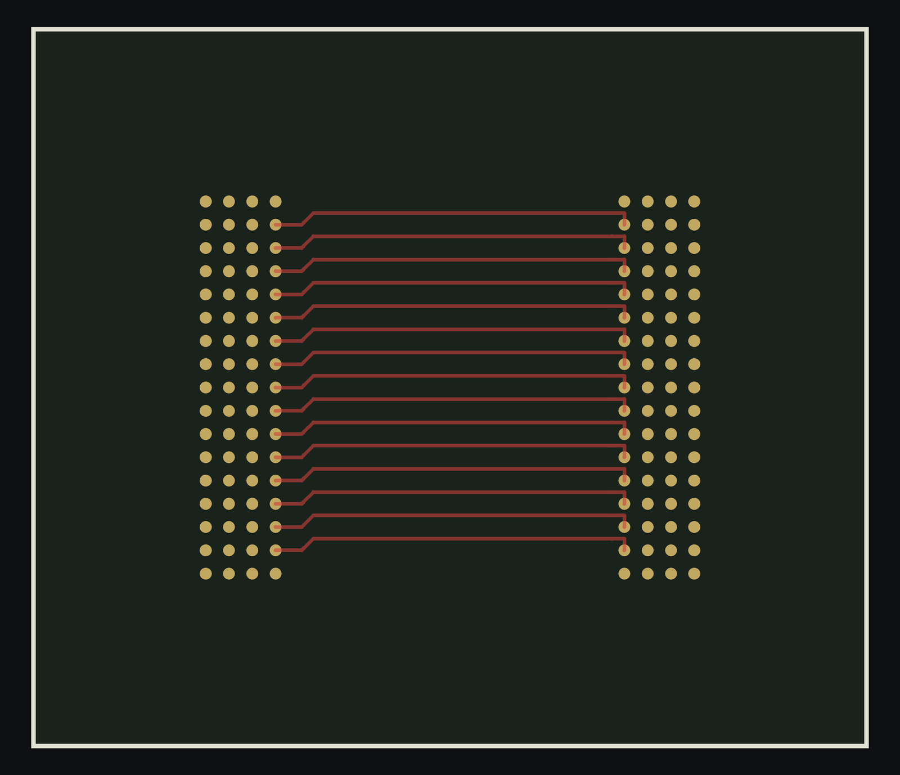
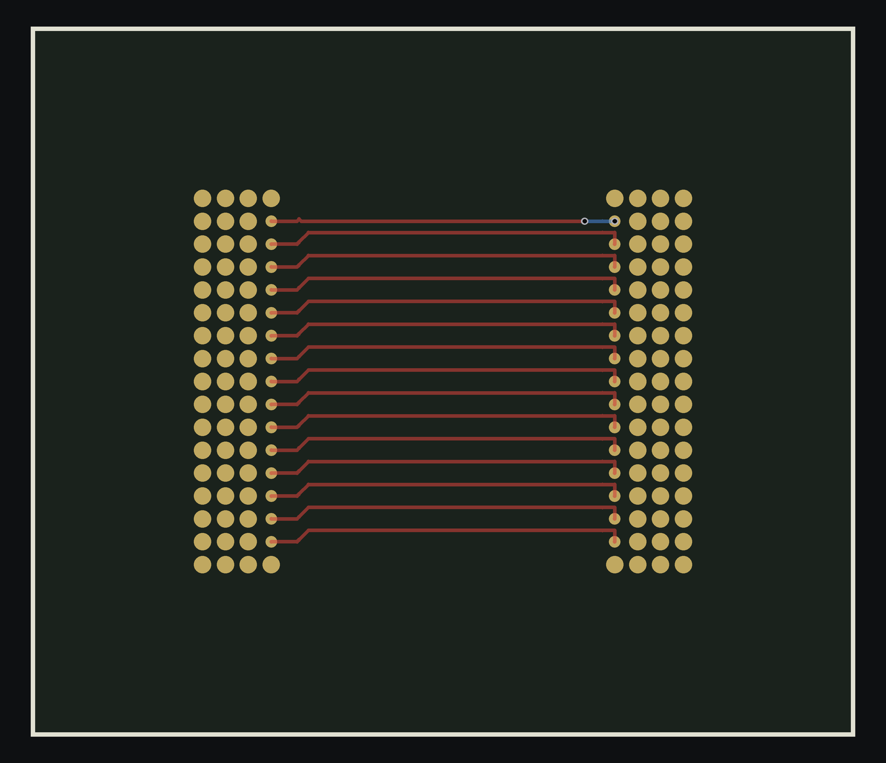
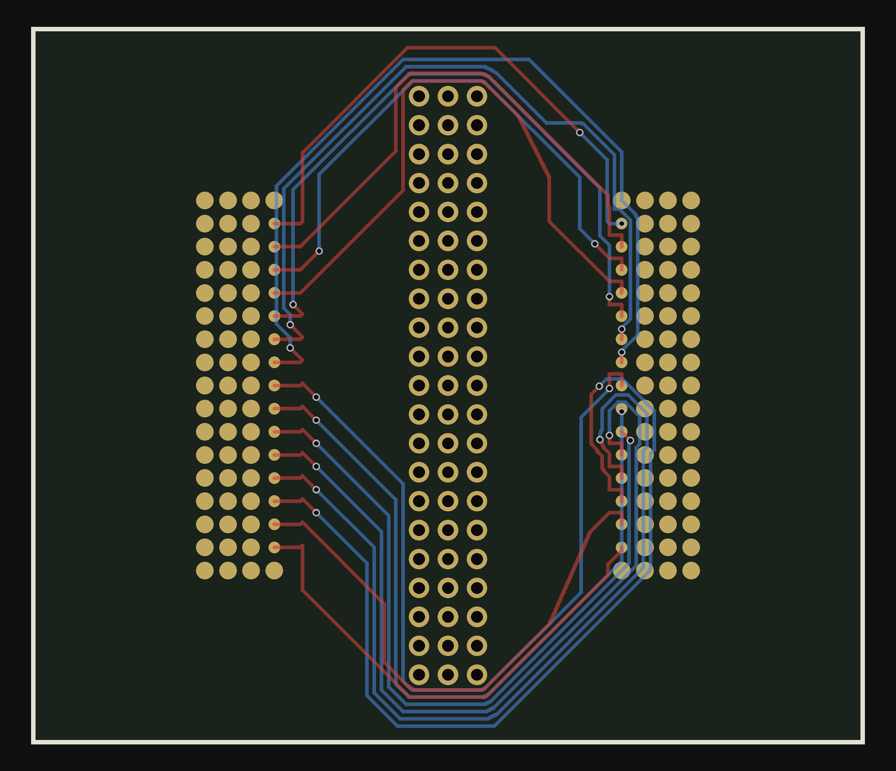
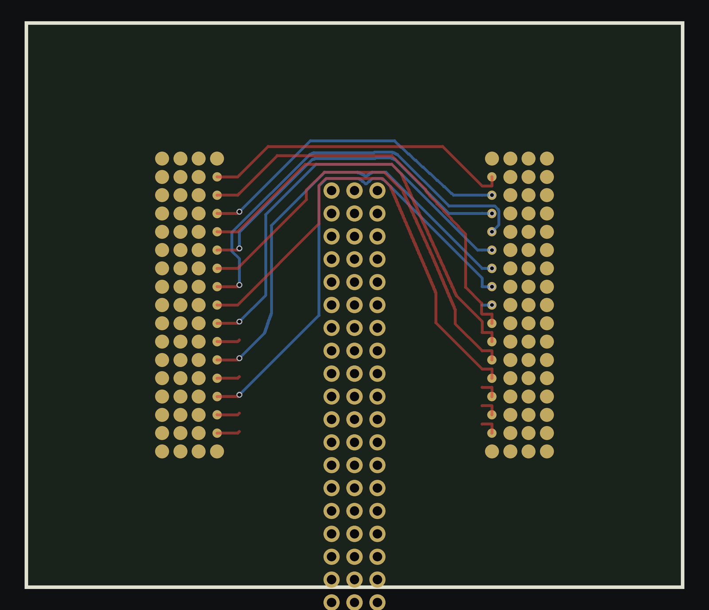

# awx -- the K-bus chain (#622)

Routing a fanned-out bus between two BGAs: one PLAN decides both ends of
every net, the FANOUT lays exactly the plan's moves and reports what it
could not, the BRAID routes the lanes in a corridor of two pages, and a
refused lane is negotiated rather than left open.

    bash chain_k.sh TAG 15 28 41            # -> tmp/TAG_k<K>.kicad_pcb, graded
    python3 make_bench.py BOARD SRC DST OUT # another array pair, from any board
    bash pose_gate.sh BOARD SRC DST 15 28   # the same pair in every pose
    modal run awx/modal_k.py --arms awx/arms.example.json   # a sweep, one container per arm

(We have no idea what `awx` stands for. The name predates every note
that mentions it.)

## Where it stands

The bench is `fb_t2q_fresh`: an H3 BGA `U1` to a DDR3 `DU1`, routed over
the coherent K-ladder. Byte-deterministic, 0 DRC at the routed 0.1 mm
floor, and identical under translation, turn-over and quarter rotation
(the pose gate).

Two arms are current, and **a number is meaningless without its arm**:

| | K15 | K28 | K35 | K41 | K51 |
|---|---|---|---|---|---|
| reference arm (one-pass plan) | 14 | 36 | 69 | 86 | -- |
| joint-solve arm | -- | -- | 58 | 80 | 137 |
| **BEST MEASURED** (`replan.py`, opt-in) | 14 | 36 | **46** | **76** | **107** |
| **human** | 22 | 46 | 58 | 70 | **81** (48 nets; 85 over 51) |

**The best row is the one to beat, and it is not the arm the chain runs by
default.** Every number in it is a real board in `awx/tmp/`, re-graded
2026-09-12 at 0 open / 0 DRC: `rw35e_rp_k35` **46**, `c3b_k41` **76**,
`rp6b_rp_k51` **107** (also `rw41e_rp_k41` 91, `rw35d_rp_k35_r1` 51).
**At K35 we BEAT the human by 12 vias.** The deficit is real at K41 (+6)
and K51 (+26), and it grows with congestion -- that is the shape of the
problem, not "we match at K35".

**2026-09-13, LOCAL, and the K51 line moved a long way -- but read the open
column.** `BRAID_LAY_ORDER=xing` then `replan.py`. **Its arm is NEITHER of
the two above**: it was `env SF_KEY_COST=1 BRAID_LAY_ORDER=xing bash
chain_k.sh xing51 51` -- the PLAIN defaults (8 source rounds, no exit guard,
no ONE_DIVE, no CP-SAT) plus the uncommitted `SF_KEY_COST`. Verified
2026-09-13 evening by re-braiding its fanout board: the plain env gives its
99 / SA1 copper-IDENTICAL in 119 s, and the joint arm's BRAID_* env over the
same fanout board gives 159 / 2 open. The fanout board and the braid env
must match; a braid-only re-run needs the env the fanout was planned under.

| board | vias | open | how |
|---|---|---|---|
| `rpW51_rp_k51` | **91** | **1 (SA1)** | `xing` 112->99, then `--worst=48 --probes=2 --rounds=6` |
| `rpX51_rp_k51` | 95 | 1 (SA1) | `xing`, then the default-width replan |
| `rpA41_rp_k41` | **82** | **0** | replan `--rounds=4` at the default width |
| `rpW41_rp_k41` | 83 | 0 | replan `--worst=41 --probes=2 --rounds=6` |

**K41 82 at 0 open is a real board and beats the cloud's 88**, though it is
still short of the recorded 76. **K51 91 is NOT a valid board** -- SA1 ships
open, and an open net UNDER-counts vias, so 91 is not comparable to the 107
until it closes. Closing SA1 is the single thing standing between this and a
new K51 record. Note the width did not decide either bench: K41 was BETTER at
the default width (82 vs 83), K51 better wide (91 vs 95).

These boards come from `replan.py` -- the route as the judge -- run wide
(`--worst=<the net count> --probes=2 --apply=strip`; `--worst` takes ONE
integer, so the `35..41` written here before was a range across K, not
syntax -- `int('35..41')` raises and no round runs). `--worst=N` re-plans
every REFUSED net plus the N most via-expensive ones, so N = the net count
puts the whole board in play against the default 3; `--probes=N` is how
many screened candidates per net AND end get a real router probe (5-20 s
each), so the recipe is ~25-30x the default's work per round. The K51 line was never run
at that width; it ran `--worst=6 --probes=1` and stopped at 107.

- **reference arm**: `SRC_ROUNDS=0 SEL_RETRY=6 EXACT_LANE=1
  DST_FACE_ASK=1 DST_WALK=3 SF_SWIM=30 BRAID_EXIT_GUARD=1
  BRAID_SWIM_HOLD=1`
- **joint-solve arm**: the above plus `SEL_XING=2 SF_EQUIV=2
  SF_JUDGE=braid BRAID_ONE_DIVE=5 DST_RESIDUE=3
  DST_RESIDUE_POOL=displaced DST_RESIDUE_CANDS=4
  BRAID_ALT_SOLVER=cpsat BRAID_CPSAT_DET=40`

The human's numbers come from `human_at_k.py`, scoped to the same
coherent net set the chain routes.


*K41: the corridor from `U1` (left) to `DU1` (right) -- front lanes red,
back lanes blue, every lane in its band, the far-face exits riding round
the destination's east face.*

### The gap is FLOOR, not realization, and crossings do not set it

`ledger_cal.py BOARD K` splits every net's vias into the **DP floor**
(the layer changes its real crossings force, everyone else fixed) and
its **slack** (realization waste). On K51:

| board | crossings | vias | DP floor | slack |
|---|---|---|---|---|
| baseline | 392 | 136 | 130 | 6 |
| pattern seed | 275 | 100 | 96 | 4 |
| pattern + seat repair | 360 | 104 | 98 | 6 |
| **human** | **338** | **80** | **74** | **6** |

1. **Slack is ~6 vias on every board measured, the human's included.**
   The router turns a plan into copper as tightly as the human does, so
   the whole deficit is the PLAN. It also caps every realization-side
   idea at about 6 vias -- `collapse_dives.py` saved 2 on the baseline
   (137 -> 135, 0 open 0 DRC) and found nothing on the pattern arm. Note
  it re-lays a ripped lane, so it must use the BRAID's track and
  clearance: laying at its own 0.1/0.1 put 30 segments of thinner copper
  into the board and reported a bigger saving than it had earned.
2. **Crossing COUNT does not set the floor.** The human has MORE
   crossings than our best plan (338 against 275) and a floor of 74
   against 96 -- 0.22 layer changes per crossing where we pay 0.35.
   What sets the floor is how the crossings are STRUCTURED: which
   partner is on which layer at each crossing, and what end layers a
   lane must hold. **The mechanism is open and is TODO 1.**

`cut_ledger.py` (the Maley cut-capacity check on a plan before any lane
is routed) says **every cut fits** -- capacity 84-100 lanes against a
load of 2-7 even in the escape fields. Space is not the constraint at
either end; order and structure are.

## The chain

1. **`coherent_nets.py K`** -- the first K routable nets of the coherent
   ladder (`k_ladder_coherent.txt`: whole rivers, tightest first; a
   prefix never splits a river).
2. **`fanout_from_plan.py OUT K --board=BASE`** -- one loop over the
   plan and both fanouts.
   - `plan_state` reads the board as it is: the legal escape menus at
     both ends (`escape_moves.py`), the launch points, each tooth's
     layer and vias, the taut-path buses.
   - The destination is chosen against those teeth (`select_moves.py`),
     the source refined against that destination
     (`plan_ends.refine_source`), and the refinement REALIZED by
     `source_realize.py` with the production engine, audited per
     dimension (face, gap along the face, layer, kind).
   - **Feedback**: a move the engine did not lay exactly leaves that
     net's menu (`banned`, keyed by `source_realize.move_sig`) and the
     round re-plans. The engine is the authority on what is possible.
   - The plan is judged by `plan_ends.judged_cost` -- the vias its own
     model implies plus the ride round both arrays at `VIA_MM` per via,
     inside the corridors the braid will actually form.
3. **`braid.py --board FO --dest DU1 --nets ... --out STEM`** --
   corridors from the geometry (`corridor.py`), a spine per corridor,
   launch and target orders from the lanes' offsets, the two-page
   schedule (`schedule.py`), and every lane routed by the real router
   inside its band (`connect.py`, `topo_strings.py`). Up to six attempts
   widen the launch pitch; the best is kept. A refused lane gets a wider
   last call, then a BLOCKER-DIRECTED RIP (the router's blocked frontier
   attributed to this run's lanes, a min-cut probe naming the cut set,
   victims re-laid or negotiated one level down). What is still refused
   is reported and left open.
4. **`grade_k.py BOARD NETS`** -- connectivity scoped to the run's nets,
   whole-board DRC at the routed floor, and the via census.

`chain_k.sh` runs a **flow frame** first (`flow_frame.py`): the pair is
turned by the quarter turn that points source-to-destination along +x,
every stage runs on that file, and the result is turned back -- so a
pair dropped at any of the four angles is the identical computation.

## The ingredients, in pictures


*K28: two pages. A front lane and a back lane cross for free; a page
lane keeps its layer through the schedule region and pays a via only
where its tooth or berth is on the other layer. The board shown is 38
vias for 28 nets; the reference arm is 36 today.*


*Far-face exits: a berth on the destination's far face is a side exit of
the main corridor whose leg lies beyond the array and whose jog runs
back along the stub's own line -- not a corridor of its own through the
ball field.*


*The blocker-directed rip: SBA2 (highlighted) was refused at the last
call, boxed by lanes routed before it. Its blocked frontier named the
lanes on it, the min-cut probe found the cheapest crossing set, SCKE1
was ripped, SBA2 routed, SCKE1 refused and negotiated in turn by
ripping SA8 -- every lane routed, K41 complete. This is the mechanism
that first completed K41 and K51.*


*K51: 48 routable nets, complete. The board shown is an early 141-via
one; the joint-solve arm is 137 and the best complete K51 measured is
107. The vias are the work.*


*The same 48 nets as the human routed them (`allwinner_h3_ddr3`, the
original board): 81 vias, most nets on ONE layer between their two
escape vias, the address rides nested round the destination, the data
lanes meandered to length. A benchmark to approach, not a pose to
match. `ledger_cal.py` says its realization slack is 6 vias -- the same
as ours -- so what this picture shows that ours does not is a better
PLAN, not tidier copper.*


*The zynq article (`make_bench.py --two-layer`): the corridor runs north
from the Zynq to the DDR3, berths on three faces. Complete at 55 vias,
but 17 of 28 in-band -- the gap a second board shows (TODO 8).*

 

 

*The pack (`pack_board.py`, 4 s, opt-in `BRAID_PACK=1`): 1574 -> 875
segments at K28, every lane, 0 open, 0 DRC, the vias exactly where they
were. Before, the bottom river is a fan of router staircases; after, it
is horizontal lanes with 45-degree jogs. K41 goes 2258 -> 1843. What the
segments BUY is still unmeasured (TODO 11). At K41 the far-face rides
round the top and east become grid legs and the source's wraps nested
chamfers; what stays off the grid is the 6-degree fan from the source's
south row and two coupled corners at the passives.*

 

*The spine. With a straight chord the frame runs through the header and
the lanes are squeezed under it one by one (24 vias, 899 segments). With
the relaxed medial spine -- the default -- the ribbon rounds the part in
45-degree legs, lanes a pitch apart through the bend (26 vias, 692
segments).*


*The mirror article: the fanned bench flipped through its plane -- every
part on the other face, every stub on the other layer, y mirrored,
self-verified. Every isometry grades as the control to the via and the
segment, which took the selector and the braid each running a pair in
the pair's own canonical frame.*


*A 30-degree rotation: complete, but 33 vias and 6 of 15 in-band. The
plan's faces are compass directions and the router's lattice is
octilinear, so a non-orthogonal pose is outside both models today
(TODO 9).*

## The tools

| | |
|---|---|
| `chain_k.sh` | the chain; `grade_k.py`, `via_census.py` grade it |
| `fanout_from_plan.py` | the planner and both fanouts |
| `braid.py` | the router: corridors, schedule, lanes, rip |
| `select_moves.py`, `escape_moves.py`, `plan_ends.py` | menus, greedy choice, plan cost |
| `source_realize.py` | realize a source plan with the production engine; `blockers_of` names what stands in a tooth's way |
| `schedule.py`, `corridor.py`, `sched_first.py` | pages, corridors, the schedule-first planner |
| `connect.py`, `topo_strings.py`, `taut_fast.py` | the real router and the taut relaxation |
| `replan.py` | the ROUTE as the judge; re-plans the ends the braid paid for |
| `pack.py`, `pack_board.py` | every lane a taut string against its neighbour |
| **`ledger_cal.py`** | **per net: DP floor vs slack. The instrument that says whether to work on the plan or the realization -- but its per-net floor is CIRCULAR (each net priced against the others AS LAID); read it beside `joint_floor.py`** |
| **`joint_floor.py`** | **the NON-circular floor: one MILP over the fixed paths that picks every path's layer at every crossing at once. Validated against the audit's independent parity+max-cut on three boards. `JOINT_FLOOR_NODES` bounds it -- no clock** |
| `room_probe.py` | **does a plan-time feature predict a swimmer's vias?** Takes FANOUT/ROUTED board pairs, rebuilds the crossing geometry the judge sees (`braid.plan_braid`) and correlates candidate features against the routed count. Every family tried is null (|r| <= 0.13 over 97 swimmers) -- run it before building any new per-lane cost term |
| `modal_k.py` | cloud arms. `return_board: true` returns the routed board, `return_files: [globs]` any tmp/ artifact (plan sidecar, raw logs, judge dumps) -- without these a cloud-only phenomenon cannot be diagnosed at all, and K44's regression is cloud-only |
| `human_at_k.py` | the human's vias for a coherent K set. **Mind the label**: `coherent_nets(51)` returns 48 nets, so "K51" is a 48-net problem -- the human is 81 over those 48 and 85 over the full 51. Both are right; ours route 48 |
| `census_vs_human.py` | per-net vias/copper/layers against the human, and where each via sits |
| `collapse_dives.py` | collapse short dives on a routed board (2 vias each) |
| `cut_ledger.py` | Maley cut capacity of a plan, before any lane is routed |
| `wall_probe.py`, `copper_same.py`, `cmp_copper.py` | track-level wall census, set-compare copper |
| `make_bench.py`, `rotate_board.py`, `mirror_board.py`, `bend_bench.py`, `channel_bench.py` | build an article from any board, and its poses |
| `pose_gate.sh` | the chain over FF / BF / FB / BB / R90 / R180 / R270 |
| `modal_k.py` | fan a sweep onto Modal, one container per (arm, K); `memory=(4096, 12288)` -- the request is the bill, the limit is the safety net |
| `arms.*.json` | the sweeps: `arms.judge.json` (the comparator: `SF_ESC_W`, `SF_ACCEPT_MARGIN`), `arms.prune.json` (`BRAID_L5_ALT_PRUNE` x cap), `arms.next.json` (everything else untested), `arms.solver.json` (the older matrix) |

## One source for every routing number

**Superseded in part 2026-09-15: every quantity below is now DEFINED in
one place, `awx/rules.py`, and installed into these names by each stage.
See "`rules.py` -- one place for the topo chain's design constants" at
the end of this file for the table and the formulas.**

Audited 2026-09-12, after a swimmer was found priced five different ways
and `collapse_dives` was found re-laying at the wrong track AND the wrong
via size. Every routing quantity now has exactly one home:

| quantity | the one source | value | who reads it |
|---|---|---|---|
| braid lane track | `topo_strings.TRACK` | 0.127 | braid (`= ts.TRACK`), pack, cut_ledger, collapse_dives, replan, fanout |
| braid hug clearance | `braid.CLEAR` | 0.105 | braid, pack, cut_ledger, collapse_dives |
| spec clearance | `topo_strings.SPEC_CLEAR` | 0.1 | topo_strings |
| via size / drill | `braid.VIA_SIZE` / `VIA_DRILL` | 0.25 / 0.15 | braid, cut_ledger, replan, fanout, collapse_dives |
| **swimmer price** | **`prices.SWIM`** | one number, five sites | plan_ends, braid x3, sched_first |
| `DIRS`, `LAYERS` | `escape_moves` | | fanout, source_realize, sched_first, replan |

**The board carries TWO track widths on purpose.** The fanout's stubs are
laid by the production engine at its own 0.1 / 0.1
(`source_realize.FAN_TRACK` / `FAN_CLEAR`) -- 23 segments on a K51 board
-- and the braid's lanes at 0.127 / 0.105 -- 2530. A tool that rips a
braid lane and re-lays it must use the BRAID's numbers; `collapse_dives`
used its own 0.1 / 0.1 and 0.45 / 0.25 and so put thinner copper and
oversized vias into the board, which also inflated its reported saving
(137 -> 133 claimed, 137 -> 135 real).

**`braid.CLEAR` (0.105) and `topo_strings.SPEC_CLEAR` (0.1) are different
quantities** -- the spec, and the spec plus 5 um so a hug does not sit
exactly on it. They were both called `CLEAR` until this audit. Do not
import one where the other is meant.

Names that LOOK shared and are not: `TOL`, `STEP`, `MARGIN`, `CAP`,
`PROX_TRACK`, `HW_COL` -- different local quantities that happen to
share a generic name or a number. Leave them alone.

## Measuring honestly

Every one of these cost a session to learn.

- **A board with open nets has artificially LOW vias.** An unrouted net
  lays no copper. Only 0-open boards compare. (`fa` K41 once read 67
  vias -- better than the human -- with 3 nets open.)
- **A single K is not a result.** Run-to-run spread on one board is
  +-2..3 vias. Judge on K28 AND K35 AND K41 together, and include K51
  before claiming "worse on none".
- **K15 and K28 first.** Higher K only once those are great. Nearly
  every richer planner wins at one K and loses at another.
- **Quote the arm with the number**, or it cannot be compared.
- **`BRAID_CPSAT_DET` is not optional.** Without it CP-SAT stops on wall
  clock across 4 workers and the same input gives 80 / 82 / 85 / 80.
- **Verify every new flag byte-identical with the flag OFF** before
  reading anything off it.
- **The probe must use the chain's own env and board.** `DST_WALK` and
  `DST_FACE_ASK` change the MENU; a probe run without them measures a
  different problem (measured: 45 berths seated vs the chain's 34).
- **THERE ARE NO CLOCKS. Every budget is in WORK, and that is a rule,
  not a preference.** A clock budget does not make a slow machine answer
  later, it makes it answer DIFFERENTLY. Measured: two identical cloud
  runs of the K35 baseline -- same image, same env -- came back **72
  vias / 1436 segs and 58 / 1840**, because a container is ~2x slower
  than the laptop (K51 1330-1574 s against 600-900) and five wall-clock
  budgets that never bind locally bound there. That was also the likely
  source of the "knife edge" +-2..3 via spread under load.
  So: every search loop is capped in **judge calls**
  (`fanout_from_plan.PLAN_CALLS`; `DST_RESIDUE_CALLS`,
  `DST_SEARCH_CALLS`, `SRC_REPLAN_CALLS`, `SF_REPAIR_CALLS`), HiGHS is
  capped in **nodes** (`BRAID_MILP_NODES`, or a stage's own `nodes`) and
  CP-SAT in **deterministic time** (`interleave_search` +
  `max_deterministic_time`, always on -- `_milp_solve`'s `time_limit`
  parameter is accepted and IGNORED). `py_router` was already clean.
  **Do not add a `time_limit`, a `max_time_in_seconds` or a
  `time.time()` guard that decides an output.**
- **Modal is a different numeric era.** The cloud image pins numpy,
  scipy, ortools, shapely and grid_router to the local versions but runs
  python 3.13 against the local 3.14, and the baseline ladder comes back
  72 / 76+1open / 118+2open against the local 58 / 80 / 137. Cloud
  numbers compare ONLY to cloud numbers.
- **Look at the renders.** `../py_router/route_render.py`; the copper is
  the plan.

## What the human does

Two vias per net, at the ENDS, on a constant layer -- `census_vs_human.py`
shows it as `DS` or `DD` on nearly every net. Our excess is at the ends
too, but piled: at K51, SBA1 `DDDDDDSS` (+6), SA1 `DSSSSS` (+4), SCS1
`DDDDDS` (+4) carry 14 of the 23-via deficit between them, with near
double path length (SA1 61.4 mm against 30.9). Five nets beat the human
by crossing the field on F with zero vias.

The human's berth order gives 68 crossings at K41 against our 250, and a
longest crossing-free chain of 29 against our 21 -- but see the floor
finding above before treating crossings as the objective.

## What the 2026-09-12 audit changed

Ten parallel audits over everything this branch adds. The defects are
fixed and in the log; what matters here is which RECORDED CONCLUSIONS
they invalidate, because those are the ones that would otherwise be
believed forever:

- **"The berth chooser accepts nothing" was never a null result.**
  `_alts5` stage A pinned a moving net's as-laid lane vias into the
  objective, so every candidate was charged the vias it would stop
  paying as well as its own. Only a move flipping a swimmer could win.
  Every source and berth arm judged through it was measured under a
  systematic bias.
- **`SPLIT_BLOCKS` was never measured.** `NEST_IN`, `NEST_STEP` and
  `BAND_LPITCH` were used and defined nowhere in any commit, so the band
  path raised NameError on the first band exit. Its recorded verdict
  ("complete, general, lost") is void -- it is a crash.
- **`SEL_XLAYER`'s verdict is void too**: that arm ran through a
  `zip(placed_nets, placed_legs)` desync pairing a trial leg with a
  stale net.
- **The joint solve had no compatibility constraints at all.**
  `plan['alt_excl']` was nested under `if xing:`, and `DST_XING` is 0 by
  default -- so every recorded `DST_RESIDUE=3` result was produced by a
  solve free to pick two berths that cannot both be laid.
- **The DRC feedback could not see a pad short**, so a pass could print
  "every berth laid as planned" on a shorted board.
- **"The human's vias are at the ENDS" could not be falsified**: the
  census's MID class did not exist (it was nearest-of-two). With it
  implemented, several of the human's vias are mid-field.
- **`grade_k` graded a crashed checker as clean**, and missed a net with
  no copper at all -- an arm that DROPPED a net scored as a via win.
  Re-graded every headline board with the strict tool: all unchanged, so
  no recorded number was actually wrong.
- **The judge's answer depended on the machine's core count** -- pool
  workers inherited each other's level-5 seeds, and at a 30-node budget
  the seed is the answer. Same class as the clock rule, different hat.

Two lessons worth keeping: an instrument that cannot measure must FAIL,
never report clean; and a knob measured negative through a broken path
has not been measured.

## What the 2026-09-13 session established

**Read this before running anything.** It invalidates a comparison this
campaign made routinely, and it closes off a whole class of work.

> **THIRTEEN KNOBS NAMED IN THIS FILE ARE NOT COMMITTED** -- they live only
> in the working tree, so a fresh checkout CANNOT reproduce the measurements
> that name them. They are instruments and records of NEGATIVE results, not
> improvements, which is why they were held back:
>
> | knob | why it is not committed |
> |---|---|
> | `SF_KEY_COST` | confirmed K44 regression, 98 -> 112, spread 0 over three containers |
> | `SF_SWIM_MODEL` | harmful on the cloud: K51 105 -> 131, K44 only 106 against a 98 baseline |
> | `BRAID_KEEP_SCHED_PAGES` | costs 12-16 vias on EVERY bench (K35 62->74, K41 88->104, K51 105->117) |
> | `BRAID_CPSAT_CONFLICTS`, `BRAID_CPSAT_CONVERGE` | unusable: a 40 s solve had not finished in 31 MINUTES |
> | `BRAID_ALT_TWOSTAGE`, `BRAID_L5_W_PER_LANE`, `BRAID_CPSAT_ENF`, `BRAID_W_PER_NET` | built for the two-stage/CP-SAT study; never shown to beat the baseline |
> | `DST_RIDE_W` | rejected -- K51 regression |
> | `SF_LDS_W` | inert (wired and verified live; it just decides nothing) |
> | `SF_RIDE_W` | correct and default-inert, but NEVER exercised through a chain |
> | `SF_REPAIR_CALLS` | a counter from the CP-SAT repair probe |
> | `BRAID_RIP_ONBOARD` | the phantom-victim fix (2026-09-13 evening): closes K51 SA1 at 3 vias and opens SA11+SDQ11 -- moves the refusal, 97/2 against 99/1; inert at K41 |
> | `BRAID_RIP_SOFT` | rip trials with the victims' old copper PRICED: K51 116/2 against 99/1 -- harmful |
> | `BRAID_RESCUES` | the per-attempt failed-rescue cap (was a hard-coded 3): lifting it is K41 91->100, K51 99/1 -> 104/**5** -- the cap is a load-bearing regulariser |
>
> The FINDINGS they produced are real and are recorded here. Everything else
> this file names is committed. **This list is auditable** -- every
> backticked `*_KNOB` in this file was checked against the committed
> sources; re-run that check when adding one.


**The short version, in the order it matters:**
1. **The plan-side swimmer price is CLOSED, and the per-lane model is
   HARMFUL, not merely inert.** A swimmer's via cost is not predictable at
   plan time (four feature families, |r| <= 0.13 over 97-98 swimmers on 5
   boards), so no cost term built on the plan can rank it -- and the cloud
   arms confirm it end to end: `SF_SWIM_MODEL`+`SWIM_CHANGES` costs **K51
   105 -> 131** and reaches only 106 at K44 against a 98 baseline. Do not
   add another without clearing the |r| > 0.2 bar (`room_probe.py`).
2. **The judge has no resolution on vias** -- it gave the SAME 73.0 predicted
   vias to a 98-via and a 112-via board, so the choice fell through to
   corridor length: 5.3 mm, costing 14 vias.
3. **`replan.py` (the route as the judge) is the only lever that moved a
   bench**: K41 91->82 at 0 open, K51 112->99->91 (SA1 still open).
4. **`BRAID_LAY_ORDER=xing` is the largest single-knob win** (K51 -13) and
   is slack-dependent (K41 +6). An arm, never a default.
5. **K51 COMPLETION, not the via count, is the open problem.** The 91-via
   board is invalid for ONE net (SA1) and it is fully diagnosed: the lane
   was never laid, walled at both ends, ends on opposite layers, tail
   exhausted. Search budget and via room are both measured INERT on it.
6. **Never compare local to cloud** (below) -- and note a verdict in the
   settled table belongs to the BOARD it was measured on:
   `BRAID_VIA_ROOM_REFUSED=2` "breaks K51" on the old 137-via baseline and
   is bit-identical on the 99-via one.

### Never compare a LOCAL result to a CLOUD one

They are not the same experiment, for two separate reasons, and the gap is
large: K35 local 76 vs cloud 60; K41 local 107 vs cloud 88.

1. **`max_deterministic_time` is not portable across architectures.** On a
   byte-identical instance (md5 verified both sides), `BRAID_CPSAT_DET=40`
   gives arm64 **1685 conflicts / obj 41.845872** and x86_64 **1970 / obj
   40.845888** (Intel and AMD agree exactly with each other). x86_64 gets
   1.17x the search per deterministic unit. ortools never claimed otherwise
   -- `sat_parameters.proto` documents it only as "correlated with the real
   time used by the solver". It buys immunity to machine LOAD, which is what
   this chain needed, and nothing about different CPUs.
   `BRAID_CPSAT_CONFLICTS` (new, default 0 = unchanged) bounds the solve by
   `max_number_of_conflicts` instead -- an integer count of discrete search
   events, identical on any CPU. **2000** matches today's x86_64 depth.
   CAVEAT: a conflict count bounds SEARCH, not TIME. It does not bound
   presolve at all, and the conflict rate is instance-specific (~42/s on the
   K35 alt instance, unmeasured elsewhere). Ship it with a generous
   deterministic-time backstop AND record which of the two fired -- a
   backstop nobody checks is how this class of bug returns.
2. **The second divergence is SOLVED, and it runs through the CP-SAT
   solution VECTOR rather than its budget.** Equalising the budget leaves
   the routed board byte-identical (arm64 DET=40 and DET=80 both give K35
   76v/1376s), which is what made the solver look innocent -- but CP-SAT
   returns a DIFFERENT SOLUTION VECTOR per architecture at the same
   objective, and `braid._profiles5` rewrites `sched.page[nm]` from that
   vector. One net's page flips, the residue goes 14 vs 13, `f` differs by
   exactly 1.0000 (the fraction bit-identical), a different berth is
   accepted, and 10 of 35 berths end up different. Freezing the rewrite
   (`BRAID_KEEP_SCHED_PAGES`) does remove the channel and costs 12-16 vias
   on every bench, so the rewrite is load-bearing: see the settled table.

### The local-vs-cloud bisect, as far as it went

Everything upstream of `residue_choice` is bit-identical across arm64 and
x86_64 -- net set, escape MENUS 35/35, cost vectors 0 of 35, ranking order,
and the `lane_free`/`_conflict`/`band_room` accept decisions 140/140. The
divergence enters ONLY at `residue_choice`, the stage that judges berths by
running the braid, and then 10 of 35 berths differ. ELIMINATED by direct
test: `grid_router` (identical copper on a byte-identical board, sha
`fd04a350d0ad` on arm64 and two x86_64 containers), the CP-SAT budget,
`BRAID_L5_SEED` (0 and 1 give the same local board), and the 449 MB on-disk
taut memo (cold gives the identical board -- it IS a pure cache).
LOCALISED TO: `plan_braid`'s PAGE ASSIGNMENT. The same plan is judged
residue 14 locally and 13 in a container, `f` differing by exactly 1.0000 --
one swimmer -- with every net's launch_idx, target_idx and corridor
IDENTICAL. Five nets differ only in their page (SA15, SBA1, SODT0 gain one
in the cloud; SDQ0, SDQ15 lose one). The page branch in `schedule.py` is
integer-only -- `lis_keep_weighted`'s weights are {0.5, 1.0, 1.5}, exact
dyadic; `inverted` compares indices; the fill sorts on a count -- so it
cannot diverge on identical inputs. **ANSWERED: the input that diverges is
the CP-SAT solution vector, via `_profiles5`'s page rewrite** (see item 2
above).

### Every parameter response is JAGGED -- single arms are not evidence

Five independent sweeps in one session, all non-monotone:

    DST_RIDE_W      K41  0.25->107  0.5->92  1.0->88  **1.5->124**  2.0->84  3.0->82*  4.0->82*
    DST_RIDE_W      K35  62  62  60  **62**  59  **83**  68
    DST_RESIDUE_CANDS K41 joint 4->107 8->94 16->106 ; two-stage 4->94 8->82* 16->118
    BRAID_RESIDUE_W K41  6->84  10->89  14->114
    BRAID_L5_SEED   K28  net-set 34 / none 36 / plan 40          (* = ships open nets)

**K35 is BISTABLE** -- three identical cloud containers gave [60, 70, 70],
mode 70 -- so quoting 60 as "the baseline" understates every K35 comparison.
**K41 and K51 baselines reproduce EXACTLY** (K41 88v/2545s over three
independent arms; K51 129v/1open twice). Grade there, never on K35 alone.
The `nodes` column of `BRAID_SOLVE_DUMP` was None for every CP-SAT solve
ever recorded; it now carries NumConflicts, the one portable unit.

### The excess is a TAIL, and the machinery that closes it is via-blind

First-pass scheduled lanes are at per-lane parity with the human (abp K41
1.73 vias/lane vs 1.71). The gap sits in lanes REFUSED on the first pass and
then closed by the x4 budget, the last call, or a blocker rip, at 5-8 vias
where a first-pass lane costs 2. On the best K41 board (76) the whole +6 over
the human is four rescued lanes; at 2 each that board is 66. Every step of
that chain accepts the FIRST completion without pricing vias: the x4 rescue
takes whatever the wider search returns (`braid.py:6960`), `connect_ladder`
returns the first rung that succeeds (`:7308`), and `rip_for` runs only when
the route outright fails and keeps the first complete trial (`:7337`) -- the
K51 log shows it accepting a victim at 2 -> 4 vias. That is why every
PRICE term measured inert: they price the plan, and the excess is set
downstream by acceptance rules no price term can see.
`modal_k.py`'s `KEEP` filter dropped exactly those attribution lines, so a
cloud via count could be read and never explained; it now carries them
(`lanes: N/K`, `rescued at x4`, `last call`, `rip [`, `econ re-lay`,
`unplaced`, `NOT escaped`).

### Measured this session, and NOT committable

| arm | verdict |
|---|---|
| `BRAID_ALT_TWOSTAGE=1` (choose, then schedule) | every solve PROVED optimal (14/14, zero gap) vs the joint model's 2 of 4 with gaps to 28.77 -- and the board does not improve: K35 identical, K41 -8 fair vias but +1 open. **Convergence is not what costs vias.** |
| Dantzig-Wolfe | refuted before building: only **15%** of the choice MILP's rows are lane-local, 84% are 2-lane coupling, so the master would carry the model |
| CP-SAT enforcement literals (`BRAID_CPSAT_ENF`) | gap 32.49 -> 32.10. CP-SAT's presolve already does it -- its bound is 9.36 where the LP is -19.61 |
| `BRAID_L5_W_PER_LANE=1` | gap -> 31.08, identical board. The "swimmers 24.45" slack was LP-relaxation slack, which CP-SAT does not use |
| `DST_RIDE_W=2.0` | K41 88->84 (-18% copper), K35 59, K15/K28 byte-identical -- but **K51 129v/1open -> 118v/3open**, a completion regression, and its neighbours 1.5 and 3.0 are much worse on both benches. A lucky point, not a corrected rate |
| `DST_XING` / `DST_CONTEND` / `DST_SWIM` | all three built-but-zero terms are **correctly zero**. At K41 vs base 88: XING 93/100/110/119, CONTEND 90, SWIM 98 |
| `replan.py --apply=strip` | its branch is gated off by **"a SOURCE move stands"** and never executed in any arm; the whole A/B compared two identical code paths |
| `BRAID_RESIDUE_W=10` | **the one live lead.** K28 38->36, K44 98->94, K47 120v/4open->108v/3open, K51 **129v/1open -> 117v/0open** (first complete K51), K41 +1, K35 60->78. Pays where the two-page capacity binds; wants to be a RULE scaled by the plan's own residue fraction, not a constant |

`replan.py` had been crashing on every round since its first commit (`:+d`
on a float residual); fixed, and its first working run took cloud K35
60 -> **56**, matching the best K35 on record and beating the human's 58.

## The judge has NO RESOLUTION on vias (2026-09-13, K44 cloud dumps)

The clearest measurement of the planning metric yet, from the two K44 arms
that differ ONLY in the judge's sort key (`d44base` 98 vias, `d44key` 112):

| arm | model's predicted vias | judged `f` | => ride | ROUTED |
|---|---|---|---|---|
| `d44base` | **73.0** | 167.25 | 94.25 | **98** |
| `d44key`  | **73.0** | 167.96 | 94.96 | **112** |

1. **Both plans predict the SAME 73.0 vias.** The model cannot tell a 98-via
   board from a 112-via one. It has zero resolution on the quantity being
   optimised.
2. **So the decision was made on `ride` alone** -- corridor length, 56% of
   `f` (94 of 167). `VIA_MM = 7.5`, so the 0.71 gap in `f` is **5.3 mm**.
   The judge took a plan 5.3 mm shorter and 14 vias worse.
3. **The error is DIFFERENTIAL, not a bias**: 73 vs 98 is -25, 73 vs 112 is
   -39. This is why NO constant reprice can fix it -- a per-swimmer delta
   adds 21*d to one plan and 22*d to the other, moving the gap by 1*d, so
   closing 14 vias needs d = 14 vias PER SWIMMER. Measured exactly as
   predicted: `SWIM_PRICE` 3 and 3.5 both returned 112, and
   `SF_SWIM_MODEL`+`SWIM_CHANGES` is bit-identical at K41 and K51.
4. Where the 14 lives: swimmers 70 -> 78 (+8, mean 3.33 -> 3.55) and PAGE
   LANES 28 -> 34 (+6, mean 1.22 -> 1.55). Not a swimmer-only defect.

**The model prices by CLASS (swimmer = flat 2.0, page lane = its changes),
never by the CONGESTION the lane will actually meet.** Two plans with the
same class histogram are indistinguishable to it however differently they
route.

**Note the arithmetic above retires the CONSTANT only.** A per-swimmer delta
moves a 21-vs-22-swimmer gap by 1*delta; a PER-LANE model is free to move the
two plans by different amounts, so it is not refuted by that argument.
It is refuted by a different measurement -- see below.

### A swimmer's via cost is NOT PREDICTABLE from the plan (98 swimmers, 5 boards)

Actual swimmer vias: mean **3.19**, sd **1.77**, range 0-10. Against every
plan-time feature:

| predictor | corr with actual vias |
|---|---|
| page crossings | +0.016 |
| changes (what `SF_SWIM_MODEL` prices) | **-0.032** |
| diamonds reserved | +0.074 |
| airline length | +0.056 |
| copper length | +0.168 |
| detour ratio copper/airline | +0.268 (and POST-route) |

Per board the crossing correlation is not merely weak but SIGN-UNSTABLE:
-0.380 (d44base), +0.121 (d44key), +0.181 (K51 local). And a learned per-net
prior is not available either -- over 23 nets that swam on >=3 boards the
**WITHIN-net sd is 1.34 against a BETWEEN-net sd of 1.01**, so the same net
varies more across boards than nets differ from each other (SA8:
[2,10,6,3,2,6,2]).

**The cost is a property of the REALIZED board, not of the net or the plan** --
the braid absorbs most predicted crossings without a via (a 13-change swimmer
came out at 2), and whether it can is local ROOM, which has not happened yet
when the judge runs. Consequences:
- a better CONSTANT (3.19, not 2.0) fixes the level and adds no ranking power;
- the swimmer COUNT is a rational REGULARISER, not an accident: refusing to
  trade a structural property for a sub-2-via gain in an unpredictable
  quantity is correct, which is the argument against shipping `SF_KEY_COST`
  alone;
- **ROOM WAS TRIED AND IS ALSO NULL** (`room_probe.py`, 97 swimmers over 5
  boards). Longitudinal room between a change's two crossings, lateral
  crowding in the window a change needs, and a room-WEIGHTED change count
  all fail: best |r| = 0.125 (`loose0.1`), `crowd` -0.003..-0.026, and the
  room-weighted count -- the actual candidate term -- is **-0.001**. At
  n=97 significance needs |r| > ~0.20, so none of these is distinguishable
  from zero. CAVEAT: this room is measured in the crossing-ORDER coordinate
  (position 0-1 along the lane), which is topological; PHYSICAL room (mm of
  channel against via diameter, the radial via-room result) is not tested
  by it -- but is not available where the judge runs either;
- the only accurate estimator is the braid itself (`replan.py`), which is where
  every best board comes from.

## The replan, verified end to end (2026-09-13)

`replan.py` is the only estimator of a lane's cost that is ACCURATE, because
it is the braid itself -- and after today it is also the only lever that has
moved a bench this session. Verified on a real K51 run, not inferred:

```
round 1: apply path = DERIVED (strip)
round 1: KEPT derived -- open ['SBA2'], drc 0, vias 110 (round start ['SBA2']/112)
```

- **The faithful apply path fires.** `--apply=strip` derives the round's
  fanout board from the probes' own routed board, so the ends agree BY
  CONSTRUCTION. Confirmed by artifact as well as by the log: the strip branch
  writes `_r<N>.census.json` and no `_r<N>_fo.log`; refan writes the log.
- **Source moves are really probed** (`ends_try = ['dst','src']` by default,
  plus `both` pairs) and really stand.
- **It improves boards**: K51 112->110 at the default width, K41 91->82.

**THE GATE TO KNOW ABOUT.** The strip path needs four conditions and one of
them is `'a SOURCE move stands'` being FALSE (`replan.py:1447`). So when the
source arm succeeds, strip is silently disabled and the apply falls back to
`refan`. Observed firing 2026-09-13 at the wide width:

```
round 1: apply path = incremental/refan -- blocked by a SOURCE move stands
```

Two things temper it, and both were measured rather than assumed:
- **refan is AUDITED and was FAITHFUL there** -- "every move laid in its
  class", "39/39 unmoved teeth unchanged", "ends of 4 changed net(s) agree on
  both boards", and the round was KEPT (91->83). When the audit fails the
  round is REJECTED and the moves banned, so the current behaviour is SAFE,
  not broken. What the gate costs is WORK (a full re-fan, 466 s that round)
  and the rounds the audit throws away.
- **the gate looks unnecessary**: `fan_src[nm]` points at the probe's
  `_dst.kicad_pcb`, which is copied from `cur` AFTER `sr.realize` lays the
  new tooth -- verified on three probes (SA11, SA12, SA14): the source
  copper changes and `_dst` carries it through identically. `git log -S "a
  SOURCE move stands"` finds no commit and no measurement behind it; it
  traces to the strip commit's stated scope, "Destination moves only."

**Width did not decide either bench** (K41 better at the default width, 82 vs
83; K51 better wide, 91 vs 95), so `--worst`/`--probes` is not a free win --
it is ~25-30x the work per round for a board that may be worse.
**`--mode=rebraid` is INERT at both K41 and K51.**

## SA1: why K51's last net is open, and what does NOT close it (2026-09-13)

K51's best board (`xing` + replan, 91 vias) is INVALID for one net. The
refusal record (`<board>_refusals.json`) and the braid log name it exactly:

```
SA1  tooth (127.027, 67.829) B.Cu   berth (146.354, 63.361) F.Cu
     page null (a SWIMMER), stage last_call,
     failed_rescues 3, margins [2.0, 4.0, 6.0], rip_assist true
```
```
forward  cell ... layer=1: ok, 6/8 neighbors blocked
    Blocking obstacles: /DDR3 16x1/SA1(3 track)      <- its OWN stub
backward cell ... layer=0: ok, 6/8 neighbors blocked
    Blocking obstacles: /DDR3 16x1/SA4(9 track)
```

**The lane was never laid at all.** On the shipped board SA1 has ONE B.Cu
segment at the tooth and nine F.Cu segments at the berth -- the whole 17 mm
corridor run between x=127.03 and x=144.33 is missing. The A* is walled at
BOTH ends (6 of 8 neighbours blocked): its own stub at the tooth, and SA4 --
47 segments sprawling x 126.7-144.3, y 60.7-70.3 -- across the berth
approach. Its ends are on OPPOSITE layers, so it must change layer somewhere
in a corridor that has no room for the dive.

**The tail is EXHAUSTED, not unused.** Three rescues at 2/4/6 mm, the
blocker-directed rip (`rip_for`) taking out SBA1 and then SCKE1, and
`last_call` -- all ran, all refused. Note `failed_rescues < 3` and
`margins=[2.0, 4.0, 6.0]` are HARDCODED in `braid.py` with no env knob;
only `BRAID_ATTEMPTS` (6) and `BRAID_BUDGET_X` (4) are tunable.

**What does NOT close it** (all on the 99-via `xing` board):

| arm | result |
|---|---|
| `BRAID_VIA_ROOM_REFUSED=2` | **bit-identical** to the base. The settled table's "breaks K51 (3 open / 30 DRC)" was measured on the OLD 137-via baseline and does not reproduce here -- it is simply INERT in this regime |
| `BRAID_ATTEMPTS=10` | **bit-identical** to the base |
| `BRAID_BUDGET_X=8` | 97 vias but **2 open** (SA11, SDQ11) -- a deeper budget moved the refusal, it did not remove it |
| `replan.py --worst=48 --probes=2 --rounds=6` | 99->91 vias, SA1 STILL open, though the wide replan puts every refused net first in its queue by construction |

**So the block is not search budget and not via room -- it is that the
corridor has no room for this lane's dive at all.** The next thing to try is
the thing none of these touch: change what SA1 is ASKED for (its berth face
or its tooth layer, so the ends stop disagreeing), or move SA4, which is the
net actually in the way. `blockers_of` names the movable-vs-pinned split.

## SA1 corrected: the loss is the VICTIM RE-LAY, and the tail is a capacity wall (2026-09-13 evening)

The section above says the corridor "has no room for this lane's dive at
all". **Its own transcript says otherwise.** In the xing braid's last call:

```
rip for SA1: min-cut probe 3 via(s) crosses ['SBA1', 'SDQ4', 'SA12']
rip ['SBA1']: SA1 still refused
rip ['SBA1', 'SDQ4']: SA1 routed (3 via(s)) but SBA1 lost -- put back
rip ['SBA1', 'SDQ4', 'SA12']: SA1 routed (9 via(s)) but SBA1 lost -- put back
```

SA1 routes at 3 vias the moment SBA1 and SDQ4 are lifted. What fails is
SBA1's RE-LAY, and its nested negotiation was reading a phantom:

```
rip for SBA1: min-cut probe 3 via(s) crosses ['SDQ4', 'SA15', 'SDQ1', 'SDQ13', 'SDQ0', 'SDQM1']
rip ['SDQ4']: SBA1 still refused
rip ['SDQ4', 'SA15']: SBA1 still refused
rip ['SDQ4', 'SA15', 'SDQ1']: SBA1 routed (1 via(s)) but SDQ4 lost -- put back
```

SDQ4 was ALREADY lifted for SA1 -- its copper was off the board -- but
`rip_for` builds its candidates from `out_segs`, which still named it, so
the nested probe priced it as a soft obstacle, the cut set led with it, one
of three victim slots went on a no-op rip, and SDQ4 was re-laid INSIDE
SBA1's negotiation (before SBA1's own victims were back) at depth 0, where
it was lost. **`BRAID_RIP_ONBOARD=1`** (NOT COMMITTED) requires a nested
rip's candidates to have copper on the board. With it SBA1's cut leads
with SDQ1, one rip re-lays SBA1 at 1 via, and the trial closes:
`rip ['SBA1', 'SDQ4']: SA1 routed (3 via(s)); re-laid SBA1 1 -> 1, SDQ4 0 -> 2`.

**And then SA11 and SDQ11 are open.** Every arm on the tail, all braid-only
re-runs of the `xing51` fanout board under its own (plain + xing) env, all
flag-off parity verified copper-identical, all inert at K41 (bs41 base 91/0,
whose four rip trials never lose a victim), times under 2-3 concurrent runs:

| arm | vias | open | s |
|---|---|---|---|
| base | 99 | 1 (SA1) | 119 |
| `BRAID_RIP_DEPTH=2` | 142 | 2 (SA11; **SDQ9 SILENT** -- 6 via-less layer changes, not in the refused list) | 259 |
| `BRAID_RIP_ONBOARD=1` | 97 | 2 (SA11, SDQ11) | 121 |
| `BRAID_RIP_ONBOARD=1 BRAID_RIP_DEPTH=2` | **141** | **0** -- the first COMPLETE board on this line | 173 |
| `BRAID_RIP_SOFT=5` (victims' old copper priced in the trial route, with or without ONBOARD) | 116 | 2 (SDQ11, SDQ15) | 105 |
| `BRAID_RESCUES=99` (the per-attempt failed-rescue cap lifted) | 104 | **5** | 150 |
| `BRAID_BUDGET_X=8` (earlier today) | 97 | 2 (SA11, SDQ11) | |

Read together: **the region SA1 / SA11 / SDQ11 / SBA1 / SDQ4 is over
capacity in this PLAN.** Every fix to the tail's mechanics closes SA1 and
evicts a neighbour -- the same two neighbours as the deeper search budget --
and the only arm that completes negotiates so deeply that it pays 42 vias
for it. The failed trials in every arm have one shape, `X routed (N vias)
but Y lost -- put back`: the refused lane, given its victims' room for
nothing, sprawls through all of it, and a victim has nowhere to go. Pricing
that room (`RIP_SOFT`) makes the refused lane detour instead (SA1 at 7 vias,
SA8 re-laid 1 -> 6), which is worse. So the tail cannot be tuned into a
complete cheap board here; the PLAN must move a berth, which is the
replan's job -- and at the DEFAULT width the replan does not do it either:

| replan (`--rounds=4`, default `--worst=3 --probes=1`, `BRAID_RIP_ONBOARD=1` in its braids) | result |
|---|---|
| from the `ONBOARD` board (97 / SA11+SDQ11) | round 1 KEPT (strip): SDQ11 closed, **100 / SA11 open**; round 2 nothing judged better, stopped (304 s) |
| from the base (99 / SA1) | round 1 KEPT (refan, a source move stood): **95 / SA1 open**; round 2 nothing judged better, stopped (241 s) |

| the WIDE recipe (`--worst=48 --probes=2 --rounds=6`) from the ONBOARD board (`rpQ51`) | round 1 KEPT (refan): SDQ11 closed, **101 / SA11 open** (617 s); round 2 nothing judged better, 8 unjudged moves "would need the full braid", stopped (1005 s in all) |

So on this plan the replan closes SDQ11 for 3-4 vias and cannot close SA11
at either width. The K51 line as it stands: base 99 / SA1 -> phantom fix
97 / SA11+SDQ11 -> replan 100-101 / SA11 -> and the only complete board is
141 / 0 (depth 2). A replan FROM that complete board (`rpR51`, default
width, the way the recorded 137 -> 107 line was made, `ONBOARD` + depth 2 in
its braids) went **141 -> 134 / 0 open** in one kept round (185 s in all;
re-graded 134 / 0 open / 0 DRC) and stopped. A valid complete K51 board on
the xing line, and 27 vias short of the 107 record, so not a line -- the
wide recipe from it is the obvious next step if this line is continued.

Two things the rescue-cap arm teaches. The base logs carry ZERO `rescued at
x4` lines at K41 and K51 -- the first three rescues fail and the cap stops
the rest -- and lifting it rescues 25-27 lanes into WORSE positions (K41
91 -> 100, K51 5 open). **The cap is the fourth accidental regulariser**
after the wall clock, `CPSAT_SCALE` and the swimmer count: a lane forced
through at 4x the budget takes a path the plain budget refused for a reason.
And `BRAID_RIP_DEPTH=2` re-opens the nested-rollback bookkeeping defect the
rip section above describes (SDQ9 shipped open with via-less layer changes
and was not in the refused list) -- not chased, because depth 2 is harmful
anyway, but do not ship a depth-2 board without reading the WARNING line.

## How the human routes the congested region (2026-09-13 evening)

Measured on `~/Downloads/bus/00_human_original.kicad_pcb` (same frame as
the bench: U1 at (120.29,63.93), DU1 at (139.93,64.56) rot 90) against our
`xing` board (`rb1`, 99 / SA1 open), scoped to the K51 net set. Scripts in
the session scratchpad: `human_vs_ours.py`, `group_census.py`,
`xing_census.py`, `layer_census.py`, `berth_kind.py`.

**What is the SAME -- the topology.** Address group (29 nets): two ring
roads round DU1, human N 11 / S 16 / both 2, ours N 7 / S 17 / both 3;
DU1 exit faces human E10 N6 S11 W2, ours E8 N7 S11 W3; layer share human
B58/F42, ours B56/F44; copper under DU1 human B 90 / F 75 mm, ours 94 / 72;
lane crossings human **338** (addr-addr 150, addr-data 135), ours 333
(209 / 77). Data group (18 nets): human enters the west face 9, ours 7;
copper human 309 mm, ours 284 mm (ours is SHORTER -- the human carries
length-matching meanders in the gap, which is how much room they have left).
So the human does not avoid crossings and does not go round where we go
through. The difference is entirely WHERE THE LAYER CHANGES SIT.

**What is DIFFERENT -- the via discipline and the berth kind.**

| | human | ours (rb1) | record (rp6b, 107) |
|---|---|---|---|
| max vias on any net | **2** | 6 | 10 |
| address nets constant-layer (exactly 2 END vias) | **22 of 29** | 11 | 4 |
| address nets with one MID change | 7 | 8 | 14 |
| address nets with 3+ vias | **0** | 7 | 10 |
| data vias / net | **1.22** | 1.89 | -- |
| data nets with 0-1 via (single layer) | 7 | 5 | 6 |
| data nets with 4 vias | 0 | **4** (SDQ0, SDQ11, SDQ15, SDQM1) | 2 |

The four 4-via data nets dive INSIDE the 6.5 mm gap between the arrays:
SDQ0's vias sit at x 128.6, 130.3, 132.0, 133.1 -- four layer changes in
5 mm to thread past other lanes -- where the human's SDQ15 is a pure F
lane with no via at all. That is +10 of the data group's +12.

| DU1 berth kind (47 balls) | human | ours (rb1) | record (rp6b) |
|---|---|---|---|
| edge dog-bone (via 0.7-3.5 mm from the ball, the stub on the ball's layer) | **22** | 5 | 11 |
| between-ball dog-bone (via 0.1-0.7 mm) | **14** | 2 | 1 |
| via-IN-pad | **0** | 16 | 15 |
| bare stub (no via within 6 mm) | 8 | 14 | 15 |
| far via (3.5-6 mm) | 3 | 10 | 5 |

36 of the human's 47 DU1 ends are dog-bones, none via-in-pad. Our fanout
answers the same balls with via-in-pad (16) or a bare stub (14) or a via
3.5-6 mm out (10). A via-in-pad berth forces the lane to arrive on B at the
ball's exact position, through the field; a bare F stub forces an F arrival
on the surface every other stub is on; either way the ONLY place left for
the lane's layer change is the corridor, which is where our excess vias
are. The human's dog-bone puts the change at the array's edge, in room that
belongs to that ball, and the stub direction picks the face. The human's
DU1 dog-bones point NE 11, SW 7, SE 5, N 4, E 4, NW 3 -- every ball gets
its own exit.

**The contested balls, one by one** (SA1 P7, SBA1 N8, SA11 R7, SA4 P8 --
the east half of the array, rows 7-8): human SA1 and SBA1 leave on F 2.8-3.0
mm NORTH to vias just outside the array's top edge, then ride B round the
north ring to a 0.5-0.8 mm dog-bone at U1 -- 2 vias, 31 mm, B 88%. SA11
leaves EAST 1.6 mm to an edge via (its column is the east-most). SA4 goes
WEST 1.25 mm to a between-ball via. Ours: SA1's berth is a bare F stub 2 mm
EAST (`stub_dir [1,0]`) with its tooth a via-in-pad on B at U1, so the
lane's ends disagree on layer and the change has to happen in the corridor
that has no room for it; SA4 is a 47-segment F loop over the north caps.

**What this says to the plan, generally.** (1) The 2-via rule is the
human's whole method: a lane is one layer with a dog-bone at each end, and
the plan should price a corridor dive as what it costs the neighbours, not
as one via. (2) The berth menu's `dogbone` kind is what the human uses 36
times in 47; the judge chooses `via_in_pad` and `surface` (bare stub) for
30 of ours. A plan that reads "via-in-pad = 1 via, cheapest" is pricing the
forced arrival layer at zero. (3) The data group wants a crossing-free
order across the gap (0-2 vias); that is a SOURCE exit-order question, and
the source is frozen in the arms. Nothing here is a face rule or a ref: it
is a berth KIND and a via budget per lane.

## Routing ONE net of a chain board from the GUI / route.py (2026-09-13 evening)

Andy opened `xing51_k51` (99 / SA1 open) in the plugin, selected SA1 alone,
and the log (`scratch_15.txt` in the worktree root) read as if it routed
much more. What it did, and what it found:

- **It routed only SA1** (`MPS Round 1: 1 units: SA1`, `Routing 1
  single-ended net(s)`). Everything else in the log is the production
  router's main-pass RIP of pre-existing copper: 25 nets registered as rip
  candidates, SA14 then SBA1 ripped for SA1, both reroutes failed, the #134
  recovery re-routed the two left ripped, that failed too, and the
  IMPROVEMENT GATE rejected the run ("broke 1, connected 0") and
  **discarded everything -- the board was not changed.**
- **Why the victims could not be re-laid -- a real defect.** A pre-existing
  net is registered with ALL its copper (`route.py` ~2250: every segment
  and via of the net), so the rip removes its fanout ESCAPE too, and the
  reroute then starts from a bare ball inside the BGA field: `Hint: pad
  U1.T18 is a fanout-dropped ball (no escape stub) ... no rip authority or
  retry can reach it`. The braid's `rip_for` keeps the stubs (it re-lays the
  LANE between tooth and berth); `route.py`'s rip cannot, so on a fanned-out
  board every pre-existing rip of a BGA net is unrecoverable. Reproduced
  from the CLI: `route.py ... --nets '/DDR3 16x1/SA1' --rip-existing-nets
  SBA1 SDQ4` (the braid's own victims) rips both and fails, "Restoring 2
  net(s)".
- **The GUI asked for 0.25 mm clearance, the CLI for 0.1, on the same
  project** -- and the chain laid this copper at 0.1, so at 0.25 (used
  0.2193 after descents in the main pass, 0.127 in the recovery pass: the
  run's `JSON_SUMMARY` says `"clearance": 0.25, "min_clearance_used":
  0.2193`) no channel on the board is legal and every ball is "boxed in by
  static obstacles". The bench projects (`fb_t2q_fresh`, every chain output)
  carry a Default net-class clearance of **0.0** (KiCad's "not configured")
  with `min_clearance` 0.0889. The CLI takes base 0.0 and pins it UP to the
  physical 2-layer floor 0.1 (`enforce_fab_floors`, "pinning up to 0.1");
  the GUI's `_effective_geometry_floor` treats 0 as unset and falls back to
  its Min Clearance CONTROL, whose default is `routing_defaults.CLEARANCE`
  0.25. Same project, 0.1 against 0.25: a CLI/GUI parity gap for any board
  whose Default class clearance is 0 -- and the bench IS such a board, so
  the chain's DRC-floor writeback (which should stamp the routed 0.1 into
  the class, #900) is not doing so here either. To repeat the experiment in
  the GUI, check Min Clearance and enter 0.1.
  **FIXED the same evening, on the writer side**: `fix_kicad_drc_settings
  .apply_targets_to_project` read a Default class clearance of 0.0 as
  "already below the target" (its write is lower-only) and never stamped
  it, so `make_bench`'s `fix_project_for_output(clearance=0.1)` reported
  "already consistent" and the 0.0 rode down every step. It now treats a
  declared 0 as UNSET, the rule every reader in that module already
  applies, and stamps `net_class[Default].clearance: None -> 0.1`
  (`tests/test_fix_drc_settings.py` + the `test_530_*` clearance tests
  pass). And the chain no longer bare-copies the project: `braid.write_out`
  and `fanout_from_plan.copy_pro` call `fix_project_for_output` with the
  SPEC (`braid.SPEC_CLEARANCE` 0.1 / track 0.1 / via 0.25 / 0.15 -- not
  `CLEAR` 0.105, the router's private margin over the spec, which the
  first cut stamped); `AWX_STAMP_PRO=0` is the flag-off control. The
  tracked bench project `fb_t2q_fresh.kicad_pro` still carries the 0.0 (not
  re-stamped, to leave the bench article as recorded); every chain output
  from it now records 0.1, and the copy in `~/Downloads/bus` was re-stamped
  by hand. Copper is unaffected (both engines route from their own
  cfg, never from the project) -- verified by re-braiding `xing51_fo_k51`
  (copper-identical to `rb1`, output project Default 0.1) and by a K15 chain
  pair with the stamp on and off. The READER divergence (an unset class
  still resolves to 0.1 on the CLI and 0.25 in the GUI on any board this
  tool has not written) is **issue #966**.
- **Even at 0.1 the production router does not route SA1** (`Boxed in at
  this geometry after 862 iterations (grid 0.1, clearance 0.1, track 0.1)`),
  which agrees with the braid: SA1 needs SBA1 and SDQ4 lifted AND re-laid,
  the negotiation `route.py` cannot do.

## The pages-first planner (`PLAN_PAGES=1`, 2026-09-13 night)

Andy's directive: **no net may need more than two vias.** A page lane costs
at most two (one at each end whose layer is not its page); only a SWIMMER
costs more. So the plan must hand the braid orders two crossing-free chains
cover, and that is a property of the ENDS. Measured first (`two_chain.py`,
`one_change.py` in the c79d1062 scratchpad; `hbn_k41/51` = the human's
copper stripped to a fanout, `human_bench.py` rewritten): on our recorded
K41 / K51 plans the best any two-page schedule can page is 28 of 41 / 28 of
47 (13 / 19 must swim); on the human's ends 35 / 41 (6 / 6). Why the human's
ends are orderable: once a net has a B end its page is free at no cost, and
a B end makes its RANK free (a dog-bone climbs under the array); an F end
pins it. Our chain froze the source, had no destination climb class, and
every chooser priced a swimmer at 2 vias and took it.

`pages_first.py` (opt-in, the old planner byte-identical at 0 -- K15 and
K28 flag-off copper IDENTICAL to the recorded boards): ONE CP-SAT chooses a
destination move, a source move ({the tooth as it stands} + `smenu`) and a
page for every net; HARD: two nets on one page are never inverted between
the launch and target orders; a net may still swim at 100 vias. Keys = the
braid's own slots (`braid_slots`: corridors built on the seed plan,
`_alt_geo` + `_alt_slot` / `_alt_src_slot`, the current tooth by `launch_o`);
`verify` runs the braid's planner on the answer and a DAMPED loop re-solves
only the nets it swims (each barred from the berth that swam) with every
other net held, PLAN_PAGES_ITERS times. Exclusions from `_conflict`,
bucketed. Deterministic (interleaved CP-SAT under PLAN_PAGES_DET). Hooks:
`dest_choice` (after the greedy; `src_free` only where a source move can be
realized), `plan()` realizes the planner's teeth through the existing
realize-confirm loop and skips the paper refine, `fanout_destination`
re-plans with the exactly-laid berths FIXED, the judge under the flag is
(braid residue with EXACT pages, the planner's own vias), the sidecar
carries `pages_first` and `braid.setup` pages such a plan exactly.
`DST_CLIMB=k` enumerates destination climbs (off; the class that frees a
B berth's rank -- not yet measured).

| K | base (this tree) | first pages-first | after the night's fixes (arm) | human |
|---|---|---|---|---|
| 15 | 16 / 0 | **14** (0 swimmers) | 14 | 22 |
| 28 | 36 / 0 | 44 (2 swimmers) | **32** (siders=1 + joined key, 31 s) / 34 (far-only) | 46 |
| 35 | 62 / 0 | **58** (8 swimmers shipped) | 60 (siders=1 + joined key, 60 s) | 58 |
| 41 | 91 / 0, 174 s | 122 (19 swimmers), 132 s | 96 clean (conflict fixes, 113 s); 92 with 2 open (siders=1 + joined key) | 70 |
| 51 | 112 / SBA2 open, 266 s | 134 / 0 open, 234 s | -- | 85 |

The night's fixes, in order (each measured, all opt-in under the flag except
the two shared bugs): (1) a strict, sticky destination loop; (2) keys from
the braid's own slots with a damped verify loop; (3) the judge = braid
residue with exact pages + the planner's vias; (4) `schedule.exact_pages`
tie-break (shared); (5) `select_moves._site_in_lane` tests ANY via, not
only dog-bones (shared; standard planner's K15/K28 copper identical);
(6) the full row-vs-column crossing test under the flag (`sm.SEL_XING=2`)
plus crossing BUCKETS in the planner's own conflict finder -- K41 122 -> 96;
(7) `PLAN_PAGES_SIDERS` (2 = far-face stubs always side exits; 1 = side
faces too, which costs 2 vias per formerly head-on F arrival: K35 58 -> 76);
(8) `PLAN_PAGES_JOINKEY`: a side exit's slot depends on its SOURCE class
(the braid's exit block: ports innermost by stub s, then the lanes whose
tooth is a joiner outermost by tooth s) -- with (7) the K28 keys match the
braid on 378/378 launch and 377-378/378 target pairs, 0 swimmers, and the
chain gives 32. Open at K41: the SOURCE side's relative head-on test (a
tooth chosen downstream on the same line turns a tooth into a joiner) and
the moved teeth's insertion slots -- 37/820 launch pairs off. Generality:
every rule is geometric (direction against the spine, face lines, comb
order along the spine, a via on a lane); no net, face or bench name; the
joined shift is derived per corridor.

All 0 open / 0 DRC. Two findings the ladder exposed, both open:
- **The braid's relative head-on test** (`_head_exit`: on a face parallel
  to the spine the most upstream stub is head-on, every other a side exit)
  makes a candidate's class -- and with the spine relaxed on a new stub set,
  every (s, o) -- flip with which neighbours are chosen. Launch order agreed
  378/378 at K28, target 26/378 off, all up face and far face. The damped
  loop gets K28 from 4 to 2 braid swimmers; keying side faces by the comb
  rule directly (`PLAN_PAGES_SIDEKEY=1`) measured WORSE (2 -> 4), off.
- **The destination loop erodes the plan.** K35 started at 1 braid swimmer;
  every pass banned the berths the engine did not lay as asked and re-planned
  with the rest fixed, and the shipped plan had 8 (5 -> 7 -> 10 in the log).
  Faithfulness of the engine to the asked berth (EXACT_LANE legs, the
  bans' scope) is the next lever.
- **Fixed on the way, in the shared code:** `schedule.exact_pages` priced a
  swimmer at exactly the price of a lane with both ends off its page and was
  free to leave it swimming (4 of 6 on one plan); `SWIM_TIE=0.01` prefers the
  page lane. Applies to the old planner's opt-in `BRAID_EXACT_PAGES` arm; the
  default greedy pager is untouched.
- **Applied to the standard planner too (Andy, 2026-09-14):** (1) the
  source is frozen wherever it cannot be realized -- `residue_choice` offers
  a candidate tooth only when its caller has an outlet (`src_out`), so the
  destination re-plan loop no longer solves with teeth that never move
  (DST_RESIDUE_SRC arms; the default proposes none, byte-identical); (2) the
  exact pager's tie-break is shared code, so the standard planner has it
  wherever `BRAID_EXACT_PAGES=1` is on (its default greedy pager pages
  whenever it can and has no tie). Still standard-planner-only defects:
  sched_first's Frame keys carry the order defect the braid slots fix; the
  realize-confirm acceptance key is shared by the DST_RESIDUE_SRC arms.

### 2026-09-14 (day): the base re-measured, determinism, the unplaced nets

Three findings, in the order they were forced.

1. **The flag-off ladder had regressed at K35+ and nobody had looked.**
   Andy asked for the OLD planner's numbers first. K15 16 / K28 36 matched
   the record; **K35 82 (record 62), K41 103 (91), K51 126 / 2 open (112 /
   1 open)**. The first divergence is round 0's braid-judged cost on the
   untouched bench, i.e. the greedy seed itself, and the cause is the
   night's "shared bug fix" to `select_moves._site_in_lane` (any via, not
   only a dog-bone's). The pair it catches is real -- 9 via-in-pad barrels
   on other nets' row-line B runs at K41 pass 0 -- but the standard
   planner's engine loop catches it too (the DRC gate bans them), and the
   changed seed lost 20 / 12 / 14 vias. Now `SEL_SITE_ANY` (default 0),
   set to 1 by `fanout_from_plan` at import under PLAN_PAGES, from the
   FIRST select. Re-verified (bs1): K35 62 / 1339 segs, K41 91 / 2486, K51
   112 / SBA2 open / 2625 -- the recorded boards, so the flag-off ladder is
   16 / 36 / 62 / 91 / 112 again. The rule this teaches: "K15 and K28 copper identical"
   is not "byte-identical" -- a fix that can change the seed is measured
   on the whole ladder.
2. **The pages-first solve was not reproducible across processes.**
   `_conflicts` bucketed on a `set()` of string-keyed tuples, whose
   iteration order follows the process's hash seed; the exclusions reached
   the CP-SAT in that order, and a `max_deterministic_time` solve that
   stops FEASIBLE lands on a different answer per order. Measured at K41,
   one model (728 + 244 candidates, 595 pairs, 31102 exclusions): obj
   1784.3 / 1726.8 / 1809.0 in three processes, three tooth sets; in ONE
   process three solves identical. Sorted (`sorted(keys, key=repr)`, the
   `learned` set likewise); `PYTHONHASHSEED=1` and `=2` now agree exactly.
   **Every pfB / pfC number of the night was one sample** (pg0 re-ran K28
   at 35 where pfB had 32). The braid's own CP-SAT paths were already
   order-stable (the Modal reproducibility check).
3. **The source-side disagreement was the greedy's UNPLACED nets, not the
   relative head-on test.** `src_diag.py` (scratchpad 38603fde) classifies
   every launch pair the keys and the braid order differently: at K41, 28
   of 40 off pairs involved SA0, SDQ7, SA2, SA9, SWE, SA7 -- nets the
   greedy seed leaves unplaced, so the braid's plan phase on the seed never
   sees them: no corridor, frame keys, `corr = -1`, hence OUTSIDE every
   planarity pair and free to swim in the model at no cost. They were the
   braid's verify swimmers. Fix: for KEYING only, an unplaced net is seeded
   at its cheapest berth (the greedy's own ranking, conflicts ignored); the
   solve still chooses among all its candidates. **K41 launch pairs off:
   40/780 -> 1/706**, and the braid's planner now swims exactly the nets
   the model swims (4 = 4). The line-mate flips (SDQ8 / SDQ15 made joiners
   by SDQ10 chosen downstream on their line) inverted NO pair: a flipped
   tooth keeps its s-order on its side, so the "source-side relative test"
   was never the gap. The one remaining pair (SA8-SA5) is the join block
   ordered by the LEG's s (`_leg_s` jogs), not the tooth's.

With the keys right, the limiter is the SOLVE: at DET 20 the CP-SAT stops
FEASIBLE with 4 swimmers against a bound near 0 (obj 2359.8, bound 1163.6;
each swimmer is 300 in the objective). `PLAN_PAGES_HINT=1` (the seed as a
solution hint) measured WORSE at DET 20 (2659.4 / 5 swimmers) -- the hint
steers the search into the greedy's neighbourhood -- and is off. The
deterministic-time sweep at K41 (one process; `det_sweep.py`, scratchpad
38603fde; the standalone first solve, seed = the greedy, unplaced nets
keyed at their cheapest berth):

| DET | hint | status | obj | bound | wall | model swimmers | braid swims on it |
|---|---|---|---|---|---|---|---|
| 20 | 0 | FEASIBLE | 2359.8 | 1163.6 | 12.6 s | 4 | 4 (the same four) |
| 20 | 1 | FEASIBLE | 2659.4 | 1140.5 | 13.6 s | 5 | 5 |
| 40 | 0 | FEASIBLE | 2036.6 | 1440.5 | 27.1 s | 3 | 3 |
| 40 | 1 | FEASIBLE | **1777.4** | 1440.5 | 26.1 s | 2 | 3 |
| 80 | 0 | FEASIBLE | 1841.7 | 1440.5 | 50.4 s | 2 | 5 (model vias 66) |
| 80 | 1 | FEASIBLE | 1777.4 | 1440.5 | 52.5 s | 2 | 3 |

So the bound proves at least ONE swimmer (1440 = 1140 + 300) and the search
finds 2 given 40 det-seconds; 80 adds nothing; the hint is worth a swimmer
at 40 and costs one at 20 -- local optima, not a trend. Arms on the ladder:
pg1 = DET 20 no hint (the night's budget), pg2 = DET 40 + hint, pg3 = DET
40 no hint. The fanout stage's wall time is the other axis (edict 2).

**Ladder, 2026-09-14 (all 0 DRC; vias / open, wall s of the whole chain
stage pair; base = flag off after the gate, timed alone at K35+; human =
`via_census` of the original):**

| K | base (bs1) | pg1: DET 20, no hint | pg2: DET 40 + hint (= the defaults now) | pg3: DET 40 | pg4: DET 20 + seed crossing test | human |
|---|---|---|---|---|---|---|
| 15 | 16, 12 s | 16, 12 s | 16, 23 s | 16, 22 s | 16 | 22 |
| 28 | 36, 28 s | **34**, 28 s | **34**, 37 s | 34, 29 s | 34 | 46 |
| 35 | 62, 53 s | 65, 56 s | 65, 58 s | 65, 54 s | 76 | 58 |
| 41 | 91, 128 s | 87, 61 s | **79**, 92 s | 81, 75 s | 89 / 2 open | 70 |
| 51 | 112 / SBA2 open, 241 s | 125 / 0 open, 123 s | **115 / 0 open**, 136 s | 106 / SA2 open, 147 s | 131 / SDQ1 open | 85 |

pg4 (`PLAN_PAGES_XING_SEED=1`, the row-vs-column crossing test for the
seed select as well as the re-plans) loses everywhere it matters (K35 +11,
two open at K41, one at K51); pg5 (the same on top of pg2's stack) gives
16 / 34 / **60** / 85 / 116 with THREE open at K51 -- one bench up (K35
60, below the base's 62 and two above the human), K41 +6, K51 broken.
Not a default by edict 3. Off, kept as the record. **`PLAN_PAGES=1`
alone now runs pg2's stack** (`PLAN_PAGES_DET` 40, `PLAN_PAGES_HINT` 1).

pg3 (DET 40, no hint) says the budget is the main effect (K41 87 -> 81)
and the hint is worth two more vias at K41 and COMPLETION at K51 (106 with
SA2 open against pg2's 115 complete). pg2 (DET 40 + hint) is the arm to beat: K41 **79 clean is the best K41
this chain has produced** (the recorded best was 88; 84 with one open),
K51 115 complete, K28 34 below the base, K15 equal, K35 +3 -- within the
time budget (92 s at K41, 136 s at K51, both under the base's own). K41
histogram 0:8 2:29 4:2 5:1 8:1 -- 37 of 41 nets at two vias or fewer, the
human 41 of 41; K51 0:9 1:1 2:23 4:11 6:4 with the model itself swimming
11 (over the two-page capacity). pg1 is the night's stack made
reproducible plus the unplaced-net keying:
below the base at K28 / K41, complete at K51 (the recorded plain K51 was
99 / SA1 open, the record complete 107), K15 equal, K35 +3, and about
HALF the base's wall time at K41 / K51 (the planner replaces the
realize-confirm rounds the paper refine used to spend). At K51 the model
itself swims 10-12 nets (the plan is over the two-page capacity, as
measured on 2026-09-12) and the braid 10-14.

**Where the vias are (`weave_census.py` / `via_where.py`, scratchpad
38603fde), K41:**

| board | vias | via-in-pad | dog-bone | weave pairs | other (dives) | per-net histogram |
|---|---|---|---|---|---|---|
| pg1 | 87 | 21 | 23 | 4 (8 vias) | 35 | 0:8 2:22 3:1 4:10 |
| base | 91 | 20 | 22 | 5 (10) | 39 | 0:7 2:24 4:8 5:1 6:1 |
| human | 70 | **0** | 29 | **0** | 41 | 0:6 **2:35** |

By region (source x<128 / corridor / destination x>132): pg1 25 / 11 / 51,
base 14 / 13 / 64, human 14 / 5 / 51. So the destination now costs what the
human pays; the remaining 17 are 11 at the SOURCE (the planner's moved
teeth are via-in-pad teeth, 1 via each, on top of the bench's F stubs) and
6 in the corridor (weaves: a lane crossed BY LAYER by a side exit's leg
pays 2). The human has no net over 2 because every net is F at one end and
pays its dive + dog-bone at the other; ours ship 11 nets at 3-4 because a
via-in-pad tooth (1) + dive (1) + dog-bone (1) + a weave or a leg crossing
is 4 -- the model prices the first three and not the fourth. That leg
crossing term is the next lever.

### 2026-09-14 (session 3): why not two vias, and the exit-leg term

Andy's two asks: build the leg-crossing term, and understand why not every
net at K41 fits on two pages at two vias when the human's do. Bench pg2
(the committed defaults): K41 79 / 0 open, human 70.

**The gap is four nets.** Per net against the human (`struct_table.py`,
`net_vias.py`, scratchpad e78852db): ours 79 = 8 nets at 0, 29 at 2, and
SCKE1 8 / SBA1 5 / SA8 4 / SA2 4 (+13 against the human's 2 each); five
DQ nets at 2 where the human is at 0 (+10); seven nets at 0 where the
human pays 2 (-14). Fix the four at 2 and K41 is 66. What each one is:
SA2 is a page-B joiner crossed by the B exit legs of eight outer joiners
that exit earlier, so it dives under them and returns (+2, priced 0);
SCKE1's 'up' via-in-pad berth sits in the north strip between DU1 and the
passives, which carries 11 'up' berths and 4 far-face lanes -- refused in
band, the last call laid a 4-via staircase through the top block (the
human goes round the SOUTH, dives at (138.1, 71.8), rides B north under
the whole array and dog-bones just north of J9: the face with ROOM);
SBA1's tooth was bought on U1's WEST face (against the flow, 11 mm under
U1 at 3 + 2 x 11 = 25 against a 300 swimmer), which the braid cannot join
to the corridor -- its own 34 mm spine, refused every attempt; SA8 is a
south-side joiner given a north-side far-face berth (its ball is in the
north half) and swims the whole bundle.

**Model 46, braid plan 82, copper 79 (`plan_vias.py`).** The pages-first
objective counts the end vias (28) and the end-page mismatches (18). The
braid's own planner on the same plan implies 54 lane changes. The 36 the
model never saw: the JOINERS' exit legs (the joined block keeps the
source's join order, last joiner innermost, so a joiner's leg crosses
every port and every inner joiner exiting later; `place_and_decide` flips
such a leg to B and pays a corner + a tip: SA5 SBA0 SDQ6 SODT0 SRAS SWE at
2 each, +12, all priced 0 as F/F/F), the page-B lanes those B legs cross
(SA2, SCS1, +4), and the swimmers' changes (+22, of which the router paid
9). The human's joiners cost 2 as well ('DD' / 'dD': F corridor, dive at
or under DU1, B ride, surface, F in), so the joiners are at parity; the
mispricing hurts by making the model F-HUNGRY for them (0 on F, 1-2 on B,
when both are 2) and blind to what their legs cross.

**The human is not a two-page router.** `two_chain.py` on the human's
ends (hbn_k41) needs 6 swimmers under our keys (the braid 10: SDQM1 SDQ9
SA1 SDQ11 SDQ12 SDQ14 SDQ0 SA4 SCKE1 SCKE0), and the human routes all ten
at 2 vias: 'Cd' -- F tooth, ONE dive mid-corridor, B to a dog-bone. A
two-page lane pays its mismatch at an end; the human puts the change
where the crossings say. Under-array copper is not the difference (B
under DU1 81 mm on both boards); the perimeter is (human B 185 / F 97 mm,
ours 108 / 143).

**Proven: our menus need two swimmers.** `PLAN_PAGES_MAX_SWIM=k` (a probe
knob) on the bench's instance (728 berth + 244 tooth candidates, 820
pairs): 0 swimmers INFEASIBLE in 5 s, 1 in 8 s, 2 FEASIBLE. On the chain's
own seed the uncapped DET-40 solve stops at 4 swimmers / obj 2309 while
the same model capped at 2 finds obj 1761 -- a search failure, not a
capacity. `PLAN_PAGES_LEX=1` (phase A minimises the swimmer count alone,
proves 2 OPTIMAL in 10 s, caps the main solve and hints it) finds a
2-swimmer plan the braid then swims 6 on: 12 teeth moved, and the keys
built on the seed no longer hold. Off.

**The exit-leg term, `PLAN_PAGES_LEG=1`.** A leg-layer bool per net (the
page for a head-on berth), corner + tip in place of the berth mismatch,
and per same-corridor pair with a shared side the crossing reified from
the keys (same side, |T| inner, exit s earlier by 0.05 mm) -- only a net
with a joiner tooth on offer owns a crossing leg -- with a crossed lane's
dive charged once however many legs cross it. Two things the build
taught: the term in ONE phase stops at 7 swimmers / obj 3318 where the
leg-free solve has 2 / 1777 (every leg-free answer is feasible under the
term at about 1830: the bigger model searches worse), and the leg
constraints built up front degrade the leg-free phase on their own (obj
2662 for 1777), so phase 1 is the pristine model and the leg variables
are added to it afterwards, phase 1's answer the hint
(`PLAN_PAGES_LEG_DET`). `PLAN_PAGES_SRC_AWAY=0` drops tooth candidates
pointing against the spine's launch direction (SBA1's west tooth).

Ladder (vias / open, PLAN_PAGES=1 + the arm; pg2 = the defaults; lg1 =
the term with the first crossed-lane rule, lg3 / lg4 = the corrected one):

| K | pg2 | lg1: LEG=1 (old rule) | lg3: LEG=1 | aw0: SRC_AWAY=0 | lg4: LEG=1 + SRC_AWAY=0 | human |
|---|---|---|---|---|---|---|
| 15 | 16 | 16 | 16 | 16 | 16 | 22 |
| 28 | 34 | 40 | 34 | 35 | 34 | 46 |
| 35 | 65 | 62 | 62 | 62 | **60** | 58 |
| 41 | 79 | 75 | 79 (copper = pg2) | **72** | **72** | 70 |
| 51 | 115 | 120 + SDQ11 open | 117 + SDQ11 open | 113 + SA10 open | 96 + 4 open | 85 |

K41 wall (fanout + braid): pg2 92 s, lg1 147 s, lg3 126 s, aw0 73 s, lg4
114 s.

lg1's K41 75 was the best clean K41 this chain had produced (the four bad
nets went 8/5/4/4 -> 3/2/2/2; SA15 6, SDQ9 4, SA1 4 appeared), K35 -3,
but K28 +6 and K51 +5 with an open net. **K28's mechanism:**
same pages, same joiners, the same 24 plan-implied changes -- but the
model, indifferent at 2 between an F berth with a B leg and a B berth,
took B berths for five joiners; the braid then put their legs on F (its
own tie: corner 1 against tip 1) over 7-10 F lanes whose berths are B,
which the term priced at 0 (the change "taken early") and which then
needed their OWN F legs: up again and down again. The braid's plan
predicted both boards exactly (ends 10 + 24 = 34; 16 + 24 = 40). The
corrected rule: a crossed lane pays two unless it leaves its page at its
own leg (z >= hit_page and not corner), and a lane hit by legs of both
layers pays two whatever it does. **The braid's plan-implied count (ends
+ changes) predicts the routed board within 3 at every K seen; the
pages-first objective does not.**

**Verdict (edict 3): nothing here is a default.** The corrected term
(lg3) repairs K28 and buys K35 -3, leaves K41's copper identical to pg2,
and costs an open net at K51 with 30 s more solve time. The away filter
(aw0) is the largest single effect -- K41 72 (histogram 0:10 2:26 4:5)
and K35 -3 in 73 s -- and with the term (lg4) K35 60 / K41 72, the best
clean K35 and K41 this chain has produced; but every arm that helps at
K41 ships an open net at K51 (four in lg4), where the plan is over the
two-page capacity and completion is the knife edge. `PLAN_PAGES=1` alone
is still pg2's stack, byte-identical (checked at K28 / K41 after the
edits). The open items, in order: the K51 completion under the away
filter; the model's disagreement with the braid (the braid's plan count
is the judge to trust); the solver's swimmer search (2 is feasible where
it settles for 4).

### 2026-09-14 (session 4): K51 completion, the braid's count as the judge, the swimmer descent

Andy's order for the day: K51 completion under the away filter; judging
plans by the braid's plan-implied count instead of the model's; the
swimmer search that settles for 4 where 2 exists. Bench pg2 (the
committed defaults): 16 / 34 / 65 / 79 / 115; re-verified IDENTICAL
copper at K28 (fanout board and routed board) after every edit below.

**K51 under the away filter completes -- a braid fix, `BRAID_RIP_PROBE_ALL=1`.**
aw0 refused SA10 (a swimmer with 17 page crossings) at the last call
with "no path even with every lane priced -- walled by static copper".
It was not: its tooth exit sat in a wedge between SA4's and SCKE1's F
diagonals, with SODT0 and SA2 on B right under it. `rip_for`'s min-cut
probe priced only the lanes on the refused search's FRONTIER (SA4 SCKE1
SRST SCS1), and the frontier is one lane deep by construction -- the
boundary of the reachable pocket -- so the probe could cross the first
wall and no other: crossing SA4 needed B, B was hard copper to it, no
path. With every lane of the run priced the cut set reads [SA4 SA1 SA2
...], the trial [SA4, SA1, SA2] routes SA10 at 2 and re-lays the three
victims at +2 each: **K51 121 / 0 open / 0 DRC** (aw0 113 + SA10 open,
pg2 115 complete). The knob acts only where the false verdict occurred
-- aw0 K51 and lg3 K51, once each; never at K15-K41 on any arm, and not
on the old planner's bs1 K51 (its SBA2 refusal is a cut set no trial
can re-lay) -- so everything else is byte-identical with it. Default 0.

**The judge: what predicts the routed board (`pred_vs_routed.py`,
scratchpad e90127ce, 19 fanout/routed pairs).** Per class, the braid's
plan-implied vias (the fanout board's ends + `plan_braid`'s per-lane
count) against the routed vias:

| board | page lanes: ends + `changes` -> routed | swimmers: ends + `swim_changes` -> routed | swimmers: ends + FLAT 2 -> routed |
|---|---|---|---|
| pg2 K28 | 40 -> 34 | -- | -- |
| pg2 K35 | 56 -> 59 | 8 -> 6 | 6 -> 6 |
| pg2 K41 | 54 -> 67 | 28 -> 12 | 13 -> 12 |
| pg2 K51 | 61 -> 73 | 74 -> 42 | 33 -> 42 |
| aw0 K41 | 46 -> 48 | 58 -> 24 | 25 -> 24 |
| aw0 K51 | 67 -> 81 | 98 -> 32 | 29 -> 32 |
| bs1 K41 | 50 -> 53 | 108 -> 38 | 36 -> 38 |
| bs1 K51 | 47 -> 49 | 144 -> 63 | 51 -> 63 |

So the count that tracks the copper is `plan_ends.vias_from_pages` as
`judge_by_braid` already sums it -- ends, each page lane's profile
changes, a FLAT `SWIM_VIAS` per swimmer -- WITHOUT the ride term (the
ride is what reverted a needed batch of teeth and why the model's count
replaced it). `swim_changes` over-predicts a swimmer 2-3x (the router
finds a smarter line than the hold-then-run), and the pages-first
model's count sees no exit legs (K41 pg2: model 46, braid 67, routed
79). Page lanes under-predict at K41+ by 12-14 -- the jammed strips
(SCKE1 8, SBA1 5) that the plan phase does not model.
`PLAN_PAGES_JUDGE=braid`: `pages_first.verify` returns the count
(`braid_count`), `choose`'s key becomes (count, braid swimmers), and
both realize-confirm sites in `fanout_from_plan` (`_pf_key`) become
(sum of `pred`, residue). `PLAN_PAGES_JUDGE=resbraid`: the residue
first, the count where it ties (only the model's vias replaced).
Default `model` = pg2.

**The swimmer descent, `PLAN_PAGES_DESCENT=1`: built, and it loses on
the merits.** After phase 1 the model is re-solved on a `clone()` with
the swimmer count capped one below the answer's and the answer as the
hint (a constraint cannot be taken back out of a CpModel; assumptions
work too), per level under `PLAN_PAGES_DESCENT_DET`, until INFEASIBLE
(a proof) or UNKNOWN. On the K41 chain's own instance (`desc_probe.py`):

| solve | model swimmers | model vias | teeth moved | braid swims | braid-implied vias |
|---|---|---|---|---|---|
| plain (pg2) | 4 (obj 2309) | 46 | 9 | 6 | **72** |
| descent, DET 20 | 2 (obj 1905) | 80 | 22 | 5 | 97 |
| descent, DET 40 | 2 (obj 1761) | 56 | 10 | 4 | 83 |

<= 1 swimmer is proven INFEASIBLE in 8 s at both budgets. The 2-swimmer
plans the descent finds are the ones the standalone probes called
"better" (obj 1761 against 2309), and under the braid's count they are
worse by 11 and 25: the objective's 300 per swimmer buys fewer swimmers
with more moved teeth and more end vias, which is what the copper pays
for. So "settles for 4 where 2 exists" was a search failure only in the
model's own objective; the search was never the lever.

**Ladder of the arms above (vias / open):** jb (`PLAN_PAGES_JUDGE=braid`)
16 / 38 / 68 / 79 / 119 + SCS1 open; jba (jb + `SRC_AWAY=0` +
`RIP_PROBE_ALL`) 16 / 38 / 62 / 72 / 134 + 3 open; desc
(`PLAN_PAGES_DESCENT=1`, DET 40) K41 93; sw4 (`PLAN_PAGES_SWIM=4`) K28 36,
K35 **54** (stopped there; the best K35 this chain has produced, human
58 -- unmeasured at K41/K51). pg2 16 / 34 / 65 / 79 / 115. The count-first
judge tolerates swimmers at the flat 2 and K51 then ships 1-3 open;
resbraid (residue first) was queued and not run. Andy stopped the arms:
"everything you're doing seems like a failure at K51 -- diagnose".

### The K51 diagnosis (2026-09-14): the human routes BUNDLES, we route lanes

Andy's reading of the renders, which the census confirms: **the human
keeps tracks on the same page in bundles, over length.** `bundles.py`
(scratchpad e90127ce) classes each K51 net by the ARC it takes round
DU1 (copper above DU1's box = north, below = south, neither = mid) and
the layer it runs on outside both arrays:

| arc / layer | human: nets (vias) | ours pg2: nets (vias) |
|---|---|---|
| mid F | 4 (0) | 7 (2) |
| mid F+B | 6 (12) | 8 (**36**: SA12 6, SDQ13 6, SDQ4 6, SDQ11/12/15/9 at 4) |
| north B | **10 (20)** | 4 (10) |
| north F / F+B | 2 (2) / 1 (2) | 0 / 3 (8) |
| south B | 3 (6) | 1 (2) |
| south F | 8 (12) | 6 (8) |
| south F+B | 13 (26) | 18 (48) |
| total | 47 (80) | 47 (114) |

The human's north bundle is ten address nets on B END TO END (F 0-2 mm
each, two dog-bones): SA0 SA1 SA11 SA12 SA14 SA15 SA2 SA4 SA8 SBA1 --
every one a ball in DU1's EAST columns (M..T), reached by riding B round
the north of DU1 and down into the east end of the array, where B is
free under the balls. The south bundle is the bottom block's east end
and the gap-S row: eight nets pure F, thirteen F with a short B tail at
DU1 (the 'dD' diver), three B. The middle is the west columns (A..H),
straight in. Bundles are chosen by DESTINATION GEOMETRY (which block,
how deep from the west face), each bundle is planar and one layer, and
bundles never cross because they are spatially apart. Length is not a
cost: the south bundle is a 25-30 mm detour for 17 mm pads.

Ours: one corridor, 47 lanes, two LAYER pages plus 11-12 swimmers. Per
arc against the human: the middle 15 nets / 38 vias against 10 / 12 (the
corridor's sorting and the swimmers' dives land there -- corridor vias 23
against 7), the north 7 / 18 against 13 / 24, the south 25 / 58 against
24 / 44 with 18 mixed-layer lanes. Ten nets are in the WRONG bundle:
SA2 SA4 SA8 SA12 (human north-B; ours south or mid at 2-6), SRST (human
south-B; ours north), SDQ13 (human mid-F at 0; ours mid at 6), SDQ4 SDQ5
(human south; ours mid). And the source is the other half: the human
peels the north bundle out of U1's NORTH face on B (7 N-B exits; ours N 2,
E 29, S 16), so ours must cross the whole bundle inside the corridor to
reach a north berth -- **170 of the plan's 224 crossings involve one of
the 11 'up' berths** (down-up 66, left-up 54, up-up 27, right-up 23);
the human's ends have 101 crossings in all. Via classes: human 0
via-in-pad / 34 dog-bones / 47 free; ours 27 / 25 / 7 weave pairs.
Region: human src 17 / corr 7 / dst 57; ours 21 / 23 / 71.

What K51 is, then: K41 fits in two layer pages of one corridor with
4-6 swimmers; the seven nets K51 adds (SA10 SA14 SDQ1 SDQ3 SDQ4 SDQ5 SZQ:
deep U1 balls, DU1 columns E-H and L/T) push it over that capacity, and
the human's answer is not a better two-page schedule but MORE PAGES:
(north, B), (south, F), (mid, F), (mid, B) -- pages by (arc, layer),
with the arc decided by where the ball sits in DU1 and the north
bundle launched from U1's north face. Nothing in the chain chooses an
arc: the berth chooser prices faces by vias/channel/reach, the braid
forms ONE corridor and pages it by layer, and the source menu has no
north-face exit. Every arm of this session (judge, descent, swimmer
price, rip probe) worked inside that structure.

**Andy's direction after the diagnosis:** finish the cheap-swimmer arm
(sw4 final: 36 / 54 / 86 / 119 + SBA2 open -- K35 only, not a default),
and look into MORE PAGES like the human: north / south / middle for
both F and B, six pages, each guided towards its own region.

### The six pages: what the probes say (2026-09-14, afternoon)

**Phantom crossings.** `phantom_xing.py` (scratchpad e90127ce) runs the
braid's plan phase on a board and classes every launch/target crossing
by the two nets' (arc, layer) as routed on a reference board. On the
HUMAN'S ENDS (hbn_k51, the clipped bench; SZQ dropped) our one-corridor
order model counts 101 crossings: **67 are phantom** (59 between lanes
on different arcs, 8 between different layers -- pairs that never meet)
and 34 real, 20 of them inside the middle bundle. On our pg2 plan: 224
counted, 147 phantom, 77 real. So the order model that drives every
schedule and every judge is counting crossings between lanes that go
round opposite sides of DU1.

**Arcs as corridors: the plan can now name them.** `braid.setup` takes
`plan['corridors']` (a list of net lists) as the grouping when a sidecar
carries it, and accepts a grouping-only sidecar (no ends). The human's
three K51 bundles written beside hbn_k51 (`tmp/hbn_k51.plan.json`,
north 13 / mid 10 / south 24):

| ends | corridors | schedule | plan swimmers | routed | open |
|---|---|---|---|---|---|
| human | 1 (as clustered) | greedy pages (hb1) | 11 | 93 | 2 (SCS0 SCS1) |
| human | 3 arcs | greedy pages (hb3) | 3+4+3 = 10 | 96 | 3 |
| human | 3 arcs | exact pages (hb4) | 2+2+1 = 5 (= MIN) | 101 | **8** (the whole middle) |
| human | 3 arcs | one-dive 1 (hb5) | -- | 111 | 12 |
| human | 3 arcs | one-dive 2 (hb6) | -- | 112 | 14 |
| human | 3 arcs | one-dive 3 (hb8) | -- | 105 | 9 |
| human | 3 arcs | one-dive 5 (hb7) | -- | 100 | 4 |
| human | 1 | exact pages (hb10) | 11 | 95 | 2 |
| human | 1 | one-dive 5 (hb9) | -- | 100 | 3 |
| human, real board | -- | -- | -- | **81** | 0 |

Two-chain capacity of the human's ends (`two_chain.py`): one corridor
101 crossings / MIN 6 swimmers; three arcs 17 + 20 + 14 = 51 crossings /
MIN 2 + 1 + 2 = 5. **One-change residue (`one_change.py`): one corridor 4;
three arcs 0 + 0 + 0, model 88 (ends 43 + changes 45) against the
human's 81.** So the STRUCTURE that reproduces the human is exactly
"arcs + one change per lane": the arc removes the phantom crossings,
the free change point resolves the real ones (the human's mid-bundle
lanes cross each other with one dive each, F before it and B after --
a two-page lane cannot, its change is pinned to an end).

**Why the braid cannot route it yet.** hb4's render: the three
corridors all get STRAIGHT two-vertex spines between the arrays (north
15.3 mm, mid 5.5 mm, south 16.6 mm). The north spine runs under the
passives along DU1's top row -- the 2.2 mm strip -- not above them
where the human's north bundle rides, and all three share the launch
region, so the bundles overlap and the middle corridor's lanes (planned
after the north one, whose lanes are its reservations) are refused six
at a time. `build_spine` draws a straight line whenever the launch and
arrival flows are within 30 degrees, and the destination array is its
own corridor's end (`own`), never an obstacle: nothing pushes an arc's
spine round the array. The general rule the human's board suggests: an
arc corridor's spine must wrap the destination's box inflated by the
corridor's half-width H (LPITCH x (n-1)/2 + LPITCH: 2.45 mm for 13
lanes, wider than the 2.2 mm strip, so it goes ABOVE the passives; a
thinner bundle would use the strip), with the parts inside that margin
solid to it; the middle corridor planned first, the arcs relaxed round
its tube. The source half is the other missing piece: the human peels
the north bundle out of U1's north face on B (7 of its 10), and our
source menu offers an 'up' move to 2 of those 10 (SA0 and SA4 have
EMPTY menus: boxed in by the bench's teeth).

**The build, in order (none of it written):**
1. region-guided spines for arc corridors (the rule above), middle
   first; measure on the human's ends with the arc sidecar until hb3/hb4
   route at ~88 with 0 open -- that is the gate for the braid half;
2. one-change scheduling per corridor (`BRAID_ONE_DIVE` exists at levels
   1-5; on the arcs it shipped 4-14 open, so it must be re-measured once
   the spines are right);
3. the planner: an arc per net (corridor membership) -- keys from
   `braid_slots` on a 3-corridor seed, pairs only within a corridor (the
   model's existing rule, which is what deletes the phantoms), the arc
   decided by the berth's side; the source menu extended with the N/S
   face B exit for a deep ball (a dog-bone into the gap, a B run along
   the column out the face) so a north-arc lane launches outermost-up
   instead of crossing the bundle.

### The wrap spine (2026-09-14, later): built, and what it exposed

`Corridor._arc_spine` (braid.py): an arc corridor (the plan's
`arcs` list beside `corridors`, 'N' / 'S') gets a WRAP SPINE instead of
`spine_of`: the destination's pad box inflated by H + a ball's radius +
clearance + a track's half-width + 0.2, merged with every part OUTSIDE
the array's own box on the arc's side whose pads reach into the inflated
box (re-inflated after each merge, until nothing touches), then the
polyline teeth-centroid -> out along the launch flow -> the box's near
corner on the arc side -> along it -> round the far corner and down the
far side to where the last stub projects, plus 0.5 mm. Axis-aligned, no
relaxation. On the human's K51 ends: N spine along y 52.7 (13 parts
merged, above both passive rows), S spine along y 74.3 (C5 C12 C6 C10
merged), each up the east side to x 148-153. The render has the human's
shape. Two lessons on the way: (1) a decoupling cap BETWEEN the balls
must not widen the wrap (merge only parts outside the array's box), and
(2) an arc's members must be the nets whose STUBS are on that arc's
faces -- classing by the copper's y-extent put the west-column SDQ nets
that merely dip under DU1's south-west corner into the south corridor
(24 lanes, 8.7 mm wide, 20 legs through the caps). With a west-column
net in the north corridor s1 < s0 and `route_lane` asked numpy for
3.5 PiB: a guard is owed there.

| grouping (human ends, SZQ dropped; SCS0/SCS1 are a BENCH DEFECT -- two unconnected pieces, no via -- open in every run, so real opens = open - 2) | schedule | swimmers | vias | open |
|---|---|---|---|---|
| v3: mid 19 / N 10 (the human's north-B) / S 18 (bottom block + gap-S east end + SCKE) | greedy (ha3) | 6 + 1 + 7 | 115 | 4 |
| v3 | exact pages (ha4) | | 109 | 4 (SA15 SCKE1) |
| v3 | one-dive 5 (ha5), + exact (ha6) | | 116 | 5 (SA11 SA12 SA15) |
| one corridor, greedy (hb1) | | 11 | 93 | 2 (= 0 real) |
| human | | | 81 | 0 |

**Why the arc still loses under the two-page schedule: the order keys.**
The south corridor alone, in the wrap frame (`two_chain` v3: 66
crossings, MIN 6 swimmers; one-change residue 4). Launch: the human's
deep balls (SODT1 V11, SODT0 W11, SA13 V12, SRAS V13, SWE W13) escape
STRAIGHT SOUTH through the array on F and leave the clip box at its
south edge at x 120-123, so they are the OUTERMOST lanes of the
eastbound band; the shallow east-face teeth (SA3 SCKE1 SCS1 at x 127.7)
the innermost. Target: the braid's exit comb puts the first exiter
innermost, and the human's first exits (J1 SODT1, K1 SODT0, J3 SRAS at
x 140-142) are exactly the outermost lanes -- the comb's order is the
reverse of the band's. The human resolves it without any reordering:
**the south bundle is ONE layer (F) end to end in launch order, and
every lane leaves it by a leg on the OTHER layer (the dive) at its own
stub** -- a B leg under an all-F band crosses anything, so the exit
order needs no comb and the schedule has nothing to resolve; 2 vias per
net = the corner where the leg dives + the berth's own via. The north
bundle is the mirror: an all-B band whose legs enter the array on B
(same layer), so there the comb applies -- first exiter innermost -- and
the human orders the launch to match by running the B lanes up U1's
east side under the F teeth in the order the comb wants (a B end makes
the rank free; residue 1 under our keys). The braid has the leg
economics already (`place_and_decide`: a band lane's leg on its own page
crosses nothing by the nested comb; other legs on the side's majority
berth layer, crossings priced along s) but no mode that says "band =
one layer, target offsets = launch offsets, legs on the other layer".

**The arc-corridor mode to build (not written):** per arc corridor a
band layer (from the plan: N = B, S = F on this pair; in general the
layer whose escapes are cheaper at that arc's faces), every lane paged
on it, no morph (target_o = launch_o for side exits, the comb only for
same-layer legs), side-exit legs on the other layer at the stub's own
s, far-face lanes carried round the corner by the wrap spine. Cost per
lane = tooth/band mismatch + corner + tip. Gate: the v3 grouping on the
human's ends at ~88 / 0 real open.

**Choosing the arc paths as part of the plan (design).** An arc is a
homotopy class round the destination: which side, and which channel on
that side -- between the array and the parts attached to it, or outside
them. The wrap rule decides the channel from the bundle's WIDTH (13
lanes need 4.9 mm + margins, the strip under the passives has 2.2, so
the box swallows them; a 5-lane bundle would ride the strip): capacity
is the criterion, so the plan's choice is the MEMBERSHIP of each arc
(which nets, hence the width) and the band layer, and the channel
follows. The plan can price an arc candidate by: the wrap path's length
(the human ignores it, so a low weight), its narrowest gap against the
bundle's width (infeasible when narrower), the end costs of its members
(tooth/band and tip mismatches, 1 via each), and -- for a same-layer
comb (the N case) -- the inversions between the launch order and the
comb order, which are the only crossings that survive in this model.
The pages-first CP-SAT already has the pieces: an arc index per net as
a variable, `braid_slots` keys built per arc (a 3-corridor seed), pair
constraints only within an arc, and the source menu extended with the
N/S-face and edge-hugging B exits that let a north-arc lane launch in
comb order.

**The bench defect, and the fix (Andy: "fix the bench by moving the
line").** `human_bench.py` clips the human's copper at each array's pad
box + 1.0 mm. The human dives to B exactly on U1's edge line for the
lanes that turn along the edge (SCS0 0.01 mm outside the line, SA4 0.16,
SCS1 0.21), and dog-bones 1.0-1.5 mm outside DU1 on every side (SA13
0.05 out, SA14 0.24, SDQ5 0.29 at 1.0), so ANY single margin cuts through
some via: no line to move to. The fix is a via-aware clip
(`human_bench2.py`, scratchpad e90127ce): per net and box, the box steps
out to swallow a via of that net lying within 0.5 mm outside the line
(+0.1), so a dive on the line keeps its run. New benches
`tmp/hbn2_k51` / `tmp/hbn2_k41` (54 vias kept against 44); the old
`hbn_*` stay for the numbers above. Why only SCS0/SCS1 were open: SA4's
via was cut the same way, but the endpoint finder took its F piece as
the tooth, while for SCS0/SCS1 it took the orphan B piece whose free end
points out of the box.

**Three benches, three answers (10:10-10:25).** The via-aware bench
(`hbn2`, edge vias kept) turned out harder for the braid, not easier:
the human's dog-bones sit 1.0-1.5 mm outside DU1 on every side and on
U1's edge line, and kept as static copper they crowd the launch and
arrival zones (SA4's via 0.8 mm from SDQ7's tooth; SDQ7 refused with its
start cell boxed by virtual copper). It also exposed a second defect of
the old bench: the human's board carries 68 `(arc ...)` copper items
that `human_bench.py` never stripped, so orphan arcs survived every clip
as obstacles (and the braid's writer re-emitted their expansions beside
them -- the "same-net soft joint" DRC pairs). The clean bench is
`human_bench3.py` -> `tmp/hbn3_k51` / `hbn3_k41`: the plain 1.0 clip,
arcs stripped, and every piece not connected to its own pad dropped
(SCS0/SCS1 get a clean F tooth like SA4; SDQ4 lost 21 orphan pieces
inside the DU1 box). Invariant asserted: every K net is exactly two
copper components. The same runs on all three:

| bench | 1 corridor, greedy | 3 arcs, greedy | 3 arcs, exact |
|---|---|---|---|
| old `hbn` (orphan arcs + stubs; opens minus SCS0/SCS1) | 93 / 0 | 115 / 2 | 109 / 2 |
| `hbn2` (arcs stripped, edge vias kept) | 87 / 7 refused + SCS1 | 111 / 1 (SA8) | 125 / 1 (SA8) |
| **`hbn3` (clean)** | **106 / 0** | 122 / 4 (south arc) | 80 / 11 (south arc collapsed) |
| human | 81 / 0 | | |

So the bench moves the one-corridor answer by 19 vias and the arc
answer by up to 42; every number above is only comparable within its
row, and `hbn3` is the one to use from here. On it the single corridor
is 106 / 0 against the human's 81, and the two-page schedule on the
three arcs loses (the south arc's comb order, as diagnosed) -- the
arc-corridor MODE is still the build. One reading survives all three
benches: with the human's edge vias in place (`hbn2`) the arcs COMPLETE
where the single corridor refuses seven, which is the region separation
doing what it should even before the mode exists.

## Settled -- do not re-run these

| arm | verdict |
|---|---|
| `BRAID_SOLVER=cpsat` (plain solves) | **never** -- K41 98. `BRAID_ALT_SOLVER=cpsat` (choice solves) is the good one |
| `BRAID_VIA_ROOM_REFUSED=2` | breaks K51 (3 open / 30 DRC) on the OLD 137-via baseline. **Re-measured 2026-09-13 on the 99-via `xing` board: bit-identical to the base -- INERT, not harmful, in that regime.** Read the verdict WITH its board; this one is congestion-dependent. Default 0 |
| `BRAID_ATTEMPTS=10` / `BRAID_BUDGET_X=8` | on K51's refused net: `ATTEMPTS=10` bit-identical, `BUDGET_X=8` gives 97 vias but **2 open** instead of 1. More search does not close a lane with no room; it moves which lane refuses |
| `BRAID_RIP_DEPTH=2` | K51 xing: 142 vias / SA11 open / SDQ9 silently broken, 259 s; with `BRAID_RIP_ONBOARD=1` **141 / 0 open** (complete, 173 s). Inert at K41 (no trial there loses a victim). Completion at +42 vias is not a line |
| `BRAID_RIP_ONBOARD=1` (NOT COMMITTED) | the phantom-victim fix. Correct locally (SA1 closes at 3 vias) and 97/2 against 99/1 on the board: the refusal moves to SA11+SDQ11, the same pair `BUDGET_X=8` evicts. Inert at K41 |
| `BRAID_RIP_SOFT=5` (NOT COMMITTED) | the refused lane routed with its victims' old copper priced: it detours instead (SA1 7 vias, SA8 1 -> 6); K51 116 / 2 open. Harmful |
| `BRAID_RESCUES=99` (NOT COMMITTED) | K41 91 -> 100, K51 99/1 -> 104/**5 open**; the base logs have ZERO successful rescues, so the cap of 3 is what keeps the x4 rescue from forcing 25 lanes through bad paths. A regulariser, keep it |
| `SEL_XLAYER=1` | crossings WORSE (K41 196 -> 301) -- but that arm ran through a `zip` desync pairing trial legs with stale nets, so the verdict is **not evidence**; unmeasured |
| `DST_XING` per-candidate | pairwise deltas are not additive; the pairwise MILP form fixes the bug and still beats nothing |
| `DST_XING_SCREEN` | helps nothing, alone or with the pattern seed |
| `SEL_CONTEND` / `DST_CONTEND` | fail in both placements, at every weight |
| `DST_WALK_OFF` (off-array walk) | built, general, loses |
| optimising the SWIMMER count | anti-correlated with vias on 3 of 4 benches; a swimmer costs ~1 via |
| `DST_SEED_ORDER` = `perp` / `arc` / `win` / `dp` | one global order round the array loses at every bench; the face carries topology AND partitions the monotone run |
| `DST_ASK_BAN=1` | an ask the engine answered a layer/kind away is not repeated: INERT on the pattern arm (18 bans, identical copper), harmful on the baseline (K35 58 -> 66; K51 0 open -> 5 open + 23 DRC) |
| `SRC_REPLAN=1` | names a better tooth, the one-net re-fan cannot lay it; superseded by `SRC_REFAN_JOINT` |
| `BRAID_EXACT_PAGES=1` | the two pages by exact MILP instead of the LIS greedy: never won a chain |
| `SF_LIS_GUARD=1` | protects the crossing-free chain: **+19 vias at K41** (107 vs 88), +4 K35, and 3 open at K51. Page assignment is ALREADY optimal -- 3 of 5 plans sit exactly on the Greene bound lambda_1+lambda_2, so this guards a solved sub-problem |
| `SF_LDS_W` (crossing depth) | wired and verified (f shifts by exactly 4x11 at weight 4) and INERT at every weight on K35/K41; at K51 2.0 and 4.0 give 115 vias but 2 OPEN. LDS is an integer 6-11 that rarely differs between neighbouring plans, so it adds a near-constant and reorders nothing |
| `SWIM_CHANGES=1` | the braid's own per-swimmer change count. Inert at K35/K41 (most swimmers there really do need 2 changes, which is what the flat price assumed); K51 124v/0open vs base 129v/1open. Superseded: it could only ever move the SECOND element of the judge's key |
| `SF_SWIM_MODEL=1` | the same count computed in the PLANNER (verified to emit mean 3.4-4.8 vias/swimmer against the flat 2.0, spread 0-7). K41 88=88, K51 129=129. Inert for the same reason |
| `BRAID_W_PER_NET=1` | per-net swim cost in the berth-choice MILP. On an ISOLATED braid over a fixed board it is 65 -> 63 vias; **in the chain it is K41 88 -> 124 with an open net**, K51 115v/2open. The isolated test exercises the profile solve only -- in the chain the same cost also drives `_alts5`, the berth CHOICE |
| `BRAID_KEEP_SCHED_PAGES=1` (NOT COMMITTED) | stop `_profiles5` rewriting pages from the CP-SAT vector (the cross-arch divergence runs through that line). **Costs 12-16 vias on EVERY bench** (K35 62->74, K41 88->104, K51 105->117). The page rewrite is load-bearing: the page is meant to BE the layer the lane ends up on, and freezing it leaves swimmer accounting and the exit blocks reading a page that disagrees with the copper |
| `BRAID_CPSAT_SCALE=1000000` | the via tie-break is `1.0 + 1e-4*u`; at the default 10000 that rounds 20 slot positions to 2 integers, at 1e6 it keeps 20. Neutral at K41, **costs 8 vias at K35 (62->70) and 22 at K51 (105->127)**. The coarse rounding was acting as a REGULARISER: collapsing near-equal slot choices beats letting the solver chase 1e-4 differences that do not survive into the routed board |
| `BRAID_CPSAT_CONFLICTS` / `BRAID_CPSAT_CONVERGE` | count-based and convergence-based budgets, built to replace the non-portable `max_deterministic_time`. **Unusable: a 40 s solve had not finished in 31 MINUTES.** A conflict count bounds the SEARCH, not PRESOLVE, and setting one means no time budget is set at all; the convergence loop repeats presolve every round |
| `SWIM_CHANGES=1` | a swimmer priced by the braid's implied changes. **MEASURED 2026-09-13**: it needs `SF_SWIM_MODEL=1` too (on the judge's path `bp['swim_changes']` is empty, so alone it silently falls back to the constant). Together: bit-identical at K41 and K51, and on the cloud K44 bench **122/1-open against 98/0**. See the per-swimmer row below |
| `SWIM_PRICE` (the ONE constant) | **cannot re-rank at equal swimmer count, by construction.** A uniform price shifts every candidate's `f` by the same amount whenever two candidates swim the same NUMBER of lanes, so it only re-ranks candidates whose counts differ. Measured at K44 locally: `SWIM_PRICE=3` on top of `SF_KEY_COST=1` is **bit-identical** to base (same 2154 segs, same 126 vias), while `SF_SWIM_MODEL=1 SWIM_CHANGES=1` -- which prices WHICH nets swim, not how many -- moves the board. This qualifies `prices.py`'s standing "calibrate the ONE number on the ladder" instruction: the constant is the right model of the BIAS (swimmers really cost mean 3.15 vias at K51 vs the flat 2.0, and that -23 is exactly the K51 predicted-89/actual-112 gap) but the wrong instrument for the judge's actual job, which is ORDERING |
| `SPLIT_BLOCKS=1` | **verdict VOID** -- it raised NameError on the first band exit (NEST_IN/NEST_STEP/BAND_LPITCH undefined) so it was never measured. Fixed 0912; unmeasured |
| the wave schedule, `refine_sides`, the source chooser | reverted (the wave never existed on take5; it is in the bundle) |
| `BRAID_LAY_ORDER=xing` | **the largest single-knob win measured, and slack-dependent**: K51 112->99, K41 91->97. Not a default -- an arm, like the pattern seed. See TODO 10 |
| `SF_ESC_W` (0, 0.25, 0.5, 0.75) | all bit-identical at K51; `=10` gives 142/3-open, so the knob is LIVE and the nulls are real. The escape term does not discriminate between K51's candidates. See TODO 1b |
| `SRC_REFAN_JOINT=1` | bit-identical at K51 -- the recorded "only pays at K51" does not survive a chain run |
| `replan.py --mode=rebraid` | inert at K41 and K51; `incremental` wins or ties. The candidates it was meant to unlock (logged "unjudged ... would need the full braid") did not materialise into a better board |
| `SF_SWIM_MODEL=1 SWIM_CHANGES=1` on the CLOUD (NOT COMMITTED) | the per-lane model, tested on the benches where these effects live. **K44**: with `SF_KEY_COST` it recovers 6 of the 14 (112->**106**) but never reaches the 98 baseline; WITHOUT it, **122 / 1 open against 98 / 0**. **K51**: **105 -> 131**, a 26-via loss against `SF_KEY_COST` alone. Bit-identical at K41/K51 locally. So it is not merely inert -- on net it is HARMFUL, exactly as the predictability measurement predicts: you cannot rank by an estimate whose correlation with the truth is -0.03 |
| a per-swimmer via MODEL of any kind | **do not build another one without a plan-time feature correlating above \|r\|=0.2 with routed vias.** Four families tested null over 97-98 swimmers / 5 boards: crossings, a learned per-net prior, geometry, and ROOM. `room_probe.py` is the instrument |
| `SF_KEY_COST=1` (NOT COMMITTED) | the residue judge returned `k = (len(res), f)`, so swimmer COUNT was the PRIMARY key and the via cost `f` only a tie-break -- it minimised swimmers, not vias. Keying on `(0, f)` instead is a **big win at the top and a real loss in the middle**: K28 38->36, K35 70->62, K47 120/4open->114/0open, K51 129/1open->**105/0open**, K15 and K41 unchanged -- but **K44 98->112**. The K44 regression is NOT bench noise: 3 identical containers per arm gave spread 0 on both (98,98,98 vs 112,112,112). Not clearly better across the ladder, so NOT committed. The finding that stands is the DIAGNOSIS -- the judge was never pricing vias -- and `SF_KEY_COST` is the instrument that proved it |
| `group_pages`, `plan_nest`, `improve_k`, `channel_shift` | dropped with take4 (bundle: `~/Downloads/bus/bus622-take4.bundle`) |

Opt-in and kept, all present here: `replan.py` (the route as the judge),
`DST_WALK=k`, `SRC_CLIMB=k`, `pack.py`. The re-berth backstop was a take4
file and is in the bundle only.

## TODO

**Priorities after 2026-09-13, highest first.** The via-count work on the
PLAN side is closed (item 1d); what is left is completion and the search's
acceptance rule.

1. **Close K51** (item 2) -- but read "SA1 corrected" first: SA1 itself
   closes at 3 vias with the phantom-victim fix, and the refusal then moves
   to SA11 + SDQ11, so the tail cannot be tuned into a complete cheap board
   on this plan. The lever is the PLAN (a berth in the SA1 / SA11 / SDQ11 /
   SBA1 / SDQ4 region must move), i.e. the replan; the tail's mechanics are
   measured out (depth, phantom, soft, rescues -- the table in that section).
2. ~~**`SF_ACCEPT_MARGIN`** (item 1c)~~ -- MEASURED 2026-09-13 evening on the
   cloud: neutral at 1, harmful at 2-3 (K41 88 -> 122 / 1 open). See 1c.
3. **`BRAID_LAY_ORDER=xing` as a slack-GATED arm** (item 10) -- the largest
   single-knob win measured (K51 -13) and a loss where there is slack
   (K41 +6), exactly like the pattern seed.
4. Everything below, in the order written.


1. **The FLOOR gap, and the instrument that measures it honestly.**
   (The original framing here -- "every lane's DP floor is 0 or 2, never
   more, 123 of 123", with a prize of K41 -8 / K51 -26 for bringing every
   violator down to 2 -- was REFUTED on 2026-09-12 and has been removed.
   It was an artefact of the circular per-net instrument, and acting on it
   would have walked the optimiser AWAY from the optimum: at K35 the joint
   optimum takes four lanes from 2 down to 0 and pays ONE lane up to 4,
   which is 4 vias cheaper. What follows is what survived.)

   **What `joint_floor.py` established.** "0 or 2, never more" is a
   property of the CIRCULAR per-net instrument. Under the non-circular
   joint floor the human has exactly ONE lane above 2 on every board:

   | | routed | per-net floor | JOINT floor |
   |---|---|---|---|
   | human K35 | -- | 2x27, 0x8 | 2x23, **4x1**, 0x11 |
   | human K41 | -- | 2x32, 0x9 | 2x28, **4x1**, 0x12 |
   | human K51 | -- | 2x37, 0x10 | 2x32, **6x1**, 0x14 |
   | ours K35 (76 v) | 2x16, 4x8, 6x2, 0x9 | 2x17, 4x7, 6x2, 0x9 | 2x21, **4x6**, 0x8 |

   The cheapest assignment is NOT the one where every lane is 0 or 2: at
   K35 the joint optimum takes four lanes from 2 down to 0 and pays ONE
   lane up to 4, which is 4 vias cheaper (54 -> 50). So **"bring every
   violator down to 2" is not the objective** -- a violator can be the
   thing that buys the zeros, and an optimiser told to eliminate them
   would walk away from the optimum.
   What DOES survive, and is the finding worth keeping, is the
   COMPARATIVE form: under the same non-circular instrument the human
   carries **one** lane above 2 and we carry **six**. The separation is
   real; the absolute "never more than 2" was the instrument talking.

   **CAVEAT, from a third audit the same day, and it matters: the
   per-net DP floor is CIRCULAR.** `ledger_cal._dp` prices each net with
   every OTHER net pinned at its ACTUAL layer, so on a badly realized
   board the partners alternate and each net's "floor" alternates with
   them -- the instrument moves with the thing it is meant to be
   independent of. The non-circular quantity is the JOINT floor: over
   the same fixed paths, require opposite layers at every crossing, pin
   the pad layers, minimise total changes (a parity system plus a
   max-cut; 2-85 s per board, exact). It disagrees where it matters:

   | board | routed | per-net floor | JOINT floor | joint slack |
   |---|---|---|---|---|
   | human K35 | 58 | 54 | **50** | 8 |
   | ours K35 (the 58-via board) | 58 | 54 | **50** | 8 |
   | human K41 | 70 | 64 | **60** | 10 |
   | ours K41 (76) | 76 | 72 | **70** | 6 |
   | ours K41 (131) | 130 | 108 | **88** | **42** |

   So at K35 our 58-via board and the human's are STRUCTURALLY
   IDENTICAL, the K41 floor gap is 8 rather than 12, and -- the part
   that bites -- **the per-net floor is 20-40 vias loose on exactly the
   boards the search walks past and rejects.** "Slack is ~6 on every
   board, so realization ideas are capped at 6" is true of the boards we
   SHIP and false of the ones we REJECT, and telling those apart is the
   search's whole job. Build `joint_floor.py` before scoring plans by
   any floor.
   **BUILT 2026-09-12: `joint_floor.py`.** One MILP over the FIXED paths:
   a binary per crossing SITE (the layer there), the equality
   `y[m,j] + y[o,k] = 1` at every crossing, both pad layers pinned, and
   the changes along each path as `d >= |difference|` pairs. Exact, and
   small -- K51's 338 crossings give ~700 binaries and HiGHS closes it in
   seconds. It reuses `ledger_cal`'s own `Path` and `_cross_pair`, and
   takes its nets from `coherent_nets` WITHOUT `--board` exactly as
   `ledger_cal` does, so both instruments run over one set (passing the
   routed output instead gave 10 paths of 35).
   **It reproduces the audit's table exactly, by a different method** --
   the audit derived these with a parity system plus a max-cut, this is a
   MILP, and they agree on every published row:

   | board | routed | per-net | JOINT | joint slack |
   |---|---|---|---|---|
   | human K35 | 58 | 54 | **50** | 8 |
   | human K41 | 70 | 64 | **60** | 10 |
   | human K51 | 80 | 74 | **70** | 10 |
   | ours K35 (the local 76-via control) | 76 | 74 | **66** | 10 |

   Note the last row against the first: our 76-via board floors at 66
   where the human's 58-via board floors at 50. The per-net floor said 74
   against 54 -- it hid 8 vias of our headroom and 4 of theirs. Infeasible
   is a first-class answer (an odd cycle in the parity system means these
   paths have no two-layer realization at all) and is reported, not
   raised.
1b. **The judge's ESCAPE term is anti-informative -- drop it from the
   comparator.** `judge_by_braid` returns `sum(pred) + ride`, where the
   escape half is `tooth_vias + m.vias + ride/VIA_MM`. Measured over the
   distinct plans on disk, pairwise rank agreement with the ROUTED via
   count:

   | statistic | K41 | K35 |
   |---|---|---|
   | `pred` (the judge as it stands) | 59% | 51% |
   | its CORRIDOR half alone | 62% | **64%** |
   | its ESCAPE half alone | 53% | **41%** |
   | LIS of launch->target alone | **64%** | **76%** |

   The judge is worse than its own corridor half at both K, because at
   K35 `pearson(esc, LIS) = +0.57` while `pearson(esc, routed) = -0.34`:
   **a plan that spends more escape vias has a longer crossing-free
   chain and routes BETTER** -- the human's trade, a dogbone at the ball
   to buy the order -- and the judge charges it +1 per via. Sweeping
   `corridor + w*escape` at K35 goes 64% (w=0) to 51% (w=1). It is a
   SIGN error, not a scale error, which is why the swimmer-price work
   (a LEVEL error) barely moved rank.
   Ship LIS as a GUARD on acceptance, never as a maximand -- the settled
   table is full of correlations that became objectives and lost.
   **BUILT 2026-09-12: `SF_ESC_W`** (`fanout_from_plan`), the weight on
   the escape half. 1.0 is the judge exactly as it has always been and is
   the default; 0.0 is the corridor half alone. The split is exact --
   `vias_from_pages` emits `tooth_vias + cross + changes + m.vias` per
   net, so the escape half is the tooth and berth vias plus the ride and
   everything else is corridor, cross-corridor dives included. The LIS
   acceptance GUARD is NOT built.
   **MEASURED 2026-09-13 at K51, and it buys nothing there.** `SF_ESC_W` at
   0, 0.25, 0.5 and 0.75 are ALL bit-identical to the default (112 vias,
   1 open, 2625 segs) -- and `SF_ESC_W=10` gives **142 vias / 3 open**, so
   the knob is demonstrably LIVE and the nulls are real. Down-weighting the
   escape half cannot help at K51 because the term does not DISCRIMINATE
   between the candidates the search sees there; only up-weighting moves the
   board, and that direction is harmful. The rank-agreement result was
   measured over plans ON DISK at K35/K41 and does not transfer to K51's
   search. Unmeasured at K35/K41 through a chain.
   **DEFECT FIXED the same day: the RIDE was inside the escape weight.**
   `judged_cost` returned `cor + SF_ESC_W * (esc + ride)`, so `SF_ESC_W=0`
   also made the CORRIDOR LENGTH free -- the one term already under-priced.
   Split out as **`SF_RIDE_W`** (NOT COMMITTED; default 1, and the default path is verified
   numerically identical over 2000 random cases). An escape via sits at the
   pad in room dedicated to that ball; a corridor via takes room IN the
   channel and pushes its neighbours round it, so escape SHOULD cost less
   than corridor -- but the corridor LENGTH has no reason to scale with it.

1c. **The search accepts at 1e-6 and takes 142 judged REGRESSIONS.**
   965 accepted moves across the K35/K41 logs, median improvement 2.00
   judged vias, 527 of 823 under 3; 142 accepted with the judged cost
   RISING because the residue count fell. A comparator right 51-64% of
   the time on a 2-via difference, accepting at 1e-6, is a random walk
   with a drift -- and that is why removing the wall clock cost K35
   58->66: **the clock was an early stop, and an early stop is a crude
   regulariser.** Replace it with an acceptance MARGIN (work-free,
   deterministic, satisfies the no-clocks rule), calibrated to the
   comparator's measured resolution. A margin large enough to accept
   nothing reproduces the pre-search plan exactly -- a free control.
   **BUILT 2026-09-12: `SF_ACCEPT_MARGIN`** (`fanout_from_plan
   .accept_key`, wired into all three key-tuple acceptance sites). 0 is
   off and is the default -- the plain `k1 < k0` tuple compare, verified
   inert. Above 0 a move must win by the margin on the judged cost, and a
   residue drop stops trumping a cost rise of any size: it may cost at
   most the margin. **Still UNMEASURED, and after 2026-09-13 it is the most
   promising unmeasured knob in this file.** Three separate regularisers
   have now been found by accident, each costing vias when removed or
   loosened: the wall clock (deleting it cost K35 58->66), `CPSAT_SCALE`'s
   coarse rounding (raising it to 1e6 cost K51 105->127), and the swimmer
   COUNT itself (`SF_KEY_COST` cost K44 98->112, and the K44 dumps show the
   inversions are decided on gaps of 0.875-1.613 predicted vias). A
   comparator with NO resolution on vias -- it scored a 98-via and a 112-via
   board at the same 73.0 -- accepting at 1e-6 is the disease all three are
   treating. `SF_ACCEPT_MARGIN` is the principled, deterministic form of the
   same medicine and nobody has run it.
   **RUN 2026-09-13 evening, on Modal (`awx/tmp/sweep_margin_0913.json`;
   `cb` baseline, `e0m<M>` = `SF_ESC_W=0 SF_ACCEPT_MARGIN=<M>`, `mo<M>` =
   the margin alone, K35/K41/K51 each), and it is NOT the medicine:**

   | | K35 | K41 | K51 |
   |---|---|---|---|
   | `cb` (margin 0) / `e0m0` (`SF_ESC_W=0`, margin 0) | 60 / 60 | 88 / 88 | **129, 1 open** (= the recorded cloud baseline, a third time) / **124, 0 open** |
   | margin 1 (`mo1` / `e0m1`) | 60 / 68 | 88 / **110, 1 open** | 114, **2 open** / 114, **2 open** |
   | margin 2 (`mo2` / `e0m2`) | 70 / 68 | **122, 1 open** / **110, 1 open** | 118, **4 open** / 118, 4 open |
   | margin 3 (`mo3` / `e0m3`) | 70 / 80 | **122, 1 open** / **110, 1 open** | 118, 4 open / 118, 4 open |
   | `stk` (`SF_ESC_W=0`, margin 2, `BRAID_L5_SEED=0`) | 68 | 102 | 123, 2 open |

   **Verdict: not the medicine.** Margin 1 is neutral where it is not worse
   (K35 60 = 60, K41 88 = 88; with `SF_ESC_W=0` K35 +8 and K51 trades 10
   vias for two OPEN nets, which under-count). Margins 2-3 are HARMFUL at
   every K: K41 +34 vias and an open net, K51 four open nets, and the K51
   outcome is IDENTICAL (118 / SA1, SCS1, SDQ11, SRST) for margin 2 and 3
   with or without `SF_ESC_W=0`, so the margin, not the escape weight, is
   what decides it (and at K41 margins 1-3 under `SF_ESC_W=0` are all the
   same 110 / SBA2 open). So the three accidental regularisers were not
   "accepting at 1e-6" in disguise: a margin that refuses the small judged
   wins refuses REAL ones, because the judge's 2-via median improvement is
   where its signal lives as much as its noise. (Six arms died with the
   Modal client -- the harness killed it for host memory while a K51 replan
   ran beside it; `--out` resumes, and those cells are re-running.)
   One number in that table is NOT about the margin and is worth its own
   line: **`e0m0`, i.e. `SF_ESC_W=0` alone, gives K51 124 / 0 open on the
   cloud**, and `cb`/K51 in the SAME sweep is 129 / 1 open (SDQ3) -- the
   recorded cloud baseline for the third time. So on the cloud instance
   `SF_ESC_W=0` is -5 vias AND closes the open net: **the first complete
   cloud K51 from a one-knob arm**, where locally the same knob was
   bit-identical at K51. Read it as the local-vs-cloud divergence says to:
   a different instance, so a lead to confirm with repeats (K51 baselines
   reproduce exactly on the cloud, so one repeat is evidence there), not a
   local result.

1d. **The swimmer count is a closed form, and the human has MORE.**
   `n - (lambda1 + lambda2)` of the RSK shape of the launch->target
   permutation is 12 on the K41 bench; the level-5 MILP's residue set is
   12. Microseconds, no solver, no board. And reconstructing the human's
   permutation from its copper: human K41 residue 14 against our 13.
   It carries MORE structurally unpageable lanes and routes 70 to our
   80. Repricing or minimising swimmers is EXHAUSTED -- the count is a
   symptom of tangle in our own generator's distribution, not a cost.
   (Also measured: judging at node budgets 1, 5, 15, 30, 100, 400 gives
   an identical answer every time, so "more search is worse" is real
   surrogate bias, not solver jitter.)
   **CLOSED 2026-09-13. "Repricing swimmers is exhausted" is now PROVEN,
   four independent ways, and the reason is stronger than "it is a
   symptom": a swimmer's via cost is NOT PREDICTABLE AT PLAN TIME.**
   See "A swimmer's via cost is NOT PREDICTABLE from the plan" above --
   crossing structure, a learned per-net prior, plan geometry and ROOM all
   return |r| <= 0.13 over 97-98 swimmers on 5 boards. Every knob in the
   family measured inert or harmful on a chain: `SWIM_PRICE` (3 and 3.5,
   cloud K44 both 112), `SF_SWIM_MODEL`+`SWIM_CHANGES` (bit-identical at
   K41 and K51), `SF_ESC_W` (bit-identical at four values). **Do not add
   another per-swimmer cost term without first showing a plan-time feature
   that correlates with routed vias above |r| = 0.2** -- `room_probe.py`
   is the instrument and takes fanout/routed board pairs.

2. **K51 COMPLETION is THE open problem, and it is now the only thing
   between us and a K51 record.** Two arms reach a low via count and both
   ship ONE open net:
   - `xing` + replan: **91 vias, SA1 open** (2026-09-13, the best line)
   - `DST_SEED=pattern`: 104 vias against the baseline's 137, chain 25 /
     slack +3, but **2 open** (SDQ12, SDQ5)

   An open net UNDER-counts vias, so none of these numbers is comparable to
   the 107 record until it closes -- **closing one net is worth more than
   any further via-count work at K51.**
   **SA1 is fully diagnosed -- see "SA1: why K51's last net is open" above.**
   Short form: the lane was never laid (only its two stubs exist), it is
   walled at both ends, its ends are on OPPOSITE layers so it must dive in a
   corridor with no room, and the tail is exhausted (3 rescues, rips,
   last_call). Search budget and via room BOTH measured inert on it
   (`BRAID_VIA_ROOM_REFUSED=2` and `BRAID_ATTEMPTS=10` are bit-identical;
   `BRAID_BUDGET_X=8` just moves the refusal to two other nets). The
   untried lever is changing what SA1 is ASKED for, or moving SA4.
3. **The pattern seed loses at K35/K41** (69 vs 58, 88 vs 80) where
   there is capacity to spare. Either gate it on slack, or find what it
   gives up when it is not needed.
4. **The berth menu is the binding constraint, and the fix is ROW
   pruning -- not column generation.** Measured on the joint arm's own
   K41 instance:
   - Each net has ~19 distinct berth geometries (median; 7-31) across
     ~4 faces. At `CANDS=4` the one-per-face guarantee consumes ALL FOUR
     slots for 28 of 41 nets, so the `vias + ride` ranking never chooses
     WHICH berth -- only one representative per face. That is why
     `DST_XING_SCREEN` beat nothing: a better ranking still returns four
     representatives. **The screen is not the lever; the cap is.**
   - The blow-up is ROWS, not columns: plain -> cap 4 grows variables
     7.9x and rows **48x**. And **77% of the proximity rows at cap 4
     (88% at cap 8) are candidate-vs-candidate** -- pairs that can never
     both be chosen, since at most one candidate per net is taken. Hard
     compatibility is already carried separately by `alt_excl`.
   - Dropping those rows: cap 4 156k -> **48k**, cap 8 527k -> **95k**,
     the WHOLE 26-berth menu -> 255k. **Pruned cap 8 is 40% SMALLER than
     the unpruned cap 4 that ships today.** Restore the dropped rows
     lazily for the chosen set (bounded by the plain instance's ~2k
     pairs, i.e. 1-4% growth per round).
   - **BUILT 2026-09-12: `BRAID_L5_ALT_PRUNE`** (`braid._l5_build`, both
     proximity emission sites), default off. **It is a RELAXATION, and
     the claim above that such a pair "can never both be chosen" is
     WRONG** -- the exactly-one row is PER NET, so net A's candidate and
     net B's candidate are routinely chosen together and the row between
     them can bind. What the prune gives up is precisely the
     mover-vs-mover interaction, the same blind spot that made the
     per-candidate crossing term non-additive at K51. The model can
     therefore return a schedule that is infeasible once both movers are
     seated; the chosen set is re-judged by the full judge and laid by
     the real router, so the cost is a worse route, not a wrong board.
     The LAZY RESTORE is NOT built. Arms staged in `arms.prune.json`.
   - **Column generation is REFUTED for this model**, by this repo's own
     solver study. The pricing subproblem is a per-lane chain DP, which
     has the INTEGRALITY PROPERTY, so the Dantzig-Wolfe master's bound
     equals the compact LP bound -- the same worthless 47.75 against an
     integer 102.62 that killed the Lagrangian arm. The claim written
     here on 2026-09-12 ("a DW master's bound is generally strictly
     stronger, so the usual objection does not apply") is FALSE here.
     And a bound is not what is missing: CP-SAT already PROVES these
     instances optimal. Model size is the problem, and that is row
     generation, not column generation.
5. **Solver budget against quality.** CP-SAT proves the 550k-row cap-8
   instances optimal in 180-310 s, which is 7x over the time edict.
   Measure the incumbent at a short `BRAID_CPSAT_DET` before buying any
   approximate solver. `BRAID_CPSAT_REPAIR` (hint repair) is built and
   unmeasured.
   **FOUND 2026-09-12, and it is a defect, not a knob: `CPSAT_SCALE` was
   destroying the level-5 tie-break.** CP-SAT takes integer objective
   coefficients, so the float objective is multiplied by `CPSAT_SCALE`
   (10000) and rounded. An up/dn costs `1.0 + 1e-4 * u_` with u_ in
   [0,1] -- and `1e-4 * u_ * 10000 = u_`, which rounds to 0 below 0.5 and
   1 above. The tie-break exists to break the symmetry "between the
   twenty equal places a dive could sit, which is what the
   branch-and-bound was grinding on", and under CP-SAT it survived as ONE
   coarse step. At 1e6 it is 100 levels. This is on the hot path: every
   cloud arm runs `BRAID_ALT_SOLVER=cpsat`. Exposed as
   `BRAID_CPSAT_SCALE` at its old value, because raising it changes the
   integer objective and therefore possibly the answer -- a knob to
   measure, not a silent fix.
   Also **`BRAID_L5_AUX_CONT`**: `z` (the DST_XING pair) and `iv` (the
   island) are implied integral at any optimum -- `z` sits in exactly one
   row `z >= ya + yb - 1` with positive cost, `iv` only in
   `st + w + iv (- y) >= c` rows with every other term binary -- so
   declaring them continuous removes branching candidates without moving
   the optimal value. It can still change WHICH optimum comes back, so it
   is off by default. Inert under CP-SAT, which builds every variable as
   a Bool regardless.
6. **`DST_ASK_BAN`** -- an ask the engine answered a layer/kind/face
   away is not asked again. Built, default off. First measurement is
   negative (K35 66 against 58); finish the ladder before deciding.
7. **The corpus A/B for the production changes, then the PR to main.**
   Audited 2026-09-12; the list was FIVE and is really this. Everything
   here changes copper on boards that have nothing to do with this
   chain, and a change that moves copper but is not on the list is the
   one nobody thinks to measure.
   - **`KICAD_SEG_DIST_EXACT`** (`single_ended_routing`) -- default ON,
     every route on every board. The maths is verified exact (3,008
     cases against brute force: it is never larger than the truth, max
     deviation 1.1e-16), so it cannot admit close copper. But it tightens
     a boolean gate `d >= clr + w/2` at ~10 sites in `pcb_modification`
     -- smoothing, dangling-bridge repair, re-bend, stub trim,
     castellated retract, via nudge -- so those passes now DECLINE moves
     they used to accept. Fewer sub-clearance grazes, possibly more
     repairs left undone; only the A/B can say which dominates.
   - the pad keep-out's sub-cell offset quantised (`routing_utils`, both
     obstacle stampers, every route)
   - `plane_fill_model` cell rounding -- changes which fill cell a
     pour-direct stub taps, on every board with planes and #678
     pour-served balls. CLAUDE.md: a plane/oracle change cannot be judged
     by one replay pair.
   - `bga_fanout/escape.py` tie-breaks -- escape direction and channel
     choice on EVERY BGA/QFN fanout
   - the `underpad` ordering/quantisation family (`depth()`, `CELL_EPS`,
     the keep-out raster rounding whose own comment measures "244
     boundary cells stamped differently") -- reorders Phase A's claim
     sequence, which decides which ball claims each rim gap, on every
     under-pad fanout
   - `rotate_frame.to_axis_aligned_frame` -- every non-orthogonal BGA/QFN
     board. This one is a FIX (main saw pours and outline in the
     un-rotated frame) but it is a copper-changing fix.
   - **`underpad._follow_plan`'s blocker order -- a DETERMINISM DEFECT,
     found 2026-09-12, patch held at `scratchpad/determinism_blockers.patch`
     (NOT applied: the tree must match the sweeps in flight).**
     `blockers_of` returns a SET of `id(pad)` -- memory addresses -- and
     Python's stable sort therefore breaks depth ties in whatever order the
     allocator produced that run. Measured: two runs of IDENTICAL code on
     the identical board printed `ripped ['SDQ14','SBA0','SDQ6']` and
     `ripped ['SDQ14','SDQ6','SBA0']`. The re-lay order is load-bearing --
     which blocker gets its gap back first decides the copper -- so this is
     a WALL-CLOCK-CLASS defect: same input, different output. It also makes
     a "byte-identical with the flag off" check fail for the wrong reason,
     which cost one false alarm today. The fix ties the break to the pad's
     own identity (`-depth, net_name, pad_number`), a property of the board
     rather than of the process. Audited the siblings: `escaped` and
     `coupled_pairs` are membership/count only and never iterated, and the
     `net_id` sets are board values, so this was the only instance.
   - `_foreign_seg_arr_trust` -- weakens a shared cache's staleness
     digest. The invariant holds today; a future in-window copper edit
     would route against phantom copper with nothing to catch it.
   - the back-side BGA fanned as the front's mirror, and the fanout's
     plan-follow (`escape_dir_hints`, which also owes a GUI call site and
     a `FLAG_PARAMS` entry -- the Class-2 drift CLAUDE.md forbids)
8. **The second bench's in-band gap.** zynq_ad9364 at K28: 0 open, 55
   vias, but 17 of 28 in band. The leg rules were tuned on ONE bench.
   Fix `flow_frame.py turn` first -- the article does not run through
   `chain_k.sh` today.
9. **Poses off the axes.** R30 and R45 break the plan's compass faces
   and need a trigonometric turn of the file.
10. **A better routing order.** Lanes are laid sequentially and every
    refusal the rip repairs is a sequential loss. Most-constrained-first
    is the reference.
    **BUILT 2026-09-12: `BRAID_LAY_ORDER=xing`**, default ''. The
    constrainedness measure is free and general -- how many other lanes
    this one CROSSES, i.e. the pairs whose launch and target ranks
    disagree. Ties keep the target order, so off is byte-identical. Also
    **`BRAID_RIP_VICTIMS` / `BRAID_RIP_DEPTH`**, which were hard-coded 3
    and 1 on `rip_for`'s signature with no way to turn them.
    **MEASURED 2026-09-13, and it is the LARGEST single-knob win on the
    board -- but it is SLACK-DEPENDENT and must not become a default.**

    | bench | off | `xing` | |
    |---|---|---|---|
    | K51 | 112 / 1 open | **99 / 1 open** | **-13** |
    | K41 | 91 / 0 open | 97 / 0 open | **+6, worse** |

    Same shape as the pattern seed (item 3): it pays where the board is over
    capacity and costs where there is slack. It is the front half of the best
    K51 line on record -- `xing` 112->99, then `replan.py` ->91. Gate it on
    slack, or carry it as an ARM, never as the default. K35/K28/K15
    unmeasured.
11. **The packing's purpose is unmeasured.** `BRAID_PACK=1` ships 0 open
    0 DRC with vias unchanged and far fewer segments; nobody has
    measured what the segments buy.
12. **The source is frozen.** Every chain arm runs `SRC_ROUNDS=0`, so
    U1's teeth are the bench's own fanout and the source disagreement
    with the human is an INPUT, not a result. The joint source re-fan is
    built (`SRC_REFAN_JOINT=1`) and only pays at K51, where the blocking
    net is in the run. **MEASURED 2026-09-13 at K51: bit-identical to the
    base (112 / 1 open). The "only pays at K51" claim does not survive a
    chain run.** Note the replan DOES move source ends and they DO stand
    (see the replan section), so the source is not immovable -- what is
    null is this knob.
    **BUILT 2026-09-12: `SRC_EXCHANGE=1`, a PROBE that changes nothing.**
    A tooth is physical copper, so a plan exchanging two nets' launch
    points is not realizable without a re-fan -- and three sessions of
    source arms measured null, which may be the engine or may be the
    idea. The probe asks the cheap half first: under the braid's own
    judge, does ANY pairwise exchange improve the plan? If none does the
    realize build is not worth writing; if some do, the gains name the
    pairs a re-fan should target. Capped at `SRC_EXCHANGE_PAIRS` (60).
    **FIRST READING, K15: `2 of 60 pair(s) improve the judge; SA9<->SCAS
    +2.00, SA7<->SCAS +2.00`.** So the source order is NOT dead on the
    merits -- gains exist and they are worth 2 judged vias, which is the
    median accepted move's size. The null results of three source arms are
    therefore about the REALIZE step, not about the idea. Read the ladder
    arm (`sx`) before drawing anything stronger from one K15.
12b. **MEMORY, measured in situ 2026-09-12.** A K35 joint arm peaks at
    **640 MB** for the whole fanout stage, and the peak is ONE `_alts5`
    call built in two steps:
    - `_l5_build` holds 329,837 row DICTS alive at once -- 434 B/row, a
      7.7x blow-up over the 7 MB CSC they encode -- for **+164 MB in one
      call**. The fix is a flat `(cols, vals, rowptr)` store plus a hash
      dedup key; measured 5-6x smaller, and the COO/CSC it builds is
      bit-identical. NOT BUILT (half a day; `_milp_solve`, `_cpsat_solve`,
      the `n_viol` loop and both dump paths are the consumers).
    - **CP-SAT never returns its arena**, so repeated solves of the SAME
      model ratchet the process: 303 -> 357 -> 441 -> 488 -> 640 MB across
      five. HiGHS on the same harness is flat (82 -> 131 -> 127 -> 130).
      The fix is to run the solve in a short-lived child. NOT BUILT.
    **DONE:** `_milp_solve` builds its COO with `np.repeat`/`np.fromiter`
    instead of three Python lists (+46 MB / 0.31 s -> +11 MB / 0.14 s at
    cap 4, ~-155 MB at cap 8; COO and CSC verified bit-identical), and
    `modal_k.py` asks for `memory=(4096, 12288)` instead of a flat 12 GB
    -- the 12 GB was a guess standing in for a diagnosis of a SIGABRT
    nobody confirmed as an OOM.
    **Ruled out, do not spend time here:** `_PROFILE_MEMO` (34 entries /
    1.1 MB), `_L5_SEED`, the 6 spawn workers (the joint arm never opens
    the pool -- `DST_RESIDUE=3` runs `residue_choice`, which is single
    process), the sharded taut memo (457 MB on disk, 38 MB resident for
    all 256), CP-SAT `num_workers` (4/2/1 -> 674/681/658 MB, no saving,
    and it CHANGES THE ANSWER), row dedup (already exact, 0 duplicates
    left), and the obstacle windows.
    **And a measurement trap for the honesty list: on macOS a memory
    reading taken while the box is loaded is low by up to 2x** -- the
    same CP-SAT solve read 329 MB loaded and 577-693 MB idle, because the
    compressor moves pages out of RSS. CP-SAT peak also has a ~20%
    run-to-run spread on an identical instance, so one peak is not a
    result any more than one K is.

13. **Tooling.** Promote the session probes into `awx/` with a line each
    here; add the flag-off parity gate that the hand check does today.
    **2026-09-13: `room_probe.py` promoted** (does a plan-time feature
    predict a swimmer's vias? -- run it BEFORE building any per-lane cost
    term) and **`modal_k.py` grew `return_board` / `return_files`**, without
    which no cloud-only phenomenon can be diagnosed at all: it returned
    filtered log lines only, so a cloud arm's copper could be counted but
    never looked at, and K44's regression is cloud-only. Still owed: the
    flag-off parity gate. **A trap worth the line: on zsh `env $VARS cmd`
    does NOT word-split**, so `env "A=1 B=2" cmd` sets ONE variable named
    `A` to `1 B=2`. It cost a wasted arm today (and once before); write the
    assignments out, and note the chain failed LOUDLY (`ValueError`) rather
    than silently measuring the wrong thing.
14. ~~Re-express the two `*_TIME` stage knobs in nodes.~~ **WITHDRAWN
    2026-09-12 -- the premise was wrong on both halves.** The node
    budgets ALREADY EXIST and are already the live ones:
    `BRAID_L5_JUDGE_NODES` (30) and `BRAID_L5_ALT_NODES` reach
    `_milp_solve(nodes=)` at every level-5 call site. And the `*_TIME`
    names are not dead either -- `_l5_time` is part of the level-5 MEMO
    KEY, where the separation is load-bearing: a plan-only pass solved
    under the judge's cap must not serve the real attempts (K41: attempt
    0 laid a 3 s incumbent, 84 vias for the 76 the full-cap optimum
    routed). Renaming them would collapse that key onto the lay pass's.
    Attempting the rename duplicated two live constants and left
    `L5_ALT_TIME` undefined at three call sites; reverted. What is true
    is only that they are confusingly named for a value that is a memo
    discriminator and a `min(cap, ...)` argument, never a budget.

## What this adds to `py_router`

**`KICAD_SEG_DIST_EXACT` (default ON, and it changes EVERY board).**
`single_ended_routing._seg_foreign_seg_dist` used to sample our segment
every 0.02 mm and measure each sample to the foreign segments, so its
minimum was always >= the truth. The minimum distance between two
segments is attained at an endpoint of one of them unless they properly
cross, so four point-to-segment distances over the foreign segments give
the exact value -- smaller or equal, never larger, so the router sees
obstacles a hair earlier and can only become MORE conservative.
Profiled at 27,900 calls / 25 s of a 149 s K41 braid. This is the one
change here that is not scoped to the awx chain, and it owes the corpus
A/B (TODO 7) before it reaches main. `KICAD_SEG_DIST_EXACT=0` restores
the sampled sweep.


`generate_bga_fanout(..., escape_dir_hints=...)`: a per-pad planned
escape keyed by board-frame pad position -- a bare FACE (`'down'`) or a
FULL MOVE (`{'face', 'exit', 'layer', 'kind', 'site'}`). The under-pad
engine follows a full move in its plan-follow phase
(`underpad._follow_plan`): planned balls leave the generic phases, their
via sites are reserved first, every ball is routed to its EXACT move
deepest-first, a ball whose exact move is blocked negotiates (its
blockers among the same call's escapes are found on a pre-commit
occupancy snapshot, ripped, the ball laid, the blockers re-laid, and the
state kept only if the count of balls landed as asked rises), and what
is still short degrades along the least damaging dimension: nearest free
gaps first, then the other layer/kind, then any face. Every ball's
outcome is reported per dimension in `pcb_data._fanout_plan_report`.

### The arc-corridor MODE (2026-09-14, session 5): built, and what each arm taught

Andy: "the arc-corridor mode in the braid (band layer per arc, target
offsets equal launch offsets when legs are on the other layer, comb only
for same-layer legs), gated on the human's ends routing at about 88 with
0 open; then the plan chooses arc membership and band layer, the channel
following from the width."

**The mode (braid.py, gated by `plan['bands']` beside `plan['corridors']`
/ `plan['arcs']`: `'F.Cu'` / `'B.Cu'` / null per corridor; `Corridor.band`,
`Corridor.arc_inner`, `Corridor.LP` / `.BG`).** An arc corridor with a
band is one bundle on one layer end to end: every stub a side exit reached
by a leg at its own s (no head-on exits, no far-face legs -- the wrap
carries the bundle round the corner), the exit block in LAUNCH order
(`offsets`: no morph, so nothing crosses inside the band), one page for
every lane (`_make_sched`: the two-page pager's answer overwritten, no
swimmers), the page held to the lane's own leg (`lay_lanes`), the leg's
layer by `place_and_decide`'s economics with the tie to the OTHER layer
(a leg there crosses the whole band for its corner via -- the human's
south bundle; the band's own layer wins only where the stub is on it and
nothing still present lies between slot and stub -- the north comb).
"Comb only for same-layer legs" turned out to need no comb at all:
re-ranking a lane inside the band is a swimmer at 2 vias, the same price
as the other-layer leg, and the other-layer leg needs no weave; the
nesting is the LAUNCH order's business, which the join comb along the
face gives for free (below) and the plan will choose.

Nothing in that design routed. Every arm below is a defect the design did
not contain, found by a probe, fixed in general terms; the flag-off chain
stays byte-identical (K28 fanout board and routed board IDENTICAL to pg2
after every edit). Bench `tmp/hbn3_k51` (human ends, SZQ dropped, v3
grouping mid 19 / N 10 / S 18), `tmp/arc_arm.sh TAG`; probes in
`tmp/arcprobe/` (`mask_probe`, `hop_probe`, `flood_probe --route-before`
= a two-layer flood of a lane's tube minus every obstacle the router
sees, which is the instrument that found most of these; `plan_dump`,
`inmask`, `zoom.py` renders copper + the Eco plan lines, `vs_human.py`
per-net vias against the human's board):

| arm | what changed | vias / open | s |
|---|---|---|---|
| hb1c | one corridor, two pages (the base on this bench) | 106 / 0 | |
| am1 | the mode as designed | 131 / 3 | 118 |
| am4 | the stub's spine frame by the ARRAY's box (`_arc_project`: a wrap spine passes a stub on two sides; the nearest leg was the east one for DU1's north-line stubs, and every leg ran along the north line at one s) | 141 / 3 | 132 |
| am5 | the legs' and jogs' mask rectangles in their own segment's frame (the lower half of each north leg projected to the east frame and fell outside the mask: 8/8 neighbours blocked by nothing) | 141 / 3 | |
| am6 | the launch leg ALONG the teeth's line toward the arc (out along the mean escape the ten teeth spread along it, every one head-on over the next one's stub); a tooth with any tooth downstream joins; join legs stamped on the tooth's layer only | 110 / 4 | 100 |
| am8 | the wrap merges only parts with copper on the BAND's layer (the F-only passives north of DU1 had pushed the B band 8 mm out, past the board edge -- eight of ten lanes planned off the board) | 112 / 3 | 128 |
| am9-11 | `Spine.lane_xy` fold clamp (a vertex inside a corner's inner fold rendered 0.8-3 mm behind its mitre); the band mask as an XY TUBE round the lane's own mitred polyline (`_band_xy`, `lane_sxy`: the (s, o) mask interpolated the offset through the corner and lay on the NEIGHBOURS' true paths; the extreme lanes' open side was unbounded and SA8 searched DU1's ball field); pitch 0.42; innermost first | 119 / 2 | 139 |
| am12-13 | band corridors first + ribbon start pushed past the combs: the middle corridor's channel is 4 mm and it collapsed (15/19 -> 2/19, 9 open) | 91 / 9 | 90 |
| **am14** | plan order; an unrouted band corridor's LAUNCH COMB reserved whole for the corridors before it (`cross_reserve`); the ribbon push only where 2 mm of region remain; the launch leg CENTRED on its block (`BG` + `LP`(n-1)/2 off the teeth: through the teeth the inner lanes launched 4 mm inside the spine and cut the corner's margin through C9); pitch 0.40, gap the legal minimum, axis snapped to the source array's own axes | **93 / 1** (SBA2) | 79 |
| am15 | + the econ re-lay honours reservations (`BRAID_ECON_RESERVE`): north 20 = the human's, middle 24 -> 38 | 115 / 7 | 89 |
| am16 | + arc lanes routed HOP BY HOP through their polyline corners (`BRAID_ARC_HOPS`: the two-layer flood proved the south tubes connected while one search died at 72-120k iterations) | 115 / 1 | 57 |
| am17 | hops without the econ reservation: south 42 -> 39 and 10/18 in band, north 27 -> 33 (SBA1 10, a hop's end pinned where the lane wanted to dodge), and 5 whole-board DRC -- the south band's outer lanes and a via 0.06-0.10 mm over the board-edge clearance. Hops off by default. | 96 / 1 + 5 DRC | 62 |
| am18 | the wrap side clamped to the board edge less the band's half-width (the south side 74.75 -> 74.58); hops off | 91 / 2 (SBA2 SODT1) | 97 |
| human | | 81 / 0 | |

am14 per arc against the human: middle **24 = 24**, north 27 / 20, south
42 / 36 (the bench keeps 40 of the human's 80). In band: middle 13/19,
north 4/10, south 9/18 -- the rest at last call, 2-8 vias each. am18 is
the tree as left (the edge clamp is a DRC class, kept): 91 / 2, the same
in-band counts, SODT1 lost on the knife edge the clamp's 0.17 mm moved.
**The gate (~88 / 0 real open) is not met**; the base on this bench is
106 / 0 and the mode is 91-93 / 1-2 in 80-100 s.

**What the probes say the rest is.** (1) U1's south-east corner: the
north corridor's SA8 stands on the SOUTH face and its join leg must cross
the east-face line between the south corridor's SA3 / SCS1 / SCS0 teeth
0.3-0.5 mm apart; the north lanes born on the southern teeth (SA0 SA2 SA4
SA1 SBA1) are walled at their join legs by the middle corridor's B copper
-- its econ re-lay ignored the comb reservation (SDQ12 / SDQ14 3 -> 1 via
straight through the slots), and with the reservation honoured the
middle pays 14. The human's comb SLANTS north-east from the southern
teeth and its middle dives sit just east of it at x 129.4-131.7; ours is
vertical along the face, so the two want the same channel. (2) The
south corridor's long lanes die at the search budget in one search
(hops fix that: 4-9/18 -> 11/18) and SA5 / SBA2 end INSIDE DU1's box
(the bench's clip), reached only through the ball rows. (3) A last-call
lane is 2-8 vias where the in-band lane would be 2.

**Next**, in order: the launch comb slanted toward the wrap (the human's:
NNE from the southern teeth, which also frees the channel's east half
for the middle bundle's dives); a corner tooth (SA8) joining OUTSIDE the
other corridor's teeth; then the plan (arc membership + band layer as
CP-SAT variables, keys per arc, the source berths chosen so the comb
nests), and the mid corridor as a band with dives at DU1.

### The slanted comb (2026-09-14, session 6): the human's count on the human's ends

Andy: "Next, in order: the slanted comb, corner teeth joining outside
the other corridor's teeth, then the plan choosing arc membership and
band layer." And, mid-session: keep the router GENERAL.

**What the bench really is.** `human_bench3.py` clips the human's
copper at U1's box + 1 mm (x 127.69 on the east, y 71.43 on the south),
so eight of the north corridor's ten teeth are the ENDS OF THE HUMAN'S
OWN 45-DEGREE RUNS, pointing north-east at x 127.69, y 59.3-67.6; the
south teeth point south-east along y 71.43. Measured segment by segment
(`tmp/arcprobe/comb_geom.py`): the human's north lane is a short east
leg, a 45-degree jog, a NORTH run beside the face for the three southern
teeth (SA0 4.4 mm at x 127.85, SA2 4.7 at 128.25, SA4 4.8 at 128.6 -- a
pitch apart), then 4-6.7 mm at 45 degrees into the band at y 57-59.6.
The session-5 comb ran the launch leg ALONG the teeth's line: the block
a gap beyond the teeth (x 127.7-131.2), every tooth a joiner with a leg
across to it, and the whole block parallel to the face -- through the
channel's east half where the human's middle bundle dives (x 129.4-131.7,
y 61.7-66.3).

**The mode (`BRAID_ARC_SLANT`, default 1 in the arc mode, band
corridors only).** `_arc_spine`: the launch leg runs from the teeth's
centroid toward the wrap's near corner along the nearest OCTILINEAR
direction (north-east for the north arc, south-east for the south),
straight to the wrap's side. `classify`: every band tooth is head-on in
that frame. `offsets`: the slots are the compact block in the teeth's
PERPENDICULAR order, its outer edge (the side away from the destination)
at the outermost tooth, every other tooth pulled toward it by a 45-degree
run in the frame -- north on the board for a north-east leg -- after a
JOG along the spine that staggers pulls sharing a line a pitch apart
(teeth on one face line all pull on one line otherwise); a shift under
half a pitch is the router's wiggle, not a run, and a pull is staggered
only past an earlier pull whose offset range comes within a pitch of
its own (the first rule, rank order with every line staggered, jogged
SA8 5 mm and chained the south's 0.1-0.7 mm pushes to 5 mm). Outward
pulls are laid outer slot first, inward pushes inner slot first: the
order in each family that lets no pull cross a lane already at its
slot. The fan-in vertices (jog end, pull end) are in the lane's own
polyline, so the band tube and the reservation follow them; `s0` is the
longest fan-in's end. The flag-off chain touches none of this (`slant`
is set only by `_arc_spine`).

**Then two reservations the slant exposed** (both by
`flood_probe --route-before`, the two-layer flood of a lane's tube minus
every obstacle):

- The middle corridor's ECON RE-LAY had put SDQ0, SDQ5 and SDQ7 through
  the pulled lanes' tubes (SA2's pocket ended at y 65.2 on SDQ0, SA4's
  at x 128.0 on SDQ7) -- the known shared defect (`BRAID_ECON_RESERVE`,
  measured a LOSS under the vertical comb: the middle paid 14). Under
  the slant it costs the middle 2.
- The band was reserved only to `s0 + 0.3`, which with the vertical
  comb lay past the channel and with the slant lies mid-channel: the
  middle's swimmer SDQ9 dove ON SA0's line 0.02 mm past the stamp's end
  and ran across SA2's and SA4's. A band corridor is one layer with
  exact slots end to end, so `cross_reserve` now stamps a band corridor
  WHOLE for the corridors routed before it: every lane's line on the
  band's layer from the tooth to its exit leg, the leg on the layer the
  economics chose, the tail on the stub's (`BRAID_ARC_RESERVE_BAND`,
  default 1). The two-page corridors keep ENDS ONLY, where whole lines
  were measured to starve the earlier corridor.

| arm | env | vias / open | in band M / N / S | s |
|---|---|---|---|---|
| am18 / sl0 | ARC_SLANT=0 (session 5 as left; reproduced) | 91 / 2 | 15 / 4 / 9 | 93 |
| sl1 | slant | 93 / 1 (SBA2) | 15 / 6 / 9 | 50 |
| sl2 | + ECON_RESERVE | 98 / 0 | 15 / 6 / 9 | 37 |
| sl3 | + ARC_HOPS | 98 / 0 | 15 / 6 / 9 | 50 |
| **sl4** | **+ RESERVE_BAND (the defaults now, with ECON_RESERVE=1)** | **80 / 0** | **14 / 9 / 11** | **35** |
| human | | 81 / 0 (80 on the K nets) | | |
| base | one corridor, two pages, this bench | 106 / 0 | | |

sl4 per arc against the human: middle 26 / 24, north **20 / 20**, south
34 / 36 (SCS0 and SCS1 route with no via where the human spends two;
SCAS 4). Every north lane is 2 vias; the renders
(`tmp/arcprobe/zs4_launchN.png`, `zs4_S.png`, `zs4_Nend.png`) show the
human's shape: the six northern teeth run north-east directly, SA0 /
SA2 / SA4 go north beside the face a pitch apart before turning, the
band runs east under the parts north of DU1 and drops into the
north-east stubs; the south teeth run south-east nested and turn north
into DU1's south face. Hops (sl3) change nothing under the slant: the
pulled lanes were not dying of budget but walled. The gate (~88 / 0)
is passed; the run is 35 s.

**The flag-off chain is byte-identical, with a caveat worth its own line.**
`PLAN_PAGES=1 bash chain_k.sh sl_chk3 28` reproduces `tmp/pg2_{fo_,}k28`
segment for segment and via for via (the session-5 reference `am_chk`
is the same copper). The FIRST attempt did not: run beside another
chain (sl4b), the pages-first planner's first CP-SAT solve -- the same
model, 501 + 186 candidates, 14975 exclusions -- stopped at a different
FEASIBLE solution (obj 729.7 / 22.0 s against 727.2 / 20.3 s), moved
SA1 as well as SCAS, and the chain shipped 32 vias against 34. So
`max_deterministic_time` with 4 workers is reproducible on an idle
machine and NOT under concurrent load (the comment in `chain_k.sh`
claims more than that); an identity check runs ALONE. The default
environment (no PLAN_PAGES) lands at the base's own 36.

**The corner tooth (the second item), built.** `offsets` tests every
band tooth's planned fan-in -- the jog on the tooth's layer, the pull on
the band's -- against the corridor's other copper (the members' teeth
and stubs are hard walls) and the static copper the router sees
(`_fanin_walled`, 0.05 mm samples). A walled tooth takes the OUTERMOST
slot, one pitch beyond the outermost free tooth (the human's SA8 rides
0.37 mm outside SA14), its fan-in is the router's: `route_lane` routes
it as a band-free first hop from the tooth to the lane's hold point at
the region's start, in a window round the hop's own ends twice the
band's half-width wide (room to skirt the band, none to circle the
array -- the whole lane's window let a hop circle DU1 in 707k
iterations), and `cross_reserve` promises nothing there. On the bench
it finds SA8 (north; its pull ran through SA0 / SBA1 / SA12's kept B
copper under the array) and SRST (south; its jog on B would lie 0.13 mm
from SCAS's kept B run).

| arm | | vias / open | in band M / N / S | s |
|---|---|---|---|---|
| sl5 | + corner teeth, whole-lane free-hop window | 80 / 0 | 14 / 10 / 13 | 31 |
| **sl6** | **+ the hop's own window (the defaults now)** | **80 / 0** | **14 / 10 / 13** | **30** |

SA8 routes in band: a 12 mm free hop to the hold point (28k
iterations), then the band, 46.8 mm and 2 vias -- the human's shape --
and the ECON RE-LAY then replaces it with the 35 mm route round DU1's
SOUTH at the same 2 vias (its rule: fewer vias, else shorter), through
the channel the south corridor's exit legs cross. The count is the
human's either way; the shape is a policy question for the re-lay (a
wrap's outermost lane is long by design). SRST is detected but its free
hop fails: its hold point sits on the south band's OUTER edge on F,
where every neighbouring lane's line is already reserved, so its via
cannot land -- the human keeps SRST (and SA7, SCAS) on B for the whole
band, a per-lane layer the arc mode does not have; last call, 2 vias,
the human's count. The middle pays 2 more (SDQ7 0 -> 2) with the north
block shifted a pitch outward for SA8's slot.

**What is NOT done, and what the renders say is left.** (1) The econ
re-lay's length economy on a wrap's outermost lane (SA8 above), and a
per-lane band layer for a corner tooth on the other layer (SRST). (2) The south
band: its wrap merges C10 (east of DU1) and stands its far side at
x 153.15, past the board's edge at 152.4 (the edge clamp guards the wrap
side only), and 7 of 18 lanes still land at last call; the human turns
every south lane north into DU1's south face at x 137.5-140.3 and
reaches the three east-end stubs from below at x 143.5. (3) The middle
bundle at 26 against 24: SDQ3 costs 2 where the human has 0. (4) The
plan: arc membership, band layer and the launch order are still the
sidecar's (`tmp/hbn3_k51.plan.json`); with the comb slanted, the plan's
lever is exactly the teeth's perpendicular order, which the source
berths set.

### The plan choosing the arcs (the third item): the fresh chain says what it needs

`BRAID_ARCS=1` (default 0) is the first, geometric form of "the plan
chooses arc membership and band layer": with no corridors named by the
plan, `braid.setup` splits a geometric corridor whose members share one
destination array by where each stub escapes it along the flow from the
source -- toward the source: the middle; sideways: the arc on that
side; the far face: the arc on the side of the stub's row -- an arc of
fewer than three nets folding back into the middle, the band layer the
majority of the arc's nets' two end layers. It runs in the judge and
the braid stage alike, so the pages-first iterations plan against it.
Nothing board-specific: the flow direction, the box, the escapes.

Measured on the fresh chain (`PLAN_PAGES=1 BRAID_ARCS=1
BRAID_ECON_RESERVE=1 bash chain_k.sh arc1 K`):

| K | pg2 (one corridor, two pages) | arcs |
|---|---|---|
| 28 | 34 / 0 | 50 / 1 (SDQM0): middle 8, N 10 on F, S 10 on F |
| 51 | 115 / 1 | 96 / **19 open** (arc4, with the s0 guard; 10 min braid): middle 9, N 20 on F, S 18 on F -- the arcs' launch regions clamped to a hair, 12 + 6 corner teeth |

The first K51 runs died before grading (the root cause and the guard are
below); with the guard the chain completes and the split loses 19 nets.
Two things the fresh chain shows that the human-ends bench could not:

1. **The arcs are a CHOICE, not a rule.** At K28 one corridor of two
   pages is under capacity and the split costs 16 vias and an open net;
   at K51 it is the human's structure. The choice has to be judged --
   the braid's own count on both plans, as `plan_search` judges chain
   candidates -- and the geometric split is the candidate generator,
   not the decision.
2. **An arc's SOURCE teeth must be the plan's too.** On the bench the
   north teeth are the ends of the human's runs, on one line at U1's
   east face; on the fresh chain the 20 nets the split puts round the
   north have teeth on every face of U1 (span 9.75 mm across a 7.6 mm
   block, the launch leg's centroid INSIDE the array, 12 of 20 teeth
   walled -- all corner teeth), and the south's 18 likewise. The human
   peels the north bundle out U1's north face on B before it is a
   bundle. So the arc variable belongs in the pages-first model, where
   the source moves are chosen: an arc per net, pairs priced only
   within an arc (67 of 101 counted crossings on the human's ends were
   between arcs), the source menu offering N/S-face and edge-hugging
   exits, the arc's band layer a variable the two end layers price --
   the design already written in the session-4 notes, now with the
   comb it needs on the braid's side. That is the next build.

The K51 braid's death was chased three ways, two of them traps: the
chain reported `Killed: 9`; a resident-memory monitor
(`tmp/arcprobe/memwatch.py`) saw the process die at 817 MB, so not
memory; a `faulthandler.dump_traceback_later` run died at 3 s -- and
its crash report names the FAULTHANDLER THREAD itself (`dump_frame` ->
`PyUnstable_InterpreterFrame_GetLine`, SIGSEGV), so a periodic-dump
diagnostic is a crash source on this process, not an instrument. Four
capped braid runs on the same board (arcs off / on, econ reservation
off, whole-band reservation off; `tmp/arcprobe/braid_try.py`) all ran
75 s past the death point without dying, so nothing in the new paths
crashes deterministically; the chain was re-run alone under nohup with
a monitor (arc2) -- and died the same way, inside a blocking call too
(arc3), and alone from a wrapper (`braid_try.py`, exit -9 at 8 s
whatever the output path), so not the tool's parenting either. What
found it: `ps -o vsz=` every second (the VIRTUAL size jumps by 44 GB
between t=6 and t=7 s while the resident set climbs to 770 MB -- the
kernel kills it when the pages are touched), then an in-process
sampler thread printing the main thread's stack every half second
(`sys._current_frames()`, no faulthandler): the death is in
`route_lane -> connect -> build_base_obstacle_map -> segment_blocked_spans
-> _capsule_mask -> np.meshgrid`, a capsule over a virtual-copper piece
whose endpoint lies 24 000 km off the board. The piece is an arc lane's
target: on the arc1 board the north arc's fan-ins end at s 26.4 while
its first stub projects at s 26.1 -- the teeth span every face of U1,
so the pulls are 5 mm -- and with s0 > s1 the region's length is the
1e-6 floor, every slope explodes and `target_o` lands at -1.35e7. The
session-4 guard clamps s1 against the TEETH's base s0; the slanted
comb sets s0 later, from the fan-ins, so `offsets` now clamps s0 to
s1 - 0.2 with a WARNING naming the corridor ("the teeth are not on one
face"), and the corridor refuses and says so instead of dying. The
four concurrent survivors were slower (four on eight cores) and had
not yet touched the pages when capped. The bench arm is unchanged by
the guard (sl7 copper-identical to sl6). `BRAID_ARCS=0` leaves the chain untouched (the split is gated
before the corridor log line).

### Handoff: the plan for the next session (written 2026-09-14 evening)

**Where it stands.** Worktree `bus622-take5` @ 2daff560 + sessions 3-6,
all UNCOMMITTED (`awx/tmp/session6_0914_slant.patch`, 2979 lines; the
flag-off chain is byte-identical to pg2, verified at K28, run alone).
The braid side of the arc mode is ready: given ends like the human's
(bench `tmp/hbn3_k51` + its sidecar) it routes them at the human's
count, 80 / 0 in 30 s, deterministic. The chain side is not: arcs as a
geometric rule lose (K28 50 / 1 against 34 / 0, K51 96 / 19 open against
115 / 1), because the plan chooses berths and source moves for ONE
two-page corridor and the arc's teeth then span every face of U1. The
bench measures the braid given the ends; the chain measures the plan;
never compare the two.

**Goal.** The fresh K51 chain better than 115 / 1 with the arcs chosen
by the plan, K28 / K35 / K41 no worse than pg2's 34 / 65 / 79, about
two minutes a K. Nothing lands unless the ladder says so (the edicts).

**Step 0 -- baselines, alone.** `PLAN_PAGES=1 bash chain_k.sh base K`
for K in 28 35 41 51, ONE AT A TIME on an idle machine (the pages-first
CP-SAT stops at a different feasible solution under concurrent load);
compare with `tmp/pg2_{fo_,}kK.kicad_pcb` by segment and via multisets
(UUIDs differ per run), record the times. K51's identity was not
re-verified this session, only K28's. Bench sanity:
`tmp/arc_arm.sh sl8 "BRAID_ECON_RESERVE=1"` must be copper-identical to
`tmp/sl6_k51`.

**Step 1 -- arc labels on the destination candidates
(`pages_first._solve`).** Every destination candidate `m` in
`st['dmenu'][n]` gets `arc(m)` in {M, N, S} by the rule already in
`braid.arc_split_groups` (flow = destination centre minus source
centre; an escape toward the source is M; sideways, the arc on that
side; the far face, the arc on the side of the row), applied PER
CANDIDATE. Per-net indicators `A[n][a] = sum of xd[n][j] over the
candidates with arc a` are linear. Then price the pair terms
(inversions, crossings: the `ltT` / `ltL` / `same` / `cr` bools) only
within an arc, gated by a `same_arc(a, b)` bool: on the human's ends 67
of the 101 counted crossings were between arcs
(`tmp/session4_0914_probes/phantom_xing.py` is the check). An arc net's
page is its arc's band layer and it never swims. An arc holds at least
`ARC_MIN` = 3 nets or none (a use bool per arc).

**Step 2 -- the band layer per arc.** One bool per arc, F or B. Costs
per arc net: a tooth on the other layer is a birth via, a stub on the
other layer an exit via; the arc mode's exit rule (every exit a leg,
the leg on the other layer for two vias unless the stub is on the band
and nothing lies between slot and stub) is priced as the layer
mismatches first and calibrated against the judge (Step 4).

**Step 3 -- source exits for the arcs (`fanout_from_plan.py`, the
`smenu` built at lines ~229-234 by `menu(p, sgrid, net, own_only=True,
climb=SRC_CLIMB)`).** The human peels the north bundle out U1's NORTH
face on B before it is a bundle. Add tooth candidates on the arc's face
and edge-hugging exits on the band layer at the near face's end, and
price a (tooth candidate, arc) pair by its PULL in the arc's launch
frame: the candidate's perpendicular distance from the arc's outer
edge line (the octilinear leg toward the wrap corner, as
`_arc_spine` draws it) -- a per-candidate constant once the arc is
fixed, so a joint bool per arc-capable candidate carries it. A
candidate is arc-capable only when that pull fits the launch strip
(the fan-ins must end before the first stub; the geometric split's
K51 failure is exactly the fan-ins overrunning the region, and the
braid now clamps and WARNS "the teeth are not on one face").

**Step 4 -- the judged choice (`fanout_from_plan.judge_by_braid` /
`explain_plan`).** Solve twice, arcs forbidden (today's model) and arcs
allowed, judge both by the braid's own plan-only count with the
corridors / arcs / bands passed in the plan dict (so `braid.setup`
builds arc corridors for the judge), keep the lower, and write
`corridors` / `arcs` / `bands` into the `.plan.json` only when the
arcs won. First calibrate the judge on arc corridors: its predicted
vias against the routed 80 on the bench and against `tmp/arc4_k51`.
Gate the whole feature on one env (`PLAN_ARCS=1`), default off.

**Step 5 -- braid-side gaps, each small and independent, each measured
on the bench (`tmp/arc_arm.sh`) with a render:** (a) the south wrap's
far side stands at x 153.15, past the board edge at 152.4 -- clamp it
like the near side and stop merging parts beyond the array's far end
(C10); (b) the econ re-lay pulls a band's outermost lane out of its
band (SA8: 46.8 mm in band, re-laid to 35 mm round DU1's south at the
same 2 vias) -- skip band-corridor lanes in the re-lay, or hold the
re-laid path inside its corridor's tube; (c) a corner tooth on the
other layer whose free hop cannot land its via (SRST) keeps its own
layer through the band, the human's SA7 / SRST / SCAS on B; (d)
`BRAID_ARC_PITCH` 0.35 (the human's is ~0.30).

**Rules.** Every arm reports vias / open / in-band / seconds and gets a
render (`tmp/arcprobe/zoom2.py`, `plan_probe.py`); a repeat run before
a number is believed; commit nothing unless clearly better on K28 /
K35 / K41 / K51 within the time budget -- the arc mode is plan-gated
and byte-identical off, so committing it as opt-in is Andy's call, not
the session's. Keep the router general: geometry, flows, faces, never
a name or a bench constant.

**Traps recorded this session.** CP-SAT drifts under a concurrent chain;
`faulthandler.dump_traceback_later` segfaults its own thread on this
process; py-spy needs root on macOS; macOS has no `timeout` and
`ulimit -v` fails -- a runaway is found with `ps -o vsz=` per second
and an in-process sampler thread (`tmp/arcprobe/braid_try.py`,
`memwatch.py`); s0 > s1 in a band corridor is guarded now.

**Files.** braid.py: `ARC_SLANT`, `ARC_RESERVE_BAND`, `BRAID_ARCS`,
`ARC_MIN`; `_arc_spine`, `offsets` (the slant block, `_fanin_walled`),
`route_lane` (the free hop), `cross_reserve`, `arc_split_groups`.
Probes `tmp/arcprobe/{comb_geom,plan_probe,reserve_probe,zoom2,
flood_probe,vs_human,braid_try,memwatch}.py`, `tmp/arc_arm.sh`,
`chain_k.sh`. Boards: `tmp/hbn3_k51` (bench), `tmp/sl6_k51` (best),
`tmp/arc4_k51` (fresh chain with the split), `tmp/pg2_*` (baseline),
the human's `~/Downloads/bus/00_human_original.kicad_pcb`.

## REVERTED 2026-09-14 (late evening): the arc line is abandoned

Andy's decision after session 7: "Let's give up on the arc idea. Revert
it, and whatever else is not working well." The CODE of sessions 3-7
(the exit-leg term, the swimmer descent, the wrap spine, the arc-corridor
mode, the slanted comb and corner teeth, and the plan choosing the arcs)
is reverted to commit 2daff560 -- `braid.py`, `corridor.py`,
`fanout_from_plan.py`, `pages_first.py` as committed, `arc_plan.py`
removed. All of it was opt-in and inert when off (the flag-off chain was
byte-identical to pg2 at every K before and after), so the default path
is unchanged: PLAN_PAGES=1 gives 16 / 34 / 65 / 79 / 115 (K15..K51),
the old planner what 901108e5 records. The write-ups above stay as the
record of what was tried and measured; the code is archived as
`tmp/session6_0914_slant.patch` (sessions 3-6), `tmp/session7_0914_arcs.patch`
(sessions 3-7, the plan-chooses-arcs work included) and
`tmp/s7/arc_plan.py.archived`; the bench `tmp/hbn3_k51` and its
routed 80/0 (`tmp/sl6_k51`) remain as the measurement that the braid
CAN route the human's ends at the human's count when given them.

The verdict, in one paragraph: on the human's ends the arc mode routes
at the human's 80 vias; on the fresh chain no arc plan ever beat one
corridor of two pages (K51 routed: base 115/0; the arc arms 112/4,
88/16, 122/6 open). The reasons found in session 7, each measured: the
plan's choice of arcs is a search problem the CP-SAT does not solve from
the one-corridor instance in its budget; the launch frame had to be
tied down (the flow turned 45 degrees, not the teeth's centroid nor the
wrap corner); an arc must OWN THE OUTERMOST TEETH of its launch face --
any middle tooth outer to an arc tooth walls its fan-in, and the
walled corner teeth were the open nets -- which with the teeth as they
stand admits arcs of three nets, and with climbed teeth (the human's
riders) blows the pairwise exit-leg pricing up to 281k pairs. What
would remain: compact order variables for the exit legs, a warm start
or decomposition for the arc arm, and a judge that prices a swimmer at
what it routes for (~3.5 at K51, not the flat 2).

**The revert's own trap (21:20-21:45, the same night).** The first K28 run
of the reverted tree graded 32 vias / 1107 segments and its copper
differed from pg2 (a different fanout board, one corridor of 28 where
pg2 has 27 + SA0): it read as "one of the reverted changes was
load-bearing for the default chain". A per-file bisect (each session-6
file's diff applied alone) then gave 34 / 783, copper-identical to pg2,
for pages_first alone, braid alone AND corridor alone -- which no code
cause can explain -- and a plain re-run of the committed tree is
identical to pg2 too. The 32 is the pages-first CP-SAT's SECOND feasible
stop at DET 40 (obj 729.7 against the usual 727.2), the same 32-against-34
pair "The base re-measured, determinism" records under concurrent load;
that run shared the machine with a memory write on a box with 55 MB
free. Rule: one divergent chain run is not evidence of a code change --
re-run it alone before bisecting. The committed tree's ladder was
re-verified afterwards (`tmp/s7/verify.log`, the base10_* boards).

## Source and destination climbs in the pages-first plan (2026-09-14, 21:55-22:30): measured, not landed

Andy: "try the src and dst climbs as part of the plan and fanouts". The
climb class (`escape_moves.enumerate_moves climb=`: a dog-bone or
via-in-pad whose run climbs along a gap on the other layer and leaves
the face at a chosen row -- the human's riders, the rank freedom the
pages-first write-up names) reaches the plan through `SRC_CLIMB` /
`DST_CLIMB`, and the engine LAYS a chosen climb on the move's own legs
(`underpad.exact_lane`): source audits 9/9 at K35, 12/12 at K41, 16/16 at
K51, and the K41 board carries four real climbs (SA1 SDQ13 SCKE0 SCS1,
B, 1-1.5 pitches; `tmp/s8/climb_census.py`). PLAN_PAGES=1 throughout,
vias / open, all 0 DRC, base = pg2:

| arm | K28 | K35 | K41 | K51 |
|---|---|---|---|---|
| base | 34 | 65 | 79 | 115 |
| `SRC_CLIMB=2` | 32 | 60 | 90 | 132 |
| `SRC_CLIMB=2` + `dedupe_climbs` | -- | 56 | 83 | 112 / 2 open |
| `SRC_CLIMB=2` + `PLAN_PAGES_CLIMB_LATE=1` | 34 | 62 | 83 | 143 / 3 open |
| `DST_CLIMB=2` raw / deduped | 42 / 34 | | | |
| both, raw | 36 | | | |
| `SRC_CLIMB=4` | 38 | | | |
| `SRC_CLIMB=2` deduped, `PLAN_PAGES_SWIM=4` / `=10` | | | 90 / 1 open, 83 | |

What each row taught. Raw: the menu grows six to eight times (K41 tooth
candidates 244 -> 1677, K51 838 -> 1874, K28 berths 501 -> 2812), the
pairwise strict conflict test with it (exclusions K41 31k -> 203k, K51
41k -> 252k, K28 destination 718k), and the CP-SAT at DET 40 stops at a
worse FEASIBLE point (K51 obj 5215 / 13 model swimmers against 3984 / 9;
K28 both 3687 / 10); the braid routes that. `dedupe_climbs` (one climbed
candidate per kind, face, layer and exit row -- the menu emits each row
four to six ways differing only in the run's first bend; plain
candidates untouched, flag-off byte-identical) halves the menu and
recovers K28's destination arm and part of K41, not K51. The swimmer
price is not the lever: at 4 the model keeps 11 swimmers and ships an
open net; at 10 it behaves as at 100. `PLAN_PAGES_CLIMB_LATE=1` (the
plain menu at iteration 0 = the base solve exactly at K28/K41; climbs
only in the re-solve that frees the swimmers, every other net held) is
the smallest model of all and still loses at K41 (the re-solve gave SA11
a climbed tooth the engine did not lay as asked and the batch loop kept
the board) and at K51 (143 / 3 open). Every form helps where there is
slack (K28/K35) and hurts where the board is over capacity (K41/K51) --
the pattern seed's shape again. Not a default; nothing landed. The two
pieces stay in the tree uncommitted, inert with the flags off
(`base11` / `base12` copper-identical to pg2), for a decision.

## Session 8 (2026-09-14, 22:40-): item 3, the batch realize-and-reject loop

Andy's order for the session: item 3 of the handoff list, then item 2
again (the climbs may work once 3 is in), then 4, 5, 6.

**What the loop cost, measured (K41, one run):** `sr.realize` 0.4-0.6 s,
the first pages-first `choose` 23 s (the CP-SAT at DET 40), a re-plan
`choose` 1.4-1.6 s (the held menu collapses to ~170 candidates and
solves OPTIMAL in a second), `judge_by_braid` 0.1 s, `plan_state` 0.5 s.
A realize-and-judge probe is ~3 s: the loop is not where the time goes.

**What the base loop actually did on pg2 (its own logs):** K28 asked one
move, kept. K35 asked 11 (all exact, kept, residue 9 -> 2), then 5 (SA11
asked dog-bone/right/B, laid surface/right/F; one move "= original"),
judged not better, all five banned. K41 asked 9 -- SA11 and SA12 asked as
dog-bones on B, laid as surface stubs on F at other gaps, level 2/3 of
the engine's degrade ladder, "exact move infeasible even alone" -- KEPT
with them (residue 11 -> 6); then SBA1 + SDQ12 kept (6 -> 5); then SDQ12
alone, laid "= original", not better, banned. K51 the same 9 with the same
two misses, kept (16 -> 10); then SCKE0 + SDQ12, SDQ12 refused outright,
SCKE0 "= original", not better, both banned. So: **every K >= 35 asks at
least one move that is not a move** (the tooth as it stands, re-asked),
and the two K41/K51 misses are the SAME two asks each time.

**Built: `PLAN_BATCH=1`** (`fanout_from_plan.batch_rounds` +
`_realize_exact`; flag-off byte-identical, K28 copper verified against
base10). The batch stays the first try. Then (1) a move the engine did not
lay as asked is banned and the OTHERS are re-realized from the same
board, so an EXACT board exists beside the as-laid one; (2) both are
judged and the better kept -- the as-laid board is a candidate, not the
default and not discarded; (3) a batch judged not better is bisected by
the planner's value per move (`pages_first._solve` now reports `value`:
the model cost the move saves its net plus the inversions its standing
key would have, each priced as a swimmer), halves tried on top of what
is kept, nothing banned for merely not helping; (4) a DRC rejection
refuses only the asked nets its pairs name (`source_realize.realize` now
returns `pairs`). Asked / landed / refused / reverted / engine calls are
printed per run.

| arm | K28 | K35 | K41 | K51 | note |
|---|---|---|---|---|---|
| base (pg2, re-run tonight as `ctl`) | 34 | 65 | 79 | 115 | K41 ctl copper-identical |
| exact-only (b1: misses dropped, never judged) | | | 91 | | the misses were serving the plan |
| `PLAN_BATCH=1`, halves (b2) | 34 | 60 / **SDQ13 open** | 79 | 115 | K28/41/51 copper-identical to base |
| `PLAN_BATCH=1`, no bisect (the default now) | = base | = base | = base | = base | by construction on this menu |

The exact-only row is the lesson: at K41 the engine's fallbacks for SA11
and SA12 (surface stubs on F, on the RIGHT face the plan wanted) judged
residue 6 against 8 without them, and the exact board routed 91. A miss
is a partial success -- the face is what the plan mostly needed -- and the
judge, not the audit, has to decide. With both boards judged the chain is
the base chain at K28/K41/K51 (it takes the same as-laid boards) and
differs only where the bisect kept a half: K35's second batch (SA1, SDQM0)
judged residue 2 -> 1 at the same model vias, and the routed board then
OPENED SDQ13 with 60 vias -- the two-net side corridor (SDQ13, SDQ8,
"cannot be reached by the spine") lost its B path once the main
corridor's lanes re-ordered; the render shows the main corridor's B
lanes detouring round the top of DU1 in a wider bundle. The same lesson
as SF_ACCEPT_MARGIN: a judge right 51-64% of the time, accepting a
residue drop of one, is a random walk. `PLAN_BATCH_DEPTH` defaults to 0.

**Two model defects found on the way, both measured, neither a default.**
The source menu re-emits the tooth as it stands (same kind, face, layer,
exit within 0.02 mm: K35 16, K41 20, K51 22 of ~200 candidates), and the
model keys the two DIFFERENTLY -- the standing tooth by the corridor's
RELAXED `launch_o` (Ly after `_relax_pitch`), the candidate by its raw
spine offset (`_alt_src_slot`, head-on -> o_t): 20 of 20 differ at K41,
by up to 0.67 mm (SA6 4.31 vs 4.98) -- so it can "fix" an inversion by
re-laying a tooth identically, which is the "= original" ask above.
`PLAN_PAGES_NOOP=1` (`same_tooth`: such a candidate leaves the menu) and a
raw-key arm (the standing head-on teeth keyed at `c.st`, the candidates'
scale) were run on the PLAN_BATCH loop:

| arm | K28 | K35 | K41 | K51 |
|---|---|---|---|---|
| `PLAN_PAGES_NOOP=1` (n1) | 34 | 61 | 77 | 141 |
| raw keys (r1) | 36 | 65 | 86 | 151 / 8 open |
| both (nr1) | 41 | 61 | 93 | 173 / 2 open |

NOOP: a smaller model (K41 224 tooth candidates, 31076 exclusions) and a
different feasible stop -- K51's first solve has obj 3976.8 against the
base's 3983.7 with its pages FLIPPED (F 19 / B 29 against F 31 / B 17),
and the chain routes 141. Raw keys are simply wrong: the braid orders the
standing teeth by the relaxed offsets, so keying them raw disagrees with
the order the braid will use; it is the CANDIDATE key that sits on the
wrong scale, and the fix would relax a candidate's offset into the
standing sequence (not built; the raw-key code is removed, the finding
kept as a comment at `PAGES_NOOP`). Same shape as every menu change this
week: a different model, a different feasible stop, the chain routes it.

**Trap:** an in-process `import fanout_from_plan; plan(...)` takes a
different greedy seed than `python3 fanout_from_plan.py` under the chain
(K41: 6 vs 2 nets the seed left unplaced, first obj 1777 vs 2309), with
the chain's own BLAS pinning exported. The chain reproduces pg2 exactly
(`ctl` K41 79 / 1787). Measure with `chain_k.sh` only; the timing numbers
above are from the in-process run and are the only thing taken from it.

### Item 2 again: the climbs on the fixed loop (23:32-23:45)

`SRC_CLIMB=2` (the deduped menu, always on since s7) with `PLAN_BATCH=1`,
no bisect (c1) and halves (c2): **34 / 56 / 83 / 112 + 2 open (SCKE1
SCS1)** -- both arms identical, and identical to session 7's deduped row.
The loop is inert here too: on the climb arm the engine refuses a move in
most batches (K41: SA11 four times under four signatures, SA9, SA3, SDQ6;
23 asked, 16 landed, 5 refused, 8 engine calls) and the as-laid board
judges the same as the exact one every time, so the same boards are
kept; no batch was judged not better with two or more laid moves, so the
bisect never ran. Session 7's "the K41 loss was a refused climb kept" was
the CLIMB_LATE arm, not this one. What is left of item 2 is the model
size: the first solve carries 1100 tooth candidates and 93100 exclusions
at K41 (1226 / 116809 at K51) and stops FEASIBLE at obj 1230 against a
bound of 959.

**The resource form of the conflict test (`PLAN_PAGES_CELLS=1`, 23:50-00:05).**
Every candidate occupies tol-sized point cells on its layer along its
lane stretches (two across-cells, so lanes within tol share), its via's
reach square on both layers, and its exit cell; one `AddAtMostOne` per
occupied cell replaces the pairwise `AddBoolOr`s. Probed against the
pairwise test at K41 with `SRC_CLIMB=2`: MISSED 0 (every pairwise
conflict is implied) and 21% (berths) / 36% (teeth) EXTRA implied pairs
-- the slop of two-across cells and square reaches. K41 plain menu:
31102 exclusions -> 9931 at-most-ones over 80001 memberships; the CP-SAT
then stops at obj 3002.8 against the pairwise 2308.9 at the same DET 40.

| arm (PLAN_BATCH=1) | K28 | K35 | K41 | K51 |
|---|---|---|---|---|
| base | 34 | 65 | 79 | 115 |
| `SRC_CLIMB=2` (c1 = c2) | 34 | 56 | 83 | 112 / 2 open |
| `PLAN_PAGES_CELLS=1`, plain menu (cp) | 34 | 63 | 102 / 2 open | 97 / 2 open |
| `PLAN_PAGES_CELLS=1` + `SRC_CLIMB=2` (cc) | 39 | 56 | 78 | 116 / 2 open |

The over-exclusion costs the plain menu K41 outright; with the climbs the
smaller model finds the best K41 yet (78, one under pg2) and loses K28
and K51. An EXACT linear form exists (an interval-clique cover per lane:
the intervals containing each start point, exact along the lane; sites
as reach intervals; crossings as point intervals) and was not built --
every arm this session that changed the model's shape re-rolled the
feasible stop, and there is no reason to expect the exact form to roll
differently. **Item 2 closes as measured: the climbs are laid exactly,
chosen by the plan, and not a default in any form** (raw, deduped, late,
on the fixed loop, on the resource form). The code stays flag-off.

### Item 4: the berth kind priced (00:10-00:35)

`PLAN_PAGES_KIND_VIP` (extra cost of a via-in-pad candidate in via
units, both ends) and `PLAN_PAGES_MISMATCH` (the end/page mismatch as a
multiple of a via, so a dog-bone on the right page beats a bare stub plus
a corridor dive at equal via count). PLAN_BATCH=1 throughout:

| arm | K28 | K35 | K41 | K51 |
|---|---|---|---|---|
| base | 34 | 65 | 79 | 115 |
| `KIND_VIP=1` (v1) | 35 | 64 | 91 | 133 |
| `MISMATCH=1.5` (m1) | 34 | 65 | 89 | 132 / 3 open |
| both (vm) | 35 | 63 | 89 | 110 / 6 open |

Not a default in any form. The copper says why the via-in-pad price
misfires: v1's boards carry two to three times the segments (K28 2029
against 783 at 35 vias) -- the dog-bones the price buys sit a pitch
further along the face than the via-in-pad they replace and the lanes
lengthen round them; the human's dog-bones are chosen WITH the corridor
order, not by a kind weight. Both knobs stay, off.

### Item 6: `BRAID_LAY_ORDER=xing` on the pg2 boards (00:35-00:41)

Most-constrained-first lane order in the braid, on the committed planner
(PLAN_BATCH=1, plain menu): **36 / 65 + SDQ13 open / 79 / 114 + SDQ5
open** against 34 / 65 / 79 / 115. TODO 10 closes: the order that won on
the old planner's boards (K51 112 -> 99) loses on these.

### Item 5: a per-face-strip capacity term (00:20-01:00)

`PLAN_PAGES_STRIP` (`pages_first.face_strips` / `strip_of`): for every
destination face but the one facing the source, the strip beside it is
measured PER LAYER -- the room from the ball-centre line to the nearest
foreign pad copper on that layer across the face's extent (any
through-hole pad, an SMD pad on the layer), or the board edge -- and
priced by `band_capacity`'s rule (one stub-tip margin, one clearance
gap, the comb pitch). A berth on a side face loads its own strip; a
far-face berth loads the side strip of its half; a near-face berth none.
The load per strip per PAGE (an AND of the berth and the page literal)
over the capacity costs the knob's value per lane, in via units.

DU1 on this bench, per the geometry: `up` F 3 lanes (2.2 mm) / **B 0
(0.3 mm)** -- the back-side passives sit on the north face; `down` F 3
(2.0 mm) / **B 28 (11.0 mm)**; `right` 16 / 16 (6.5 mm). That is the
human's south-on-B route read off the copper: the north strip has no
room on B and the south has all of it.

| arm (PLAN_BATCH=1) | K28 | K35 | K41 | K51 | K51 strip loads (F/B over cap) |
|---|---|---|---|---|---|
| base | 34 | 65 | 79 | 115 | (unpriced) |
| `STRIP=3` (s3) | 36 | 72 | 98 / 3 open | 118 / 1 open | down 9/3, 19/28; up 6/3, 5/0 |
| `STRIP=100` (s100) | 36 | 77 | 86 | 135 | down 3/3, 26/28; up 7/3, 4/0 |

At 100 the model does move the lanes south on B as the human does (down
B 26 of 28) and still leaves 4 on the north's B and 7 on its F, because
those balls have no other face in their menu; the braid then pays 135
vias for the south-on-B bundle it was handed -- a bundle whose lanes all
have to reach the corridor mouth on the west, which the model does not
price. Not a default. The measure itself (the per-layer room beside each
face) is worth keeping as an instrument: it names the human's choice
from the geometry alone.

## Session 9 (2026-09-15, 00:40-): item 1, the mid-corridor page change, measured before it is built

Andy's ask: explain item 1 of the session-7 list and think about what would
work best there. Measured first, on FIXED ends, so the idea is graded on
its own capacity before any model change re-rolls the CP-SAT's feasible
stop (the session-8 root finding).

**The idea.** Today a lane holds ONE page through the corridor -- in the
plan (`pages_first`: a page bool per net, no inversion inside a page) and
in the braid (`Schedule` / `exact_pages`: the page lane runs on its layer
over the whole region, and pays each end that is not on it with a via AT
that end: the birth via at the launch slot, the landing via at the target).
The chain runs no `BRAID_ONE_DIVE` (default 0, not set by `chain_k.sh`:
no `one dive:` line in any pg2 log), so both halves of the chain are the
same two-page model. The human's 'Cd' lane ("why not two vias") is F from
the tooth, ONE dive mid-corridor, B to a dog-bone: the same two vias, the
change where the crossings say. Item 1 = a page per HALF per lane in the
plan: an inverted pair crosses in the first half iff |dL| < |dT| (linear
on the keys once the sign bools exist), so the pair constraint becomes
"not the same page in the half where they cross"; F-then-B is free for an
F-tooth/B-berth lane and one via otherwise.

**The probe: `xchange_probe.py BOARD K [--cap 2] [--one-corridor] [--drop]`.**
The braid's plan phase on the board (the sidecar read as the braid reads
it; `--one-corridor` drops a grouping sidecar so the human's ends are one
corridor like ours), each corridor's `launch_o` / `target_o` and end
layers, and on the SAME crossings (two ribbon lines inverted between
launch and target cross at f = dL / (dL - dT)) four layer models under the
human's two-via cap (end vias T + D plus corridor changes), CP-SAT, every
solve OPTIMAL in under a second: `pages` = one layer through the region
(today), `half` = one layer before f = 0.5 and one after (item 1 as
written), `quarter`, `free` = any step function along the lane's crossing
sequence (session 3's `one_change.py`). Minimises 1000 x residue + vias.

| board | pages | half | quarter | free | the braid's schedule |
|---|---|---|---|---|---|
| pg2 K28 (27 lanes, 23 crossings) | 0 | 0 | 0 | 0 | 0 |
| pg2 K35 (32, 78) | 3 | 3 | 3 | 3 | 2 |
| pg2 K41 (40, 131) | 5 | 5 | 4 | 3 (SDQ9 SA8 SA1) | 5 |
| pg2 K51 (45, 224) | 11 | 10 | 10 | 8 | 12 |
| human ends K41 (`hbn_k41`, one corridor; 41, 85) | 6 | 6 | 6 | 4 | 10 |
| human ends K51 (`hbn_k51`, SZQ dropped; 47, 101) | 6 | 6 | 6 | 4 | 11 |

Residue (lanes that fit no profile at two vias), vias as the model counts
them (K41: pages 36, free 40 -- a freed lane pays its changes).

**What it says.** (1) The MIDPOINT model is inert: 0 / 0 / 1 / 0 lanes on
our boards, 0 on the human's ends. Where a lane's change must sit is
between two specific crossings of ITS sequence, and a fixed split lands
there by luck (12 of K41's 131 crossings lie within 5% of the midpoint,
which a real build would also need a dead band for). (2) A FREE change
point buys 2-3 lanes per board and still leaves 3 / 8 / 4 / 4. (3) The
leftover is PARITY, not room: cap 3 gives the identical residue (a B/B
lane cannot change at all, an F/B lane exactly once), and only cap 4 --
two mid changes for any lane -- clears it, at 68 / 118 model vias against
40 / 52. (4) The one-page residue is pure topology: identical at cap 2, 3
and 4 (the Greene 2-chain bound). (5) On the human's ends the free model
still needs 4 swimmers where the human routes every net at two vias; what
the one-corridor order model cannot see is the arc structure (67 of 101
crossings phantom, "the six pages"), not the change point.

**What the vias say (routed pg2 boards, vias per net):** K41 swimmers
SDQ12 2, SDQ9 2, SA8 4, SA1 2, SA11 2 -- 12 for 5, four of them at the
human's two -- and the nine lanes refused in band 24 (SCKE1 8). The four
nets above two are SCKE1 8 (north-strip room), SBA1 5 (a west tooth in its
own corridor), SA8 4 (a north far-face berth for a south joiner; residue
under EVERY model above) and SA2 4 (exit legs): none is a layer-profile
problem. K51: the 12 swimmers cost 42 (SA12 6, SCS0 6, five at 4), 15 nets
sit at 4-6. So item 1's ceiling at K41 is about two vias on fixed ends.

**Why the free version does not go into the CP-SAT cheaply.** The lane's
layer along its crossing SEQUENCE needs the crossings' order along s, and
the crossing fraction is a ratio of the four end keys, so ordering two
crossings of one lane is a product of decision variables per pair of pairs
(K41: ~40 lanes x ~10 crossings each). A seed-fixed order is exact only
with the other lanes held, which is the damped loop's regime already.

**The braid half, end to end.** The via POSITION is the braid schedule's
business, and the braid already has the mid-corridor scheduler item 1
describes: `BRAID_ONE_DIVE` (level 1 = a changer changes once at the s
the crossings say, stayers stay; level 2 = rides allowed; level 5 = the
whole-lane profile MILP), never run on the pages-first stack until now
(`tmp/s9/onedive.sh`, `PLAN_PAGES=1` + the level; the judge and the
braid both take it):

| K | pg2 (pages) | level 1 | level 2 | level 5 | human |
|---|---|---|---|---|---|
| 28 | 34 | 40 | 40 | 39 (2 min) | 46 |
| 35 | 65 | 69 | 64 | 64 | 58 |
| 41 | 79 | 112 | 110 | not run | 70 |
| 51 | 115 | 153 + SA10 open | 130 | not run | 81 |

All 0 DRC. Level 1's mechanism at K41 (its log): rides forbidden, so 22
stayer-stayer same-layer crossings become 9-10 residue against the
two-page schedule's 5, the plan's verify loop degrades on that verdict
(10 braid swimmers), 53 in-band refusals, 112 vias. Level 2 admits rides
and still pages F 15 / B 18 / swimmers 8 at K41 with 23 of 41 routed in
band. Level 5 was stopped after K35 (39 / 64, over the time budget at
K28 and losing there). **Verdict on item 1 (edict 3): nothing here is a
default, and the plan half is not worth building** -- the midpoint model
is inert on fixed ends, the free model's ceiling is 2-3 lanes a board, and
the braid's realisation of the same idea loses at every rung.

### Does the pages-first solve run long enough, and does a better plan route better? (session 9, 01:30-)

Andy's second ask. Three instruments, in the order they cost: (1) every
arm's fanout log already records its FIRST solve (`pages-first: N nets,
... FEASIBLE obj X bound Y in Z s`) and the chain log its grade, so the
whole session-8 ladder is a free dataset; (2) `PLAN_PAGES_DUMP=<dir>` (new,
inert unless set) writes every instance the chain solves, as built and
hinted, and `solve_curve.py INSTANCE.pb --det 640` re-solves it under the
chain's own parameters with a long budget, printing every improvement as
(deterministic time, objective, bound, swimmers, and the objective split
into swimmer / via / channel / reach / mismatch terms) -- the curve the
chain's DET-40 stop sits on, on the CHAIN'S instance (an in-process
`plan()` takes a different greedy seed); (3) a DET ladder on the chain
(80 / 160 / 320 against pg2's 40 and pg1's 20), queued as `tmp/s9/det.sh`.

**(1) What the logs already say.** The first solve at K28 and above is
NEVER proven; every later solve of a chain (the swimmers re-solved with
the rest held, the destination re-plans with the laid berths fixed) is a
small instance that proves OPTIMAL in 0.3-3 s. The gap grows with K and is
the swimmer price (300 a net): the bound is about the non-swimmer part.

| K | first solve (pg2) | bound | gap | wall |
|---|---|---|---|---|
| 15 | 296.4 | 279.8 | 6% | 16 s |
| 28 | 727.2 | 644.5 | 11% | 20 s |
| 35 | 1028.2 | 935.3 | 9% | 23 s |
| 41 | 2308.9 (4 swimmers) | 1163.6 | 50% | 23 s |
| 51 | 3983.7 (9 swimmers) | 1533.9 | 61% | 20 s |

**Objective against the routed board, arms on the SAME objective** (same
prices and menus; only the budget, the hint, the seed or the loop differ):

| K41 arm | first obj (swimmers) | last obj (swimmers) | routed |
|---|---|---|---|
| desc (swimmer descent) | 1761.0 (2) | 1996.8 (3) | 93 |
| pg5 (xing seed) | 1777.4 (2) | 2009.6 (3) | 85 |
| pg2 (DET 40 + hint) | 2308.9 (4) | 2261.9 (4) | **79** |
| pg3 (DET 40, no hint) | 2350.8 (4) | 2278.9 (4) | 81 |
| pg1 (DET 20) | 2963.7 (6) | 3167.9 (7) | 87 |
| aw0 (menu filtered) | 2024.7 (3) | 3171.0 (7) | **72** |

The two plans the solver found with 2 swimmers routed WORSE (93, 85) than
the 4-swimmer plan (79), and the arm with the worst final objective (aw0,
3171) routed best (72). Spearman over the five same-menu arms is -0.3.
K51 says the same: pg2 3983.7 -> 115, pg5 3728.1 -> 116 + 3 open, n1
3976.8 -> 141, nr1 3692.5 -> 173 + 2 open, r1 3663.8 -> 151 + 8 open. The
one axis on which a lower objective DID route better is the budget alone
at K41 (pg1 -> pg3 -> pg2: 2964 / 2351 / 2309 -> 87 / 81 / 79), which is
what the DET ladder tests further.

**What the objective is made of** (read off the logs: obj = 300 per
swimmer + 3 per model via + the channel-length and reach terms):

| K (pg2) | obj | swimmers | model vias x 3 | channel + reach | share |
|---|---|---|---|---|---|
| 28 | 727 | 0 | 84 | 643 | 88% |
| 35 | 1028 | 0 | 138 | 890 | 87% |
| 41 | 2309 | 1200 | 138 | 971 | 42% |
| 51 | 3984 | 2700 | 183 | 1101 | 28% |

The greedy's "tie-break" units (VIA_W 3, CHAN_W 2 per mm, reach 1 per mm)
are not a tie-break in a global objective: at K28 and K35 the solver
spends its whole budget on lane length, and everywhere one via trades for
1.5 mm of channel. The routed judge is vias. That is the arithmetic behind
the table above: a lower objective is mostly shorter lanes, and the vias
follow the keys' validity, not the objective.

**(3) The DET ladder on the chain** (`PLAN_PAGES_DET`, everything else
pg2; first-solve objective / swimmers, then the routed board):

| K | DET 20 (pg1) | DET 40 (pg2) | DET 80 | DET 160 | DET 320 |
|---|---|---|---|---|---|
| 28 | 731.1 -> 34 | 727.2 -> 34 | 727.2 (same stop, 38 s) -> 34 | 727.2 (75 s) -> 34 | 727.2 -> 34 |
| 35 | 1028.3 -> 65 | 1028.2 -> 65 | 1028.2 **OPTIMAL** (34 s) -> 65 | 1028.2 -> 65 | 1028.2 -> 65 |
| 41 | 2963.7 (6 sw) -> 87 | 2308.9 (4) -> 79 | **2022.6 (3) -> 102 + SDQ11 open** | **1761.0 (2, the optimum) -> 98** | 1759.5 (2) -> 92 |
| 51 | 4819.7 (12) -> 125 | 3983.7 (9) -> 115 | 3344.5 (7) -> 120 | 3329.0 (7) -> 117 | 3329.0 (7, the same stop) -> 117 |

K35 is settled: DET 80 proves the DET-40 plan optimal, so 65 is the
model's optimum routed. K41 is the answer to the third question: the
longer solve found a plan better by EVERY plan-side measure -- objective
2308.9 -> 2022.6, model swimmers 4 -> 3, the braid's own judge 5 -> 3
swimmers on the final plan -- and the chain routed it at 102 vias with a
net open, against 79 clean. The braid refused 16 lanes in band (pg2: 9)
and the last call paid for them: per net, 12 worse and 6 better, the
worst on the teeth the better plan MOVED (SCKE0 2 -> 11, SDQ0 2 -> 6,
SCS0 0 -> 4; 6 teeth moved against pg2's 9, a different six). The plan's
judge cannot see band room and refusals, and the improved objective is
spent on ends the braid cannot lay. DET 160 reaches the model's optimum
itself (1761.0, 2 swimmers SA4 / SRST -- the plan the curve's DET-406
best is) in 89 s, moving 10 teeth; the braid's planner swims 4 on it
(the keys are built on the seed and hold only near it: session 3's
`PLAN_PAGES_LEX` finding again), 44 in-band refusals, 98 vias clean. Three
points on one axis: DET 40 / 80 / 160 -> 79 / 102 + 1 open / 98 (DET
320: 92).

**The judge that would have said no.** Session 3's `plan_vias.py` (the
braid's plan phase on the fanout board: end vias on that board + the
plan-implied changes of every lane + cross-corridor vias), on the four
K41 plans:

| plan | planner objective | planner's judge (braid swimmers) | braid's plan count | routed |
|---|---|---|---|---|
| DET 40 (pg2) | 2308.9 | 5 | 28 + 54 + 2 = **84** | 79 |
| DET 80 | 2022.6 | 4 | 33 + 59 + 2 = 94 | 102 + 1 open |
| DET 160 | 1761.0 | 4 | 33 + 55 + 2 = 90 | 98 |
| DET 320 | see table | 4 | 32 + 62 + 2 = 96 | 92 |

The planner's own judge (residue with exact pages + the planner's vias)
approved every better-objective plan; the braid's count rejected all
three, and predicts the routed board within 4-8. The plan's objective
and its judge do not see what the braid's count sees: the lane CHANGES
(exit legs, crossed lanes, the schedule's dives) and the end vias as
laid, not as priced.

**(2) The curves, on the chain's own instances** (`modal_curve.py`: the
d40 control's first solve of each K re-solved on Modal at DET 640, 4
workers interleaved). **K28 and K35 are PROVEN**: the DET-40 plan is the
optimum -- K28 727.2 found at DET 10.5, proven at DET 592 (651 s); K35
1028.2 found at DET 11.6, proven at DET 76 (57 s). K41 is not:

| K41, deterministic time | 10 | 20 | 40 | 80 | 160 | 320 | 640 |
|---|---|---|---|---|---|---|---|
| objective | 3620 | 3204 | 2053 | 2049 | 1916 | 1831 | 1760 |
| swimmers | 8 | 7 | 3 | 3 | 2 | 2 | 2 |
| bound | 1141 | 1141 | 1164 | 1164 | 1440 | 1440 | 1476 |

111 improvements; the best, 1759.5 with 2 swimmers (SA4, SRST) at DET
406, is 16% above the bound and is the 2-swimmer plan the capped solves
of session 3 found (obj 1761) -- 0 and 1 swimmers are infeasible there,
so this is about the optimum. Its split: swim 600, reach 691, channel
294, vias 102, mismatch 72. And K51 (103 improvements in 354 s):


| deterministic time | 10 | 20 | 40 | 80 | 160 | 320 | 640 |
|---|---|---|---|---|---|---|---|
| objective | 6128 | 5471 | 4317 | 3991 | 3677 | 3626 | 3335 |
| swimmers | 16 | 14 | 10 | 9 | 8 | 8 | 7 |
| bound | 1261 | 1261 | 1558 | 1558 | 1558 | 1558 | 1558 |

So the K41 solve needs DET ~400 to reach its optimum and the K51 solve
is nowhere near converged: still improving at DET 432,
the bound frozen at 1558 from DET 40 on (the gap is the swimmer terms, 7
x 300 = 2100 of the final 3335; the rest is reach 779, channel 291, vias
96, mismatch 69 -- reach, the around-the-box distance, is the largest
non-swimmer term). And deterministic time is NOT the same on two
machines: the cloud's DET-40 stop is 4317 / 10 swimmers where the local
chain's is 3983.7 / 9, and the local DET-80 chain (3344.5) reached what
the cloud took DET 430 to find -- modal_solve.py's bistability finding
again, so the curve says how far from converged the solve is, and the
chain's own log says where it stopped.

**The swimmer CERTIFICATE (`solve_curve.py --min-swim`: the same
instance, the objective replaced by the swimmer count alone).** K41: the
fewest swimmers the menus admit is **2, PROVEN at DET 30** (30 s). K51:
**4, PROVEN at DET 209** (224 s) -- where the full-objective solve had 10
swimmers at DET 40, 9 at 80 and still 7 at DET 640. So the term that
owns the bound gap can be certified cheaply on its own, and at K51 the
chain's plan sits five swimmers above the floor at DET 40 and three at
DET 640: the objective's big-M swimmer terms are what the solver cannot
search, not the instance's size. (`--swim-cap K` is phase B: the rest of
the objective with the count pinned.) **K41 at cap 2:** the optimum
1759.5 is found at **DET 22** (uncapped: DET 406, 18x later) and holds
unchanged to DET 640 (26 improvements, the last at 22.3), bound 1475 --
so the rest of the objective plateaus at once but does not prove: the 16%
residual gap is the pair / key constraints' relaxation. Practical
convergence test, then: the certificate for the swimmers plus a PLATEAU
for the rest (no improvement over ten times the time-to-last-improvement);
a proof of the rest needs smaller instances (the trust region) or a
tighter formulation.

**The exchange rate is wrong in this objective (Andy, 02:05: "one via is
supposed to be 7.5 mm of length").** The repo's ONE rate is
`select_moves.VIA_MM = 7.5` -- the router's 75 grid units -- and
`plan_ends`' judge, the realize loop's judged objective and the braid all
convert at it, as ride DIFFERENCES from a reference. The pages-first
CP-SAT never adopted it: it kept `sched_first`'s greedy ranking weights
(a via 3, a mm of channel 2, a mm of reach 1) as its objective and prices
ABSOLUTE lane length, so a via trades for 1.5 mm of channel or 3 mm of
reach inside the solve, five and two-and-a-half times cheaper than in the
judge, and the length terms are 87% of the objective at K28 / K35. Fix,
flag-gated: `PLAN_PAGES_RATE=1` prices every length term at VIA_W /
VIA_MM per mm (via units); ladder `rt1` queued behind `ub1`
(`tmp/s9/rate.sh`). Note the optimum itself changes under the rate, so
K35's proven optimum is expected to move too. **`rt1` K28: 42** (pg2 34).
The re-priced plan is via-cheaper on paper -- model vias 28 -> 18, 19 nets
at zero -- and moves SIX teeth where pg2 moved one; the braid refuses in
band (15 refusal events, 22 of 25 routed at attempt 0) and the last call
pays. The DET-80 mechanism again: the objective's units were wrong, but
fixing them lets the solve move more ends than the seed's keys can vouch
for, which is the structural defect the trust-region walk addresses and
no re-pricing can. `rt1` K35 65 (a different plan, same count), **K41
100**: the re-priced solve stops at 1116.7 (19% gap) with 2 model
swimmers and TEN teeth moved, the braid's planner swims 4 on it, 21 of
38 lanes route in band (94 refusal events) and the last call pays.
**K51 133 + SA12, SDQ13 open.** `rt1` = 42 / 65 / 100 / 133+2o against
34 / 65 / 79 / 115: the rate is right and the ladder is wrong, for the
reason above -- not a default, and not a re-run.

**The damped re-solve is dead half the time.** "Free the swimmers, each
barred from its berth, hold the rest" returns INFEASIBLE in 132 of 251
K41 re-solves across the session's logs (17 of 174 at K35, 80 of 365 at
K51; pg2 K41: both of them), and the loop then keeps the first solve's
plan. Diagnostic added (log only): on INFEASIBLE the solve names every
freed net whose EVERY candidate is excluded by a held one-move berth --
the hypothesis, since pages and swim literals are free for every net and
cannot make it infeasible. **Confirmed by the d40 control** (copper-
identical to pg2, 34 / 65 / 79 / 115): K41's two dead re-solves are
`SA1 17/17, SA15 17/17, SA8 14/14` and then `SA11 19/19` -- every
candidate of the barred swimmer excluded by a held berth -- and K51's is
`SA1 17/17, SA6 15/15, SCS0 18/18`. **The fix, `PLAN_PAGES_UNBLOCK=1`**
(off = byte-identical): for a boxed-in swimmer the held berths that box
in its least-held candidate are un-held (full menu restored; a berth the
realize loop FIXED because it is laid is never touched), so the small
proven re-solve can move them. Ladder `ub1` (`tmp/s9/unblock.sh`): K28 34,
K35 65, **K41 79** -- the unblock fired (SA1 and SA15 boxed in by SA0's
held berth, SA8 by SA11's; two freed) and the re-solve was STILL
infeasible with "0 freed nets with every candidate excluded": no single
hold boxes a freed net any more, but the freed nets' remaining candidates
exclude one another (or a source pair, a learned pair), and the HARD bar
on each swimmer's old berth leaves no joint assignment. So
`PLAN_PAGES_UNBLOCK=2` makes the bar SOFT: the old berth stays in the
menu at one swimmer's price, the re-solve is always feasible (the
verified plan is a solution) and moves what can move; ladder `ub2`
queued behind `rt1`. `ub1` K51: 115 (the unblock freed SA12 / SA8 / SBA2's
berths for SA1 / SA6 / SCS0; the same board as pg2). **`ub2` (the soft
bar): K28 34, K35 65, K41 82** -- the re-solve now runs (K41: a plan the
braid swims 5 on instead of 6 at iteration 1, kept), the later realize
rounds drift with it (6, then 8 -> 5 swimmers where pg2 held 5), and the
board is 3 vias worse. A live loop is not a better loop when its judge is
residue + planner vias (the finding above); the fix is correct and its
value waits on the judge switch. `ub2` K51: 115 (no re-solve found a
plan the braid swims fewer on, 11-13 against 12; the pg2 board). `ub2` =
34 / 65 / 82 / 115: not a default.
## Session 10 (2026-09-15, 02:40-): THE PLAN, items 1-3 built; item 1 gated and laddered

Andy's ask: start THE PLAN. Order of evidence: the judge switch first (item
1), gated OFFLINE on every recorded run before its ladder; then the
certificate (item 2) and the trust-region walk (item 3), built flag-off
and queued behind the judge ladder. Standing rule re-stated by Andy
mid-session: **keep the router GENERAL -- nothing tuned to this board or
its chips.** Every judge below is a quantity read off the plan's own
geometry (the braid's plan-implied count, its residue); the price and
margin arms in the second wave are diagnostics for choosing a RULE, not
constants to ship.

### Item 1: `PLAN_JUDGE` -- the braid's plan-implied count as the judge

**Built** (`fanout_from_plan.py`, `pages_first.py`, `plan_ends.py`; default
byte-identical, `ctl` K28 copper IDENTICAL to s9's `d40` on both the fanout
board and the routed board):

- `PLAN_JUDGE=count`: `judge_by_braid` returns the COUNT -- the ends as
  they stand (the teeth as laid, the berths as chosen) + every page lane's
  `changes` + every swimmer's `swim_changes` + `cross_vias` -- and NO ride
  term. `PLAN_JUDGE=flat`: the same with a flat `prices.SWIM` per swimmer
  (`SWIM_VIAS` re-prices the judge alone; `SWIM_PRICE` would re-price the
  braid too). `plan_ends.vias_from_pages(swim_mode=)` carries the choice.
- ONE key / compare / print for every realize-and-confirm site: `pf_key`
  ((residue, cost) as recorded, with the CP-SAT's own vias as the cost
  under PLAN_PAGES; (count, residue) under PLAN_JUDGE), `pf_better`
  (lexicographic; `PLAN_JUDGE_MARGIN=m` makes a count difference within m
  a tie the residue decides), `pf_fmt`. Sites: the source realize loop,
  `batch_rounds` (whole batch and its bisected parts), `src_replan_pick`'s
  reference key, and `pages_first.choose`'s re-key loop (`verify` now
  returns `(swim, bp, cost)`).
- **Old planner (the feedback rule):** its judge is `judge_by_braid`'s
  ride-priced cost with flat swimmers -- the ride term is the defect
  session 4's pred_vs_routed named (it reverted a needed batch of teeth),
  and `PLAN_JUDGE` applies to it as the same opt-in; unmeasured there.

**The offline gate, `judge_gate.py`** (new tool): every recorded
`<tag>_fo_kK` + `<tag>_kK` pair under `tmp`, `tmp/s7-s9` -- 246 boards --
gets `plan_braid` on its fanout board (what `judge_by_braid` calls), and
each candidate judge is held against the routed board (vias on the run's
nets; open nets). Rows cache in `tmp/s10/judge_gate.tsv`; `--swim-flat`
sweeps the flat price on the cache. Per K: Spearman rho on clean boards /
pairwise concordance / false-accept rate over pairs with |d routed| >= 5:

| judge | K28 (76) | K35 (51) | K41 (63) | K51 (56) |
|---|---|---|---|---|
| resid = the current key[0] | .59 / .66 / .05 | .15 / .55 / .31 | .23 / .56 / .34 | -.17 / .42 / .48 |
| model vias = the current key[1] | .13 / .50 / .42 | .09 / .53 / .30 | .23 / .56 / .37 | .39 / .55 / .35 |
| c_sw (ends + changes + swim_changes + cross) | **.62 / .75 / .16** | .26 / .65 / .31 | .51 / .74 / .24 | .22 / .56 / .39 |
| c_flat (flat 2 per swimmer) | .20 / .61 / .20 | **.67 / .81 / .15** | **.68 / .77 / .21** | **.48 / .63 / .26** |
| c_flat at 3 / 4 | .57 / .63 | .54 / .48 | .67 / .68 | .59 / .47 |

The current judge (residue first, then the model's vias) is near-random
at K35 and above. On the recorded corpus the flat count is the best single
judge and the swim_changes count second; the two disagree on swimmer-heavy
plans (sw4 K41, 11 swimmers: c_sw 108 for a routed 90 + 1 open, c_flat
76), where c_sw over-predicts but ORDERS right and c_flat under-predicts.
The DET quartet: both counts put d40 first -- the decision that matters;
neither orders the three worse plans among themselves (the +-5 precision).

**The ladder** (`PLAN_PAGES=1` + the arm; base 34 / 65 / 79 / 115):

| arm | K28 | K35 | K41 | K51 | note |
|---|---|---|---|---|---|
| jf: `PLAN_JUDGE=flat` (2) | 38 | 68 | 79 | 119 + SCS1 open | = session 4's jb, board for board |
| **jc: `PLAN_JUDGE=count`** | **34** | **60** | **79** | **115** | better at K35, tied elsewhere, 0 open, 0 DRC |
| jf3 / jf4: flat 3 / 4 | 34 / -- | -- | -- | -- | running |
| jm5: flat 2, margin 5 | -- | -- | -- | -- | queued |

**Why the gate and the ladder disagree on the flat count.** The loop
compares NEAR-IDENTICAL plans, and its decisive comparisons are between a
plan with MANY swimmers and its realized batch with few: at K35 the plan
on the original teeth has 9 swimmers and scored 57 at flat 2, the batch
that took the residue to 2 scored 64 -- the batch the copper wanted (65
routed with it; jf reverted it and routed 68). At flat 2 a nine-swimmer
plan is cheap on paper; `swim_changes` prices those nine at 4-6 each
(jc: 70 -> 66, kept). The gate, which compares whole different plans,
cannot see this: its swimmer-heavy boards ROUTED at ~3 a swimmer, because
the braid's last call pays them one at a time. So the count's swimmer
term must be the one that penalises a residue the braid has not yet
paid for, and swim_changes is that today.

**Where jc's K35 gain came from** (the logs, `jc_fo_k35.log` vs
`d40_fo_k35.log`): every decision at K28 / K41 / K51 is IDENTICAL to the
control's (the residue direction and the count direction agreed on every
batch -- hence the ties), and the one difference is K35's second batch:
four teeth realized (SA1 SDQ15 SDQ8 SDQM0; SA11 refused), residue 2 -> 2,
which the old judge called a tie and reverted (cost 38 -> 38) and the
count accepted (66 -> 58): routed 65 -> 60. Render (`tmp/s10/r_jc_k35.png`
vs `r_d40_k35.png`): the same corridor and bundles; the control keeps two
long B stubs running deep into U1's array where jc keeps one.

**Second wave** (flat 3 / flat 4 / margin 5): jf3 = jf4 = **34 / 60 / 79 /
108 + 2 open** -- the two open nets at K51 are SDQ11 and SDQ13, the
west-face through-run stubs below; jm5 K28 34, K35 68 (its K41 / K51 rungs
ran across a default change and are discarded). Flat 3-4 buys jc's K28 /
K35 and loses K51's completion: not a default.

**The session's ladder, consolidated (vias / open; base 34 / 65 / 79 /
115; human 46 / 58 / 70 / 81):**

| arm | judge | length in the judge | solve units | K28 | K35 | K41 | K51 |
|---|---|---|---|---|---|---|---|
| jf | flat 2 | none | greedy | 38 | 68 | 79 | 119 + 1 |
| **jc** | **swim_changes** | none | greedy | 34 | **60** | 79 | 115 |
| jf3 / jf4 | flat 3 / 4 | none | greedy | 34 | 60 | 79 | 108 + 2 |
| jm5 | flat 2, margin 5 | none | greedy | 34 | 68 | (discarded) | (discarded) |
| jcr (= jcs0, an identical configuration) | swim_changes | ride | greedy | 34 | 68 | 80 | 119 + 1 |
| **jcl** | **swim_changes** | **lane** | greedy | 34 | **60** | 80 (231.0 < jc's 233.0 by the rule) | 115 |
| jfl / jfl3 | flat 2 / 3 | lane | greedy | 34 | 68 | 80 | 124 + 1 |
| jcR / jclR | swim_changes | ride / lane | RATE everywhere | 28 | 60 | 94 | 172 + 4 |
| jpR | swim_changes | ride | rate in the CP-SAT only | 30 | **58** | 91 + 2 | 118 + 3 |
| jplR | swim_changes | lane | rate in the CP-SAT only | 30 | 61 | 91 + 2 | 118 + 1 |

Read: (1) the swimmer term must be `swim_changes` -- every flat price
reverts the K35 batch the copper wanted and opens K51, with or without a
length term; (2) the braid's planned LANE length is the length estimator
(jcl's K41 call was right by the rule, jcr's ride call was not); (3) the
rate in the solve wins K28 / K35 and loses K41 / K51 by displacement --
its place is behind the judge (the portfolio, jpf queued), not in front
of it.

### The west-face through-run stubs (Andy's question on the K35 renders)

The long B.Cu lines running from the corridor deep into U1 are SOURCE
FANOUT STUBS the planner asked for: teeth relocated to U1's WEST face --
the face away from DU1 -- laid across the whole ball array, which the
braid then rides back east. Per K on the fanout boards: K35 d40 SA15
SDQ13 SDQ8 (jc: SA15 SDQ13), K41 SBA1, K51 SDQ11 SDQ13; aw0 (the away
filter) none at any K. SDQ13 sits at L21, U1's EAST-most column; SA15 and
SDQ8 1-3 mm from the east edge; each pays 11-13 mm out and the same
back. The CP-SAT prices a tooth at 3 a via + 2 a mm, so a 13 mm through-
run is ~29 against 300 for a swimmer, and a far-face launch sits at the
end of the launch order and crosses nothing: the solve buys a crossing-
free order with a 26 mm detour. Neither judge saw it: the count charges
the tooth one via and no length, and the one term that did -- the ride --
was dropped in session 4 because it fought a batch the copper wanted.

**Andy's rule (03:10): length is priced at 7.5 mm per via equivalent
EVERYWHERE.** Built as `PLAN_RATE=1` (one variable, three sites) plus the
judge's ride:
- the judge: `PLAN_JUDGE=count` now ADDS `ride_mm / VIA_MM` (source box
  included: `_st_with_src` moves the launch, so a west tooth's wrap is
  seen); `PLAN_JUDGE_RIDE=0` is the count alone (= the jc arm);
- the CP-SAT (`PLAN_PAGES_RATE`, implied by `PLAN_RATE`): every length at
  VIA_W / VIA_MM per mm, AND a tooth candidate's wrap round the SOURCE
  box to the destination's side (`around_box(exit, dref, sbox) -
  straight`, the term ride_mm has and the solve never did); the
  cheapest-berth keying of an unplaced net in the same units;
- the greedy seed (`select_moves.SEL_RATE`): `via_weight * (vias + (chan
  + reach) / VIA_MM)` in place of 3 / 2 / 1.
Arms (`tmp/s10/rate.sh`): jcr = count + ride; jcR = count + ride +
`PLAN_RATE=1`. **jcr: 34 / 68 / 80 / (lost)** -- the ride in the judge reverts
the K35 batch again (judged 144 -> 148: count 70 -> 66, ride 74 -> 82).
TRAP: macOS's filesystem is case-insensitive, so the `jcR` arm wrote over
`jcr`'s boards and log (`jcr_k41` = 80 was read before the overwrite,
`jcr_k51` never was); never give two arms tags that differ by case only.
**The copper says the batch was right under the rule**: with it (jc)
60 vias / 911 mm, without it (jcr = jf's board) 68 / 892 mm -- 8 vias for
19 mm, +5.4 via-equivalents net -- and the base 65 / 963. The ride MODEL
put the batch at +60 mm (3x the copper) and the count at -4 vias (half
the copper): both estimates erred the same way. The judge's length
estimator is therefore `PLAN_JUDGE_LEN=lane` (the braid's own planned
polylines + berth runs, at VIA_MM; `ride` = the around-box ride, jcr's
arm; `judge_gate2` measures rho(lane_mm, routed_mm)); arms jcl / jclR
queued behind the probes (`tmp/s10/lane.sh`). **jcl (count + the braid's
lane length) = 34 / 60 / 80 / 115.** Under the rule its K41 board is the
BETTER one: 80 vias / 1132 mm = 231.0 against jc's 79 / 1155 = 233.0; the
one decision that differed (the SBA1 + SDQ12 batch) it priced +1 and
reverted, the copper says +2. The braid's planned length is the first
length estimator whose calls the copper confirms (K35 accepted, K41
reverted, both right by the rule). `rule_table.py` grades every arm's
boards under the rule.
**jcR (everything at the rate): K28 28** (base 34, human 46; the best
K28 this chain has produced) at 699 mm against the base's 34 / 656 mm --
a TIE under the rule (121.2 vs 121.5) -- **K35 60** (jc's count); render
`tmp/s10/r_jcR_k28.png`: the same corridor, more lanes on F, one wider
loop over DU1's top, no exiled stubs. **K41 94, K51 172 + 4 open** (SA1
SDQ3 SDQ4 SDQ7): jcR = 28 / 60 / 94 / 172+4o. The rule applied to the ONE
BIG SOLVE re-rolls its DET-40 stop far from the seed (K41: 11 teeth moved,
59% gap; K51 the same) -- the DET-80 / rt1 displacement mechanism, which
the rule cannot cure and the walk exists to. The rate is right; the
solver that spends it must stay near the seed.
`PLAN_RATE` reaches the greedy select the OLD planner uses too (the
feedback rule): offered there as the same opt-in, unmeasured.

**Generality debt found by the objective review (edict 1), recorded, not
fixed:** the braid's and the planner's design rules are LITERALS for a
0.1 mm process -- `topo_strings.TRACK = 0.127`, `braid.CLEAR = 0.105` /
`SPEC_CLEARANCE = 0.1` / `VIA_SIZE = 0.25` / `VIA_DRILL = 0.15`,
`select_moves.BAND_TIP = 0.9` / `BAND_LPITCH = 0.35` -- while the braid
reads only `min_hole_to_hole` and the edge clearance off the board
(`board_constraint`), and `chain_k.sh` grades at `--clearance 0.1`. A
board at a 0.15 clearance would be planned and routed at 0.105. The
general form is one `rules_of(board)` (netclass + `.kicad_dru` +
`routing_defaults`) feeding all of them, and D1's strip capacity must
read it before it becomes a constraint. One session; not this one.
**[2026-09-15: the LITERALS are now in one place (`awx/rules.py`); the
board-derived resolution was declined -- py_router owns that and will
SUPPLY the geometry. See "`rules.py` -- one place for the topo chain's
design constants" at the end of this file, including what it did NOT fix.]**

**`judge_gate2` (the gate re-graded with the braid's planned lane length
and the routed length; Andy's rule `vias + mm / 7.5` as the TARGET;
deduped, same-family rows: 30 / 27 / 35 / 33 boards).** Spearman rho
against the rule / pairwise concordance:

| judge | K28 | K35 | K41 | K51 |
|---|---|---|---|---|
| resid (the current key) | .18 / .44 | -.28 / .46 | -.16 / .42 | -.18 / .44 |
| c_sw = count with swim_changes (jc) | .31 / .71 | .07 / .61 | .12 / .58 | -.02 / .52 |
| c_flat (flat 2) | .32 / .69 | .54 / .77 | .33 / .63 | .59 / .65 |
| c_cap3 (min(swim_changes, 3)) | .31 / .71 | .30 / .73 | .25 / .63 | .34 / .61 |
| c_sw + lane / 7.5 | .70 / .84 | .17 / .53 | .38 / .66 | .29 / .63 |
| **c_flat + lane / 7.5** | **.88 / .87** | .54 / .62 | **.68 / .74** | **.82 / .78** |

The lane estimate: rho(lane_mm, routed_mm) .80 / .64 / .59 / .36, mean
lane / routed 0.82-0.88 (the tooth and berth runs and the smoother's
detours are the shortfall). On whole plans, under the rule, the flat
count plus the braid's planned length is the judge; swim_changes plus
length is worse at every K (the 2-3x over-prediction now has a partner
it inflates). The loop's decisive comparisons are residue-heavy (the
K35 batch), where flat 2 lost on the ladder -- so `jfl` (flat 2 + lane)
and `jfl3` (flat 3 + lane) are queued behind `jcl` / `jclR` / `jpR` /
`jplR` (`tmp/s10/flat_lane.sh`); the ladder decides.

### The three Opus reviews of THE PLAN (2026-09-15, 03:00) and what changed

Judge review: the offline gate compares whole plans while the loop
compares near-identical ones, so it mis-ranked flat over swim_changes at
K35 (build a DECISION-level gate from the recorded `judged ... KEPT /
reverted` lines); the gate's rows are duplicate-weighted (246 rows, 155
distinct plans) and mix arms whose braid differed; residue does NOT
predict open nets (rho .43 / -.22 / .15 / .12), so it is no completion
guard; price a swimmer by MERGED DIVE INTERVALS at 2 x VIA_MM, not a
constant; the margin rule ratchets under a moving incumbent -- margin 0
in the bisect; the count without the ride is blind to length (finding 8,
which Andy's rule settles). Solve review: the walk's proposal generator
ranks by an objective anti-correlated with the braid's count -- run a
20-neighbour correlation probe before laddering it, and put the via-unit
objective on the walk first; the r schedule was inverted and cleared
valid cuts; the budget was per call, not per run; the certificate on the
trusted model is a neighbourhood minimum, and a cap at the floor steers
into the plans that routed worst; the first acceptance could be
unverified; measure key validity (pairs off) per step. Objective review:
"length as a difference from the seed" is inert inside the solve (a
per-net constant); `PAGES_SWIM = 100` bypasses `prices.py`; D1's capacity
rests on five hard-coded design rules; cut D7; K51 cannot reach the human
on one corridor + two pages, and the general arc key is the corner
sequence of `around_box_path`; build a negative control (the walk must
reject the DET-160 and rt1 plans).

**Applied:** the walk rewritten (`_walk`): the reference is the seed
completed by a radius-0 solve (objective + model swimmers read off it,
verified), the cuts stay until the reference moves, r resets on
acceptance / shrinks on an unproven solve / grows on a proven exhaustion
or TRIES rejections, the swimmer cap is the REFERENCE's model count
(monotone), one solve budget per run (`_WALK_BUDGET`), trust-region holes
logged, `pairs off` per step, and `PLAN_PAGES_WALK_PROBE=N` (acceptance
off, N proposals, Spearman(d obj, d count) printed -- the gate for the
walk). The certificate caps only when PROVEN and only on an untrusted
solve. Not applied yet: the merged-interval swimmer price, D1's rules from the
board, the negative control. The gate's dedupe / family columns and the
per-swimmer clamp ARE in `judge_gate.py` now (`--dedupe`, `--main-only`,
`c_cap3`), with the braid's planned lane length and the routed length per
row (`judge_gate2.tsv`). **The decision-level gate is sized, not built:**
the recorded fanout logs hold 486 `judged ... KEPT / reverted` decisions
(K28 86, K35 111, K41 150, K51 136; 329 kept, 157 reverted) with the
after-board on disk beside each; scoring a judge on them means routing
BOTH branches through the braid, ~1.5 min a replay at K41, so a 40-
decision sample is ~2 h of one machine -- a Modal job (`modal_k.py`), not
a laptop one.

**The walk's first K41 probe did not probe (03:35): the greedy seed is
not in the model.** At radius 0 the seed violates **26** of the model's
own exclusions (`_conflicts(strict=1)`; **83** under `PLAN_RATE=1`,
whose seed differs), and no model-feasible plan exists within r=3 of it,
so the walk shipped the seed (15 swimmers, count 241 -- the recorded
loop's free first solve never has to be near the seed, which is how this
went unseen; at K8 it was 5 pairs, and that seed routes clean at the
human's count). Two readings, both live: the strict cells forbid pairs
the engine lays (K8 says so), and the greedy's own collision test
(`SEL_SITE_ANY`) misses pairs the model sees. Built: a PROXIMITY solve
(`_solve(trust=(ref, src, None))`: minimise the ends moved off the
reference, the cost as a tie-break) whose answer is the walk's
reference when the seed is infeasible; its Hamming distance is the
measured gap between the two legalities. Probes re-queued
(`tmp/s10/queue2.sh`: probe2_r0 / r1 after jcl, then jclR, jpR, jplR,
jfl, jfl3). **Then the cause was read off `select_moves._conflict`'s own
docstring:** `strict` adds ONE thing -- lane keys matched within a 0.16
mm tolerance instead of exactly -- and the docstring says it is the
SOURCE refinement's form, that "the DESTINATION choice is not strict:
the fanout takes only the plan's DIRECTION from it, never its move
geometry", and that applying it there once took a K19 plan from floor 12
to 20 and left 5 lanes open. The any-via site-in-lane rule (session 3's
nine DRC shorts) and the shared-exit rule are NOT gated by strict. The
pages-first model applies strict to its destination candidates
(`PLAN_PAGES_STRICT=1`, undocumented in this README until now), so its
legality is the one the docstring warns against, and the K8 seed's 5 /
K41's 26 "violations" are tolerance-band lane matches the engine lays
without a DRC mark (K8: routed at 10). Queued (`tmp/s10/queue3.sh`): the
K41 probe under `PLAN_PAGES_STRICT=0` and the ladder arm jcs0.
**CORRECTION (04:30): the strict reading was wrong.** The probe under
`PLAN_PAGES_STRICT=0` is byte-identical to the strict one (31102
exclusions both ways; on the base board's K41 menu `_conflicts` gives
29833 strict AND non-strict), because the destination menu's lanes lie
on EXACT gap lines and the tolerance band matches nothing extra. The
seed's 26 violations are conflicts under the greedy's own non-strict
test: `_select` places a net at its least-conflicting candidate rather
than leaving it unplaced (`select_moves.py:1402`, "N conflict(s)"), and
the fanout ENGINE then negotiates the berths (K8: the five conflicting
pairs laid clean by negotiation, not verbatim). So the gap is between a
seed that tolerates conflicts and a model that forbids them -- the
model cannot know what the engine will negotiate -- and no exclusion
knob closes it. jcs0 = jc, a free determinism check.

**The K41 probes with the proximity reference (03:55): THE WALK IS
PARKED.** Reference = the model-feasible plan nearest the seed: **11 ends
moved** at the greedy's units (model swims 16, the braid swims 16, count
261 -- the shipped pg2 plan's count is 84), **17 ends** under the rate
(count 284). Twenty proposals at r=3 from each: Spearman(d obj, d count)
= **-0.18** (RATE=0) and **-0.09** (RATE=1); d count -13..+7 and
-61..+7 (from a reference that bad, most moves help; the model's
ranking of them is noise). The solve review's stop condition ("if it is
<= 0 under both, do not build the walk yet") is met: the CP-SAT's
objective does not rank proposals the braid's way even three moves from
a reference, and the seed's neighbourhood in this model is not a good
region -- the greedy's planarity and legality and the model's disagree
at the seed itself (16 model swimmers on a plan the greedy built as
crossing-free). What produced the good K41 boards this month was the
MENU and the JUDGE, not search: the away filter (aw0 72), the leg term
(lg1 75), today's batch acceptances (K35 60). So: the walk code stays
(flag-off; `_walk`, the proximity solve and the probe are instruments),
and the effort goes to the judge (jfl / jfl3 pending), the rate in the
solve with the source wrap as the PRICED form of the away filter (jpR /
jplR pending), the legality gap (probe3 / jcs0 pending), and the away
filter under the new judge (jal, queued -- VOID: `PLAN_PAGES_SRC_AWAY`
and `BRAID_RIP_PROBE_ALL` no longer exist in this tree, they went with
the reverted arcs-era code like `PLAN_PAGES_JUDGE` and `_LEX`; jal's
copper is jcl's, IDENTICAL at K41. The priced form of the filter -- the
source wrap in the rate objective -- rides in the portfolio's rate
proposal instead).

**jpR (the rate in the CP-SAT only, the seed at the greedy's units,
count + ride judge): 30 / 58 / 91 + 2 open (SA15 SA9) / ...** -- K35 58
is the human's count and the best clean K35 this chain has produced, and
K41 breaks again: the displacement is in the SOLVE (vias five times
dearer relative to length, the DET-40 stop trades ends for length far
from the seed), not in the seed. jclR = jcR at every rung (28 / 60 / 94 /
172+4o): the judge cannot undo a first solve's displacement after the
fact. So the rate needs a solver that stays near a good plan: the walk
as a REFINEMENT of the big solve's plan (`PLAN_PAGES_WALK_FROM=solve`:
the free first solve is the reference, verified, re-keyed there, every
step judged) -- built; its K41 probe (probe4) is queued after the final
gate, since the earlier probes measured proposals around a BAD
reference (the plan nearest the seed, 16 swimmers) and cannot say
whether the model ranks moves usefully near a good one.

**The judge orders the FINAL plans right at every K, so a PORTFOLIO is
the principled use of the rate in the solve.** `judge_gate` on the s10
arms' shipped fanout boards (count + lane length at 7.5 per via):

| K | greedy-unit plan (d40 / jc) | the rate's plan (jpR) | the copper, under the rule |
|---|---|---|---|
| 28 | 108.6 | 109.3 | 121.5 vs 125.1: greedy |
| 35 | 164.3 (jc) / 174.1 (d40) | **161.5** | 181.4 / 193.4 vs **174.1**: rate |
| 41 | **217.5** | 245.5 | 233.0 vs 236.6 + 2 open: greedy |
| 51 | **291.9** | 300.3 | 300.2 vs 296.5 + 3 open: greedy (complete) |

Four for four, the open boards ranked last by the count's swimmer term.
Built: `PLAN_PAGES_PORTFOLIO=1` -- the first solve of a plan runs under
both objectives (one extra DET-40 solve) and the judge picks the plan the
loop continues from; the objectives are proposal generators, the braid's
count decides. On today's boards that would have shipped 34 / 58 / 79 /
115 with no rung worse than the base. Arm jpf queued (`tmp/s10/queue6.sh`,
after the refinement probe).

**probe4 (04:50): the walk as a REFINEMENT of the big solve's plan.**
Reference = the free first solve (pg2's plan: 9 teeth to move, model
swims 4, the braid swims 6, count 239 with the lane length). Eleven
proposals at r=3 before the region is exhausted (the cap at 4 model
swimmers and the moved-set cuts bar the rest): d count -7, -3, -2, 0,
+1, +2, +5, +17, +27, +28 -- three the judge would ACCEPT (232, 236,
237 against 239), each ~2 s. Spearman(d obj, d count) -0.12, but the
model's own d obj is +-1..7 on a 2309 objective: it sees ties, the judge
sees a 35-unit spread. So the objective cannot RANK proposals, and does
not need to: the walk is a verified enumeration near a good plan, and
the judge disposes -- THE PLAN's B with the reference moved from the
seed (a bad region in this model) to the big solve's plan. Tooth moves
invalidate the keys most (pairs off 34 / 780 on a three-teeth
proposal, 2 / 820 on a berths-only one). Arm jwf queued (`queue7.sh`,
after the portfolio arm); the budget is the question (40 solves at ~2 s
on top of a 90 s K41 chain). **jwf: K28 34, K35 54, K41 74, K51 125** (complete; K51 +10) -- the best clean K35 and K41 this chain has produced (base 65 /
79, human 58 / 70; K35's step took three teeth for a 0.35 count gain
with the braid's swimmers 1 -> 4, which I doubted and the copper
vindicated; K41's step moved SDQ15 / SA11 / SCS1's teeth, count 239 ->
232). **Time: K28 86 s, K35 127 s, K41 218 s** against 35 / 61 / 83 --
over the 2-minute edict at K41: 23 solves in the first call, most at
radii 4-9 AFTER the one accepted step (the region grows to RMAX before
the walk gives up). Arms queued: jwfm (`PLAN_JUDGE_MARGIN=3`: a count
difference within the noise is decided by the residue) and jwfb
(`_SOLVES=16 _RMAX=5`, the budgeted form).

### Item 5's gate, D4 the pinch census: built, first reading weak

`pinch_gate.py` (new): per LANE of every recorded run, the plan phase's
polyline and page give four censuses -- `end_pinch` (foreign fanout
copper within VIA_NEED of the lane's two ends), `run_static` (foreign
same-layer fanout segments within PROX_TRACK of the run), `run_lanes`
(OTHER planned lanes on the same page within PROX_TRACK: the virtual-
copper pinch the refusal lines name) and `xings` (same-page crossings) --
against the labels the braid's own log gives (refused at attempt 0;
routed only at the last call, with its vias) and the routed vias per
net; AUC per label and Spearman per K, cached in `tmp/s10/pinch_gate.tsv`.
Smoke on the 26 K28 runs of `tmp/s9` (723 page lanes, 59 refused at
attempt 0, 53 last-call): AUC(refused at 0) end_pinch .57, run_static
.54, run_lanes .57, xings .54, the three summed .58 -- and the lane's own
LENGTH .67. A pinch read off the plan barely beats chance at K28; the
full run over every K and root follows the ladder. Nothing prices a
pinch until it clears the bar (the review: well above 0.5 on a held-out
K, and above room_probe's recorded null). **The full run (every root and
K: 9577 page lanes, 1999 refused at attempt 0, 1743 last-call) says it
does not clear it:** AUC(refused at 0) end_pinch .55 / .57 / .52 / .45,
run_static .52 / .60 / .55 / .61, run_lanes .52 / .50 / .51 / .51, xings
.49 / **.37** / .44 / .46, the sum .53 / .46 / .47 / .47 at K28 / 35 / 41
/ 51; over all 9577 the best single census is run_static at .58 and the
crossing count is BELOW chance. rho against the routed vias per net:
run_static .22, lane length .22, the rest ~0. **D4 is closed, negative:**
a pinch census read off the plan phase's polylines does not predict what
the braid refuses; the refusal is decided by what the OTHER lanes lay
(the virtual-copper net) in an order the census cannot see. The static
walls (run_static) carry the only signal, and it is weak. No pricing.

**The rule table (`rule_table.py`, vias + mm / 7.5, every s10 arm; the
best COMPLETE board per K in bold):**

| K | base (d40) | best complete | arm | note |
|---|---|---|---|---|
| 28 | 34 v / 656 mm = 121.5 | **28 v / 689 mm = 119.9** | jclR | jcR 121.2, base 121.5, jc / jcl 121.5: within 1.6 |
| 35 | 65 / 963 = 193.4 | **58 / 871 = 174.1** | jpR | jc / jcl / jal 181.4 |
| 41 | 79 / 1155 = 233.0 | **80 / 1132 = 231.0** | jcl / jal | jpR 236.6 + 2 open |
| 51 | 115 / 1389 = 300.2 | **115 / 1389 = 300.2** | base / jc / jcl | jcs0 295.9 + 1 open, jf3 282.2 + 2 open |

### Item 2: the certificate, `PLAN_PAGES_CERT` (built, queued)

`_solve`: phase A on `m.clone()` with the objective replaced by the
swimmer count, under `PLAN_PAGES_CERT_DET` (30) of deterministic time; the
main solve is capped at what phase A found -- PROVEN or "UNCERTIFIED (best
found, bound b)", said in the log; `=2` also hands phase A's whole plan to
the main solve as its hint. In the walk phase A runs ONCE per `choose`
(`cert_cap`), not per proposal (the K8 smoke test re-ran it 18 times).

### Item 3: the trust-region walk, `PLAN_PAGES_WALK=r` (built, queued)

`_walk` replaces `choose`'s one-big-solve + damped re-solve: from the
greedy seed, keyed exactly there and VERIFIED by the braid (its count and
residue are the reference key), the CP-SAT proposes the objective-best
plan that moves at most r ends (`trust`: a berth off its reference berth, a
tooth off its reference tooth; a net the seed left unplaced is free); the
braid's plan phase verifies it; accepted iff `pf_better`, then re-keyed
there; rejected -> a no-good on its SET OF MOVED ENDS (not the exact
candidates: the K8 smoke test re-proposed the same three ends at a
neighbouring gap three times) and the next-best, up to
`PLAN_PAGES_WALK_TRIES` (3); no accepted proposal at r -> r + 1, bound
`PLAN_PAGES_WALK_RMAX` (8); a proposal that is the reference itself and
OPTIMAL jumps r to the bound (one solve says whether anything in the model
beats it); a solve that does not prove shrinks r; an INFEASIBLE solve under
the cap relaxes the cap by one (the certificate is proven INSIDE the trust
region, so it can sit behind the barred proposals). Budgets:
`PLAN_PAGES_WALK_DET` (10) per solve, `_STEPS` (20) accepted,
`_SOLVES` (40) in all -- deterministic time and counts only.

**K8 smoke (`tmp/s10/smoke2_fo_k8.log`, walk 3 + count judge + cert +
rate):** every proposal cut the objective (51.7 -> 38.5 with 7 moves) and
raised the braid's count (10 -> 14-18) and residue (1 -> 2-3), so the walk
accepted nothing and shipped the seed (K8 = 10, human parity). Two facts to
carry: the model's proposals are still LENGTH-driven even in via units
(the seven moves are worth ~4 vias of length to the model and cost 4-8
real ones), and the model says 0 swimmers on plans the braid swims 3 on,
three moves from the seed -- the keys' validity radius is small. Ladder
arms jw / jwr / jwcr (walk; + rate; + cert) queued in `tmp/s10/walk.sh`.

## THE PLAN: planning that routes better (written 2026-09-15, end of session 9; Andy's ask)

Goal: a plan (ends + pages) whose optimum the braid routes at the human's
count with 0 open, K41 and K51 within ~2 min, deterministic, and graded by
a judge that predicts the routed board. Every item below rests on a
measurement in this README; the build order is the order of evidence.

### Diagnosis, in one table

| defect | evidence | consequence |
|---|---|---|
| the objective is not the routed cost | a via = 1.5 mm of channel (VIA_MM is 7.5); absolute length 87% of it at K28/K35; swimmers at 300 own the bound gap | its optimum routes worse: DET 40/80/160/320 -> 79 / 102+1o / 98 / 92 |
| the keys are exact only near the seed | insertion-slot keys with set-dependent parts (ext, relaxed pitch, head-on class); 10-12 teeth moved -> the braid swims 4-6 where the model says 2 | any solve that moves far from the seed ships a void promise |
| the judge approves what the braid rejects | residue + planner vias: 5 -> 4 -> 4 -> 4 swimmers; the braid's plan count 84 -> 94 / 90 / 96; routed 79 -> 102 / 98 / 92 | the loop cannot tell a better plan from a worse one |
| band room is absent | refusals 9 -> 16 -> 44 events, blockers = the virtual-copper net (dynamic); SCKE1's north strip (static) | the last call pays 24-40 vias a board |
| the re-solve was dead | INFEASIBLE 132/251 at K41: swimmers boxed in by held berths, then a joint residue | the first solve's lottery stop ships unimproved |

### A. The judge: the braid's plan-implied count (first, gates everything)

`judge_by_braid` under `PLAN_PAGES` returns the count `plan_vias.py`
computes: end vias AS LAID on the fanout board + every page lane's
plan-implied `changes` + every swimmer's `swim_changes` + `cross_vias`
(which carries `band_over` at the swimmer price). Residue is a tie-break
and a completion guard, never the key. Precision is +-5 (DET 320 vs 160
mis-ordered by 4), so a step is accepted only when the count drops by more
than the noise or the residue drops. Gate: the four K41 DET plans and the
session-8 arms re-graded offline must order as the routed boards did.
Cost: ~30 lines; half a session with its ladder.

### B. The solve: a certified swimmer floor, then a proven trust-region walk

1. **Phase A, the certificate.** `min swimmers` alone, proven (K41 2 in
   30 s, K51 4 in 224 s; `solve_curve.py --min-swim`). Budget it; if it
   does not prove, keep the best found as an UNCERTIFIED cap and say so.
2. **Phase B, the walk.** From the greedy seed, keyed exactly there:
   solve with at most r moved ends (a berth or a tooth changed), swimmers
   <= the cap, objective in via units (C); the neighbourhood is small, so
   it proves in seconds (the capped K41 solve reached its optimum at DET
   22 and held). Verify with the braid's plan phase (A); accept iff the
   count drops; otherwise a no-good cut and the next-best, up to m tries;
   re-key at the accepted plan; repeat. r starts at 3; a step that does
   not prove in DET 10 shrinks r; no improving step at r grows it (bound
   8) or widens to the swimmers' crossers; stop at no improvement or the
   time budget. Twenty steps of (keying 0.4 s + solve + plan phase 0.4 s)
   fit two minutes at K41.
3. **Converged means:** the count is certified (or the cap is uncertified
   and said so), every inner solve proved, and no r-step improves the
   braid's count. **Not converged means:** the walk stopped on time; ship
   the best VERIFIED plan (every accepted step is near its seed, so its
   keys hold) and log the count's improvement rate over the last steps.
   Never ship a lottery stop far from the seed (what DET 80 / 160 / rt1 did).
4. The existing loop's pieces are reused: `PLAN_PAGES_LEX` (phase A),
   the damped re-solve with the soft bar (`UNBLOCK=2`, now live), the
   hold / avoid / fixed plumbing, `_solve.value`.
Cost: ~150 lines in `choose` / `_solve`; one session with its ladder.

### C. The objective, in the braid's units

- Vias at VIA_W; every length at 1 / VIA_MM per mm (`PLAN_PAGES_RATE`,
  now `PLAN_RATE`). [s10 review: "as a difference from the seed" was
  inert inside the solve -- a per-net constant -- and is dropped; the
  RATE is the whole of this bullet, and Andy made it the rule
  everywhere.]
- Swimmers at a via price (~3, the routed mean) -- the certificate cap
  handles the count, so the price no longer has to be a wall.
- The exit-leg term (`PLAN_PAGES_LEG`, the corrected crossed-lane rule):
  the changes the braid's count charges and this objective did not.
- The berth KIND (`PLAN_PAGES_KIND_VIP`): the human's 36 dog-bones of 47
  ends -- harmful under the lottery, re-graded on the walk.
Rule: one term per ladder, on the walk, so an effect is the term's and
not the feasible stop's.

### D. Band room: the detection methods, from cheapest to dearest

| method | what it sees | where it lives | cost | status |
|---|---|---|---|---|
| D1 strip capacity per face per page (`face_strips`: strip height to foreign copper / comb pitch) | the static room a side or far face has (SCKE1's north strip) | a HARD constraint in the CP-SAT | free | built as a price (item 5), losing under the lottery; re-grade as a constraint on the walk |
| D2 exit-leg crossings (the leg term) | a leg crossing N lanes' bands -> a B leg or N dives | the CP-SAT objective | free | built (lg3) |
| D3 the braid's plan phase on the candidate plan | `band_over`, cross-corridor vias, the planned polylines -- the dynamic part | the judge (A), once per step | 0.4 s | exists (`plan_braid`) |
| D4 the pinch census on planned lanes | at each lane's via sites (launch slot, landing slot) the neighbours within VIA_NEED on both layers; along its run the same-layer neighbours within PROX_TRACK (level 4's proximity sampling) | a per-lane refusal predictor read off D3's polylines; a price on the predicted refusals | ~0.1 s | to build; GATE: it must correlate with the recorded refusal lists (pg2 9, det80 16, det160 44 events) above the |r| = 0.2 rule before it prices anything |
| D5 the wall census (`wall_probe.py`, 0906) | track-level walls at the destination | a diagnostic when D4 and the braid disagree | seconds | exists |
| D6 router probes (`replan.py`, the route as the judge) | the truth, one lane at a time | the final plan's refused lanes only, <= 2 rounds | 5-20 s a lane | exists; produced the best boards (K41 76 / 82) |
| D7 refusal feedback | the braid stage's refusals as no-goods for one re-plan round | the walk's outer loop | one extra fanout + braid | to build; bounded by the time budget |

The refusal lines at K41 name the virtual-copper net as the blocker, so
D3 + D4 carry most of the room question; D1 carries the strip cases.

### E. Keys: keep the surrogate honest

- Re-key every accepted step (B does this by construction).
- Log the model-vs-braid pair agreement after each step (the `src_diag`
  instrument: K41 launch pairs off 1/706 at the seed); off-pairs above a
  threshold shrink r.
- Later, not first: the set-dependent parts of the keys (`ext`, the
  relaxed pitch, the relative head-on class) as conservative bounds or
  explicit variables.

### F. The gates (edicts 2-4)

Ladder K28 / K35 / K41 / K51 against 34 / 65 / 79 / 115 with times and
renders; commit nothing unless better at every K within ~2 min; log per
run the certificate, the inner statuses, the braid's count per step and
the refusal predictors, so a regression is attributable to a step, not a
lottery; one chain at a time; corpus A/B on Modal before any default.

### Build order

| # | build | gate | size |
|---|---|---|---|
| 1 | judge = the braid's count (A) | orders the four DET plans and the s8 arms as routed; ladder | 1/2 session |
| 2 | certificate + cap in `_solve` (B1) | K41 optimum found in-chain at DET ~22; ladder | 1/2 session |
| 3 | the trust-region walk (B2-B4) | deterministic, <= 2 min K41, ladder >= pg2 at every K | 1 session |
| 4 | objective in via units, one term per ladder (C) | each term's own ladder on the walk | 1 session |
| 5 | strip capacity as a constraint (D1) + the pinch census (D4) with its correlation gate | predictor |r| > 0.2 against recorded refusals, then its ladder | 1 session |
| 6 | refusal feedback round (D7) | ladder, within budget | 1/2 session |
| 7 | re-grade on the stable base: berth kind, climbs (item 2), NOOP, strip price | ladders | as time permits |

Where the vias are expected to come from: K41's four bad nets map to
D1 (SCKE1's strip), the walk + leg term (SBA1's west tooth), the count
(SA8's wrong-side berth, 25 crossings) and D2 (SA2's exit legs); K51's
fifteen nets at 4-6 vias are seven swimmers (certificate 4) and the
refused lanes (D1 / D4).

## Handoff: the next session (written 2026-09-15, ~04:40, end of session 10; supersedes the session-9 handoff below)

**Tree.** `bus622-take5` @ 693b8922 + everything s8 / s9 left uncommitted +
session 10's, all flag-off and byte-identical off (`ctl` K28 copper
IDENTICAL to s9's d40 on the fanout and the routed board). New flags:
`PLAN_JUDGE` (count | flat) + `PLAN_JUDGE_RIDE` + `PLAN_JUDGE_LEN`
(ride | lane) + `PLAN_JUDGE_MARGIN` (fanout_from_plan); `PLAN_RATE`
(select_moves SEL_RATE + pages_first PAGES_RATE with the source wrap);
`PLAN_PAGES_CERT` (+`_DET`), `PLAN_PAGES_WALK` (+`_RMAX/_TRIES/_STEPS/
_SOLVES/_DET/_PROBE/_FROM`), `PLAN_PAGES_PORTFOLIO` (pages_first); the
proximity solve (`_solve(trust=(ref, src, None))`). New tools:
`judge_gate.py` (+`--dedupe --main-only`, `tmp/s10/judge_gate2.tsv`),
`pinch_gate.py` (`tmp/s10/pinch_gate.tsv`), `rule_table.py`. Arms and
logs under `tmp/s10/`, queue scripts `tmp/s10/*.sh`. Nothing committed,
nothing pushed. Two traps this session: **macOS paths are case-
insensitive (arm tags `jcr` / `jcR` collided)**, and **a default flipped
while an arm runs contaminates its later rungs** (jm5; new behaviour is
opt-in only, defaults change between arms).

**Andy's rules this session:** keep the router GENERAL (no board
constants); **length is priced at 7.5 mm per via equivalent EVERYWHERE**
(`PLAN_RATE`, the judge's length term); a synthetic harness with known
answers "at some point" (memory `project-synthetic-bus-harness`).

**Baseline unchanged:** `PLAN_PAGES=1 bash chain_k.sh TAG K` -> 34 / 65 /
79 / 115, 0 open, 0 DRC; human 46 / 58 / 70 / 81.

**The one arm better on a rung and worse on none: `PLAN_JUDGE=count
PLAN_JUDGE_LEN=lane` (jcl) = 34 / 60 / 80 / 115**, and its K41 board is
the better one under the rule (231.0 vs 233.0). The count with
`swim_changes` (jc, no length) = 34 / 60 / 79 / 115. Every flat swimmer
price loses K35 and opens K51, with or without a length term. The rate
in the solve wins K28 / K35 and loses K41 / K51 by displacement (jpR 30 /
58 / 91+2o / 118+3o; jcR 28 / 60 / 94 / 172+4o); the portfolio (both
objectives, the judge picks) = 34 / 62 / 80 / 115, complete, not better
than jcl. The walk from the seed is parked (the seed is not in the
model: 26 conflicts at K41, the nearest feasible plan 11 ends off with
16 swimmers); the walk FROM THE BIG SOLVE'S PLAN (probe4) finds
accepted proposals at ~2 s each; **its arm jwf = 34 / 54 / 74 / 125**,
complete -- the best clean K35 and K41 this chain has produced (human 58
/ 70) and K51 ten worse, at K28 86 s / K35 127 s / K41 218 s against 35
/ 61 / 83 (over the 2-minute edict at K41: the region keeps growing to
RMAX after the accepted step). **jwfm (`PLAN_JUDGE_MARGIN=3`, the residue decides a count
tie within 3) = 34 / 64 / 74 / 119 + SCKE1 open**: the margin rejects the
K35 step that made 54 and opens K51 -- the residue is not a completion
guard (the judge review's finding, now measured on the walk); margin 0
stands. **jwfb (`_SOLVES=16 _RMAX=5`, the budgeted form) = 34 / 54 / 74 /
125, the SAME boards as jwf** at K28 69 s / K35 86 s / K41 149 s / K51
157 s (jwf 86 / 127 / 218; base 35 / 61 / 83 / 126): the accepted step
comes early, the rest of the budget was the region growing after it.
Under the rule: K35 **172.5** (base 193.4, jpR 174.1, jcl 181.4), K41
**228.2** (base 233.0, jcl 231.0), K51 306.0 (base 300.2), K28 121.5 (=
base). Not a default by edict 3 (K51 worse, K41 over time by 30 s); the
first search mechanism to beat every clean board at K35 and K41.
**Nothing is a default** (edict 3: jcl is better at K35 only); the
judge switch is the change with the evidence behind it.

**Settled this session (do not re-run):** the current judge (residue,
model vias) is near-random at K35+ (gate); flat swimmer prices; the ride
as the judge's length (3x over on the K35 batch); the rate in the ONE
BIG SOLVE (displacement); `PLAN_PAGES_STRICT` (inert on the destination
menu); the away filter and rip probe flags (gone from the tree); D4 the
pinch census (AUC .45-.61 over 9577 lanes: closed negative); the
certificate as a cap (a neighbourhood minimum; and fewer swimmers route
worse here).

**Next, in order:** (1) the walk from the solve at K51: why its accepted
steps route worse there (render `tmp/s10/jwfb_k51` against `d40_k51`;
the count's K51 precision is the weakest, gate2 rho .36 on the lane
length) and the K41 time (the first call's solves after the accepted
step); (2) the rate's source wrap -- the priced away filter -- inside the
walk's proposals, since the west-face stubs survive every judge-only
arm; (3) the decision-level gate on Modal (486 recorded decisions, both
branches routed) -- the gate that would have separated jf from jc before
a ladder; (4) the merged-dive-interval swimmer price (one currency with
`changes`); (5) the design rules from the board (`rules_of(board)`)
before D1; (6) the synthetic harness. Related memory: `issue-622-judge-switch-0915-s10`.

## Handoff: the next session (written 2026-09-15, ~02:30, end of session 9; supersedes the session-8 handoff below)

**Tree.** `bus622-take5` @ 693b8922 + everything session 8 left uncommitted
(`tmp/session8_0915_batch_loop.patch`) + session 9's, all flag-off and
byte-identical off (the d40 control with only the dump flag graded
34 / 65 / 79 / 115): `PLAN_PAGES_DUMP` (instance writer),
`PLAN_PAGES_UNBLOCK` 1 / 2, `PLAN_PAGES_RATE`, the infeasible-re-solve
diagnostic; new files `xchange_probe.py`, `solve_curve.py`,
`modal_curve.py`; ladder scripts `tmp/s9/{onedive,det,unblock,rate,unblock2}.sh`;
instances under `tmp/s9/dump/k*/` with their Modal curves. Nothing
committed, nothing pushed. Git works again (Xcode licence accepted).

**Baseline unchanged:** `PLAN_PAGES=1 bash chain_k.sh TAG K` -> 34 / 65 /
79 / 115, 0 open, 0 DRC; human 46 / 58 / 70 / 81.

**Settled this session (do not re-run):**

| question | answer | evidence |
|---|---|---|
| item 1 (mid-corridor page change) | CLOSED both halves | midpoint inert on fixed ends (5->5, 11->10, human 6->6); free change 2-3 lanes, parity-limited; braid's ONE_DIVE 1/2/5 loses every rung |
| do the plan solves converge? | K28/K35 yes (proven); K41 needs DET ~400, K51 not by DET 640 | curves on the chain's own instances |
| does more time improve the plan? | yes: K41 2309 -> 1760, K51 3984 -> 3335 | DET ladder + curves |
| does a better plan route better? | **NO**: K41 DET 40/80/160/320 -> 79 / 102+1o / 98 / 92; K51 115 / 120 / 117 / 117 | the DET ladder |
| why | the braid's plan-implied COUNT rejects every plan the planner's judge accepted (84 vs 94/90/96) and predicts routed within 4-8 | `plan_vias.py` on the four K41 fanouts |
| what owns the bound gap | the swimmer terms; the count is certifiable apart (K41 2 in 30 s, K51 4 in 224 s) | `--min-swim` |
| with the count pinned | the rest plateaus at once (K41 optimum at DET 22 vs 406) but does not prove (16%) | `--swim-cap 2` |
| the objective's units | a via = 1.5 mm of channel inside the solve where the repo's rate is 7.5 (VIA_MM); length = 87% of the objective at K28/K35. Re-priced (`rt1`): 42 / 65 / 100 / 133+2o -- right units, more teeth moved, worse route | Andy caught it; `PLAN_PAGES_RATE` |
| the damped re-solve | INFEASIBLE 132/251 at K41: swimmers boxed in by held berths, and a joint residue beyond that | diagnostic; `UNBLOCK=1` inert (79/115), `=2` running |

**The design on the table (README "Does the pages-first solve run long
enough"):** the CP-SAT proposes within a trust region (few moves per
proven solve, re-keyed each step), the braid's plan-implied count
disposes; the swimmer certificate as phase A; the objective in via units
at VIA_MM with length as a tie-break; strip capacity as a constraint;
band room read from the braid's plan phase per step. Build order: judge
switch (`judge_by_braid` under the flag: the braid's count, not residue +
planner vias), then the walk, then the objective terms one at a time.

**Every ladder of the session, against the base 34 / 65 / 79 / 115:**

| arm | K28 | K35 | K41 | K51 |
|---|---|---|---|---|
| one-dive level 1 / 2 / 5 | 40 / 40 / 39 | 69 / 64 / 64 | 112 / 110 / -- | 153+1o / 130 / -- |
| DET 80 / 160 / 320 | 34 / 34 / 34 | 65 / 65 / 65 | 102+1o / 98 / 92 | 120 / 117 / 117 |
| unblock 1 / 2 (soft bar) | 34 / 34 | 65 / 65 | 79 / 82 | 115 / 115 |
| rate (via = 7.5 mm) | 42 | 65 | 100 | 133+2o |

Nothing is a default. Every arm that changed the PLAN more than pg2's
lucky stop did routed worse, whatever made it change, and the one judge
that predicted the outcome is the braid's plan count.

## Handoff: the next session (written 2026-09-15, 01:05, end of session 8)

**Tree.** `bus622-take5` @ 693b8922 + UNCOMMITTED, all flag-off and
copper-identical to base10 with the flags off (K28/K41 verified at the
end of the session, `tmp/s9/off2_*`): session 7's `dedupe_climbs` /
`PLAN_PAGES_CLIMB_LATE`; session 8's `PLAN_BATCH` (+ `_DEPTH`),
`PLAN_PAGES_NOOP`, `PLAN_PAGES_CELLS`, `PLAN_PAGES_KIND_VIP`,
`PLAN_PAGES_MISMATCH`, `PLAN_PAGES_STRIP`; `pages_first._solve` reports
`value` per source move and `source_realize.realize` returns `pairs`
(both inert). The whole diff is saved as
`tmp/session8_0915_batch_loop.patch` (1095 lines; the four files are also
snapshotted in `tmp/session8_0915/`). Note: `/usr/bin/git` stopped
working at 01:10 -- `xcode-select -p` is Xcode.app and its licence is
unaccepted (`sudo xcodebuild -license accept` in a real terminal, or
`sudo xcode-select -s /Library/Developer/CommandLineTools`); meanwhile
`/Library/Developer/CommandLineTools/usr/bin/git` works directly.
Commit or drop -- Andy's call;
nothing here is better than the base at every K.

**Baseline unchanged:** `PLAN_PAGES=1 bash chain_k.sh TAG K` -> 34 / 65 /
79 / 115, 0 open, 0 DRC (`ctl` K41 79 / 1787 copper-identical to pg2);
human 46 / 58 / 70 / 81.

**The six ideas of the session-7 list, all measured, none landed:**

| # | idea | best arm | verdict |
|---|---|---|---|
| 3 | the batch loop | judged-both, no bisect = base copper | correct, inert; the bisect opens K35 |
| 2 | climbs on the fixed loop | 34 / 56 / 83 / 112 + 2 open | loop inert on it; cells form 39 / 56 / 78 / 116 + 2 open |
| 4 | berth kind price | 34 / 65 / 89 / 132 + 3 open | worse at K41/K51 every arm |
| 5 | strip capacity | 36 / 77 / 86 / 135 | moves lanes south on B like the human, braid pays |
| 6 | lay order xing | 36 / 65 + 1 open / 79 / 114 + 1 open | closes TODO 10 |
| 1 | mid-corridor page change | not built | the one idea left untested |

**What the session actually established.** (a) The chain is
deterministic and the CP-SAT's FEASIBLE stop at DET 40 is the whole
story: every change to the model's SHAPE this session -- a candidate
dropped (NOOP), a key rescaled, an encoding swapped (cells), a price
added (kind, strip) -- re-rolled that stop, and the chain routed the new
stop, up or down by 10-30 vias with no relation to the change's merit
(K51 NOOP: obj 3976.8 against 3983.7, pages F 19 / B 29 against 31 / 17,
routed 141 against 115). A ladder is one sample per arm of a lottery,
and 2-of-4 wins are its noise. Until the solve is proven or a
warm-start makes it stable, no model term can be graded on this chain.
(b) The loop's misses are the judge's better boards, not accidents; the
audit's "exact" is not the criterion, the judge is. (c) The source menu
re-emits the standing tooth under a different key (relaxed vs raw) --
the candidate keys are on the wrong scale; the fix (relax a candidate
into the standing sequence) is not built. (d) The per-layer room beside
each destination face reads the human's south-on-B choice off the
geometry (north B 0.3 mm, south B 11 mm).

**Suggested next:** stabilise the solve before any more terms -- prove
it (K28 stops at 727.2 / bound lower; try a warm start from the previous
K's plan, or fix the pages by a first solve and solve the berths as a
second, smaller instance), then re-run NOOP / STRIP / cells on a stable
solve. Item 1 (the mid-corridor page change) is the only untested idea
and needs the braid's `changes` realised per half; build it only on a
stable solve.

**Traps:** in-process `plan()` takes a different greedy seed than the
chain (measure with `chain_k.sh`); the K28 first solve has two feasible
stops (32 / 34) under load; one chain at a time; `tmp/s9/*.sh` are the
session's ladder scripts (each waits for the previous `.done`).

## Handoff: the next session (written 2026-09-14, 22:35, end of session 7; SUPERSEDED by the session-8 handoff above)

**Tree.** `bus622-take5` @ 693b8922 (this README's sessions 3-7 record)
+ three UNCOMMITTED pieces, inert with their flags off (controls
`base11` / `base12` copper-identical to pg2): `fanout_from_plan.dedupe_climbs`,
`pages_first.PAGES_CLIMB_LATE`, the climb section above. Commit or drop
-- Andy's call. Sessions 3-7 code (the arc line) is archived in
`tmp/session6_0914_slant.patch` and `tmp/session7_0914_arcs.patch`.

**Baseline, re-verified alone tonight:** `PLAN_PAGES=1 bash chain_k.sh TAG K`
-> 34 / 65 / 79 / 115 (K28..K51), 0 open, 0 DRC, 32 / 56 / 79 / 121 s;
human 46 / 58 / 70 / 81. One divergent run is not evidence: K28's first
solve has a second feasible stop at 32 vias under load.

**Settled tonight.** Arcs: abandoned (the braid routes the human's ends
at the human's 80 when given them; no plan-chosen arc beat one corridor
on the chain). Climbs: laid exactly, chosen by the plan, and jagged in
every form (help K28/K35, hurt K41/K51; table above). The swimmer price
is not a lever. Model SIZE is the recurring limiter: a bigger or
different menu moves the CP-SAT's feasible stop and the chain routes it.

**Six ideas for two-page capacity at K51, ranked, each with its fact:**

1. **One mid-corridor page change per lane at a chosen half.** The human
   routes the nets that must swim under our keys at 2 vias as 'F tooth,
   one dive mid-corridor, B to a dog-bone' ("why not two vias"): a lane
   whose ends differ in layer changes once anyway, and the human puts the
   change where the crossings say. Split the corridor at its midpoint, a
   page per half per lane; an inverted pair crosses in the first half
   iff its launch gap is smaller than its target gap (linear on the keys),
   so the pair rule is "not the same page in the half where they cross".
   The braid already realizes scheduled changes; the plan side is new.
2. **Climbs**: measured (above). Left: an at-most-one-per-cell resource
   form of the conflict test (the pairwise one is quadratic in
   candidates), and item 3 (the K41 loss was a refused climb kept).
3. **Fix the batch realize-and-reject loop** (`plan()`): all moves in one
   engine call, judged as a whole, every move banned on rejection. Keep
   the batch as the first try; on rejection bisect by the planner's value
   per move (2-4 engine calls); ban only a move refused as asked; count
   asked vs landed per K.
4. **Price the berth kind**: 36 of the human's 47 DU1 ends are dog-bones,
   none via-in-pad; ours 16 via-in-pad + 14 bare stubs, which pushes the
   layer changes into the corridor. One kind weight in the menu cost.
5. **A per-face-strip capacity term**: K51's SCKE1 failure was 11 'up'
   berths + 4 far-face lanes in the north strip; 170 of the plan's 224
   crossings involve those 11 berths. A strip holds width/pitch lanes
   (`select_moves.band_capacity` is the model for split blocks).
6. **`BRAID_LAY_ORDER=xing` as a slack-gated arm** (TODO 10): K51 112->99 /
   K41 91->97 on the old planner's boards; unmeasured on pg2.

Do not: another per-swimmer via model; optimising the swimmer count;
geometric hints to a solver. Do: one chain at a time, renders for every
arm, the routed ladder as the judge, nothing landed unless better at
every K within about two minutes a K.

## Session 11 (2026-09-15, 09:30-): K51 at the TRACK level -- every first-pass refusal is a launch-side wall

Andy's asks: understand what goes wrong at K51 at the track level (not the
via ladder); then "reduce strongly the last-call routing and rip-ups,
getting all routes in-band"; consider `VIA_MM` above 7.5 with the away
gate; spawn Opus agents on the handoff's items 3-6 (done, in their own
worktrees off the local WIP commit `6998d959`, which carries the s8-s10
tree so the agents see the real code -- NOT for merge, never pushed).

**Instruments (all in `tmp/s11/` and the session scratchpad):**
`braid_ab.sh TAG K` runs the BRAID ALONE on the recorded `tmp/s9/d40_fo_kK`
fanout boards (flag-off base = IDENTICAL copper to `d40_k35/41/51`, so a
braid change is A/B'd with the plan held fixed); `ledger.py LOG..` prints
per corridor the FIRST-ATTEMPT in-band lanes, the kept attempt's, and the
tail work (last calls, x4 rescues, rip trials) -- the in-band count is the
headline Andy asked for, the via count follows it; `rule.py K BOARD..`
grades vias + mm/7.5. In the scratchpad: `plan_geom.py` (the braid's plan
phase dumped: every lane's (s,o) polyline, page, req, bwin; then the
SAME-PAGE PITCH CHECK, every pair of page lanes planned closer than
TRACK+CLEAR perpendicular), `src_face.py` (source exit face / destination
entry face per net, human vs ours), `wall_*.txt` (wall_probe censuses of
all 12 K51 refusals). **`wall_probe --png` draws the F layer only**
(`if png and L == 0`): a B-tooth lane's picture is the wrong layer; read
its text census. Legend: red blocked F cell, black free, green reached
from the tooth (yellow circle) on F, white real F copper, light blue the
virtual centrelines of lanes not yet laid, yellow cross-corridor reserves.

### What the base K51 board is, at the track level

`d40_k51` (115 vias): the first pass routes **33 of 45** corridor lanes;
12 are refused; the tail closes them -- 11 last calls, 9 rip trials, rip
victims re-laid at up to 8 vias (`SRAS 2 -> 8`, `SDQ4 0 -> 4`, `SCS0 2 ->
4 -> 8`, econ re-lay recovering some). Regions: human 17 / 7 / 57 vias at
source / corridor / destination, ours 21 / 23 / 71. The walk's K51
(`jwfb`, 125) has the same shape: 33/46 first pass, 13 last calls, 7 rip
trials, `SDQ1 0 -> 8` as a rip victim, `SDQ11` a 10-via west-face stub --
which is why the plan-implied count (blind to the tail by construction)
judged it better (302 vs 328) and the copper said worse (125 vs 115).
**The count judge becomes honest exactly when everything routes in band.**

### The census: all 12 refusals are LAUNCH-side, in the fan-in

`wall_probe` at each lane's first call (attempt 0's world):

| lane | class | tooth | pocket cells | farthest s (of ~21-30) | walled by |
|---|---|---|---|---|---|
| SDQ0 | page F | F | 1727 | 14.0 | band + virtual SDQ2 F + pad C5.2 |
| SDQ2 | page F | F | 950 | 12.3 | virtual SDQ0 F + virtual SDQ1 F |
| SDQ1 | page F | F | 1633 | 13.5 | virtual SDQ2 F + band + virtual SDQ7 F |
| SDQ7 | page F | F | 481 | 11.9 | real SDQ3 F + virtual SDQ5 F |
| SA2 | page B, joiner | B | 217 | 8.6 | virtual SA6 B (SA6's join leg) |
| SBA1 | swimmer | B | 2554 | 11.9 | real SDQ4 B + real SA1 B, 0.05 mm apart |
| SA6 | swimmer, joiner | F | 1762 | 11.7 | real SA5 F + virtual SA2 F |
| SRST | swimmer | F | 535 | 12.1 | real SDQM1 F + real SA0 F |
| SCKE0 | swimmer | F | 6373 | 14.8 | real SA10 F + real SA5 F |
| SCS0 | swimmer | F | 994 | 12.2 | real SA4 F + real SA10 F |
| SCKE1 | swimmer | F | 6003 | 14.8 | real SA10 F + real SA5 F |
| SA12 | swimmer | F | 3427 | 12.6 | virtual SDQ1 F + virtual via hop SCS0 |

Every pocket from the tooth dies between s 8.6 and 14.8 -- the comb sits
at s ~10.3, the schedule region is s0 11.92 .. s1 16.22 -- and every
pocket from the STUB is open. The destination is not where K51 fails;
the fan-in from the comb into the ribbon is. Three mechanisms:

**D1 -- the island stack (the page lanes, every K >= 35).** `deflect_islands`
bends the DQ lanes round the bench capacitor C5 (a part sitting in the
corridor at s 14-15) to its south edge and stacks them outward at
`min(MINP, original)` = 0.38 -- TIGHTER than the 0.5-0.66 the slope-scaled
`pair_floor` had given their launch and target slots -- with a run-in whose
slope is the line's own (1.44) PLUS one: 2.4. Perpendicular room between
two lines 0.38 apart at slope 2.4 is 0.38 / sqrt(1 + 2.4^2) = **0.14 mm**,
below TRACK + CLEAR = 0.232. The virtual copper of the not-yet-laid
page-mates then enforces an infeasible promise, and the lanes are refused
in the order they are laid. `plan_geom.py`'s same-page pitch check over the
WHOLE plan finds only these pairs -- K35: SDQ0/SDQM0, SDQ0/SDQ2, SDQ2/SDQ7,
SA4/SDQ7 (0.07-0.18 mm); K41: SDQ0/SDQ2, SDQ0/SDQ14, SDQ2/SDQ7, SA3/SDQ7;
K51: SDQ1/SDQ7 (0.03), SDQ1/SDQ2, SDQ0/SDQ2 (0.14) -- and they are the
refused DQ lanes at every K (K35 attempt 0: SDQM0 SDQ0 SDQ2 SDQ7; K41:
SDQ0 SDQ2 SDQ7 ...; K51: SDQ0 SDQ2 SDQ1 SDQ7). They route at the last call
at 0-1 vias each; the damage is the copper laid meanwhile. The code's own
comment on `lay_lanes` knew the class: "the same slots all starting at s0
lay 0.19 mm apart across a 1.5 slope".

**D2 -- a join leg stamped on both layers (SA2).** `virtual_of` stamps a
joiner's leg on every layer `allowed` -- both, for a swimmer. SA6's leg
(swimmer, F tooth, s 8.72) starts at o 3.67 on the south face line, which
is SA2's tooth line (B tooth, s 8.38, jog to its leg at 9.08): the B stamp
of SA6's F leg seals SA2's B jog. The head rule for a head-on tooth already
says a tooth's piece is a promise on the tooth's layer only.

**D3 -- swimmers laid last, no room at the comb.** The swimmers (12 at K51)
route after every page lane, against real copper. SBA1 (B tooth) sits
between SDQ4 (B page) and SA1 (an earlier swimmer, laid free) with 0.05 mm
between them just past the end of its stamped head piece; SCKE0/SCKE1/SCS0
(F teeth in the south rows, berths on DU1's north face) reach s 12-14.8 on
F and are walled by SA10/SA5/SA4's F lanes -- and the 0.325-pitch comb has
no via room to dive earlier. These are the lanes that pay 4-6 vias each and
whose rips re-lay victims at 8. Their fix is the PLAN (a south-row tooth
given a north berth is a swimmer by construction; the human launches these
nets from U1's north on B) -- not a braid rule.

### Two opt-in braid fixes, measured braid-only on the fixed d40 plans

`BRAID_DEFLECT_SEC` (deflect_islands): level 1 = every consecutive pair on
the island's side stacked at MINP x sec(bend slope), run-ins stretched to
the region's start; 2 = only the lanes the island displaces and their
pushed neighbours; 3 = the EXACT perpendicular distance between the two
lanes' bent paths, pushed by bisection; 4 = level 3 plus the s-STAGGER of a
bus bend: a bent lane's run-in starts as early as its own polyline allows
(tooth or leg end + 0.3) so its slope stays at or under 1, the outer lanes
turning first; `BRAID_DEFLECT_Q` the perpendicular room (default TRACK +
CLEAR + 0.01). `BRAID_JOIN_LEG_TOOTH=1` (virtual_of): a join leg is a
promise on the tooth's layer (and the page's, if different). Flag-off is
byte-identical (base = d40 copper at every K).

### The arms, braid only on the fixed d40 plans (first-pass in-band lanes of corridor 0 / vias / open)

| arm | K35 | K41 | K51 | verdict |
|---|---|---|---|---|
| base (= d40) | 28/32, 65, 0 | 28/40, 79, 0 | 33/45, 115, 0 | |
| `DEFLECT_SEC=1` sec pitch, every pair | 31/32, 60, SDQ13 open | 18/40, 76 | 26/45, 106, 2 open | cascade: every pair on the side is held to the rule; K41 SCAS pushed to +59 mm |
| `=2` displaced pairs only | **32/32, 65, 0** | 18/40, 76 | 26/45, 116, 2 open | K35 fully in band; the cascade still runs once it starts, and with the slope-scaled slots (below) it drove a lane off the board and crashed the router (a 490 TiB window) |
| `=3` exact distance, bends from the region start | 32/32, 65 | 16/40, 78 | -- | unsatisfiable: two bends from lines a pitch apart at the same s cannot clear past ~45 degrees whatever the push; bisection runs to its cap |
| `=4` early-start bends (bus-bend stagger) | 28/32, 62, SDQ13 open | 29/40, 77 | 22/45, 109, **7 open** | the early bend cuts across the head-on neighbours' fan-in pieces, which the stack-pair check never sees |
| `=4`, room 0.33 | 22/32, 68 | 30/40, 80 | 21/45, 107, 2 open | wider room = wider stack = the joiners refused |
| `=5` full-geometry check | 24/32, 66, SDQ13 open | 28/40, 82 | 24/45, 106, 2 open | inner-to-outer placement lets an early bend run over a later member's fixed tooth exit; where the paper check passes at 0.27 the router still finds a 1-4 cell thread |
| `SLOPE_FROM_MID` slots by the bent slope | 29/32, 64, SDQ13 open | crash | -- | the second pass widens the launch by 1.7 mm and the geometry explodes like the arc line's |
| `JOIN_LEG_TOOTH` | 27/32, 65, SDQ13 open | 28/40, 79 | 33/45, 121, SDQ11 open | frees SA2's class, exposes SA8's (B joiners lose the B room the both-layer stamps kept) |

Under the rule (vias + mm/7.5) the base is 193.4 / 233.0 / 300.2 and no
arm beats it on every rung. **Verdict (edict 3): none is a default.** What
they establish: the DQ group's in-band path does not exist in this plan's
frame. Its lanes must shift 5-6 mm across the ribbon inside ~3 mm of s to
reach the south exit block past C5, from teeth 0.325 mm apart; the launch
comb spreads them to 0.5-0.6 by s0 (pair_floor at the chord's slope), the
island then demands slope 2.2 and pitch 0.65, and widening the stack
pushes the 15 south joiners, which at LPITCH 0.35 and slope 0.67 have no
room to bend at all. Every arm moves the refusal to a neighbour. The opens
in every arm are the west-face through-run stub corridors (SDQ11, SDQ13),
one-lane corridors routed after corridor 0 on 1.5 mm end reserves -- a plan
defect, the rate's source wrap is what removes them.

**The synthetic harness (agent, its README section) says the same from the
other side:** on a clear channel the chain routes every K8/K15/K28 case at
its known optimum, DRC-clean; a part in the corridor is where it falls
apart -- on a sorted bus whose optimum is 0 vias it pays 8-26 as the
blocker grows, at 2.1x detour, strands 4 of 15 nets where the counting
bound says 16 fit, and every obstacle case leaves the band (171/580 lanes
in band against 285/310 clear).

### Plan side: a pitch-infeasible lane as a swimmer (`PLAN_PAGES_PITCH=1`)

`braid.pitch_violations(bp)` -- the same-page pitch check over the plan
phase's exported geometry (`plan_braid` now carries each lane's `mid`,
`req`, `bwin`, `s0`, `s1`) -- and `pages_first.verify` marks every lane of
a violating pair page None, so the damped loop re-solves it with that
berth barred, the key counts it and the judge prices it as a swimmer.
`PLAN_PAGES_PITCH_Q` the room (default TRACK + CLEAR + 0.05; 0.232 = the
paper bound). On the recorded plans it flags exactly the refused DQ group
(K51: SDQ0 SDQ1 SDQ2 SDQ7 at 0.232) plus launch fan-in pairs at 0.282.
Flag-off K28 is byte-identical to the s10 control (both boards), under
concurrent load. **Inert at every K, at both bounds** (0.282 and 0.232:
65 / 79 / 115, the base's boards segment for segment): the loop bars the
DQ berths, every re-solve lands on a plan the braid's planner swims 19
lanes on (the whole south joiner bundle), the key keeps iteration 0. The
DQ menus DO carry head-on `left` berths (a 4-6 mm surface stub on F to the
west face, or a B dog-bone), so the alternative exists; the forced probe
below asks what the braid makes of it.

### The two threads finished (Andy: "make sure no improvements are possible there")

**Level 6** = level 5 with the later group members' FIXED tooth-side pieces
in every check and a second sweep against the paths as finally bent.
**Join-leg level 2** = the other layer's stamp kept but clipped where it
covers another not-yet-landed net's head piece on that layer (the first
cut was inert: `virtual_of` never sees the lane being routed, which is
exactly the head to protect; the probe showed SA2's pocket 217 -> 15530
cells once that was fixed). **`BRAID_VIRT_SLACK`** (connect.py) widens
every virtual stamp: a virtual line keeps a neighbour's centreline a track
plus a clearance away and the lane it stands for then needs exactly that
from the neighbour -- zero slack, no cell on an unlucky grid (K35 SDQ0
between SDQM0's real copper and SDQ2's line, 0.000 mm free even where the
paper check passed at 0.27).

| arm | K35 | K41 | K51 |
|---|---|---|---|
| base | 28/32, 65, 193.4 | 28/40, 79, 233.0 | 33/45, 115, 300.2 |
| level 6, room 0.27 | 30/32, 65, 194.6 | 28/40, 79 | 32/45, 116, 2 open |
| level 6, room 0.30 | 30/32, 65 | 30/40, **75**, 229.5 | 32/45, 128, 3 open |
| join-leg level 2 | = base | = base | 33/45, 121, SDQ11 open: SA2 routes in band, SA10 refused instead |
| slack 0.10 | 27/32, 62, 191.6 | 30/40, 77, 229.5 | **13/45**, 106, 2 open |
| level 6 + slack 0.10 | 27/32, **61**, **189.0** | 31/40, **75**, **226.3** | **12/45**, 109, 2 open |

(in-band first pass / vias / rule; the human is 186.1 / 220.6 / 250.5.)
The join-leg thread is closed: freeing SA2's tooth moves the refusal to
SA10 and the tail is worse -- the first-pass count at K51 is a capacity of
the corridor, not of any one tooth. Level 6 with the slack is the best
clean K35 and K41 the braid alone has produced (61 / 75, under the rule
189.0 / 226.3 against 193.4 / 233.0), the gain coming from the TAIL
(cheaper last calls once the neighbours hug less) rather than from the
first pass -- and at K51 the same slack closes most bands at the packing
the ribbon has there and the first pass collapses to 12-13 of 45. The
one-cell slack (0.05) is the last candidate; if K51 rejects it too, the
braid side is exhausted on this plan and the plan (the DQ berths, the
forced probe's 100 at K51) is where the K51 gap is.

**Closed (2026-09-15, afternoon).** The slack sweep with level 6 at K35 /
K41: 0.05 -> 65 / **74** (rule 194.8 / **223.5**, the human 220.6), 0.15 ->
68 / 72 with the first pass down to 27 of 40, 0.20 -> 3 and 12 nets open.
And K51, run alone because two K51 braids exhaust this 8 GB machine
beside PyCharm: level 6 + 0.05 -> **29/45 first pass, 134 vias, 2 open**;
0.05 alone -> 32/45, 119, SA12 open. Every braid-side arm of the day that
helps K35 or K41 hurts K51 on this plan, and the join-leg clip moves the
refusal from SA2 to SA10. The braid side is exhausted on the recorded
plans: at K51 the ribbon is packed to the pitch, so any extra room a lane
is given is a band a neighbour loses, and the DQ group's south-face
berths cannot be made feasible by geometry. The forced probe (the four
DQ nets held to head-on west-face berths, everything else free) is the
measurement that says where the K51 gap is: 100 vias / 1245 mm (rule
265.9 against 300.2) with one net open, the DQ lanes in band, and the
refusals moved to the south joiners. The model's own candidate prices
already prefer those head-on berths (SDQ0 16.6 against 23.9 in its units);
it chose the south face because the head-on plan carries two more model
swimmers at 100 vias each, a price no length saving can offset -- and the
copper says those swimmers cost ~3 vias apiece. The next build is
plan-side and general: a berth is priced by the corridor part its ribbon
lane must cross on its page, and a swimmer at what the copper pays for
one, so that the model stops buying a 6 mm shift through an island to
save a swimmer it could afford.
## The synthetic harness (agent, 2026-09-15)

Every number above this line comes from **one** bench -- `fb_t2q_fresh`, an
H3 escaping into a DDR3 -- graded against **one** human layout. That gives a
ranking (better or worse than 81 vias at K51) but never an *optimum*, so a
result of "106 vias" carries no information about whether 106 is 30 too many
or 2. Andy's ask: *"a test harness that gives the planner and router a large
set of generated test cases with known answers to solve and route, to see
where it is not optimal."*

Two files, both general -- nothing in either names a board, a net, a face or
the bench:

* **`synth_bus.py`** writes a case: a 2-layer `.kicad_pcb` + `.kicad_pro` at
  the bench's 0.1 mm process, two BGA arrays facing across a channel, `K`
  two-pad nets in a chosen pin pattern, optional foreign parts, and a
  `<stem>.truth.json` carrying the planted permutation and its answer.
* **`synth_ladder.py`** runs a batch: generate, `make_bench.py` (source
  fanout + DRC floor + coherent ladder), `chain_k.sh` (plan + destination
  fanout + braid), then grade against the answer.

```bash
python3 synth_bus.py --self-test              # the truth model checks itself
python3 synth_bus.py out.kicad_pcb --k 15 --pattern interleave
python3 synth_ladder.py --batch b1            # 23 cases, patterns x K
python3 synth_ladder.py --batch b3            # the corridor-obstacle ladder
python3 synth_ladder.py --batch b1 --regrade  # re-grade, no chain
```

### Three answers, and they bracket

For a peripheral bus (every used ball on the facing column, so both ends of
every lane are on F) the channel is a permutation and two lanes cross iff
their order is inverted. Then:

| | what it is | when it exists |
|---|---|---|
| `lb` | `2 * (K - LIS(pi))` | always -- and still valid with an obstacle |
| `opt` | best **whole-lane** solution = the proper 2-colourings of the crossing graph, `2 * sum min(part)` | only when that graph is bipartite |
| `dp` | best over **all** routings, mid-channel layer changes included, by a DP over the crossing events | K <= `--dp-cap` (22; 0.02 s at K=15, 4.5 s at 22, hopeless at 28) |

`dp` is the number to grade against. It is what turned `reversed` and most
`shuffle` seeds from "no answer" into an answer: the whole-lane model returns
nothing for an odd cycle, which is exactly the interesting half of the space.
`--self-test` asserts `lb <= dp <= opt` on every pattern at K in 4..12 and
checks the two closed forms, and it reports two facts worth keeping:

* on `sorted`, `blocks`, `interleave` and `riffle` the whole-lane optimum and
  the exact optimum **agree** -- mid-channel changes buy nothing there, which
  is what makes those planted cases clean;
* on `reversed` the LIS bound is **tight** at every K tested, so `2*(K-1)` is
  the answer even though the crossing graph is a clique.

The DP is exact for **one crossing order** (the straight-line one, with a
deterministic tie-break) and one homotopy class. That is the honest caveat
and it is written into `crossing_events`' docstring.

### The gaps

```
PLANNER gap = the braid's plan-implied count (judge_gate c_sw) - the optimum
BRAID   gap = the routed vias                                 - that plan count
DP      gap = the routed vias                                 - the optimum
DETOUR      = routed copper mm / straight-line mm
inband/offered = the braid's own `lanes: a/b routed` lines, summed
```

`inband` is there because "all lanes in band" is the objective the planner is
actually optimising, and a case can route perfectly while leaving it.

Three columns decide whether a number means anything:

* **`thru`** -- lanes with copper *inside* an array. The optimum is
  channel-confined, so `thru > 0` means a cheaper topology than the model
  describes was available and a negative gap is **not a win**. The `b1`/`b2`
  pair exists to separate this: the same 23 cases, `b2` with the array
  interiors closed by fattening the unused balls (`--pad-inner 0.6`).
* **`slot_cap`** -- on an obstacle case, how many lanes can physically pass by
  counting. Without it `open=4` cannot be read: a router defect if the lanes
  fit, a correct refusal if they do not.
* **`k_real` vs `k_asked`** -- `coherent_nets` counts whole *rivers*, so the
  ladder can hand the chain fewer nets than asked. The truth is re-derived
  from the prepared board, never trusted from the sidecar.

### What the first batches measured

`b1` (23 cases, open arrays), `b2` (the same, interiors closed), `b3` (14
corridor-obstacle cases). Summary lines as run:

```
b1: 18 with an exact answer: routed 206 vs optimum 254; 11 exact, 0 open, 0 DRC.
    11 channel-confined (thru=0): routed 112 vs 112 -- ALL 11 EXACT.
    in band 285/310 lanes; 4 cases left the band.
b2: 17 with an exact answer: routed 228 vs optimum 240; 11 exact, 0 open, 0 DRC.
    13 channel-confined: routed 130 vs 124, 10 exact.
    in band 271/311; 4 cases left the band.
b3: 14 with an exact answer: routed 260 vs optimum 118; 1 exact, 4 with opens.
    in band 171/580; ALL 14 cases left the band.
```

**1. On a clear channel the chain is at the optimum.** Every one of the 11
channel-confined `b1` cases routed exactly its known optimum -- `sorted`,
`blocks`, `interleave` and `riffle` at K=8, 15 and 28, DRC-clean and with no
open nets. That is a real result and it is the first time the campaign has
been able to say it. It also means the corpus bench's remaining gap is not a
generic "the braid wastes vias" defect.

**2. Two vias on a bus with zero crossings.** `sorted_k15` with the array
interiors open routes at **0 vias**, every lane straight on F (left). The
identical permutation with the interiors closed pays **2** (right) -- one
lane dives to B and back at the destination berth, and no crossing requires
it. Same for `sorted_k8` and `sorted_k28`. A 15-net, 3-second, known-answer
reproduction of a berth-side via the plan did not need.

 

**3. The escape field breaks the planner, not the braid.**
`interleave_k15_dep2` (bus balls drawn two columns deep, so the teeth are a
real escape field rather than one clean column) is the largest planner gap in
`b1`: plan-implied **28** against an optimum of **14**, with the braid then
recovering 10 of them (routed 18). The braid gap is negative and the planner
gap is +14 -- the plan was the wrong half.

**4. A part in the corridor is where it falls apart.** `b3` walks a
through-hole blocker up the middle of the channel and grows it, so the bus
must fan in past it through a shrinking slot at each end. On `sorted`, whose
clear-channel optimum is **0 vias**:

| obstacle | room each side | `slot_cap` | routed | open |
|---|---|---|---|---|
| 2x12 mm | 6.4 mm | 116 | 8 | 0 |
| 2x18 mm | 3.4 mm | 56 | 14 | 0 |
| 2x20 mm | 2.4 mm | 36 | 22 | 0 |
| 2x22 mm | 1.4 mm | 16 | 26 | **4** |

Nothing in this ladder needs a single layer change: the lanes do not cross,
and a group passing above and a group passing below both stay on F. The
render (left, the 2x20 row) shows what happens instead -- the bundle wraps to
the board edge at 2.11x detour with most lanes flipped to B and back, and a
knot of stacked vias at the destination.

The `open` column is the sharper finding, because `slot_cap` says the lanes
fit. At 2x22 the counting bound is 16 lanes against K=15 and the chain
strands 4. The off-centre case is worse (right): the blocker is pushed down
so every lane must pass over the top, `slot_cap` is **68**, and the chain
still strands **4 of 15** -- crowding the survivors into a tight bundle
hugging the obstacle while the top third of the board sits empty. This is
the session-11 "parallel bends at the lane pitch go infeasible" class,
reproduced on a generated board with a known answer.

 

**5. The in-band objective collapses under an obstacle.** All 14 `b3` cases
left the band, 171 of 580 lanes in band on the first attempt, against
285/310 on the clear-channel `b1`. The band model has no representation for
"the corridor is obstructed", so the plan it hands the braid is one the braid
cannot execute, and everything after that is recovery.

**6. A negative control that fired.** `interleave_k8_pi0.6_obs2x18` reports
`slot_cap = 0`: the K=8 article is shorter, so an 18 mm blocker seals the
channel. The chain leaves 8 nets open and the harness says that is **correct
refusal, not a defect**. Keep this case -- it is the proof that `slot_cap`
discriminates, and without it the 4 opens in the rows above would be
unreadable.

**7. One case does not build, and it is a real refusal.**
`interleave_k15_dep2_pi0.6` (depth 2 *and* the interiors closed) fails in
`make_bench`: with 0.6 mm unused balls there is no escape for a ball in the
second column. The driver now names it instead of crashing -- the first
`b2` run died in `print_table` on a `KeyError: 'routed'` because a
build-failure row carried only a tag.

### What this harness can and cannot see

**Can:**

* price a plan and a routed board against a **real optimum**, not a ranking;
* separate the **planner** gap from the **braid** gap on the same case;
* say whether an open net is a router defect or a physical impossibility
  (`slot_cap`), and whether a *negative* gap is a win or a broken model
  (`thru`);
* sweep pin pattern, K, channel width, destination rotation, escape depth,
  foreign parts, array porosity and a corridor obstruction independently,
  deterministically and with no clock in any budget;
* run a case in seconds, so a defect found here is a fixture, not an
  expedition.

**Cannot:**

* **judge anything about a real board's geometry.** These are two facing
  rectangular arrays in a straight channel. No corners, no mixed pitches, no
  irregular ball maps, no power/ground obstruction of the escape field, no
  more than two layers -- and the bench's K51 defect lives partly in exactly
  those. A pass here is necessary, not sufficient.
* **price anything but vias and copper length.** Nothing here scores
  crosstalk, matched length, or the *quality* of a berth.
* **claim its optimum outside the model.** The `dp` answer assumes each
  inverted pair crosses exactly once, in the straight-line order, in the
  channel. A lane that reaches its ball through the array is outside it --
  which is why `thru` is printed and why `b2` exists, and why a negative gap
  must be read as "the model does not apply here", never as "the router beat
  the optimum".
* **see the obstacle in its own optimum.** `b3`'s `dp` is the *clear-channel*
  answer; the excess over it is the price of the obstruction, and no claim is
  made that the excess is minimal. The `slot_cap` bound is likewise an upper
  bound that ignores the bends into and out of the slot -- it says "there was
  room", not "a routing exists".
* **stand in for the corpus.** It is a microscope, not a regression suite.

### Where to take it next

1. **Case 2 is the cheapest open defect in the repo**: 15 nets, no crossings,
   3 seconds, 2 vias where 0 is provably right, and it only appears when the
   array interior is closed. Diagnose the berth.
2. **Case 3** says the escape-field plan is the thing to fix, and a depth
   sweep (`depth` 1..4) would say how it degrades.
3. **Case 4/5** want the band model to know a corridor can be obstructed. The
   obstacle ladder is the gate: `sorted` with a blocker should cost 0 vias.
4. A `--pattern shuffle --inversions N` sweep at fixed K would give a
   dose-response of gap against crossing count, which none of these batches
   has (the patterns are corners, not a curve).
## `rules.py` -- one place for the topo chain's design constants (agent, 2026-09-15)

Half of the generality debt recorded above is paid, and the other half was
DECLINED on purpose. `awx/rules.py` is now the single definition of the
chain's design constants; every module's constant defaults to it and every
stage installs from it.

**Andy's decision, and the reason.** The first version of this module
RESOLVED the numbers from the board -- the sibling `.kicad_pro` Default net
class, `.kicad_dru` layer rules, `list_nets.board_constraint`, the
`fab_tiers` floor. That was removed. **py_router already does that
resolution**, properly and in one place, and the topo chain is not a second
front for it: two resolvers reading one board are two chances to disagree
about what it asks for. The topo chain will be DRIVEN by the main router, and
when it is, the geometry will be SUPPLIED. So this module holds the chain's
own constants and offers exactly one seam for that handover --
`Rules.from_router_config(cfg)` -- which is unused by the chain today and
covered by a unit test only.

| quantity | the one source | value | formula |
|---|---|---|---|
| spec clearance | `rules.SPEC_CLEARANCE` -> `topo_strings.SPEC_CLEAR`, `braid.SPEC_CLEARANCE` | 0.1 | the chain's spec: what the fanout lays at, what `chain_k.sh` / `grade_k.py` grade at, what the output project records |
| braid hug clearance | `Rules.hug` -> `braid.CLEAR` | 0.105 | **= clearance + 5 um** -- the spec plus a hair, so a hug does not sit exactly on it |
| braid lane track | `rules.TRACK` -> `topo_strings.TRACK` | 0.127 | the lane track (5 mil) |
| fanout track / clearance | `Rules.fan_track` / `.fan_clear` -> `source_realize.FAN_TRACK` / `FAN_CLEAR` | 0.1 / 0.1 | the production engine's stub width; clearance **= the spec**. The board carries TWO track widths on purpose |
| via size / drill | `rules.VIA_SIZE` / `VIA_DRILL` -> `braid.VIA_SIZE` / `VIA_DRILL` | 0.25 / 0.15 | |
| lane slice | `Rules.lane_slice` -> `select_moves.NEST_IN`, `cut_ledger.NEED` | 0.232 | **= track + hug** -- two parallel tracks of width w at clearance c sit at pitch w + c |
| lane pitch / exit pitch | `Rules.lane_pitch` / `.exit_pitch` -> `braid.LPITCH` / `MINP`, `select_moves.BAND_LPITCH` | 0.35 / 0.38 | **= max(the chain's pitch, one lane's slice)** -- the floor binds above clearance 0.218 |
| band tip | `Rules.band_tip` -> `select_moves.BAND_TIP` | 0.9 | **= array pitch / 2 + the engine's exit margin** (DU1's 0.8 + 0.5). A DEAD default -- see below |
| `BAND_GAP`, `HALF_SEP`, `VIA_NEED`, `END_KEEP`, `MARGIN_OUT` | `Rules` properties | | braid's / topo_strings' own expressions, re-evaluated on install so the formula has one home |
| hole-to-hole / edge | `Rules.hole_to_hole` / `.edge_clearance` | None | the braid reads these two off the board itself and applies them tighten-only; that is left exactly where it was |

**How it is wired.** Each stage is its own process, so each entry point calls
`rules.install_defaults()` once: `braid.main`, `fanout_from_plan.main`,
`make_bench.main`, `pack_board.main`, `replan.main`, `cut_ledger.main`,
`collapse_dives` (after its argparse). `install` writes the values into the
module constants the chain already reads and re-evaluates the ones derived
from them. **The literals stay as each module's DEFAULT**, so a module
imported without an install behaves exactly as before -- the chain is
byte-identical BY CONSTRUCTION, not by measurement. Constants were chosen
over functions because the consumers read them as module ATTRIBUTES at call
time (`te.VIA_SIZE`, `br.CLEAR`) in ~30 places, so one install reaches all of
them and no hot loop grows a call. `chain_k.sh` and `grade_k.py` grade at the
module's clearance and PRINT it (`GRADE ... clr=0.1`), instead of each
carrying its own literal 0.1.

`install_defaults()` is inert today -- it installs what the modules already
hold -- and that is the point: it is the seam. When the main router drives
the chain, that call becomes `install(Rules.from_router_config(cfg))` and the
whole chain moves onto the router's geometry at once.

**`from_router_config` does not invent what a router config cannot say.** It
takes `clearance` / `track_width` / `via_size` / `via_drill` (plus
`hole_to_hole_clearance` / `board_edge_clearance` when present) and derives
the chain's quantities by the formulas above. Two things it refuses to guess:
the **two track widths** (a config has ONE `track_width`, so the supplied
width becomes both unless the caller passes `fan_track` -- the split is a
chain decision and stays an explicit argument rather than a silent ratio),
and **band_tip**, which is array geometry, not routing geometry. A config
carrying neither clearance nor track_width raises rather than falling back to
the chain defaults: a mis-wired handover must not look like a working one.

**Float bits are part of the contract.** `0.1 + 0.005` is one ULP ABOVE the
double `0.105`, and `0.127 + 0.105` one ULP BELOW `0.232`. A 1-ULP clearance
moves a grid cell, moves a lane, changes the via count. So every DERIVED
quantity is rounded to 6 decimals (the writeback's own normalization) and
lands exactly on the literal it replaced, while the expressions the modules
already spelled are re-evaluated in their original order and not rounded.
`tests/test_622_rules_of.py` compares with `.hex()`, not `approx`.

**The gate: flag-off byte-identity.** `PLAN_PAGES=1 bash chain_k.sh T 15 28`
before and after: K15 and K28, fanout board AND routed board, **IDENTICAL
copper** on `copper_same.py` and on `cmp_copper.py` (counters, so a
duplicated segment cannot hide), and the stamped `.kicad_pro` byte-identical.
Ladder unchanged: K15 16 vias, K28 34 vias, 0 open, 0 DRC.

**A bug this work introduced, and what caught it.** The first `install`
resolved its targets with `sys.modules.get(name)`. A stage runs as
`python3 braid.py`, so the router's own module is named `__main__` and
`sys.modules['braid']` does not exist: the install wrote NOTHING into the
router, silently, while the stage printed the numbers it was not using -- the
"a wiring fix can be INERT" trap exactly. `install` now also matches a module
running as `__main__` by its `__file__`, every stage prints **its own
constants** rather than the `Rules` object, and the test runs a stand-in
stage as a real subprocess. A second, quieter one: `braid.clip_round_ends`
captured `END_KEEP` as a DEFAULT ARGUMENT, bound at def time where a module
attribute write cannot reach it; it now reads it in the body, and the test
AST-scans every awx file for that shape.

**Found and NOT fixed (recorded, as the audit above records its own):**

- **`select_moves.BAND_TIP` is a DEAD default.** Its only readers
  (`band_leg`, `band_capacity`) are on the `SPLIT_BLOCKS=1` path, and that
  path's caller (`fanout_from_plan.plan_state`) already overwrites it with a
  different formula -- `max(pitch_x, pitch_y) / 2 + 0.05`, half a pitch plus
  one occupancy cell, because the under-pad engine ends its stubs at the
  boundary cell and not at `exit_margin` (measured 0.425 at 0.8 mm pitch).
  The 0.9 is reproduced exactly by the formula in its own comment, and is not
  what runs.
- **`select_moves.BAND_BLOCK_GAP = 0.30` calls itself "the braid's
  BAND_GAP", which is `TRACK + CLEAR + 0.07` = 0.302.** A stale hand-copy.
  Making it follow the formula changes the chain's output, so it is named
  here instead of changed.
- **The 0.025 routing grid in `braid.setup` is still a literal**, justified
  in its own comment by a rule computation ("the legal minimum, track +
  clearance = 0.227, plus 23 um") that is not true at another geometry -- so
  a supplied geometry would not move it.
- **Per-NET-CLASS clearance.** The braid prices ONE scalar for the whole bus,
  and whatever the main router supplies will be one number too, so a board
  whose bus class differs from its Default class needs a decision that does
  not exist yet on either side.
- (Observed while the resolver still read the board, and still true:
  `list_nets.board_constraint` cannot see `min_via_drill` -- it is not in
  `_CONSTRAINT_FIELDS` -- although this repo's own writeback writes that key
  and the bench carries it. That is py_router's to fix if it matters.)


## The merged-dive-interval swimmer price (agent, 2026-09-15)

Session-10 handoff item 4, from the Opus objective review: "price a swimmer
by MERGED DIVE INTERVALS at 2 x VIA_MM, not a constant" -- one currency with
a page lane's `changes`. **Built, gated offline, laddered: NULL as a per-lane
term and WORSE on the ladder than the `swim_changes` it replaces. Not a
default, and not a candidate.** It joins the four null feature families and
D4 the pinch census. Flag-off is byte-identical (`ctl0` K28 copper IDENTICAL
to s10's recorded `ctl` on BOTH the fanout board and the routed board).

**What was built.** `braid.Corridor` now stores the CONSTRAINT SEQUENCE its
swimmer census already builds -- `swim_seq`, `[(s, layer), ...]`: the tooth
layer at the region start, one entry per page crossing carrying the layer
that crossing forces (`_need_at`, the opposite of the partner's layer there),
the berth layer at the end -- and `plan_braid` emits it beside `swim_changes`.
`plan_ends.merged_changes(seq, window, link)` prices it;
`vias_from_pages(swim_mode='merged', swim_seq=...)` and
`SWIM_MODE=merged` (+ `SWIM_MERGE_W`, `SWIM_MERGE_LINK`) select it.

**The model, and why it is one family with the two prices already laddered.**
`swim_changes` is the number of adjacent differences in that sequence, which
is the EXACT minimum for a lane that must be on the named layer AT each point
IN THAT ORDER -- there is no slack in it to merge. So the relaxation has to be
of the ORDER, and that is the honest one: `Schedule.inverted` forces the
swimmer to cross each partner an ODD number of times and nothing forces WHERE;
the positions in the sequence are read off two straight planned midlines, and
the router bends. Crossings within a merge window may therefore be taken in
any order (serve all of one layer's partners, then the other's); crossings
further apart may not. Constraints are grouped by the window and a group is
priced as a SET, not a sequence (a one-layer group pins the lane, a two-layer
group costs one change inside and may be entered on either layer; a DP over
the groups). So **W = 0 is `swim_changes` exactly and W = infinity is the flat
price** -- one knob between the two prices the ladder has already measured.
The window is not a bench number: a dive and its resurface are two via SITES,
so the default is `2 * select_moves.VIA_NEED_SITE` = 0.72 mm. The review's
"cannot exceed swim_changes" claim is TRUE and measured: 0 of 1342 rows exceed
it, at any window, in either linkage mode.

**The offline gate, `swim_gate.py`** (new tool; reuses `judge_gate`'s
spearman / concordance / variants and its cached board aggregates, so the
columns are directly comparable -- it reproduces the recorded c_sw / c_flat
numbers exactly). The same 246 recorded `<tag>_fo_kK` + `<tag>_kK` pairs under
`tmp`, `tmp/s9`, re-planned with `plan_braid`: **1399 swimmer rows** (57
dropped as OPEN -- an open net lays no copper), cached in
`tmp/s10/swim_gate.tsv`. Its per-board `(resid, swim_changes)` agree with
`judge_gate2.tsv` on every one of the 246.

**PER SWIMMER: null, at every window, in both linkage modes.** Pearson r of
the merged count against that lane's ACTUAL routed vias (chunk):

| set | n | W=0 | 0.36 | 0.72 | 1 | 1.5 | 2 | 3 | 5 |
|---|---|---|---|---|---|---|---|---|---|
| K28 | 77 | -.07 | .03 | .08 | -.10 | .01 | .01 | .14 | -.03 |
| K35 | 161 | -.21 | -.21 | -.14 | -.25 | -.23 | -.06 | -.11 | -.21 |
| K41 | 439 | .12 | .12 | .13 | .09 | .08 | .10 | .04 | -.04 |
| K51 | 665 | -.00 | .01 | .04 | .03 | -.07 | .00 | -.05 | -.06 |
| **all** | **1342** | **.05** | **.04** | **.07** | **.03** | **-.06** | **-.02** | **-.05** | **-.06** |
| within-board | 1329 | -.00 | -.00 | .03 | .01 | -.07 | .00 | -.05 | -.11 |

The `within-board` row is the fairest form of the question and the one to
quote: each board's own mean removed from BOTH sides, so it asks only
"inside ONE plan, does the price rank its swimmers?" -- **r between -0.15 and
+0.03** over 177 boards (link mode's is -0.15 at W=1). Pooled r never reaches
0.15. The only cells near the bar are K35's, and they are NEGATIVE. By the
standing rule (|r| > 0.2 before a per-lane term prices anything) **the merged
count must not price anything**, exactly as `room_probe`'s three room features
and the four plan-time features before it.

**WHOLE PLAN: it does beat both incumbents -- and its own control beats it.**
Per K, rho(clean) / concordance / false-accept, the lane-length form (= jcl's
judge), `c_m1` = merged at W=1:

| judge | K28 (76) | K35 (51) | K41 (63) | K51 (56) |
|---|---|---|---|---|
| c_sw_len (= jcl) | **.75 / .93 / .07** | .07 / .58 / .40 | .56 / .77 / .23 | .16 / .65 / .34 |
| c_flat_len | .70 / .94 / .06 | .33 / .63 / .35 | .55 / .76 / .24 | .15 / .69 / .29 |
| c_m1_len | .72 / .94 / .06 | .27 / .64 / .34 | **.70 / .80 / .20** | **.69 / .77 / .21** |
| ^ flat@3.13_len (CONTROL) | .71 / .95 / .05 | **.38 / .66 / .32** | **.72 / .81 / .19** | .40 / .76 / .23 |

On the criterion as written -- against `c_sw` and `c_flat` -- the merged count
WINS at K41 and K51 and beats `c_sw` at K35, which is why the ladder below was
earned and run. But the last row is the control the README's own rule demands,
and it settles what the win is: **a FLAT price set to that window's own mean
(3.13) scores the same or better at every K** (K51's apparent merged advantage
lives in rho(clean), which at K51 rests on only **20 clean boards** of 56; the
concordance over all 1337 pairs is .77/.21 against .76/.23, a tie). The mean
merged price is 3.22 at W=1 and 3.69 at W=0.72 against a routed mean of 3.27:
the merged model's contribution is a well-calibrated LEVEL and nothing else --
"a better CONSTANT fixes the level and adds no ranking power", re-measured.

**The ladder (`PLAN_PAGES=1 PLAN_JUDGE=count PLAN_JUDGE_LEN=lane
SWIM_MODE=merged`; base 34 / 65 / 79 / 115, jcl 34 / 60 / 80 / 115, human
46 / 58 / 70 / 81):**

| arm | K28 | K35 | K41 | K51 | time (whole rung) |
|---|---|---|---|---|---|
| mg1: `SWIM_MERGE_W=1` (the gate's best) | 34 | 68 | 80 | 124 + SDQ11 open | 73 / 143 / 108 / 210 s |
| mg072: `SWIM_MERGE_W=0.72` (the derived default) | 34 | 68 | 80 | 124 + SDQ11 open | 59 / 130 / 114 / 177 s |

**The two windows ship IDENTICAL copper at every K** (`copper_same.py`, all
four rungs), so the family is flat in W over its whole physical range: the
merge either happens or it does not. Both lose K35 by 8 against jcl, tie K41,
and lose K51 by 9 WITH a net open -- and the open net is **SDQ11**, one of the
two nets every flat price opens at K51 (jf3 / jf4 = 34 / 60 / 79 / 108 + SDQ11
and SDQ13). The flat-family failure mode, inherited exactly.

**Why, at decision level -- the one line worth keeping.** The K35 rungs differ
on their FIRST decision, the same batch in both arms:

```
jcl   : 11 teeth realized; judged count 182 -> 181, residue 9 -> 2: KEPT
merged: the same 11 teeth;  judged count 178 -> 181, residue 9 -> 2: reverted, banned
```

The AFTER plan is 181 to both. The merge changes the BEFORE plan -- the
nine-swimmer one -- from 182 to 178, because merging is precisely what makes a
nine-swimmer plan cheap on paper. Once that batch is reverted and its moves
banned, the two further batches `jcl` keeps (181 -> 172) never happen, and
K35 ships 68 instead of 60. This is the mechanism session 10 already named
("the count's swimmer term must be the one that penalises a residue the braid
has not yet paid for, and `swim_changes` is that today") observed directly,
at the decision the offline gate cannot see. The renders agree
(`tmp/img/mg1_k35.png` vs `jcl_k35.png`): jcl re-seats those source teeth
deep into U1's array on B, the merged arm keeps the original teeth and a pile
of vias at the array edge.

**Note the merged price is worse than BOTH its own endpoints at K35** --
`swim_changes` (W=0) 60, flat 3 60, merged 68. A per-lane term with null
resolution that still VARIES per lane does not just fail to help: it adds
noise to the judge's ordering. That is the general lesson, and it is the
argument against the next per-swimmer model as much as this one.

**Settled -- do not re-run:** the merged-dive-interval price, at any window
and either linkage rule, as the judge's swimmer term. What is NOT settled and
is the one live thread left in it: the swimmer's cost is a property of the
REALIZED board, so the only estimator that has ever worked is the braid
itself (`replan.py`) -- the merge relaxes the plan's ORDER model, and the
plan's order is not what was wrong.

### The plan-side fix (Andy: "price a berth by the corridor part its ribbon lane must cross on its page, and a swimmer at what the copper pays")

**`PLAN_PAGES_ISLAND=v`** (pages_first, vias per part). The braid's plan
phase now exports, for every page lane, the corridor parts its REGION
CHORD (launch slot at s0 to target slot at s1) crosses on its own page
(`plan_braid` key `islands`, from `static_islands`; the run's own arrays
excluded). In `choose`, when a verified plan carries such lanes, each of
their berth candidates is priced at v per part crossed (the price
accumulates across iterations) and the model is solved again with
EVERYTHING free -- the damped loop's held re-solve moved the violators
onto berths the held plan could not accommodate (19 swimmers, K35),
while the forced probe with everything free found the head-on plan the
model's own prices already prefer (SDQ0: 16.6 head-on against 23.9 south
in its units; it took the south face for two fewer model swimmers at
PAGES_SWIM = 100 vias each). The judge (`pf_key`, here the braid's count
plus its planned lane length at VIA_MM) keeps the better plan. On the
recorded plans the chord test flags exactly the C5 group (K35 SDQ15 SDQ14
SDQ0 SDQM0 SDQ2; K41 the same less SDQM0; K51 SDQ15 SDQ0 SDQ2 SDQ1) --
the lanes refused in band at every K. **`PLAN_PAGES_SWIM=4`** is the
swimmer at what the copper pays (mean 3.2 measured over 98 swimmers).
Arms, all under `PLAN_JUDGE=count PLAN_JUDGE_LEN=lane` (jcl = 34 / 60 /
80 / 115): `ip3` (island 3), `ip3sw4` (+ swimmer 4), `sw4j` (swimmer 4
alone, for attribution); one chain at a time on this machine.

Ladder so far (vias / rule; jcl = 34 121.5 / 60 181.4 / 80 231.0 / 115
300.2): **ip3 = 34 121.5 / 60 181.4 / 80 231.0 / (K51 pending)** -- the
price fires (K35: five berths priced, K41: four) and the free re-solve's
plans are judged no better, so the shipped boards are jcl's to the
segment at K28-K41. `ip3sw4` and `sw4j` run after it; the ladder script
is `tmp/s11/ladder_ip.sh`, its output `tmp/s11/ladder_ip.out`.

## Handoff: the next session (written 2026-09-15, ~13:45, end of session 11; supersedes the session-10 handoff)

**Tree.** `bus622-take5` @ `1cdceecc` + uncommitted `braid.py` /
`pages_first.py` / `README.md` (the island price and this text). The
branch now carries, as local commits never pushed: `6998d959` (the
s8-s10 flag-off code, a WIP so agent worktrees could branch from the
real tree), `10c6e4d6` (session 11's braid-side arms: `BRAID_DEFLECT_SEC`
1-6, `BRAID_JOIN_LEG_TOOTH` 1-2, `BRAID_VIRT_SLACK`, `PLAN_PAGES_PITCH`),
the synthetic harness merge (`awx/synth_bus.py`, `synth_ladder.py`,
`awx/img/synth_*`), the constants module merge (`awx/rules.py`,
`tests/test_622_rules_of.py`, every stage installs from it; K15/K28
copper-identical), and the merged-interval write-up (README only, NULL).
Every flag is off by default and the flag-off chain is byte-identical:
`PLAN_PAGES=1 bash chain_k.sh TAG 28` reproduces `tmp/s10/ctl_k28` on the
fanout AND the routed board (checked after every merge). The agent
worktrees and branches are deleted; nothing of theirs is lost. **Andy
stopped the decision-level gate as useless** (its code is gone with its
branch) and **reduced `rules_of(board)` to one constants module** -- the
board-derived resolution already exists in py_router, the main router
will SUPPLY these constants later (`Rules.from_router_config`).

**Instruments (all under `tmp/s11/`):** `braid_ab.sh TAG K` (braid only,
on the recorded `tmp/s9/d40_fo_kK` plans; base = d40 copper), `ledger.py`
(per-corridor first-attempt in-band lanes, tail work, opens -- the
headline for "all lanes in band"), `rule.py K BOARD..` (vias + mm/7.5),
`ladder_ip.sh` (sequential chain ladders). Scratchpad f987c8cb:
`plan_geom.py`, `src_face.py`, `pitch_check.py`, the wall censuses.
**`wall_probe --png` draws F only.** **This machine has 8 GB and PyCharm
holds 1.7: run ONE K51 braid at a time** (parallel ones are killed, and
the pages-first CP-SAT is reproducible only on an idle machine).

**Settled this session (do not re-run):** every braid-side arm on the
recorded plans -- island-bend levels 1-6 (the cascade, the unsatisfiable
same-s bend, the early bend over the neighbours' fixed tooth pieces, the
thread the grid cannot follow), the join-leg stamp (moves the refusal
SA2 -> SA10), the virtual-stamp slack (K35 61 / K41 74 at best, K51's
first pass collapses to 12-13 of 45 at 0.10 and 29 at 0.05); the
plan-side pitch-as-swimmer hook (inert at every K, both bounds: the held
re-solve). The forced probe (four DQ nets head-on) is the measurement
that locates K51's gap: 100 / 1245 mm against 115 / 1389 with one open.

**Next, in order:**
1. Read `tmp/s11/ladder_ip.out`: `ip3` K51, `ip3sw4`, `sw4j`. The
   question is whether the free re-solve under the island price finds
   the head-on plan the forced probe found (100 at K51) -- at K35/K41 it
   did not beat jcl's plan under the judge. If not: look at what the
   priced re-solve chose (`pages-first: iteration N` lines in
   `tmp/s11/ip3_fo_k51.log`) and whether the swimmer price (100 vias)
   is still what decides; `sw4j` is the attribution arm.
2. The west-face through-run stubs (SDQ11/SDQ13): every fix arm's opens.
   The rate's source wrap inside the walk's proposals (s10 item 2).
3. The swimmers (D3): south-row teeth given north berths are swimmers
   by construction; the human launches those nets from U1's north on
   B. A source-side move class, not a braid rule.
4. The synthetic harness (`awx/synth_ladder.py`) as the gate for any of
   the above: on a clear channel the chain is at the optimum at every K;
   a part in the corridor is where it pays 8-26 vias on a 0-via optimum
   and leaves the band -- exactly the C5 class. Run it before a ladder.

## Session 12 (2026-09-15, 14:00-): the island-price ladder read; the end-of-face climb; the rate in the walk

### Item 1: the island-price ladder (`tmp/s11/ladder_ip.out`), read

Vias / rule (vias + mm/7.5); jcl = the count+lane judge, the reference.

| arm | K28 | K35 | K41 | K51 |
|---|---|---|---|---|
| jcl | 34 / 121.5 | 60 / 181.4 | 80 / 231.0 | 115 / 300.2 |
| `ip3` (island 3/part) | = jcl | = jcl | = jcl | **129 + SA11 open** / 311.1 |
| `ip3sw4` (+ swimmer 4) | 36 / 122.3 | 58 / 175.0 | 80 / 232.3 | 119 + SBA2 open / 296.8 |
| `sw4j` (swimmer 4 alone) | 36 / 122.3 | 54 / 168.5 | 86 / 237.9 | 119 + SBA2 open / 296.8 |
| forced probe `fl` (four DQ nets head-on) | -- | 68 / 185.7 | -- | 100 + SCAS open / 265.9 |

**No arm reaches the head-on plan.** What each says:

1. **`ip3` K51 keeps all four DQ nets on DU1's south face.** Final berths
   SDQ0 down/F, SDQ1 down/B, SDQ2 down/F, SDQ7 down/B, SDQ15 down/F
   (jcl: F / F / B / B / B; the probe: every one left/B). The price is
   LEARNED per chosen berth signature from the verified plan, so each
   re-solve steps a flagged lane to its sibling south berth (the other
   layer, a neighbouring slot), which crosses C5 as well and is priced on
   the next iteration -- a walk over the south face that never reaches
   the west face, because a head-on B berth costs a model swimmer at 100
   and the whole south face at 3/part is cheaper than one. At K51 the
   chain took the priced plan at stage 1 (count 308 against 329) and the
   later stages then solved at 344-381 where jcl's ran 301-311; the
   final floors were **314.27 (ip3) against 315.50 (jcl)** -- the judge
   could not separate them, and the copper is 129 + 1 open against 115.
   The K51 judge's precision is not +-5.
2. **`sw4j`: the swimmer at 4 is what removes the west-face stubs, and
   the board is not better for it.** The model buys 18 swimmers (obj
   1330.7; jcl 9 at 3983.7), moves SDQ0 up/F and SDQ2/SDQ15 left/F (on
   F, where the probe's head-on berths are on B), keeps SDQ1/SDQ7 south;
   the braid's count is 354 against 329 at the same stage (the stage's
   first solve is the reference, so it ships); routed 119 + SBA2 open.
   Its K51 plan has ONE west-face tooth (SCAS; jcl SCAS SDQ11 SDQ13).
3. **`ip3sw4` = `sw4j` byte-identical at K28 and K51** (36; 119 + SBA2,
   1333.4 mm, 104 rip trials): with the swimmer at 4 the island price
   fires on SDQ1 / SDQ14 / SZQ and every re-solve is judged worse (373 /
   370 against 354; 343 against 341), so nothing lands. K35 58 against
   54 and K41 80 against 86 are the price landing on a near-tie.
4. **So the swimmer price still decides.** At 100 the model keeps the DQ
   group south to save two model swimmers; at 4 it moves two of them
   west but onto F with 18 swimmers, which routes 119, not 100. And
   "the model prefers head-on" is NOT established: the first solve is a
   20 s FEASIBLE point (jcl obj 3983.7, bound 1533.9; the forced probe
   4060.9, bound 1567.2) -- the solver stops where det 40 leaves it, on
   both. The probe's plan (all four left/B; 7 model swimmers at the end
   against jcl's 11) is not reachable through prices on this solve.

**Settled: `PLAN_PAGES_ISLAND` as built.** A price learned per chosen
berth cannot say "this face", and the K51 judge cannot tell 115 from
129. To become a mechanism it would need every candidate priced by its
own chord up front (the chord test is cheap) AND a swimmer price the
copper agrees with -- and `sw4j` says the second alone routes worse.

**For item 3, the human's census on the same nets** (`bundles51.txt`):
the human launches ten K51 nets -- SA0 SA1 SA11 SA12 SA14 SA15 SA2 SA4
SA8 SBA1, balls in U1 rows N-W, columns 17-21 -- from U1's NORTH face on
B (20-27 mm of B copper, 2 vias each). Our K51 swimmers are that set
less SA0/SA4/SA8, plus SDQ12 SDQ9 SCKE0 SCKE1 SA6 SDQ7 SRST SCS0 SDQ4
SDQ5 SA10. The bench's east face carries this run's stubs in rows F-Y
(31 of the 48) and **rows A-E are free**: Andy's proposal -- not a north
stub, "a stub exiting at a row above the other stubs on the East" -- has
five free rows to land in. That move IS the climb class
(`escape_moves.enumerate_moves climb=`, the s7 measurement above):
what is new is offering ONLY the climb to the free end of the face, a
handful of candidates per net instead of the six-to-eight-fold menu
that made the CP-SAT stop worse at K41/K51.

### Items 2 and 3 built: the end-of-face climb, the rate in the walk; and a menu pre-filter (Andy)

**The probe that reframes item 2** (`src_prices.py`, scratchpad): every
source candidate of K51's west-face nets priced in BOTH unit systems with
its frame key. SDQ11: `left/B` (the west tooth) greedy 29.6 / rate 11.3,
key -29; `up/B` (the north face at the corner column) greedy 14.0 / rate
5.2, key -8; `right/B` 3.6 / 3.1, key 0. The north exit has the SAME
order effect as the west tooth (both key before every east-face launch)
and is cheaper under either price, yet the model took the west face for
both SDQ11 and SDQ13 -- because the north exit is ONE point, (126.69,
57.11), for every east-column ball, so at most one net can have it.
**The far-face tooth is chosen by exclusion, not by price**; the rate's
wrap changes no order among these candidates (west/east 4.1x greedy,
3.5x rate). The launch face has five free rows (A-E) north of the bundle
(rows F-Y) and one south (AA): Andy's climb has room, and it is what the
model is reaching for when it takes the west face.

**Built (all opt-in, flag-off byte-identical: `ctl12` K28 = `ctl11` on
both boards):**
- `SRC_CLIMB_END=n` (fanout_from_plan `end_climbs`; escape_moves
  `enumerate_moves(dirs=)`): the launch face = the source face nearest
  the most launch points; the span = what the run's teeth occupy along
  it; climbs enumerated on that face alone with `climb` = the row count,
  kept when the exit lies beyond the span by half a pitch or more, the n
  nearest rows per (layer, end), the cheaper start per row, tagged
  `Move.end_climb`. K51: +? per net (K28: +48 over 28 nets; K35: +54).
- `SRC_CLIMB_END_WALK=1` (pages_first): the end climbs enter ONLY the
  walk's proposal solves (`_solve(end_climbs=)`), never the reference.
- `PLAN_PAGES_WALK_RATE=1`: the walk's proposals in the rate's units
  (`_solve(rate=1)`), the reference in the run's.
- `PLAN_PAGES_MENU=k` / `PLAN_PAGES_MENU_TOP=K`: the solve's menus
  pre-filtered -- per net at most k per (face, layer, climbed) class by
  the objective's own price, then K overall; the seed's choice, fixed /
  held / trust-reference moves, the standing tooth and the end climbs
  always kept. Menu census at K51 (`menu_census.py`): 838 berths = ~17
  per net over 8 classes, the B dog-bone classes 3-5 deep, the F classes
  2; 225 tooth moves.

**K28 smokes.** `ce2` (end climbs in EVERY solve): 40 vias against 34 --
the first solve's menu 186 -> 234 tooth candidates, its feasible point
obj 727.2 -> 737.0, the braid's count 123 -> 133, six teeth moved (two
end climbs: SCKE0 to the south end, SDQ13 to row E), and the stage-1
plan ships unjudged. The s7 climb finding again, at a quarter of the
menu growth: **the big solve does not converge (11% gap at K28, 61% at
K51) and any extra candidate moves its stopping point.** `cew` (in the
walk only): 34 = the walk arm; the walk proposed SCAS's end climb and
berth changes ten times, the judge rejected all (count 128-145 against
122.5) -- K28 has no swimmer to fix. `wr` (rate in the walk): 32, but
its REFERENCE solve read obj 729.7 where five other runs of the same
model read 727.2, and a re-run under the flag read 727.2 -- **the CP-SAT's
feasible point is load-dependent once in ~6 runs** (this machine was
running the synthetic harness beside it). Rule: **an arm's first-solve
objective is a determinism CANARY** -- K28 727.2 / 644.5, K35 1028.2 /
935.3, K41 2308.9 / 1163.6, K51 3983.7 / 1533.9 -- and a rung whose
canary differs is re-run, not read.

**The synthetic harness as the gate** (`tmp/s12/synth_base_{b1,b3}`,
jcl configuration; arms `jw` / `cew` / `wr` queued behind it in
`synth_arms.sh`, compared by `synth_cmp.py BATCH ARM..`).

**`cew` (end climbs in the walk's proposals) on the bench: K35 54 / K41
74 = the walk arm to the segment (no end climb taken; the accepted steps
are jwfb's), K51 118 + SCS0 open (jwfb 125, jcl 115; canary 3983.7
matched). The K51 walk took four steps (jwfb one), moving SDQ11 / SDQ12
/ SA14 / SDQ13 / SDQM0 teeth and berths, and the shipped plan has the
same two launches beyond the F-Y span as jwfb (SCKE0, SCS1: plain south
teeth) and the same west-face teeth (SCAS, SDQ11) -- no end climb
survived. `end_probe.py` (scratchpad) on the K51 bench: the end climbs
EXIST and are conflict-free against every standing tooth, strict or lax
-- SDQ11 `right/B` at row E, climb 4, greedy 10.1 (its west tooth 29.6,
the same order effect: key -2.5 against the bundle's first launch
-2.16); SDQ13 climb 6, 12.7; SA15 climb 10, 23.1 -- but SBA1, SRST,
SA12, SDQ4/5, SA10, SDQ1 have NONE (their column gaps on B are walled
by the standing B teeth's via-in-pad barrels: SA15's at R17 seals the
gap SBA1 at T18 would climb), and with n=2 rows per end only two nets
can take the north end: the walk gave a row to one and the rest went
back west. Next: SRC_CLIMB_END=5 (every free row A-E) at K51, and the
walk log now says WHERE a moved end went (`SDQ11:s>rB*`, `*` = end
climb, `^` = climb).

**The menu pre-filter at K28 (fanout only):** top 8 by price: berths
501 -> 230, exclusions 14975 -> 1584, the solve OPTIMAL in 7.9 s -- at
obj 1014.3 with a model swimmer, against the full menu's FEASIBLE 727.2
with none: **price alone cuts the candidates the planar plan needs**,
and the two-stage hint from it gives the full solve 730.2 (worse than
the greedy hint's 727.2). Class cap 2: 501 -> 365, exclusions 7069,
FEASIBLE 730.2 bound 656.0 -- neither proves. The bound barely moves
with the menu (644 -> 656), so the 11% gap at K28 is the encoding's,
not the menu's; what a small menu buys is a PROVEN solve, and a proven
solve is what makes price changes measurable (jpR at K35: OPTIMAL in
18 s and the best complete K35 under the rule).

**The harness on the walk (`synth_cmp.py b1 base jw`; base = the jcl
configuration, jw = jwfb's walk):** routed 343 -> 298 over the 23 cases,
in band 533/560 -> 481/534, opens 0 -> 2. Every gain is a crossing-heavy
case -- `reversed_k28` 83 -> 54, `reversed_k8` 8 -> 6,
`interleave_k15_dst180` 22 -> 16 -- and the loss is `reversed_k15`: 26 /
0 open -> 18 / 2 open (SYN09, SYN11 refused at last call). Its log says
why: the walk accepted NOTHING in any stage (0 steps, 4-8 solves each),
so the plan that shipped is the RAW first solve (the braid swims 9 on
it, count 70) -- where the recorded loop would have gone on to re-key
it (its iteration 1 had 3 model swimmers and the board routed 26 / 0).
**Under `PLAN_PAGES_WALK` the damped loop does not run at all**
(`choose` returns `_walk`'s answer), so a walk that finds no step ships
a worse plan than the loop it replaced. The fix is a reference the loop
has already improved: `PLAN_PAGES_WALK_FROM=damped` (built next).

**Five end rows at K51 (`cew5x`, fanout only, walk from the solve):**
the walk's step 2 reads `moved 3 [SDQ13:s, SDQ11:s, SA15:s>rB*]` --
SA15 (ball R17, berth on DU1's north face: a swimmer by construction)
TOOK an end climb to U1's east face's north end on B, while SDQ11 and
SDQ13 went back to their standing east stubs; count 325 -> 307,
accepted. The mechanism fires once the end has room for more than two
nets. The braid still lists SA15 among its 13 swimmers on that plan: an
outermost LAUNCH needs an outermost TARGET as well, and its north-face
berth sits mid-order -- the berth is the model's to move, the judge
counted the plan better anyway. The chain result (`cew5` K51) is
queued.

**`PLAN_PAGES_WALK_FROM=damped`** (built, K28 smoke: "reference = the
damped loop's plan", the walk runs after the loop and ships the loop's
plan when it accepts nothing). Queues reprioritized (`bench_queue1b.sh`:
cew5 51, jwd 51/35/41, cew5d 51/35/41, cel5 51, mf2 51, mt8s 51, jpRm2
51, cewr5 51, jw12 51, ctl12b 28; `synth_arms2.sh`: jwd, cew5d, cew5 on
b1+b3 after the running jw b3). `wr` (rate in the walk): K35 54 = jwfb,
the same accepted step under either unit system -- the rate does not
change what the walk proposes there.

**The two feasible points of the K28 model, and what they route.** The
full-menu solve at DET 40 returns obj 727.2 (bound 644.5) in most runs
and **729.7** in some (`wr` K28's reference; the menu portfolio's second
solve in `mfp_chk`); the four CP-SAT workers share solutions on the wall
clock, so the point they stop at is load-dependent. The two plans are
NOT equivalent: the 729.7 plan is judged 118.6 against 122.5 and ROUTES
32 against 34 -- the plan the model calls worse by 2.5 units is the
better copper by two vias. The objective's blindness, seen at the
smallest scale: which feasible point the solver hands back is worth as
much as the menu it searched. Hence `PLAN_PAGES_SEEDS=n` (built next):
the first solve n times under different CP-SAT random seeds, each plan
verified, the judge keeps the best -- diversity the judge can use, as
`PLAN_PAGES_PORTFOLIO` does across objectives and
`PLAN_PAGES_MENU_PORTFOLIO` across menus (K28: the judge took the full
plan over the class-cap-2 plan, 118.6 against 122.9).

**`PLAN_PAGES_SEEDS=3` at K28 (fanout only):** seed 0 and seed 1 both
stop at 727.2 (the same plan, key 122.5), seed 2 at 733.2 with a model
swimmer (key 123.2, the braid swims 1); the judge keeps seed 0. The seed
changes the search, not always the point; the 729.7 plan that routes 32
was not among these three. Built; the arm `sd3` (K51 / K35 / K41) is
queued behind the mechanisms.

**Item 2, settled: `wr` (the rate's source wrap inside the walk's
proposals) = K35 54 / K41 74 / K51 125 (0 open, rule 306.6) -- jwfb's
54 / 74 / 125 to within 5 mm at K51 (canaries matched at every K).** At
K35 and K41 the walk accepts the SAME step under either unit system; at
K51 its one accepted step differs by one net (SA14's tooth in place of
SA11's) and the copper lands on the walk's own 125. The probe said why
before the ladder did: the west-face tooth is chosen by exclusion, not
by price, so pricing its wrap changes nothing the model was weighing.
Note also that the walk arms carry NO open net at K51 and only SDQ11 on
the west face (its step 1 returns SDQ13's tooth east in every arm): the
opens of the s11 fix arms were the braid-side arms on the recorded d40
plan, not a property of the west-face stub.

**The harness on the obstacle ladder (`b3 base jw`):** identical to the
segment except `interleave_k15_obs6x18` 32 -> 30. The walk is a
plan-side mechanism; the obstacle cases are braid-side (every one
leaves the band), and the harness separates the two as designed.

**Why one end climb does not pay (the `cew5x` plan, read):** SA15
launches at row D (y 59.70) and berths at x 142.73 on DU1's north face
-- the 9th of 13 north berths from the west; SBA1 (143.13) and SA12
(143.93), east of it on the same page B, launch from rows T and R,
south of SA15's new row, so SA15's lane still crosses theirs and the
braid (and the model) still count it a swimmer. An outermost LAUNCH
pays only with an outermost TARGET, or when its page-mates east of it
climb too, in berth order -- the human's answer, ten nets launched
north on B in the order of their north-face berths. That is a GROUP
move: k end climbs assigned to the k outermost berths of one face and
page, verified as ONE proposal; the walk's r=3 cannot compose it and
the count judge rejects each member alone. And the group's climbs do
not all exist on today's menu: SBA1 and SA12 have no end climb because
the standing B teeth's barrels (SA15's own at R17) wall their column
gaps -- the menu would have to be built with the group's own old teeth
removed, and the realize lay the group after stripping them.

### The first K51 below the reference: `cew5` = 109 vias, 0 open, 0 DRC (rule 284.7)

`cew5` = jwfb's walk (from the solve, SOLVES 16, RMAX 5) + `SRC_CLIMB_END=5
SRC_CLIMB_END_WALK=1` -- the five free rows of U1's east face offered as
end climbs in the walk's proposals only. K51: **109 / 0 open / 1317.7 mm,
rule 284.7** against jcl 115 (300.2), jwfb 125 (306.0), the forced probe
100 + 1 open (265.9), the human 81 (250.5). Canary 3983.7 matched; the
chain's walk steps are the probe's to the digit (step 1 SDQ12/SA14 teeth,
step 2 `SDQ13:s, SDQ11:s, SA15:s>rB*`: SA15 climbs to row D, SDQ11 and
SDQ13 return east; count 329 -> 325 -> 307). In band first pass 37/48,
kept 39/48 (jcl 33/48), last calls 9 (14), rip trials 5 (9). With two rows
(`cew`) the same walk gave 118 + 1 open: the end needs room for the
group. Its other rungs (K28/K35/K41) are queued first; edict 3 decides.

**Look at the renders** (`cew5_k51.png` against `jcl_k51.png`, scratchpad
8b767581; the K51 nets bright, x 112-147): jcl's two west-face through-run
stubs are the long B tracks crossing U1's whole field at rows J and L to
the west face and round -- the 26 mm wrap. In `cew5` they are gone: SDQ11
and SDQ13 launch east again, one B climb runs north along the east
columns to row D, and the north arc into DU1 carries more of the bundle.
The launch region is visibly less tangled; the destination side is much
the same. **`jwd` (walk from the damped loop's plan) K51 = 124 / 0 open
(309.7)**: at K51 the damped loop does not improve the first solve (its
plan is the reference's, count 329), so the walk starts where jwfb's
did and lands beside it (125).

**The group climb (`PLAN_PAGES_GROUP=5`, K51 fanout smoke) and what walls
it.** The census per destination face and page, berths outermost first
with each net's climb count: up/F `SA6:0 SA0:11 SA10:0 SCS0:0 SZQ:11
SDQM1:11 SDQ13:11`; up/B `SA12:0 SBA1:0 SA15:9 SCKE0:0 SCKE1:0 SDQ5:0
SDQ11:9`; down/B `SA8:2 SA2:2 SCS1:2 ...`. Proposals: up/F outermost 4
(SA0 SZQ SDQM1 SDQ13) count 342 rejected, 3 -> 367 rejected, **2 (SA0,
SZQ) -> 328.5 against 328.8 ACCEPTED** (a hair); up/B (SA15, SDQ11) 353
rejected; down/B (SA8, SA2) 329 rejected. So the group mechanism runs
and the judge takes only a marginal pair, because the group it can form
is not the human's: SBA1 and SA12 (up/B, balls T18 / R18) have NO climb
even with their page-group's teeth removed. `gap_blockers.py`
(scratchpad) says what walls their two column gaps between the ball and
the north edge: **the run's OWN standing teeth of other groups** -- SA0's
and SRST's F `up` stubs (11 and 7 segments along the gap), SA14's and
SA15's B teeth and via barrels; excluding EVERY K net gives each of them
54 climbs. The human's north bundle is ten nets re-fanned TOGETHER
(rows N-W, columns 17-21); ours can only be laid the same way -- a JOINT
re-fan of the east block (`source_realize.realize(free=...)` strips and
re-lays a set jointly with the engine) with the climbs enumerated against
the block stripped. That is the next build of item 3: the group =
every net whose standing tooth crosses the launch face between the
group's rows and the end, freed together; the plan carries the climbs,
the engine re-lays the rest around them, the judge decides.

**The group climb with the whole run stripped from the enumeration
(`group_end_climbs` excludes every net of the run; the joint realize
frees a laid climb's blockers itself, `blockers_of`, capped at
`SRC_REFAN_MAX` 6):** the census fills in -- up/F every member 11
climbs, up/B every member 9 -- and the judge takes TWO groups at stage 1:
up/F outermost 5 (SA6 SA0 SA10 SCS0 SZQ) count 329 -> 301, swimmers 11
-> 8; up/B outermost 5 (SA12 SBA1 SA15 SCKE0 SCKE1) 301 -> **291**,
swimmers 7. That is the lowest K51 count any plan has been judged at
(cew5's shipped plan 307, the human-count territory). Two defects in
the same run: both groups were handed the same rows 57.43-58.73 (the
assignment was per group; now unique across groups and the standing
launches), and the joint re-fan laid 17 (10 climbs + 7 freed blockers)
with 9 of 17 in the asked gap -- SA0 and SA10 as asked, SBA1 one row
off, SA15 / SCS0 / SA6 degraded 8-11 mm along the face by
`_follow_plan`, SZQ sent to another face, SCKE1 refused -- and the
audit then crashed on the refused net's bare ball (`order_agreement`,
guarded now). The engine cannot lay ten B climbs through five column
gaps; the human's ten north launches use row gaps as well. The round
loop judges the REALIZED plan, so a degraded group is reverted, not
shipped -- the question the chain will answer is how many of the group
survive the lay.

**`PLAN_PAGES_WALK_FALLBACK=1` (K28 smoke):** stage 1 the walk's plan
(key 118.6) over the loop's (122.5); stage 2 a tie, the loop's. Arms
`jwf` / `cew5f` queued on the bench and the harness.

### `jwd` K41 = 71 vias, 0 open (rule 224.3): the best clean K41 this chain has produced

`jwd` = the walk FROM THE DAMPED LOOP'S PLAN (`PLAN_PAGES_WALK_FROM=damped`,
jwfb's budgets): K35 54 / 172.5, **K41 71 / 224.3** (jwfb 74 / 228.2, jcl
80 / 231.0, the human 70 / 220.6), K51 124 / 309.7 (jwfb 125). Canary
2308.9 matched. Its K41 walk step: `SDQ15:s>lB, SA11:s, SCS1:s` from the
loop's plan (count 239 -> 232) -- SDQ15's tooth sent to the WEST face,
and the copper is the better for it: a far-face tooth is not a defect
in itself, the K35/K51 through-runs were. In band first pass 31/41,
last calls 6, rip trials 2 (jwfb 33/41, 7, 9). Not better than jwfb at
K51 and equal at K35; the walk from the loop's plan and from the free
solve are two neighbourhoods, and neither contains the other's wins.

**The group climb, realized (`grp_chk` K51, rows unique):** stage 1
takes up/F outermost 5 (count 329 -> 301) and rejects every up/B group
at the inner rows 59.06-60.03 (325 / 324 / 330); the joint re-fan lays
14 asked, 8 of 14 in the asked gap, and the REALIZED plan is judged 317
-> 320: **reverted, the seven degraded moves banned** (SA12 SA11 SA6 SA0
SA10 SCS0 SZQ). The later stages accept groups again (298 / 295, 310 /
305) and the destination passes end at 311 -- the chain (`grp`) is
queued. The wall is the engine: `_follow_plan` degrades a climb it
cannot lay verbatim instead of refusing it, so a group arrives
half-laid and the round judge throws the whole round away. A group
needs an all-or-nothing lay (or the climbs the engine can actually lay,
enumerated against what it will strip).

## Session 13 (2026-09-15, 17:40-): the group climb LAYS; and K51 = 98 vias

### The record: **K51 = 98 vias, 0 open, 0 DRC (rule 280.5)** -- and what is actually in it

`tmp/s13/joint51_k51.kicad_pcb`, from **`SRC_REFAN_JOINT=1
CHAIN_BRAID_AB=1`** and nothing else -- TWO FLAGS, no tuned number: the arm
reproduces at the DEFAULT `SRC_REFAN_MAX=6` (`jdef51`, same 98 / 0, same
canary), so the 20 the group arm needed is not load-bearing here. Previous best clean K51: 109
(`cew5d`), 115 (jcl), 107 (the recorded `replan.py` board); the human is 81.

**ATTRIBUTED, and the obvious reading is WRONG.** The record was first seen
on the `grpAB` arm (group climb + braid-tier judge + portfolio) and it is
tempting to credit the group for it. It earns none of it: in that run the
group was proposed, laid exactly, and **REJECTED by the tier judge** --
`braid tier: 106 via(s)/1 open against 98/0` -- so the board that shipped
carries no group climb at all. Re-run with the group machinery entirely
off, `joint51` produces **copper IDENTICAL to `grpAB`'s** (2369 segments,
99 vias, 0 differ) at the same floor 302.25 and the same canary.

Two ingredients, and NEITHER alone is the record:

| arm | K51 |
|---|---|
| jcl (the reference) | 115 / 0 open |
| `SRC_REFAN_JOINT=1` alone (= the portfolio's arm A) | 112 + 1 open |
| `CHAIN_BRAID_AB=1` alone (`ab13`) | 115 / 0 open |
| **both** | **98 / 0 open** |

* **The JOINT RE-FAN** (`SRC_REFAN_JOINT`, built 2026-09-11, default off and
  not in jcl) reaches a different fanout board. Both arms realize the SAME
  nine source moves at iteration 0; freeing the blockers costs one miss
  instead of two and the round's floor lands at 302.25 against the
  control's 315.50.
* **The PORTFOLIO** then picks the marker-off braid of that board: 98 / 0
  against 112 with a net open.

So the count judge graded the better board WORSE (302 is its floor, and its
marker-on braid opens a net), and the second braid is what recovers it.
That is the same lesson as everything else in this section, and it is why
the pair is needed: **the joint re-fan alone is a REGRESSION** (an open net
against jcl's clean 115), and the portfolio alone changes nothing at K51.

It was FOUND by accident (`tmp/s13/nosc2_k51.kicad_pcb`) and the accident
is worth keeping, because it is what the rest of this section explains.

It came out of the braid-tier judge below, which fans out a candidate and
braids it in a scratch stem -- and therefore braids a board that has **no
`<board>.plan.json` sidecar**, because only `fanout_once` ran and not
`explain_plan`. Its board read 98 / 0 open where the chain's own answer from
the identical fanout board read 112 with SDQ11 open. The two fanout boards
are copper-IDENTICAL (`copper_same.py`: 583 segments, 35 vias, 0 differ), so
the sidecar is the only difference, and deleting it reproduces the 98 in one
braid run:

    cp <chain>_fo_k51.kicad_pcb nosc2_fo_k51.kicad_pcb   # and its .kicad_pro
    python3 braid.py --board nosc2_fo_k51.kicad_pcb --dest DU1 --nets ... \
            --out nosc2_k51
    GRADE nosc2_k51 K=48 clr=0.1 open=0 drc=0 vias=98

**It is NOT "delete the sidecar".** On the `dst1` board (`DST_ITERS=1`, no
group) the sidecar is worth **+7 the other way**: 115 with it, 122 without.
So the plan the braid is handed helps on one board and costs 14 vias and a
net on another -- which is the same shape as everything else measured today
(a proxy overriding the copper), and exactly the kind of pair the braid-tier
judge exists to decide. `braid-plan-sidecar-is-load-bearing` recorded this
family at K28 (36 against 38); at K51 it is 14 vias and a completion.

**ATTRIBUTED, in three braid runs on the one board.** It is not the
sidecar's ends -- those are written from the ACHIEVED copper and cost
nothing. It is the one-word `pages_first` MARKER in it, which switches on
two rules:

| the board, braided | vias | open |
|---|---|---|
| sidecar as the chain writes it | 112 | SDQ11 |
| sidecar, `PLAN_PAGES_SIDERS=0` | **98** | SDQ11 |
| sidecar with `pages_first` STRIPPED (both rules off) | **98** | **0** |
| no sidecar at all | **98** | **0** |

So **`PLAN_PAGES_SIDERS` costs the 14 vias and `schedule.EXACT_PAGES` costs
the open net**, and keeping the plan's ends costs nothing at all. Both ride
on the same marker, neither has ever been measured at K51:

* `PLAN_PAGES_SIDERS` defaults to 1 as "measured best on the K28/K35/K41
  ladder (2026-09-14)" -- K51 is not in that list.
* **`EXACT_PAGES` has no flag at all.** `braid.py` assigns
  `_sch.EXACT_PAGES = 1` whenever the marker is present, which OVERRIDES
  the `BRAID_EXACT_PAGES` env after import, so there is no way to turn it
  off from outside except by editing the sidecar. It is the rule nobody
  could have A/B'd.

### And the general form of it: what else was only validated below K51?

Sixteen ON-by-default knobs cite K values that stop below 51 (the audit is
a dozen lines of regex over `os.environ.get` defaults and the comment block
above each one; re-run it whenever a default is added):

`PLAN_PAGES_SIDERS` [28,35,41] -- now measured at K51 and WRONG there;
`BRAID_RIDE_W` [28], `SEL_EXT` [28], `SEL_XING` [28];
`BRAID_PROX_TRACK` [35], `BRAID_MAXCH` [35], `BRAID_L5_ALT_PERNET` [35],
`BRAID_MILP_NODES` [35], `DST_RESIDUE_CANDS` [35], `DST_RESIDUE_POOL` [35],
`PLAN_JUDGE_LEN` [35];
`BRAID_TAIL_MAXCH` [41], `BRAID_L5_JUDGE_TIME` [41], `BRAID_ALT_SOLVER`
[41], `BRAID_L5_ALT_PRUNE_ROUNDS` [41], `DST_RESIDUE_WORKERS` [41],
`TAUT_SAVE_EVERY_N` [41]; `BRAID_L5_SEED` [15,28,35,41]; `SF_ESC_W` [35,41].

Only four cite K51 at all (`BRAID_L5_NODES`, `BRAID_SEC_CAP`,
`PLAN_PAGES_DET`, `PLAN_PAGES_HINT`). **The braid-side ones can all be
laddered on ONE fixed fanout board** -- no re-planning, one braid per arm,
so the whole ladder is about twenty minutes (`tmp/s13/knob_ab.sh`).

**That ladder is RUN and it is all-inert on the K51 board**: `BRAID_MAXCH`
3/5/6, `BRAID_TAIL_MAXCH` 4/8, `BRAID_RIDE_W` 1/4, `BRAID_PROX_TRACK`
0.20/0.30, `BRAID_L5_SEED=0`, `BRAID_L5_ALT_PERNET=0`,
`BRAID_L5_ALT_PRUNE_ROUNDS=2`, `BRAID_ALT_SOLVER=cpsat` -- every one of the
thirteen arms gives 98 vias and 2348 segments, byte for byte. That board's
lanes route in band on the sixth attempt with two nets at last call, so the
level-5 machinery those knobs govern is never reached. **It is not that the
defaults are right at K51; it is that they are not consulted.** The two that
ARE consulted are the two on the marker, and both are wrong there.

### The marker, on and off, at every rung -- it is a COIN FLIP per BOARD

`tmp/s13/marker_ab.sh`, on the flag-off control's own fanout boards. Three
arms so the marker is separated from the sidecar's ends:

| K | marker on (shipped) | `pages_first` stripped | no sidecar |
|---|---|---|---|
| 28 | **34** | 36 | 36 |
| 35 | 60 | 60 | 60 |
| 41 | 80 | **74** | 74 |
| 51 (control board) | **115** | 122 | 122 |
| 51 (the GROUP board) | 112 + 1 open | **98** | **98** |

**`nomark` and `nosidecar` agree at every rung**, which pins the whole
effect on the marker and clears the sidecar's ends completely. And the
marker helps at K28 and on one K51 board, costs six vias at K41 and
fourteen on another K51 board -- **not K-dependent, BOARD-dependent**, so
there is no default to flip and a K-keyed one would be a board-specific
hack.

### The two arms that came out of it, measured end to end

| arm | K28 | K35 | K41 | K51 |
|---|---|---|---|---|
| jcl (the reference) | 34 | 60 | 80 | 115 |
| cew5d (session 12's best) | 34 | **54** | **71** | 109 |
| **`ab13` = `CHAIN_BRAID_AB=1` alone** | 34 | 60 | **74** | 115 |
| **`grpAB` = the group + the tier judge + the portfolio** | 34 | 61 | **74** | **98** |
| `joint51` = joint re-fan + portfolio, NO group | -- | -- | -- | **98** (copper = grpAB) |
| human | 46 | 58 | 70 | 81 |

All 0 open, 0 DRC; every canary matched (K28 727.2/644.5, K35 1028.2/935.3,
K41 2308.9/1163.6, K51 3983.7/1533.9). Rule: grpAB 117.9 / 182.2 / 221.1 /
**280.5**.

**`ab13` passes edict 3**: six vias better than jcl at K41 and worse on no
rung. It is the first default candidate since jcl, and it is a portfolio --
it changes no engine behaviour and cannot regress by construction, it only
costs a second braid.

**`grpAB` reaches the K51 record but does not cause it** (see above:
`joint51` gets the identical copper with the group machinery off, and the
tier judge REJECTED the group in that very run). Its K35 61 against 60 is
one via of damage the group machinery does and the record does not need.
**So the arm to carry forward is `joint51` + the portfolio, and the group
climb is a mechanism that WORKS and has not yet PAID** -- its only winning
board so far, the forced 107, is superseded by this 98.

### The chain change: a PORTFOLIO, `CHAIN_BRAID_AB=1`

Braid the fanout board both ways -- once as the chain writes it, once with
`BRAID_EXACT_PAGES=0 PLAN_PAGES_SIDERS=0` -- and keep the better copper by
`(open, vias)` (`pick_braid.py`; a board that does not GRADE is not a
candidate, so a missing file cannot win with "0 open, 0 vias"). Sequential,
never in parallel: two braids at once is what this box cannot do, and a
concurrent run is also how a deterministic stage stops being one.

**A defect fixed on the way: `BRAID_EXACT_PAGES=0` could not turn the rule
off.** `braid.py` assigns `schedule.EXACT_PAGES = 1` whenever the marker is
present, which happens after `schedule` has read its own env -- so on the
only plans that HAVE the rule, the flag for it did nothing. It now honours
an explicit `0` (and says so), which is what made the A/B arm expressible
at all.

## Session 13 (continued): the group climb LAYS, and it routes K51 in 107

### Item 1, the three pieces -- built, and each one was necessary

**Piece 1, LANES (`escape_moves.enumerate_moves(own_line=)`).** The climb
block ran a via-in-pad's run along the two column-GAP midlines beside the
ball and nowhere else; a dog-bone has only those, but a via-in-pad starts
on the ball's own column LINE, and on the run layer that line is empty
except where another ball has a barrel of its own -- which `clear` already
decides. One entry (`g = 0`) in the `gaps` list, with no leg to step into
the gap. It matters because a 0.65 mm pitch gap carries about one 0.33 mm
track, so five column gaps cannot carry ten climbs and `_follow_plan`
degrades half of them. Measured on the K51 bench: the group's members go
from 2 lanes each to 2-3, and the five-member assignment below uses a
column line for one of them. Off by default (`own_line=False`), so
`SRC_CLIMB` and `end_climbs` are untouched; `group_end_climbs` asks for it.

**Piece 2, A CONSISTENT ASSIGNMENT (`pages_first._nest_assign`).** The
greedy handed each member, outermost berth first, the farthest free row.
The replacement is a DFS with three constraints -- distinct rows (none
taken by a standing tooth or an earlier group), pairwise room
(`source_realize.moves_clash`, the same numbers `blockers_of` uses), and
NESTED exits. **The nesting is geometry and it is NOT the berth order**,
which is the finding that made the piece work: a member's leg out to the
face crosses every lane beyond it that is still running at that row, so
of two members the INNER one must leave first, and the launch order of a
group is therefore fixed by the COLUMNS its balls sit in. Taken in berth
order the K51 up/B group has NO consistent assignment from three members
up (its westernmost lane belongs to its easternmost berth); taken in lane
order all five assign in 0.00 s. The handoff asked for berth order and the
board says it cannot be had -- which is exactly what item 2 (the re-berth)
is for.

**Piece 3, ALL OR NOTHING (`fanout_from_plan._realize_group_first`).** A
group laid beside the round's other teeth is not laid: the engine's
plan-follow claims the shallowest balls first, negotiates at most three
same-call blockers, and rips whatever is in the way of the ball it is
laying -- measured, it ripped two members of the group to lay two ordinary
teeth and re-laid them eight millimetres off their asked rows. So the
group gets an engine call of ITS OWN, before the round's other moves, with
its own blockers freed; every member exact or the whole group is dropped
(the missed member banned, the rest free to re-form next round). **Laid
alone the group is exact: 4 of 4, 4/4 ranks kept, 0 inversions.**

Four more defects had to go with it, each found by running it:

1. The candidate menus are enumerated with EVERY net of the run stripped
   (they are re-fanned jointly), so a candidate that traverses the whole
   face reads as free while it in fact needs a dozen teeth out of the way.
   Every candidate now carries `Move.blockers` (`blockers_of` against the
   real board) and the assignment orders on it, fewest first.
2. **The second call was freeing the group's own fresh climbs as
   "blockers" and re-fanning them with no hint** -- the group undone in
   the call after it was made. The rest's pool now excludes the laid
   members.
3. The round's other moves were chosen against a launch face the group had
   just rearranged; laid on top of it they put 30 DRC pairs on the board
   and the whole round was thrown away. A group now takes the whole
   iteration and the next one re-plans against its copper.
4. A net whose climb the engine refuses by FACE (`exact move infeasible
   even alone`) had one of its thirty-odd climbs banned and proposed its
   neighbour next round, for the same answer and another engine call. One
   face refusal now takes that net's end climbs on that face out of the
   run.

### The result: K51 = 107 vias, 0 open, 0 DRC (rule 281.9) -- and the judge said no

| arm | K28 | K35 | K41 | K51 |
|---|---|---|---|---|
| jcl (reference) | 34 / 121.5 | 60 / 181.4 | 80 / 231.0 | 115 / 300.2 |
| cew5d (session 12's best) | 34 | 54 / 172.5 | 71 / 224.3 | 109 / 284.7 |
| **grpF** (the group, kept past the judge) | 36 | 68 | 80 | **107 / 281.9, 0 open** |
| **grpT2** (the group, the BRAID decides) | -- | -- | -- | **107, copper identical to grpF** |
| human | 46 | 58 / 186.1 | 70 / 220.6 | 81 / 250.5 |

Every canary matched (K28 727.2/644.5, K35 1028.2/935.3, K41 2308.9/1163.6,
K51 3983.7/1533.9). **107 is the best clean K51 this chain has produced**
(cew5d 109, jcl 115, the forced head-on probe 100 with one open). It is
NOT a default: at K28 and K35 the arm is worse (36 against 34, 68 against
60), which is edict 3, and it needed `PLAN_PAGES_GROUP_FORCE` to ship at
all.

**And that is the finding.** The round judge scored the laid group at
**373 against 302** and reverted it; the same board, carried on by the
destination passes that follow, shipped at count 306 and ROUTED 107
against the 115 of the plan the judge preferred. Two things were measured
about that error, one fixed:

* **A third of it was a destination that could not move.** After a source
  move is realized the destination is re-chosen with every other berth
  HELD, which is right for one tooth (it stops the comparison charging
  that tooth for the greedy's twenty other changes) and wrong for a group,
  which rearranges the launch order of a whole page: the berths chosen
  against the old order can only swim on the new one.
  `PLAN_PAGES_GROUP_FREE=1` re-chooses free, and the count goes 373 ->
  356.
* **The rest of it is the count itself.** 356 against 302 is still not a
  near tie, and the copper says 107 against 115. The count's blindness
  here is not noise to be tie-broken; it is systematic on a whole-plan
  change.

### Item 2, the re-berth; item 3, the walk budget; item 5, the harness

* **`PLAN_PAGES_GROUP_DST=1`** (item 2). A berth is not a slot that can be
  handed to another net -- it is an escape of that net's OWN ball -- so the
  re-berth is not a permutation but a small monotone re-choice: each member
  picks from its own destination menu, taken in the order the climbs now
  launch, so the frame keys come out non-decreasing, every candidate held
  inside the key BAND the group already occupies (so it cannot invert
  against a net outside the group) and each member's standing berth always
  a candidate.
* **`PLAN_PAGES_WALK_STAGE=n`** (item 3). The walk's solve budget is
  run-wide and the first stage spends the lot, so every later stage --
  the destination passes, where the berths are chosen against the teeth
  just realized -- prints "the run's solve budget is spent" and ships its
  reference unwalked. The flag caps a STAGE instead of raising the total,
  so the arm is budget-neutral and asks "do the later passes move?"
  without also asking "does more search help?".
* **`synth_bus --row-offset`, and the `b4` batch** (item 5). Every case in
  b1/b2/b3 fills the facing column from the first non-corner row to the
  last (`rows` is derived as K + 2), so a launch has NOWHERE along the face
  to move to: **the end-of-face climb and the group move cannot exist on
  any case the harness had, and it was inert for them however they were
  flagged.** `row_offset` leaves free ball rows at each end and changes
  nothing else, so each b4 pair (offset 3 against offset 0) measures
  exactly what the room buys on a case whose optimum is known.
  **What the harness CANNOT plant, and it is worth stating:** a clear
  two-layer channel cannot make the group move pay. A crossing costs its
  lane 2 vias (one at each end, both pads on F) and a climb that re-orders
  a launch costs the same 2 -- it dives to the other layer to run along the
  face and must come back for its F pad. So on a clear channel the answer
  with the room is the answer without it, and what the pair grades is that
  the chain still REACHES the optimum with the extra moves on the menu.
  The climb's value is congestion relief, which is why b4 carries the
  obstacle rows too: there the excess over the clear-channel optimum is the
  measure, and re-ordering the fan-in at the face can move it.

### Item 4: the braid-tier judge -- and it is what makes the group SHIP

`PLAN_PAGES_TIER_GROUP=1` in place of the force flag gives **K51 = 107 / 0
open, copper IDENTICAL to `grpF`** (`copper_same.py`: 2842 segments, 108
vias, 0 differ). The tier fired once, routed both candidates, and read

    braid tier: ..._tier0_1a routed 106 via(s), 1 open
    braid tier: ..._tier0_1b routed 122 via(s), 2 open
    judged count 302 -> 373 ... KEPT  [braid tier: 106/1 against 122/2 --
    the copper decides, AGAINST the count]

So the probe flag is retired: a group ships because the copper says so, not
because the judge was switched off. Two things that came with it:

* **The count is ANTI-correlated at K51 on this decision.** The plan the
  round kept at floor **358.44** routes **107**; `grpT`'s, kept at floor
  **335.10**, routes **133**. Not noise, not a tie -- a lower count, 26
  vias worse.
* **`PLAN_PAGES_GROUP_FREE` is harmful once the tier decides.** Freeing the
  destination re-choice improves the COUNT of the group's board (373 ->
  356) and makes the copper worse (`grpT`, 133 against 107): it hands the
  tier a different destination plan to measure, and the one it measures is
  the worse one. Keep it off; it stays in the tree as the attribution for
  where a third of the count's error lives.

### What a REJECTED group cost the other rungs, and two defects that were mine

`grpT2` (the tier judge, before these two fixes) = **38 / 68 / 91 + 1 open
/ 107**, and the tier was not the problem: it rejected the group at K28 (38
against 36 routed) and at K41 (100 against 87), correctly. The regressions
were in what a DROPPED group left behind.

1. **A group takes the whole iteration, so on rejection the round's other
   source moves were thrown away with it** (the loop `break`ed). It now bans
   the group and hands the rest to the next iteration. K28 38 -> 36, K41
   91 + 1 open -> **80 / 0 open**.
2. **The order of the realize's ask dict is LOAD-BEARING.** Rebuilding
   `rest` with the group members' restored moves APPENDED instead of left in
   place gives `_blockers_for` a different walk order -- and its `free` list
   is capped -- and the engine a different hint order. Measured at K35: the
   same eleven asks on the same board, **69 segments different**, judged 198
   against the control's 181, which is the whole of that rung's regression.
   `rest` is now built in place.
3. **A tier verdict and a count baseline cannot be mixed.** With (1) fixed,
   K51 went 107 -> **131 + 1 open**: after the tier overruled the count to
   keep the group, `best_key` is a count the braid has just contradicted,
   and two more count-driven iterations took the plan from floor 359 to
   floor 336 -- the anti-correlated direction. Measured three ways: carried
   on unchanged, floor 336 and **131**; STOPPED at the overrule, floor 373
   and **109 + 1 open**; and the one intermediate step that helped, floor
   358 and **107**. There is no stopping rule in the count, so what ships is
   not "stop" but "**change the judge**": every later decision of that round
   goes to the braid too.

4. **And the tier must route at the CHAIN'S OWN attempts.** At
   `BRAID_ATTEMPTS=1` it is a cheaper router than the one that will route
   the board, and its `open` term is then not the chain's: it read a
   candidate 103 vias / 2 open against an incumbent 106 / 1 and rejected it
   on completion, where the full chain takes that same plan to **107 and 0
   open**. A judge that penalises a plan for opens the real router would
   have closed is worse than the count it replaced. Default is now the
   chain's own; `PLAN_PAGES_TIER_ATTEMPTS=1` is the fast, wrong one.

And the flag-off control on this code, `ctl13`, is **34 / 60** -- jcl
exactly.

### The braid-tier judge itself (`PLAN_PAGES_TIER`)

Where the count cannot be trusted, route instead: fan out the candidate's
destination (`fanout_once`), hand the board to the braid at
`BRAID_ATTEMPTS=1` (the extra attempts widen the launch pitch -- a repair,
not a measurement) and grade it. The verdict is `(open, vias)`, completion
first, as every grade in this chain is. `PLAN_PAGES_TIER=x` fires on a near
tie within x; `PLAN_PAGES_TIER_GROUP=1` fires on every group decision,
because the count's error there is not small but systematic;
`PLAN_PAGES_TIER_MAX` (3) caps the run. It costs a destination fanout plus
a braid per candidate, ~90 s at K51, and the result is cached per (board,
plan). Off by default.

## Handoff: the next session (written 2026-09-15, ~18:45, end of session 13; supersedes the session-12 handoff)

**Tree.** `bus622-take5` @ `96de973b` + this session's uncommitted edits.
New, all opt-in and flag-off inert:
`escape_moves.py` (`enumerate_moves(own_line=)`, `Move.group`,
`Move.replaces`, `Move.blockers`); `source_realize.py` (`moves_clash`);
`fanout_from_plan.py` (`_lane_of`, `_blockers_for`, `_group_pullin`,
`_realize_group_first`, `_tooth_move`, `_reseat_blockers`, `braid_tier`,
`PLAN_PAGES_GROUP_FREE`, `SRC_REFAN_RESEAT`, `PLAN_PAGES_TIER` /
`_TIER_GROUP` / `_TIER_MAX`, `plan_state` carries `banned`);
`pages_first.py` (`_nest_assign`, `_regroup_berths`, `PLAN_PAGES_GROUP_DST`,
`PLAN_PAGES_GROUP_FORCE`, `PLAN_PAGES_WALK_STAGE`); `synth_bus.py`
(`--row-offset`); `synth_ladder.py` (batch `b4`).

**Flag-off identity: DONE and byte-exact.** `PLAN_PAGES=1 PLAN_JUDGE=count
PLAN_JUDGE_LEN=lane bash chain_k.sh basectl 28` in a clean `git archive` of
`96de973b` against `ctl13` here: canary 727.2 / 644.5 on both, and
`copper_same.py` says IDENTICAL on the FANOUT board (518 segments, 22 vias)
AND the routed board (1002 segments, 40 vias).

**The headline: the group climb LAYS, and the board it makes routes K51 in
107 vias, 0 open, 0 DRC (rule 281.9)** -- the best clean K51 this chain has
produced (cew5d 109, jcl 115, the human 81). It ships under
`PLAN_PAGES_TIER_GROUP=1`, the braid-tier judge, whose copper is IDENTICAL
to the forced arm's; the round's own count judge scored the same plan 373
against 302 and reverted it.

**The one number to carry forward: at K51 the count is ANTI-correlated on
this decision.** Floor 358.44 routes 107; floor 335.10 routes 133.

**Arms (vias / open; canaries matched everywhere):**

| arm | K28 | K35 | K41 | K51 |
|---|---|---|---|---|
| jcl (reference) | 34 | 60 | 80 | 115 |
| cew5d (s12 best) | 34 | 54 | 71 | 109 |
| **`nosc2` -- a chain board braided with NO plan sidecar** | -- | -- | -- | **98 / 0 open** |
| grpF (group, force) | 36 | 68 | 80 | **107** |
| grpT2 (group, braid tier; before the three fixes) | 38 | 68 | 91 + 1 open | **107, copper = grpF** |
| grpT3 (+ fixes 1, 2) | 36 | 68 | **80** | 131 + 1 open |
| grpT4 (+ fix 3, stop on overrule) | **32** | 68 | **80** | 109 + 1 open |
| grpT5 (fix 3 as "switch the judge", tier at ATTEMPTS=1) | -- | -- | -- | 109 + 1 open |
| grpT6 (tier at the chain's own attempts) | -- | -- | -- | 112 + 1 open |
| grpT (tier + `_GROUP_FREE`) | -- | -- | -- | 133 |
| grpFree (`_GROUP_FREE`, no tier) | -- | -- | -- | 112 + 1 open |
| ctl13 (flag-off, THIS code) | 34 | 60 | -- | -- |
| dst1 (`DST_ITERS=1`, no group) | -- | -- | -- | 115 |

**`grpT4`'s K28 = 32 is NOT a result -- its canary is off** (729.7 / 643.8
against 727.2 / 644.5), and 729.7 is the OTHER feasible point of the K28
model, the one session 12 already measured as routing 32 where 727.2 routes
34. The arm's real K28, at the right canary, is `grpT3`'s **36**. This is
the canary rule earning its keep: the number looked like a two-via record on
the smallest rung and it was the solver's stopping point, not the arm.
`grpT4`'s K41 80 ties jcl. K35 68 against 60 is the one rung still short and
is UNEXPLAINED -- the group there is refused by the engine and the round
then reverts everything and ships the base board, where the control keeps
two rounds.

**Not a default yet, and the reason is understood and fixed (unmeasured).**
grpT2's regressions at K28/K35/K41 are NOT the tier judge making bad calls
-- it rejected the group at K28 (38 against 36) and K41 (100 against 87),
correctly. They are two defects of mine in how a DROPPED group leaves the
round, both fixed at the end of the session and both unmeasured:

1. **A group takes the whole iteration**, so the round's other source moves
   were not realized; on rejection the loop then `break`ed and threw them
   away. It now bans the group and hands the rest to the next iteration.
2. **A group proposal REPLACES an ordinary source move** (`Move.replaces`),
   and dropping the group used to drop that move with it -- so a net the
   plan wanted to move kept its standing tooth for a reason that had
   nothing to do with it. The pre-group move is restored into the rest.

**NEXT, in order:**

0. **The K51 record's arm is `SRC_REFAN_JOINT=1 CHAIN_BRAID_AB=1` (two
   flags, no tuned number -- it reproduces at the default
   `SRC_REFAN_MAX=6`), and the JOINT RE-FAN half of it has only been run at
   K51.** Run it at K28/K35/K41 before anything else -- it is a
   pre-existing flag that jcl does not use, it is a REGRESSION on its own
   at K51 (112 + 1 open against 115 clean), and the pair is only known to
   pay on one rung. If it holds, that pair is the new reference arm.
1. **`ab13` (`CHAIN_BRAID_AB=1`) is a DEFAULT CANDIDATE and should be one.**
   34 / 60 / 74 / 115, six vias better than jcl at K41 and worse on no rung,
   every canary matched. It changes no engine behaviour, only routes the
   board twice and keeps the better, so the case against it is time (one
   extra braid a rung) and nothing else. Run it on the synthetic harness
   (`synth_ladder --batch b1`) and, if it holds, make it the default and
   retire the flag.
2. **`grpAB` = 34 / 61 / 74 / 98 is the K51 record and is ONE VIA short at
   K35.** That rung is the whole of what stands between this and a default.
   It is already traced: read `tmp/s13/grpT4_fo_k35.log` -- the group is
   accepted into the plan by a HAIR (count 183 against 184), the engine then
   refuses to lay it, and the round reverts everything and ships the BASE
   board (floor 181.96) where the control (`ctl13_fo_k35.log`) keeps two
   rounds to floor 172.01. A group accepted on a hair that cannot be laid
   should not have moved the plan; the fix is either a margin on the group's
   acceptance or laying it before accepting it.
3. **Items 2 and 3 are built and UNMEASURED**: `PLAN_PAGES_GROUP_DST=1`
   (the re-berth in launch order) and `PLAN_PAGES_WALK_STAGE=n` (the walk's
   per-stage budget). `tmp/s13/queue1.sh` has both arms ready; it was
   written and then stopped, because it had been started concurrently with
   another chain and a concurrent run moves the CP-SAT's feasible point.
4. **`b4` has not been run** (`python3 synth_ladder.py --batch b4`): the
   first harness batch on which an end-of-face climb can exist at all.
5. **`PLAN_PAGES_GROUP_FREE` is harmful with the tier and stays off** --
   it improves the group's COUNT (373 -> 356) and makes the copper worse
   (133 against 107). It is kept as the attribution for where a third of
   the count's error lives.
6. **`SRC_REFAN_RESEAT` is off and has never succeeded.** Asking the
   displaced blockers back to their own teeth is right, but a refused
   blocker keeps the copper it had, which can be standing in the tooth
   another blocker was just re-seated into -- musical chairs, 23 DRC pairs.
   The fix it needs is to ask only for teeth the group's copper has not
   taken.

**Rules learned this session:**

* **A group's launch order is fixed by its COLUMNS, not by its berths.** A
  member's leg out to the face crosses every lane beyond it, so the inner
  lane must leave first. A berth-ordered group has no consistent assignment
  at all from three members up.
* **A group must be laid in an engine call of its own.** Beside the round's
  other teeth, the plan-follow's negotiation rips its members to lay
  ordinary ones.
* **Enumerating against a stripped board over-promises.** The candidates are
  built with every net of the run removed (they are re-fanned jointly), so
  a traverse of the whole face reads as free; `Move.blockers` is what makes
  the difference visible, and the freed blockers are re-laid with NO hint.
* **The count judge cannot price a whole-plan change.** Not a tie, not
  noise: anti-correlated, by 26 vias.
* **A REPLACEMENT judge must measure what the chain will do.** The braid
  tier at one attempt rejected on an open net the real router closes.
* **The order of the realize's ask dict is load-bearing** -- it is the order
  the blocker census walks (and its list is capped) and the order the engine
  gets its hints in. The same eleven asks, rebuilt in a different order, gave
  69 different segments.
* **The braid's plan sidecar is worth up to 14 vias and a completion, in
  EITHER direction.** It is not a fact about the code, it is a second
  candidate.
* **A flag that is assigned over cannot be A/B'd.** `BRAID_EXACT_PAGES` was
  read by `schedule` at import and then overwritten by `braid.py` on every
  plan that had the rule, so the only flag for the rule was dead on exactly
  the runs where it mattered.
* **The canary rule earns its keep on the SMALL rungs too.** A K28 = 32
  looked like a two-via record twice in one session; both times the first
  solve had stopped at 729.7 instead of 727.2, and 729.7 is a plan that
  routes 32 whatever the arm. Re-run a rung whose canary differs -- the
  re-run gave 34.
* **A default's evidence has a K range, and it should be written down.**
  Sixteen ON-by-default knobs cite K values that stop below 51; the one that
  cost 14 vias at K51 says "measured best on the K28/K35/K41 ladder" in its
  own comment.

## Handoff: the next session (written 2026-09-15, ~15:30, end of session 12; supersedes the session-11 handoff)

**Tree.** `bus622-take5` @ a472bd26 + this session's edits (a WIP commit
at the end of the session if the flag-off identity check passes; see
the tree's log): `escape_moves.py` (`enumerate_moves(dirs=)`,
`Move.end_climb`), `fanout_from_plan.py` (`SRC_CLIMB_END`, `end_climbs`,
`group_end_climbs`), `pages_first.py` (`SRC_CLIMB_END_WALK` 1|2,
`PLAN_PAGES_WALK_RATE`, `PLAN_PAGES_WALK_FROM=damped`,
`PLAN_PAGES_WALK_FALLBACK`, `PLAN_PAGES_MENU` / `_TOP` / `_STAGE` /
`_PORTFOLIO`, `PLAN_PAGES_SEEDS`, `PLAN_PAGES_GROUP`, the walk log's
`n:s>rB*` tags), `source_realize.py` (`order_agreement` guarded against a
bare ball). Every flag is off by default. Flag-off identity: `ctl12` K28
= `ctl11` on both boards (before the later edits), and `ctl12c` -- the
fanout stage on the FINAL code, run until its canary read 727.2 -- is
copper-identical to `ctl12`'s fanout board (540 items); the braid was
not edited this session. The canary rule below is how to read any
control run under load (the first `ctl12c` try read 729.7 and differed).

**The two results of the day (vias / rule; human K35 58 / 186.1, K41 70
/ 220.6, K51 81 / 250.5):**

| arm | K28 | K35 | K41 | K51 |
|---|---|---|---|---|
| jcl (reference) | 34 / 121.5 | 60 / 181.4 | 80 / 231.0 | 115 / 300.2 |
| jwfb (walk from the solve) | 34 | 54 / 172.5 | 74 / 228.2 | 125 / 306.0 |
| **cew5** = jwfb + `SRC_CLIMB_END=5 SRC_CLIMB_END_WALK=1` | 34 / 121.5 | 54 / 172.5 | 74 / 228.2 | **109 / 284.7, 0 open** |
| **jwd** = `PLAN_PAGES_WALK_FROM=damped` | -- | 54 / 172.5 | **71 / 224.3** | 124 / 309.7 |
| wr = jwfb + `PLAN_PAGES_WALK_RATE=1` | 32 (canary off) | 54 | 74 | 125 / 306.6 |
| cew (two end rows) | 34 | 54 | 74 | 118 + 1 open |
| ip3 / ip3sw4 / sw4j (s11's island ladder) | 34 / 36 / 36 | 60 / 58 / 54 | 80 / 80 / 86 | 129+1o / 119+1o / 119+1o |
| grp (`PLAN_PAGES_GROUP=5`, the group climb, no walk) | -- | -- | -- | 119 + SCS1 open / 295.9 (12 groups judged in, the engine's degraded lays reverted them; canary matched) |

**cew5 = 34 / 54 / 74 / 109 (every canary matched): not worse than jwfb
on any rung and better at K51; against jcl better at K35, K41 and K51
and equal at K28.** jwd is not worse than jwfb on any rung and better at
K41. Neither is a default by this session (edict 3 is Andy's call, and
the walk's K41 time -- 149 s against 83 -- was the s10 caveat); both
are the first arms since jcl that beat every clean board they touch.

**The queue, complete (16:48; vias / rule, K51 opens named; every
first-solve canary matched except where the menu was trimmed by design):**

| arm | K35 | K41 | K51 |
|---|---|---|---|
| jcl | 60 / 181.4 | 80 / 231.0 | 115 / 300.2 |
| jwfb = jw12 (re-run on this tree) | 54 / 172.5 | 74 / 228.2 | 125 / 306.0 |
| cew5 (walk from the solve + 5 end rows) | 54 | 74 | **109 / 284.7** |
| jwd (walk from the damped plan) | 54 | **71 / 224.3** | 124 / 309.7 |
| jwf (walk + damped fallback) | 54 | 71 | 124 |
| **cew5d = cew5f (both mechanisms; damped or fallback + 5 rows)** | 54 / 172.5 | **71 / 224.3** | **109 / 284.7** (K28 34 / 121.5, canary matched; a first try at 729.7 read 32) |
| sd3 (three CP-SAT seeds, judge picks) | 60 | 80 | 113 + SA4 open / 285.5 |
| mf2 = mfp (class cap 2, alone / portfolio) | 60 | 80 | **102 + SA4 open / 266.6** |
| mtp (top 8 + portfolio), cel5 (end climbs in the re-solves) | -- | -- | 115 (= jcl: nothing landed) |
| grp = grpw (the group climb) | -- | -- | 119 + SCS1 open / 295.9 |
| jpRm2 (the rate + class cap 2) | -- | -- | 133 + 4 open |
| ctl12b (flag-off, the final code) | K28 34, copper IDENTICAL to ctl11 | | |

Readings. **`cew5d` = 54 / 71 / 109 is jwd's K41 and cew5's K51 in one
arm, equal to jwfb at K35** -- the first arm to beat jwfb on two rungs
with none worse: **cew5d = 34 / 54 / 71 / 109** (jwf K28 34 as well). The fallback (`jwf`) equals jwd on the bench and on the
harness: the count judge takes the loop's plan over the walk's wherever
they differ, including `reversed_k28` where the walk's plan routes 54
against 83 -- the judge cannot see that win, so the fallback recovers
jwd's completeness and none of jw's gains. **The class-cap-2 menu at K51
routes 102, the fewest vias of any arm, with SA4 open** (mf2 = mfp: the
portfolio took the trimmed plan, its solve obj 3973 against the full
menu's 3984; at K35 the trimmed solve PROVED, obj 1067, and the judge
took the full plan). So a pre-filtered menu does reach a different and
cheaper region at K51; what it lacks is completion, which the count
judge does not price. The seed portfolio moved K51 by a hair in the
judge's units (328.25 against 328.81, seed 2's obj 3639) and routed 113
+ 1 open. The rate with the cap still displaces (133 + 4 open, obj 3015
FEASIBLE): trimming did not make K51 prove.

**The harness (b1, 23 cases; routed / open):** base 343 / 0, jw 298 / 2,
jwd 341 / 0, jwf 341 / 0, cew5 301 / 2, cew5d = cew5f 339 / 0. On b3
every plan arm is 258 / 19 against 260 / 19: braid-side, as designed.
The one thing on the harness the count judge gets wrong is the same
case every time -- `reversed_k28`, where the walk's plan (54) is judged
worse than the loop's (83).

**Settled this session (do not re-run):** the island price
(`PLAN_PAGES_ISLAND`, s11's build) -- learned per chosen berth, it walks
the DQ group over the south face and never reaches the west face; the
rate's source wrap in the walk (`wr`) -- the far-face tooth is chosen by
exclusion, not price, and the walk proposes the same steps under either
unit system; the end climbs in EVERY solve (`ce2`, K28 40 against 34:
the big solve's feasible point moves with any extra candidate); price-
only menu trimming (`PLAN_PAGES_MENU_TOP=8` alone: proves in 8 s at obj
1014 with a swimmer, against the full menu's 727 with none); the
two-stage hint from a trimmed solve (730.2 against 727.2).

**Rules learned:** (1) **the CP-SAT's feasible point is load-dependent**
(the K28 model returns 727.2 or 729.7 under load; the 729.7 plan routes
32 against 34) -- read every arm's first-solve objective as a CANARY
(K28 727.2 / 644.5, K35 1028.2 / 935.3, K41 2308.9 / 1163.6, K51 3983.7
/ 1533.9) and re-run a rung whose canary differs; a flag-off identity
check under load must match the canary before its copper is compared.
(2) Under `PLAN_PAGES_WALK` the damped loop does not run; a walk that
accepts nothing ships the raw first solve (the harness's reversed_k15
opened two nets that way). (3) One end climb never pays: an outermost
launch needs an outermost target or its page-mates climbing with it, in
berth order (the human's ten-net north bundle).

**The queue still running when this was written** (one chain at a time,
`tmp/s12/bench_queue1c.sh` -> `bench_queue1c.out`): cew5 K41 / K28,
grp 51 (the group climb), cew5f and jwf 51/35/41 (the walk with the
damped-loop fallback, with and without the five rows), cew5d 51/35/41,
sd3 51/35/41 (three CP-SAT seeds, the judge picks), mfp 51/35/41 and
mtp 51 (menu portfolios), cel5 51, grpw 51, mf2 51, jpRm2 51 (the rate
with a class-capped menu: does K51 PROVE?), jw12 51, ctl12b 28 (the
flag-off control at the queue's end, compared with ctl11 by
`copper_eq.py`). The harness arms (`synth_arms2.sh` -> jwd, cew5d, cew5;
`synth_arms3.sh` -> jwf, cew5f; compare with `python3 tmp/s12/synth_cmp.py
b1 base jw jwd ...`): so far jw 298 routed / 2 open, jwd 341 / 0 against
the base 343 / 0 on b1; b3 is braid-side and no plan arm moves it.

### The group climb: how to make it lay (Andy, end of session 12: "can that be made to work well? even better than 109/0?")

The plan side is done -- the judge takes the group at K51 count 291
against 307 for the plan that routed 109, and the count has been worth
about a via a point in this range, so a group laid AS PLANNED should
land near 95-100. The wall is the lay alone, three mechanical pieces:

1. **Lanes.** `enumerate_moves` runs a climb along a column-gap midline
   only: five gaps for columns 17-21, and at 0.65 mm pitch with 0.25 mm
   barrels a gap carries about one track (0.40 mm free, a track needs
   0.33), so ten climbs cannot fit and `_follow_plan` degrades half of
   them. The human's ten north launches also run on B OVER via-free
   ball positions (a ball without a via is empty space on B). Add the
   COLUMN LINE as a run lane for a via-in-pad start wherever the column
   has no barrel between the ball and the exit row -- one more `gaps`
   entry (g = 0) in the climb block -- and the east block has ~10 lanes.
2. **A consistent assignment inside the group**, not just distinct rows:
   distinct lanes; no run through another member's barrel; and NESTED
   exits, because a member's eastward exit leg crosses every lane east
   of it still running at that row, so the westernmost lane must exit
   northernmost. A small matching (<= 10 members, a handful of
   candidates each; brute force or a 1-second CP-SAT). It also says the
   group's TRUE size, which may be six or seven, not ten.
3. **All or nothing.** With a consistent assignment the verbatim legs do
   not collide, so the engine lays them exactly; any member it still
   degrades fails the WHOLE group before the braid runs (audit the
   `gap ok` column of the source audit), instead of a half-laid group the
   round judge throws away. `SRC_REFAN_MAX` (6 freed blockers) may need
   raising for a group this size.

Caveats: the K51 judge is the weakest rung (291 is a target, not a
promise), and the human's 81 also rests on the destination side, which
the group leaves at the model's outermost berths as they stand -- expect
the group to close about half the remaining gap. About a session; gate it
on the harness's `reversed` cases before the bench, and add a planted
"north bundle" pattern there (k launches that must leave the far end of
the face) so it has a known answer.

**Next, in order:**
1. Read the queue (`tmp/s12/bench_queue1c.out`): the fallback arms jwf /
   cew5f (the harness says the walk's opens come from shipping the raw
   solve; the fallback should give jw's wins with jwd's completeness),
   cew5d (jwd's K41 71 and cew5's K51 109 are different mechanisms on
   different rungs; if it is not worse on any rung it is the first
   default candidate since jcl), then sd3 / mfp / mtp / jpRm2 for the
   pre-filter question -- does any trimmed menu PROVE at K51 under the
   rate, and does the judge ever prefer its plan? `ctl12b` at the end is
   the flag-off control. Re-run alone any rung whose canary is off.
2. The group climb's three pieces above.
3. **The same move at the destination.** The group takes the outermost k
   berths as they stand; let the composite also RE-BERTH its members to
   the outermost slots of the face in launch order (the matched group,
   both ends). The forced probe's 100 at K51 was exactly this for the
   DQ group on the west face -- a proposal the judge could take, where
   the island price could not express it.
4. **A walk budget per stage.** The walk spends its 16 solves at stage 1
   and every later stage (the destination passes) gets none; give each
   stage its own budget and see whether the destination passes move.
5. **A braid-tier judge for near-ties.** At K51 the count cannot separate
   115 from 129 (floors 314 / 315). For the final pick among the top two
   or three plans of a stage, route corridor 0's first pass in band (no
   last call, no rips; ~1 min at K51) and let THAT decide -- expensive,
   so only where the count is within its noise.
6. The D1 island stack at C5 (the DQ group's south-face bends) is still
   there in the 109 board; item 3's re-berth is the plan-side answer to
   it, the braid-side arms are settled.
