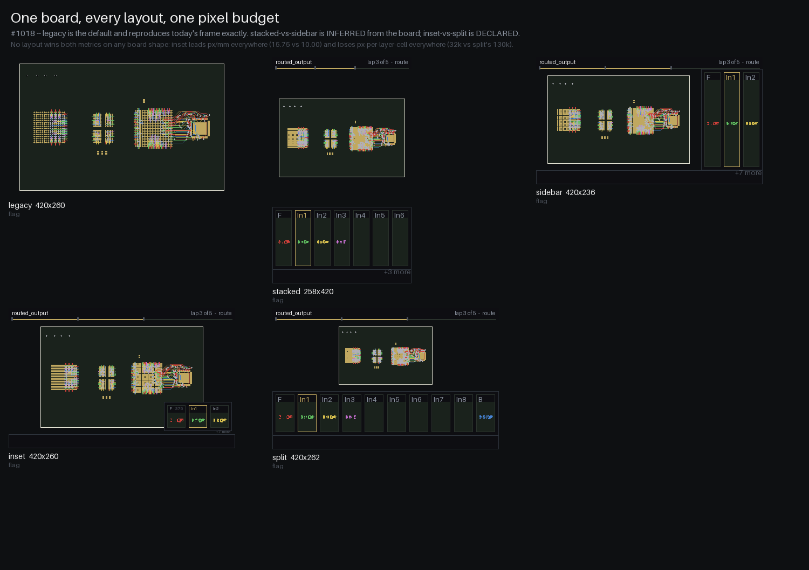
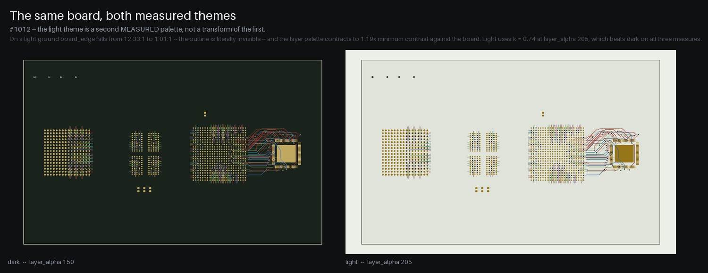
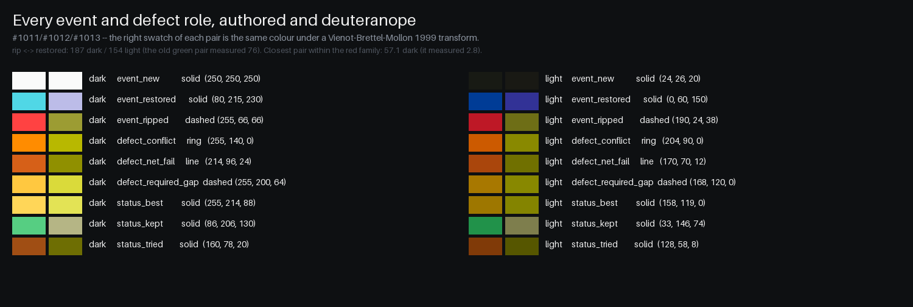
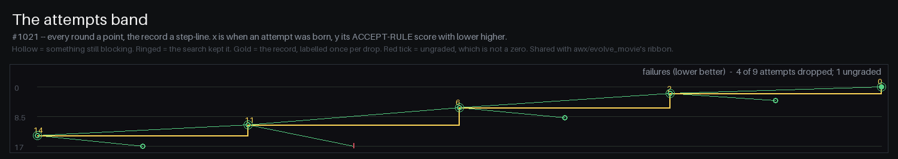

# Board rendering & routing animation

A fast, dependency-light way to **look at a routed board** and to **watch the
router work** — every track and via being laid down, ripped up, and restored,
in order, from bare input to finished board (issue #482).

Unlike the KiCad-based renderer it replaces, none of this needs KiCad,
`kicad-cli`, an SVG step, or a headless browser. It rasterizes the parsed
geometry directly with [Pillow](https://python-pillow.org/), so a still is
~0.2 s and a full movie renders in about a second.

That is still true of everything below **by default**, and it is the reason this
subsystem exists. One opt-in feature does need `kicad-cli` — the 3D isometric
panel (#887) — and it is off unless asked for, costs ~2-4 s per render when it
is, and degrades to the ordinary single-panel movie, at full speed and with a
stated reason, when the binary is absent. See
[the 3D isometric panel](#the-3d-isometric-panel-and-the-run-clock-887).

Three pieces:

| Tool | Role |
|------|------|
| `make_movie.py` | **Front door** — make the movie from whatever you have: a run directory, a list of step boards, or one board. |
| `route_render.py` | **Renderer / viewer** — draw a board (segments, vias, pads, zones, outline) to a PNG straight from geometry. |
| `route_trace.py` | **Trace recorder** — with `KICAD_ROUTE_TRACE=1`, record every segment/via as it is committed, ripped, and restored. |
| `animate_route.py` | **Animator** — the engine `make_movie.py` drives; also replays a single trace over a board. |

---

## Quick start

```bash
# 1. Static image of any board (no trace needed)
python3 py_router/route_render.py board.kicad_pcb -o board.png

# 2. Record a trace while routing (default-OFF flag)
KICAD_ROUTE_TRACE=1 python3 py_router/route.py in.kicad_pcb out.kicad_pcb
#    -> writes out_routetrace.json next to the board

# 3. Movie of that routing step
python3 py_router/animate_route.py out_routetrace.json --board in.kicad_pcb -o routing.mp4

# 4. Movie of a WHOLE run (fanout -> diff -> planes -> signal -> repair)
python3 py_router/make_movie.py runs_set1/myboard            # -> runs_set1/myboard/routing.mp4
```

---

## `make_movie.py` — making the movie (issue #506)

The stress harness renders one movie per run; this makes the same movie on
demand, from any set of boards you already have.

```bash
python3 py_router/make_movie.py RUNDIR                       # whole chain in a directory
python3 py_router/make_movie.py step1.kicad_pcb step2.kicad_pcb step3.kicad_pcb
python3 py_router/make_movie.py board.kicad_pcb              # one board draws its own copper
python3 py_router/make_movie.py RUNDIR -o out.mp4 --size 1400 --fps 8 --png
```

- **A directory** → its chain, ordered by `stepN` in the filename when present,
  otherwise by write time (the order the chain produced them).
- **Several boards** → animated in the order given (`step*.kicad_pcb` from a shell
  glob works; each board's *new* copper is the delta from the previous one).
- **One board** → its copper reveals in `--chunks` batches.

Any board with a sibling `<board>_routetrace.json` animates per segment/via
instead of as a coarse delta, so `KICAD_ROUTE_TRACE=1` on the routing steps buys
a much finer movie for free.

Options: `-o/--output` (the extension picks `.mp4` vs `.gif`), `--size`, `--fps`,
`--supersample`, `--layer-alpha`, `--rip-hold`, `--chunks`, `--end-hold`,
`--png-dir` (dump raw frames), `--png` (also write a full-resolution still of the
final board), `--quiet`.

**In the GUI:** tick **Make routing movie** in the Advanced options tab's *Debug*
section (default off). While it is on the plugin records what it routes and
writes the movie next to the board as `<board>_routing.mp4` (then `_routing_2`,
`_routing_3`, … — earlier movies are never overwritten), printing the path in
**green** in the Log tab:

- **Any single routing step** — Route, Route Diff Pairs, Create Planes, Repair
  Planes, Fanout — gets its own movie the moment it completes, animating just
  that step's new copper.
- **A plan run** from the AI tab (*Run Selected Steps* / *Run All Selected
  Steps*) gets **one** movie covering all of its steps together.

The baseline is the board as it stood when you ticked the box (and the end state
of each movie afterwards), so successive movies never re-animate copper an
earlier one already showed. Rendering happens off the UI thread. `run_plan.py --movie`
(see [plans from the command line](claude-skills.md#plans-from-the-command-line))
does the same for a headless run.

Library use (what the GUI calls):

```python
from make_movie import make_movie
path = make_movie(['runs_set1/myboard'], out='routing.mp4')   # or a board list
```

In a movie, **new copper flashes white**, **reroutes / restores flash green**,
and **rips flash red** on the frame before they vanish. Copper layers are drawn
with per-layer transparency so overlaps blend at crossings.

---

## `route_render.py` — the renderer / viewer

```bash
python3 py_router/route_render.py BOARD.kicad_pcb [-o OUT.png] [--size 1600]
    [--supersample 2] [--layer-alpha N] [--no-pads] [--no-zones]
    [--layers F.Cu,B.Cu]
```

- `--size` — longest image dimension in px. `--supersample` anti-aliases (1 = fastest, 2 = crisp stills).
- `--layer-alpha` — per-layer copper opacity 1–255; `<255` blends overlapping layers at crossings, `255` = opaque.
- `--layers` — render only these copper layers (per-layer views).

Library API (also the substrate for the animator):

```python
from kicad_parser import parse_kicad_pcb
from route_render import BoardRenderer

r = BoardRenderer(parse_kicad_pcb("board.kicad_pcb"))
r.render().save("board.png")                       # whole board
r.frame(segments=subset, vias=[]).save("f.png")    # an arbitrary subset (a frame)
```

`BoardRenderer` computes the world→pixel transform and the static substrate
(outline, zones, pads) **once**; each `frame(...)` composites a chosen subset of
copper on top, with optional highlight colors — which is exactly what the
animator drives.

---

## `route_trace.py` — the trace (`KICAD_ROUTE_TRACE=1`)

Setting `KICAD_ROUTE_TRACE=1` makes each routing front-end drop a sibling
`<output>_routetrace.json` — a time-ordered log of the copper it added, ripped,
and restored. It is **default-off**, read-only over the router (never changes
the routed result), and cheap.

**Granularity by step** — how finely each step is animated:

| Step | Front-end | Granularity |
|------|-----------|-------------|
| Signal routing | `route.py` | **Individual** — every commit / rip / restore, in true order |
| Differential pairs | `route_diff.py` | **Individual** — same choke points |
| Plane creation | `route_planes.py` | Per-**plane** taps + the pour **fills in** on the frame it is created |
| Plane repair | `repair_planes.py` | **Individual** per-join and per-rip, in order |
| BGA fanout | `bga_fanout.py` | Coarse — no trace; shown as the step's board delta |

Signal and diff-pair copper flows through the two `pcb_modification.py` choke
points (`add_route_to_pcb_data` / `remove_route_from_pcb_data`), so it is traced
per segment/via automatically. The plane front-ends add copper outside those
choke points, so they snapshot-diff `pcb_data` (repair) or emit from their tap
dicts (creation); a nested reconnect `batch_route` never double-records.

Not shown per-region: **voronoi fill sub-regions**. The router chain's boards do
not store computed zone fills, so a plane pours in as one shape at its creation
step, not region by region.

---

## `animate_route.py` — the animator

Two modes:

```bash
# Single trace over one board
python3 py_router/animate_route.py TRACE.json --board BOARD.kicad_pcb -o out.mp4

# Whole run: every stepN_*.kicad_pcb board's copper delta in chain order,
# with fine rip/restore animation spliced in for steps that recorded a trace
python3 py_router/animate_route.py --run-dir RUNDIR -o out.mp4
```

Key options: `--size`, `--fps`, `--layer-alpha`, `--rip-hold` (frames to hold a
rip red), `--end-hold` (seconds on the final frame), `--chunks` (reveal batches
for an untraced step), `--png-dir` (also dump raw PNG frames for external
encoding).

The whole-run mode relies on step outputs being named `stepN_<what>.kicad_pcb`;
it orders steps by the leading `stepN` and uses the last as the final board.

### Output format: `.mp4` vs `.gif`

The **output extension picks the format**:

- **`.mp4`** (H.264) — ~10–50× smaller than GIF, full color, plays natively in
  browsers / phones / Slack / social. Best for sharing and posting online.
  Needs `imageio` + `imageio-ffmpeg`:
  ```bash
  pip install imageio imageio-ffmpeg
  ```
  (bundles a static ffmpeg binary — no system install). If unavailable, the
  animator falls back to writing a sibling `.gif`.
- **`.gif`** (default) — native Pillow, **no dependency**, autoplays inline in
  chat / Markdown / GitHub issue bodies. Larger and 256-color. Pillow's GIF
  writer holds every frame it is given, so a film over 260 frames is
  **strided** to fit (one frame in N kept, each lasting N frame-times, the way
  `awx/evolve_movie.py` does it), and the animator says so. The `.mp4` is never
  strided.

### Memory and the frame budget (#1036)

`make_movie` spools every frame to a temp directory as it is drawn
(`py_router/frame_spool.py`) and applies the post-passes (the planned frame,
the attempts band, the run clock, the iso panel) per frame while the encoder
streams. Run 32's 22-board chain reached 29.5 GB before this change. How
flat memory stays depends on the output. An `.mp4` (imageio-ffmpeg) is encoded
one frame at a time, so memory does not grow with the frame count. A `.gif`,
which is also what an `.mp4` falls back to without imageio, goes through
Pillow's writer, which holds every frame it is handed. The stride caps that at
`GIF_MAX_FRAMES` (260) frames, so GIF memory grows up to the cap and then stays
there. `tests/test_1036_streaming.py` measures whichever case the machine can
render, from the platform's own peak-RSS counter (no psutil): 6x the frames as
an `.mp4`, or two GIFs both over the cap. Either way peak RSS stays flat,
while the same frames held in a list grow by about 300 MB.

**An overlay that fails costs the overlay, not the film.** The attempts band,
the run clock and the iso panel are drawn while the encoder streams, so a frame
one of them cannot draw would otherwise surface in the encoder. That overlay is
instead dropped from that frame to the end of the film, `movie: <overlay>
DROPPED` is printed once, and the film is still written at one size. A frame
that cannot be composed at all is re-raised as its own error. It is never
reported as `mp4 encode failed`.

**The spool uses disk instead.** A spooled 1400 px frame is about 1.27 MB,
so a 6000-frame film spools about 7.6 GB into the temp directory. Before
drawing, `make_movie` estimates the film and checks the free space
(`frame_spool.disk_check`, with a 20% margin). When the spool will not fit it
prints `SPOOL DISK` with the numbers, and an unbudgeted (`--max-frames 0`)
film falls back to the default budget. `make_film.py` streams through the same
spool: its board frames first, then the assembled film with its cards. It takes
the same `--max-frames` and makes the same disk check, and both spools are
removed on every way out, including a failed write.

A per-segment route trace plays one frame per event, and a long one makes a
film nobody watches to the end. `--max-frames N` (default
`$KICAD_MOVIE_MAX_FRAMES`, else 2400; `0` = no budget) is the film's frame
budget. Each traced step gets a fair share of what is left, and a trace that
does not fit its share is revealed in `--chunks` batches instead. The movie
prints `TRACE OVER BUDGET` naming the step.

---

## Stress-run integration (`tests/stress/render_run.py`)

Every stress run (live `run_board.sh` and no-LLM `redo_stress_test.py`) renders,
per board:

- `<final-board>.png` — combined snapshot, and `<final-board>_<layer>.png` per copper layer
- `<run-dir>/routing.mp4` — the whole-run movie (H.264 when `imageio-ffmpeg` is
  installed, else `routing.gif`). Chain boards are ordered by `stepN` when
  present, otherwise by write-time (for semantically-named chains).

`KICAD_ROUTE_TRACE=1` is exported by default in stress runs (set
`KICAD_ROUTE_TRACE=0` to skip; the movie then falls back to a coarse per-step
reveal). See the [stress-test runbook](../tests/stress/RUNBOOK.md#run-artifacts-final-snapshot--routing-movie-482).

## Placement movies: the camera (#431)

**The camera turns itself on for a placement chain (#1036).** When `--camera` is not given and consecutive boards differ in part POSES, `make_movie` uses `auto` and says so. A move counts only at `$KICAD_MOVIE_MOVE_MIN_MM` (0.5 mm) or more, or with any rotation. Below that it is drift, which the per-step substrate draws without a camera. A 0.05 mm nudge used to switch a whole routing film to the placement camera.

`make_movie.py` animates a `place_route_loop` work dir as well as a routing
chain. It detects one by the `loop_round{N}.json` sidecars the loop writes --
never by a `loop_round*.kicad_pcb` glob, because `--work-dir` defaults to the
output board's directory (which may hold unrelated boards) and mtime order would
animate a REJECTED round as though it had been kept. Only ACCEPTED rounds enter
the chain; the sidecar's `parent` is what makes the set a chain at all, since
round N follows the last accepted board rather than N-1.

```bash
python3 py_router/make_movie.py WORKDIR --camera auto -o placement.mp4
python3 py_placer/place_route_loop.py board.kicad_pcb out.kicad_pcb --route-args '...' --movie
KICAD_MOVIE_CAMERA=auto python3 py_router/make_movie.py WORKDIR     # env knob, same effect
```

The camera is **off by default**, everywhere. Every GUI movie is a routing
movie, so turning it on there would be regression risk for no gain; the env knob
exists so one variable covers the GUI recorder, `run_plan.py --movie` and the
stress renderer at once.

What it does: an establishing overview, a zoom to the parts a round actually
moved, a pan when the next round works elsewhere, and the moves play only after
the camera arrives. That last part is structural, not a timing guess --

> a frame either MOVES THE CAMERA or CHANGES THE BOARD, never both

-- so every transition happens over a frozen board, and a settle beat separates
arrival from action. Long moves dolly out through a waypoint and back in, since
a flat pan across a dense board at 6 fps is an unreadable smear. Nearly-identical
consecutive rounds produce NO camera move at all (hysteresis): they nudge the
same parts, and without it the camera vibrates while saying nothing.

Two implementation notes worth knowing:

* Part motion needs no new drawing code. `build_boards` already builds its
  renderer with `dynamic_zones=True`, which draws pads per frame from
  `renderer.pcb` -- so re-pointing that attribute animates the footprints. With
  `dynamic_zones=False` pads are baked into the static base and the same
  re-pointing does nothing.
* Views are letterboxed in WORLD space so every frame is the same size.
  `_write_mp4` fails on mixed sizes and the failure is SILENT: it is caught, and
  the whole movie degrades to a GIF.

Rotation snaps rather than tweening (quench rotations are 90-degree multiples and
rare); `--camera-budget SECONDS` caps the runtime, scaling camera shots first and
only touching the moves as a last resort.

---

## The 3D isometric panel, and the run clock (#887)

Two optional additions to the frame. **Both are off by default, and the fast
path above is unchanged when they are** — which matters here more than it
usually would, because this subsystem exists precisely because `kicad-cli` was
taken out of it, and one of these puts it back on an opt-in path.

### `--panels xray+iso` — a 3D view under the board

```bash
python3 py_router/make_movie.py WORKDIR --panels xray+iso -o routing.mp4
KICAD_MOVIE_PANELS=xray+iso python3 py_router/make_movie.py WORKDIR   # env knob, same effect
```

The X-ray board view keeps the full frame width and a `kicad-cli pcb render` is
stacked underneath it. Like the camera, it has no GUI control of its own: one
variable covers the GUI recorder, `run_plan.py --movie` and the stress renderer
at once.

**What it does NOT show is routing progress.** Copper sits under soldermask, so
the 3D view barely changes as tracks are laid. What it shows is the parts moving
across placement rounds, and the board turning: shot *k* of *K* is rendered at
`yaw0 + sweep·k/(K−1)`, one slow turn across the whole film. That sweep is what
makes the panel animated, and it is free — a different `--rotate` costs exactly
the same render.

Measured on KiCad 10.0.0, and each number shapes the design:

| | |
|---|---|
| one render, `--quality basic` | **1.4–2.7 s** serial on a quiet machine; **1.9–4.2 s** when four run at once, which is what `--iso-jobs 4` actually pays. Load matters more than the board: across tigard, lvds, ulx3s (225 models) and glasgow_revC (224), 3 reps each, one quiet pass spreads under 2x, with glasgow consistently slowest |
| `--quality high` | **5.0–7.5 s** on the same four boards at 1035×700 — about 3x `basic`, which is why `basic` is the default. (#887's own table reports 12.6 s, but at 900×700 `--floor`, which is a different question) |
| 8 renders, serial vs 6 workers | **~2.4x**, e.g. 24.0 s vs 10.2 s |
| a 900×700 request returns | **872×672** |
| a 640×480 request returns | **616×448** — the same for two very different boards, and across an 8-step yaw sweep |

So: **one render per chain STEP, never per frame** (`--iso-max-renders`, default
24, caps it — a COUNT rather than a number of seconds, so the same chain
composes the same movie on a fast machine and a slow one), and **the returned
size is never trusted**. Every panel is letterboxed into a box the composer
chose, and the render is asked for at 1.15× that box so the fit downscales
rather than blurs.

**Component bodies depend on the board, and their absence is silent.**
`kicad_files/tigard.kicad_pcb` renders as a *bare board* — pads, mask,
silkscreen, no parts. Its 84 `(model …)` references are 81 `${KISYS3DMOD}` +
3 `${KIPRJMOD}`, and 82 of them name a `.wrl`, while KiCad 10 ships `.step`;
`-D KISYS3DMOD=…` does not fix it. `lvds_converter_dualclk` renders fully populated. `kicad-cli` says
nothing either way, so the panel counts what is actually on disk and captions
`3D models N/M`, adding `BARE BOARD` and the reason at zero — never an empty
green rectangle that reads as a bug.

Without `kicad-cli` you get the single-panel movie at full speed and a line
saying so, naming `$KICAD_CLI`. That is a whole-movie decision taken **once**,
before compositing, and it is made on a probe render rather than on the binary
merely existing — because after the first composed frame the height is fixed and
cannot change. A single failed render later keeps its box with the reason drawn
inside it, for the same reason: mixed frame sizes make `_write_mp4` degrade the
whole movie to GIF, silently.

### The run clock

A run wrapped in `tests/stress/tee_cmd.py` leaves a `cmd_timing.jsonl`, and when
the movie finds one beside the chain it draws a run-clock overlay bottom-left,
opposite the caption:

```
RUN CLOCK  +0:51:23 of 1:17:39
stage  R3-route
basis  cmd_timing.jsonl - 153 wrapped commands, mapped by mtime
at  2026-08-20T10:03:32Z
```

The basis is the **run** clock, and that is measured rather than stylistic: in
run 24 the wrapped commands account for 253.3 s of a 4658.7 s run — 5.4% — so a
clock driven by tool time would sit near zero for over an hour.

**It counts up, and there is deliberately no countdown.** One was implemented
and it was exact — the movie is built after the run, so `t1 − instant` is the
subtraction of two recorded facts, not a forecast. It came out anyway, because
exact is not the same as legible: a countdown *reads* as "time left in this
video" and *means* "time that remained in the run", and a 25-frame GIF that ends
in four seconds while showing `remaining 0:15:57` invites exactly that
misreading. `+0:51:23 of 1:17:39` says the same thing with no way to misread it,
and anyone who wants the other number can subtract. Removing it also deleted the
machinery it needed to be safe — a coverage predicate over whether the ledger
spanned the film, its shortfall message, and an exact-or-absent branch in both
the overlay and the metadata.

A frame is mapped to an instant by its board's **mtime** falling inside a
command's `[t_start, t_end]`: `tee_cmd` stamps `time.time()` and a file's mtime
is the same clock, and it runs commands serially, so at most one row can contain
one. On run 24 that resolves all 17 chain boards. argv matching is the fallback
(mtime does not survive copying a work dir), and it is only a fallback because
on that same run it picks the wrong command for **9 of the 17** chain boards,
five of them by more than a minute — a dry run that never wrote the board, a
checker that only read it, a step that exited 1, and six more.

**The `at` line is UTC, and that is the point.** The ledger's own `iso_start` is
*local time with no offset* (`tee_cmd` uses `time.localtime`), so it means
different things on different machines; `t_start` is epoch seconds, so UTC is a
total function of a recorded fact. `--png-dir` frames carry the same instant as
PNG text metadata:

| key | |
|---|---|
| `krt:utc` | absolute UTC instant of this frame — the one to read |
| `krt:run_started_utc` | when the run began, so elapsed is checkable from the PNG alone |
| `krt:elapsed_s`, `krt:elapsed_hms` | position in the run |
| `krt:step`, `krt:stage`, `krt:step_wall_s` | which beat, which command, and what that command cost |
| `krt:run_total_s`, `krt:tool_s`, `krt:outside_s` | the run's totals |
| `krt:clock_basis` | how this frame was placed: `mtime`, `argv`, `pre-run`, … |

A frame is therefore self-describing: it needs no ledger and no knowledge of the
machine that produced it to be placed in time, which is the whole reason the
block exists. There is no `krt:eta`, no `krt:progress` and no `krt:remaining_s`
— a prediction, a percentage and a countdown all invite being read as forecasts.

The same reader is a standalone report — the end-of-run timing audit that used
to be a hand-run watch subagent:

```bash
python3 -X utf8 py_router/cmd_timing.py WORKDIR          # step table, subtotals, totals
python3 -X utf8 py_router/cmd_timing.py WORKDIR --json
```

---

## The render design system (#946)










Two films are rendered from one engine, and before #946 they did not agree with
each other. The issue opened on the narrowest symptom — ripped copper and
restored copper told apart by hue alone, on the red–green axis, with no key in
the frame — and the finding underneath it is that **there was no design system
at all**: every module re-derived the same intent and landed near it. Six distinct
near-black triples coexisted across the render modules -- `(14,14,18)`,
`(14,16,18)`, `(28,28,34)`, `(10,11,13)`, `(16,18,21)`, `(20,23,28)` -- one of
them hand-copied with a comment saying it was copied *"so the film and the
movie do not drift into two different dark greys"*, which is itself the
evidence that nothing shared them.

Four modules now hold it, and every renderer imports them:

| module | owns |
|---|---|
| `py_router/render_theme.py` | *what things look like* — semantic roles, two measured themes, the mark vocabulary. **Imports no PIL**, so `render_placement` can import it at module scope |
| `py_router/frame_layout.py` | *where things are* — named layouts, aspect presets, every box in final pixels. Pure geometry, no PIL, no board reads |
| `py_router/render_chrome.py` | the in-frame key, the rail and the totals |
| `py_router/render_panels.py` | the lower box and its four contents |

plus `py_router/movie_attempts.py` (the attempts band) and
`py_router/copper_motion.py` (retract and grow).

### Themes

`--theme dark` (the default) or `--theme light`, on `make_movie.py`,
`make_film.py` and `render_placement.py`, or `$KICAD_RENDER_THEME`.

The dark theme's values **are** the constants the renderers used before, so an
unthemed render is byte-identical. The light theme is a genuinely second
measured palette, not a transform of the first, and three measurements say why:

- **on a light board the outline vanishes.** `board_edge` measures 12.33:1
  against the dark board body and **1.01:1** against a light one — and since
  the board body sits only 1.11× off the ground, a light frame with no edge has
  no board in it at all. The hole colour is the mirror image and the one
  theme-invariant token, improving 1.22× → 15.21× for free.
- **the layer palette does not carry over.** Alpha compositing preserves the
  differences *between* layers whatever the ground (closest rendered pair 24.8
  dark vs 24.3 light), but nothing had measured contrast **against the board**:
  1.96× minimum dark, **1.19×** light. `_LAYER_PALETTE` is a *light-on-dark*
  palette, so over a bright board every entry is nearly the board. Scaling the
  palette toward black by k = 0.74 and raising `layer_alpha` to 205 beats dark
  on all three measures at once (2.00× minimum, closest pair 25.1, mean 78.9).
  The light palette is written out as literal triples, never computed at
  import: a derived palette means the committed baseline describes a
  *computation*, and a rounding change would silently move frames.
- **the obvious light event palette reproduces the defect.** Darken the dark
  events by one factor until the weakest clears 4.5:1 against the light board
  and the rip/restore pair lands at **73.3** deuteranope separation — *below*
  the **76.2** the original red/green collision measured. The binding event is
  `event_new`, which is near-white and needs the most darkening, and it drags
  the other two down with it. The shipped light palette measures **153.6**.

  ```bash
  python3 -X utf8 py_router/palette_audit.py --propose
  ```

  That flag exists because this paragraph used to carry a bare `88.6` that
  nothing in the tree computed — a claim, not a measurement.

`py_router/palette_audit.py` is the instrument. It is stdlib-only and never
imports PIL:

```bash
python3 -X utf8 py_router/palette_audit.py --self-test   # pins the TRANSFORM
python3 -X utf8 py_router/palette_audit.py --json out.json
python3 -X utf8 py_router/palette_card.py --theme light -o card.png
```

`--self-test` exists because **a broken deuteranope transform reads as a broken
palette**. It pins six published fixtures (black/white = 21.00; the old dark
rip↔green pair = 76; rip↔cyan = 187) in milliseconds, on every invocation.

`tests/test_946_palette_measures.py` re-derives every floor from the shipped
palettes *and* compares them per key against
`tests/946_theme_contrast_baseline.json`, reporting `DRIFT` / `INVERTED` /
`ORPHAN` / `MALFORMED`. Both halves are needed: a threshold alone would pass a
margin that silently collapsed from 12.0× to 4.6×, and a baseline alone cannot
say whether the new number is acceptable, so regenerating it launders a
regression.

### Ratios and layouts

`--layout` and `--aspect` on `make_movie.py`, or `$KICAD_MOVIE_LAYOUT` /
`$KICAD_MOVIE_ASPECT`.

`legacy` is the default and reproduces today's frame exactly. That is deliberate
and is the same call the camera knob already made (*"'off' (default) keeps every
existing movie bit-for-bit"*): making `auto` the default would change the shape
of every existing artifact — the GUI recorder's, `place_route_loop`'s
`placement.mp4`, `render_run`'s.

**A declared size is kept.** With `--aspect` given, or a layout with an aspect
of its own (`stacked`, `sidebar`, `split`), the frame is exactly that size.
The attempts band is reserved inside it (`plan_frame(track_px=)`), out of the
board's share. It used to be grown under every frame afterwards, so a 16:9 film
with a band came out taller than 16:9. `tests/test_946_frame_layout.py` checks
the whole layout × ratio cross product as plan data, and encodes 30 real films
(5 layouts × 3 ratios × 2 themes) and reads their size back. Two things still
grow the frame, and the status lines say so: the run clock (its height is
measured from the finished text) and the iso view on `legacy`/`inset`, which
have no panel to put it in.

**The 3D view goes into the layout's own panel** with `--panels xray+iso` on
`make_movie.py` or `make_film.py`. On `stacked` and `split` the lower box is
split left/right (the iso view gets 42% of the width). On `sidebar` the column
is split top/bottom. The per-layer strip draws into the other half. The panel's
gate is asked before the frame is planned (`movie_panels.preflight`), so a
board that would be gated as mostly bare gets no empty box reserved for it.

**Themes reach every region.** The cards and badges in `make_film`, the iso
panel's ground, caption strip and error text, and the run clock's band draw in
the active theme. `--theme` takes `dark` or `light` in any case and refuses anything else.
`--layer-alpha` defaults to the theme's own measured alpha (dark 150, light
205). The CLIs used to pass 150 explicitly, so LIGHT's measured 205 was never
used.

| layout | arrangement | frame aspect | px/mm on copper | px per layer cell |
|---|---|---|---|---|
| `stacked` | board full width, panel below | 0.62:1 | 10.00 | 113 000 |
| `sidebar` | board left, panel a right column | 1.78:1 | 12.38 | 100 050 |
| `inset` | board fills frame, panel a corner inset | 1.85:1 | **15.76** | 28 490 |
| `split` | board on top, lower box split | 1.60:1 | 11.06 | **128 800** |
| `auto` | `sidebar` on a wide board, `stacked` otherwise, **`legacy` on an extreme one** | — | — | — |

`inset` covers part of the board with its corner panel **by design**. It is the layout that trades the panel for copper pixels, and the pads under the inset are hidden for the whole film. Use `split` or `stacked` when every pad must stay visible.

*(one pixel budget — 1.62 Mpx — on a 1.85:1 board, four cells across the
panel.)* **Re-derive it rather than trusting it:**

```bash
python3 -X utf8 py_router/layout_budget.py --swing
```

Every figure above is that command's output, and
`tests/test_946_layout_budget.py` compares the two on every run. It has to:
`inset`'s px-per-layer-cell was quoted as "32k" in four places — including the
comment on `CELL_MIN_W`, the constant that leans on it — and is **28 490**. A
12% error that nothing could catch, because nothing computed it.

**No layout wins both metrics, on any board shape.** `inset` wins px/mm
everywhere and loses px-per-layer-cell everywhere (28 490 against `split`'s
128 800, a **4.5× penalty**); `split` is the mirror image. `stacked` and
`sidebar` genuinely swap, by **8.8–23.8%**, on board aspect — and the crossover
falls exactly at `ADAPTIVE_ASPECT_CUT`, which is the number `auto` branches on. That asymmetry is the design rule:

> **`stacked`-vs-`sidebar` is INFERRED; `inset`-vs-`split` is DECLARED.**
> Picking between the first pair from `board_info.board_bounds` costs one
> comparison and is right across the corpus. Choosing `inset` over `split` is a
> decision about what the film is *for*, so it is a flag, never an inference.

**`auto` gives up its chrome outside `EXTREME_ASPECT_LO`..`EXTREME_ASPECT_HI`.** Every chrome layout has a FIXED board-box aspect and only `legacy` inherits the board's, so a board far outside the corpus range fills very little of whichever box it is given — and the adaptive cut, tuned on 0.5–2.5, picked the *second worst* option for a 6.5:1 board. Measured at size 560 on such a board:

| layout | board box aspect | the board fills |
|---|---|---|
| `legacy` | 6.51 | **100%** |
| `split` | 2.95 | 45% |
| `inset` | 14.74 | 44% |
| `sidebar` | 1.53 | 24% |
| `stacked` | 0.98 | 15% |

In a real placement film that showed up as the board holding **4.6–4.9% of the frame** during the beats where parts were moving — the camera zoomed *in* and the subject got *smaller*. Chrome you cannot afford is not a feature, so outside the band `auto` returns `legacy` and says so.

| constant | value |
|---|---|
| `EXTREME_ASPECT_LO` (`py_router/frame_layout.py`) | 0.50 |
| `EXTREME_ASPECT_HI` (`py_router/frame_layout.py`) | 3.00 |

`FrameGeometry.chosen_by` carries the sentence — `"adaptive: board aspect 1.41 >
1.25"` — and `frame_layout.frame_status_line` prints it.

| constant | value |
|---|---|
| `RAIL_FRAC` (`py_router/frame_layout.py`) | 0.045 |
| `FOOT_FRAC` (`py_router/frame_layout.py`) | 0.045 |
| `RAIL_MIN_PX` (`py_router/frame_layout.py`) | 22 |
| `FOOT_MIN_PX` (`py_router/frame_layout.py`) | 26 |
| `ADAPTIVE_ASPECT_CUT` (`py_router/frame_layout.py`) | 1.25 |

**Both frame dimensions are forced even.** Only the height ever was, while
`animate_route._write_mp4` crops `a.shape[0] & ~1` **and** `a.shape[1] & ~1` —
so a taller-than-wide board silently lost a pixel column in every mp4 this repo
had written. Planning `legacy` too means the frame is even *before* the encoder.

`frame_layout.assert_frames_uniform` is wired into `animate_route.save_movie`,
the choke point every front end passes through. **On failure it reports loudly
and pads; it does not raise** — aborting a routing run for a cosmetic reason is
something this repo refuses elsewhere (`movie_panels._finite`). The film is
produced, the defect is audible, and the distortion is a letterbox rather than
a squash.

### The lower box

One fixed rect, four contents, switched by the phase the frame belongs to:

| phase | content |
|---|---|
| bookend | a board summary — parts, nets, copper layers, segments, vias |
| placement | the inventory: how much of the board is seated, by reference class |
| routing | the per-layer strip |
| seeding | the same inventory, emptying as the pile empties |

It is **one box** because a panel that appears and disappears changes frame
height, and Pillow does not raise on that — it writes a valid file in which
every later frame has been silently resized to the first.

The strip is the answer to the 19 two-layer crossings that landed within 34 of
some third layer's solo appearance (worst: `B.Cu` over `F.Cu` renders
`(96,98,142)` against `In6`'s `(99,102,143)`, **5.1 apart**). **Position carries
layer identity instead of colour, and position never collides.** Each cell draws
at full strength on its own ground, so there is no alpha dimming and no blend.

It builds **no second `BoardRenderer`** — `tests/test_431_placement_movie.py:92`
pins exactly one on the no-stage path — and `draw_layer_strip` returns a `Cell`
per cell carrying the count string it stamped and the number of lines it
stroked, so a test can assert the drawing rather than re-deriving the tally and
comparing it to nothing.

| constant | value |
|---|---|
| `CELL_MIN_W` (`py_router/render_panels.py`) | 26 |
| `CELL_FLOOR_W` (`py_router/render_panels.py`) | 8 |
| `LABEL_GAP_PX` (`py_router/render_panels.py`) | 5 |

Cells shrink in **number**, not below legibility: below `CELL_MIN_W` the strip
draws fewer, wider cells and says `+N more`. And a count that would touch the
layer name is **dropped, not overprinted** — measured overlap was +25 px at
`CELL_MIN_W` exactly and +23 px at a 180 px box.

### The attempts band

Routing and placement are not one shot. `place_route_loop` tries a round,
routes it, keeps it or throws it away, and tries again — and the search is on
disk in full, because `write_round_sidecar` records every round including the
rejected ones. Nothing drew it.

```bash
python3 py_tools/make_film.py --from-loop-dir wk/ -o film.gif
python3 py_tools/make_film.py --from-ledger converge/ledger.jsonl -o film.gif
python3 py_router/make_movie.py RUNDIR --no-attempts     # the OFF arm
```

Every round is a point; the record is a step-line. x is when an attempt was
born, y its accept-rule score with **lower higher on screen**. A node is hollow
while something is still blocking and filled once it is admissible; a kept
attempt is ringed; the gold staircase labels each new record once; and the band
grows with the film behind a visibility horizon.

**The axis is the run's own accept rule, chosen once over the whole list and
named in the label.**

| producer | axis | why |
|---|---|---|
| `place_route_loop` | `failures` | `better()` ranks "failures first, then iterations" |
| `place_route_loop --accept-cmd` | `accept_score` | that *is* the accept rule |
| `converge` ledger | `score.blocking` | `_score_key`'s leading term |
| `awx` evolve ledger | `vias` | the last term of `awx`'s own key |

`vias` is the literal analogue of what `awx/evolve_movie` plots and it is in
every sidecar — but the loop annotates it report-only, and an axis that is not
the accept rule draws a staircase pointing one way beside accept/reject rings
pointing the other. **Never mixed**: a film whose axis changes meaning halfway
is worse than no film.

**On a PLACEMENT run the axis is still the routed result**, which surprises
people. `place_route_loop` is a place-*and*-route loop: a round moves parts,
routes the board, and is kept or thrown away on `better()`, whose leading term
is `failures` — copper, from the route summary. So the y-axis of a placement
film reads *"how much is still unrouted after moving the parts"*. That is the
run's own accept rule; a placement score would not be.

The sidecar also carries `ratsnest_crossings`, `ratsnest_hpwl` and
`ratsnest_length`, and the band deliberately does **not** plot them.
`_ratsnest_screen` uses them to decide whether a candidate is worth paying a
routing run for — it is a *screen*, not the judge. Plotting a screen where the
verdict belongs is the same failure in its exact form, and there is a
measurement behind it: on one run crossings were **anti-correlated** with
correctness.

A placement tool that does not route — `place_optimize`, `place_seed`,
`place_portfolio` — writes no `loop_round*.json` at all, so there is no band
and nothing is invented.

`best_so_far` is one algorithm with two policy flags, shared with
`awx/evolve_movie.Ribbon`: on this side a *rejected* round cannot set a record
(the loop rejects exactly what `better()` says is not better), and on the `awx`
side *"a world with open nets is not admissible however few vias it has"*. When
the axis IS the blocking term the admissibility gate must be off, or the
staircase collapses to a single point.

**An ungraded attempt is not a zero.** A screened round's sidecar carries
`metrics: {}` on purpose, and a converge row's `blocking: null` means a
component that was asked for could not answer. Neither is dropped and neither is
plotted at the axis floor: they are a tick on the rail, counted in the caption.

**A place-and-route run is ONE graph.** A combined run leaves two records of
its search: the converge ledger (placement laps and routing laps, told apart by
`kind`), and `loop_round*.json` sidecars when `place_route_loop` ran. When both
sit next to the boards, `movie_attempts.discover` joins them
(`join_tracks`). The x-axis counts laps across both halves: the half that
started first keeps its indices and the other is shifted past it. The second
half's root descends from the first half's last kept attempt. Both axes are a
blocking term (`score.blocking`, `failures`), and the label names both. A loop
ranked on an `--accept-cmd` scalar is not joined, and the note says it was left
out.

**x is run time when the ledger has a clock (#1042).** A converge ledger's
rows carry `t`. When every attempt has one, x is run time over the ledger's
whole span, placement laps included, and the caption adds `[x: run time]`. The
placement panels draw the same domain. A joined converge + loop graph has no
time on its loop half, so it keeps the lap index.

**Lineage follows `parent_sha`.** A ledger row with no `parent_sha`, or one
naming a board no row produced, is drawn from the last accepted row before it,
which is the loop's own rule. The caption counts those guesses, because under
parallel lineages the guess can be wrong. They stay guesses until `record`
takes a parent explicitly (#1034).

**The axis breaks when a few attempts dwarf the rest.** Run 32's ledger
opens at blocking 12 703 (the unplaced pile) and spends about 200 laps between
19 and 43. On a linear axis those laps share one pixel row, and the record's
drops 41 → 38 → 33 → 32 → 30 cannot be seen. So the working range (every
graded attempt up to the 90th percentile, `WORK_PCTL`, padded) gets the main
plot. The attempts above it are compressed on a log scale into a thin strip at
the bottom (`STRIP_FRAC` 0.18) under a break mark, and the caption says
`[axis broken above N]`. The break is offset-based: it happens only when the
gap between the worst attempt and the working range's top is larger than
`BREAK_RATIO − 1` (1×) times the working range's own span, so it behaves the
same for negative scores. Otherwise, or when the broken axis cannot be drawn,
the whole range is one linear scale. `tests/test_1036_attempts_axis.py` checks
that the working laps span at least half the plot on the run-32 ledger and on
a synthetic track, and that a linear axis and a log axis both fail that check.

**Nothing is synthesised.** No sidecars and no ledger means no band, and the
status line says so in words. One attempt is also an OFF arm — `attach` then
returns the frame list completely untouched, the same list object holding the
same images.

**And it refuses a frame too short to carry it.** `BAND_MIN_PX` is a floor with no opinion about the frame it is floored in: on a long thin board rendered `legacy` at 560x86 the band took **74% of the picture**, and 52% at 124 px — a time series about the run dwarfing the film it annotates. Above `BAND_MAX_FRAC` there is no room for one, and `attach` declines and says so rather than shipping a band nobody can read.

| constant | value |
|---|---|
| `BAND_FRAC` (`py_router/movie_attempts.py`) | 0.16 |
| `BAND_MIN_PX` (`py_router/movie_attempts.py`) | 64 |
| `BAND_MAX_FRAC` (`py_router/movie_attempts.py`) | 0.34 |

### The placement panels (#1042)

The attempts band keeps the routed VERDICT on its axis. A converge ledger's
placement lap scores the copper-free board, where `blocking` is every net
unrouted: run 32's accepted placement rows read 267 → 251 → 239 on that axis
while the laps moved floorplan errors 41 → 11. So placement laps are taken OFF
the verdict axis, and the caption counts them. Placement gets three panels of
its own beside the band (`py_router/movie_placement.py`):

| panel | y | series | instrument |
|---|---|---|---|
| LEGALITY | log | off-outline parts, conflict pairs, overlap mm² | `render_placement --json-out` |
| ARRANGEMENT (screen) | own axis each | airwire crossings (left), hpwl mm (right); dashed benchmark lines | `render_placement --json-out` |
| INTENT | linear | floorplan errors | `check_floorplan --intent` on every board, else the ledger's `board_score` |

- **Measured in process.** The numbers are the ones `render_placement
  --json-out` writes, computed by its own `PlacementModel` and
  `legality_findings`, and `check_floorplan.main` runs in the same process.
  Nothing starts a subprocess of `sys.executable`: inside KiCad that is the
  pcbnew binary, and a child started that way hangs
  (`kicad_routing_plugin/deps_check.py`). About 3 s per board for each
  instrument, cached by board sha.
- **Cheap gates first.** Before anything is measured, the chain must have at
  least two copper-free boards and a part must have moved between them
  (poses are parsed, no instrument runs). A routing chain whose first
  snapshot is copper-free measures nothing.
- **One instrument per line.** With `--floorplan-intent`, INTENT is
  `check_floorplan --intent` on every board, the pile included. Without it,
  INTENT is the ledger's own `score.blocking_by.floorplan`, labelled
  `ledger board_score`. A board no row scores is unmeasured. The two
  instruments are never mixed on one line.
- **Unmeasured is said.** A board the instrument cannot answer for (no
  parts, an unreadable file) is marked on the axis and listed on the status
  line, never plotted as zero. With no intent and no ledger, the INTENT plot
  reads "unmeasured".
- **x is run time** when the ledger carries `t`, over the same domain the
  verdict band draws (`movie_attempts.ledger_time_domain`, every row,
  placement laps included). A re-entry sits where it happened. A board no
  row names (the pile, the run's input) sits at the start. Boards closer
  than `MIN_BEAT_PX` (8) are spread to it so each keeps its own point.
  Without a clock, x is the board order. The header says which.
- **One point per placement board.** Never per frame, because a glide's
  frames are pixel interpolation, not evaluated placements. Points appear
  board by board. A beat changes on the frame its glide LANDS
  (`build_boards(lands_out=)`), the same frame the inventory changes. Before
  the first beat lands, no point and no flag is drawn. Once the film is
  routing, the header says "placement settled".
- **The floor is in the legend.** When the last board's conflict pairs are
  all contacts between KiCad-locked parts (`metrics.locked_contact_pairs`),
  the legend reads "floor N = locked parts", and a dashed line marks the
  value.
- **Defect flags.** A ledger row with `kind == classification` and
  `shape == placement` flags the first placement board after it. The flag is
  a numbered marker in a lane above the INTENT plot, off every series line.
  Flags on one board stack. The legend carries the lever's headline, the
  text before its first ':', wrapped at words and never cut.
- **Readable or not drawn.** Every plot is at least `PLOT_MIN_PX` (48) tall,
  and every title, footer line and legend word renders whole.
  `movie_placement.plan_band` sizes the band for this frame: side by side
  (placement in 46, 52 or 58 % of the width) when three panels fit there,
  else stacked with placement on top. The verdict graph gives up height down
  to its 64 px floor, and the band never takes more than `BAND_MAX_FRAC`
  (0.48) of the frame. A LANDSCAPE frame (w >= 1.25 h) with a band keeps
  the side-column arrangement: board on the left, iso, layer grid and stats
  in a right-hand column (`ISO_SIDE_FRAC`, with or without iso), and the
  band as the one bottom row, placement panels left and verdict right. The
  band is capped there so the board box keeps `BOARD_MIN_SHARE` (0.55) of the
  frame height after the rail and the foot. Side by side, placement takes
  whichever of 46, 52 or 58 % of the width needs the least height. A
  full-width lower box under the board as well as the band left a 16:9 split
  frame a 1000x170 board box before this. Elsewhere `frame_layout` keeps the
  board box at `BOARD_ALONE_MIN_SHARE` (0.30) of the frame, so a tall band
  shrinks the lower panel, not the board. The verdict band's caption shortens
  to whole clauses when it sits beside the panels, and is never dropped. A box too narrow for three panels keeps fewer,
  INTENT then LEGALITY then ARRANGEMENT, and the header names what was
  dropped. When nothing readable fits, the panels are declined and the
  status line says why. Measured over 5 layouts × 5 ratios × {500, 1000,
  1400} px: every frame at 1000 and 1400 draws. At 500 px, landscape frames
  decline, and so does any frame that also carries the verdict graph. A
  failed draw repaints the box and says so.
- **Flags.** `--attempts-ledger PATH`, `--benchmark-board PATH` (the human's
  board or a previous run, drawn dashed), `--floorplan-intent PATH` and
  `--no-placement-panel` exist on both `make_movie.py` and `make_film.py`.
  `--attempts-ledger` feeds both the verdict band and the panels, so a film
  rendered from copies away from the run directory still has both.

On run 32's glasgow_revC chain (#1042) the panels read:

| board | off-outline parts | conflict pairs | overlap mm² | crossings | hpwl mm | floorplan: `check_floorplan --intent` | floorplan: ledger |
|---|---|---|---|---|---|---|---|
| the pile | 243 | 3214 | 9503.03 | 10974 | 4834 | 131 | no row |
| placed_v2 | 0 | 6 | 23.69 | 3740 | 5760 | 12 | 12 (row 9) |
| placed_v3 | 0 | 6 | 23.69 | 3750 | 5743 | 11 | 11 (row 53) |
| glasgow_revC (the human benchmark) | 0 | 10 | 70.05 | 1352 | 3641 | | |

### The ghost and the arrow

A placement tween glides parts from their source pose to their parsed one, and watched frame by frame that reads as *the board assembling itself* rather than as *these parts moved, from there to here*. `py_router/place_motion.py` draws a **ghost** at the source pose and an **arrow** to the part's current one, through the `overlays=` seam, so it costs no frame geometry.

The arrow **grows** — it runs from the ghost to where the part is *now*, so it starts at zero length and spans the whole journey by the end — and the ghost **fades in** rather than out, because at t=0 it sits on top of the part and says nothing while at t=1 it is the only thing marking the origin. A part that moved less than `MIN_TRAVEL_MM` gets neither: the ghost would be a smear on the part and the arrow a dot.

| constant | value |
|---|---|
| `MIN_TRAVEL_MM` (`py_router/place_motion.py`) | 1.5 |

### A rip retracts; its replacement grows

The channel a movie has and a still does not is **time**, and direction survives
every colour deficiency there is. `py_router/copper_motion.py` is pure geometry:
it takes trace-style rows and returns rows, so the whole animation is assertable
as data before anything is drawn.

It retracts **from the far end**, not everywhere at once: the segments are
ordered by distance from an anchor and consumed from the far end, with the
frontier segment cut rather than dropped. The anchor is the doomed set's
endpoint nearest the surviving copper — the end a track is actually pulled back
to.

Only **restores** grow. A plain `new` add happens thousands of times in a film;
a restore is the thing a rip turns into, so the two motions are opposites on
screen, which is the claim.

`--rip-hold 0` still cuts: `Movie.motion` is `rip_hold > 0` rather than a knob
of its own, because "no rip animation, just cut" already has a spelling.

| constant | value |
|---|---|
| `MOTION_STAGES` (`py_router/copper_motion.py`) | 4 |

**Disclosed:** `reveal_delta`'s chunked *add* path passes `event='route'`, so a
coarse step (fanout, planes, repair) rips with motion but does not grow with it.
That is correct rather than incomplete — those steps are not restoring copper a
rip took away — but the growth half is visible on trace steps and on an explicit
restore, not everywhere.

### Per-format defaults — measured, and refused

#946 §4 asks for per-format defaults for `--size` and `--fps`, on the grounds
that *"6 fps is below the rate at which motion reads as continuous"*. The
premise is true of continuous motion and false of this movie.

**Raising `fps` adds no frames.** A routing movie's frames are discrete events —
one per copper event, or per chunk of a coarse reveal — so `fps` only changes
the per-frame delay. Measured on the two-board `fanout_starting_point →
fanout_output1` chain, identical 13 frames at every rate:

| format | size | fps | bytes | film |
|---|---|---|---|---|
| gif | 1000 | 6 | 59 550 | 3580 ms |
| gif | 1000 | 12 | 59 550 | 2530 ms |
| gif | 1000 | 24 | 59 550 | 1990 ms |
| mp4 | 1000 | 6 | 108 935 | |
| mp4 | 1000 | 12 | 103 447 | |
| mp4 | 1000 | 24 | 96 467 | |

The raise is nearly free — the GIF is byte-identical and the mp4 gets *smaller*
— and it buys nothing, because it does not interpolate: it plays the same
slideshow faster and ends sooner. What actually makes motion continuous is more
frames, which is the retract-and-grow above and the camera's `tween`.

| constant | value |
|---|---|
| `DEFAULT_SIZE` (`py_router/make_movie.py`) | 1000 |
| `DEFAULT_FPS` (`py_router/make_movie.py`) | 6.0 |
| `MOSTLY_BARE_FRACTION` (`py_router/kicad_iso_render.py`) | 0.25 |

`tests/test_946_format_defaults.py` re-measures this on every run, so a later
raise has to come past the measurement rather than around it.

### No GUI control

None of `--theme`, `--layout`, `--aspect` or `--no-attempts` adds a dialog
control, which is the second arm of CLAUDE.md's CLI/GUI parity rule taken
explicitly: the GUI's movie button passes no movie parameters at all
(`movie_recorder.py:160` is `make_movie(boards, out=out, quiet=True)`), and the
env knobs are how a feature with no dialog control of its own reaches every
front end at once — the same rationale `KICAD_MOVIE_CAMERA` and
`KICAD_MOVIE_PANELS` already carry.

**The env knob and the kwarg parse asymmetrically**, following
`make_movie._panels_wanted`: an unknown value in the *knob* warns to stderr and
falls back (a typo in a shell must not abort a routing run that happened to ask
for a movie), while an unknown value passed as a *kwarg* raises and names the
accepted set (a typo in code is a bug).
