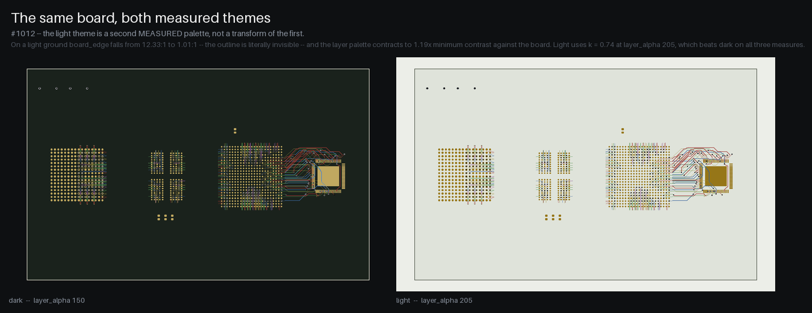
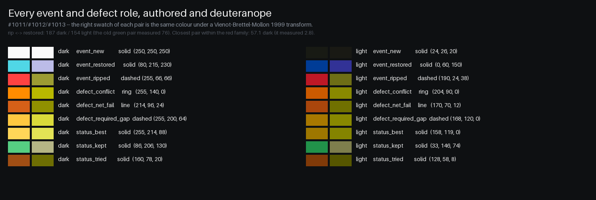

# Board rendering & routing animation

A fast, dependency-light way to **look at a routed board** and to **watch the
router work** — every track and via being laid down, ripped up, and restored,
in order, from bare input to finished board (issue #482).

Unlike the KiCad-based renderer it replaces, none of this needs KiCad,
`kicad-cli`, an SVG step, or a headless browser. It rasterizes the parsed
geometry directly with [Pillow](https://python-pillow.org/), so a still is
~0.2 s and a full movie renders in about a second.

That is still true of everything below, and it is the reason this subsystem
exists. (The 3D isometric `kicad-cli` panel #887 added is retired: the stage3d
layout's own 3D board replaced it. `py_router/kicad_iso_render.py` remains as
a standalone CLI.)

Three pieces:

| Tool | Role |
|------|------|
| `make_movie.py` | **Front door** — make the movie from whatever you have: a run directory, a list of step boards, or one board. |
| `route_render.py` | **Renderer / viewer** — draw a board (segments, vias, pads, zones, outline) to a PNG straight from geometry. |
| `route_trace.py` | **Trace recorder** — with `KICAD_ROUTE_TRACE=1`, record every segment/via as it is committed, ripped, and restored. |
| `animate_route.py` | **Animator** — the engine `make_movie.py` drives; also replays a single trace over a board. |

---

## Quick start

```bash
# 1. Static image of any board (no trace needed)
python3 py_router/route_render.py board.kicad_pcb -o board.png

# 2. Record a trace while routing (default-OFF flag)
KICAD_ROUTE_TRACE=1 python3 py_router/route.py in.kicad_pcb out.kicad_pcb
#    -> writes out_routetrace.json next to the board

# 3. Movie of that routing step
python3 py_router/animate_route.py out_routetrace.json --board in.kicad_pcb -o routing.mp4

# 4. Movie of a WHOLE run (fanout -> diff -> planes -> signal -> repair)
python3 py_router/make_movie.py runs_set1/myboard            # -> runs_set1/myboard/routing.mp4
```

---

## `make_movie.py` — making the movie (issue #506)

The stress harness renders one movie per run; this makes the same movie on
demand, from any set of boards you already have.

```bash
python3 py_router/make_movie.py RUNDIR                       # whole chain in a directory
python3 py_router/make_movie.py step1.kicad_pcb step2.kicad_pcb step3.kicad_pcb
python3 py_router/make_movie.py board.kicad_pcb              # one board draws its own copper
python3 py_router/make_movie.py RUNDIR -o out.mp4 --size 1400 --fps 8 --png
```

- **A directory** → its chain, ordered by `stepN` in the filename when present,
  otherwise by write time (the order the chain produced them).
- **Several boards** → animated in the order given (`step*.kicad_pcb` from a shell
  glob works; each board's *new* copper is the delta from the previous one).
- **One board** → its copper reveals in `--chunks` batches.

Any board with a sibling `<board>_routetrace.json` animates per segment/via
instead of as a coarse delta, so `KICAD_ROUTE_TRACE=1` on the routing steps buys
a much finer movie for free.

Options: `-o/--output` (the extension picks `.mp4` vs `.gif`), `--size`, `--fps`,
`--supersample`, `--layer-alpha`, `--rip-hold`, `--chunks`, `--end-hold`,
`--png-dir` (dump raw frames), `--png` (also write a full-resolution still of the
final board), `--quiet`.

**In the GUI:** tick **Make routing movie** in the Advanced options tab's *Debug*
section (default off). While it is on the plugin records what it routes and
writes the movie next to the board as `<board>_routing.mp4` (then `_routing_2`,
`_routing_3`, … — earlier movies are never overwritten), printing the path in
**green** in the Log tab:

- **Any single routing step** — Route, Route Diff Pairs, Create Planes, Repair
  Planes, Fanout — gets its own movie the moment it completes, animating just
  that step's new copper.
- **A plan run** from the AI tab (*Run Selected Steps* / *Run All Selected
  Steps*) gets **one** movie covering all of its steps together.

The baseline is the board as it stood when you ticked the box (and the end state
of each movie afterwards), so successive movies never re-animate copper an
earlier one already showed. Rendering happens off the UI thread. `run_plan.py --movie`
(see [plans from the command line](claude-skills.md#plans-from-the-command-line))
does the same for a headless run.

Library use (what the GUI calls):

```python
from make_movie import make_movie
path = make_movie(['runs_set1/myboard'], out='routing.mp4')   # or a board list
```

In a movie, **new copper flashes white**, **reroutes / restores flash green**,
and **rips flash red** on the frame before they vanish. Copper layers are drawn
with per-layer transparency so overlaps blend at crossings.

---

## `route_render.py` — the renderer / viewer

```bash
python3 py_router/route_render.py BOARD.kicad_pcb [-o OUT.png] [--size 1600]
    [--supersample 2] [--layer-alpha N] [--no-pads] [--no-zones]
    [--layers F.Cu,B.Cu]
```

- `--size` — longest image dimension in px. `--supersample` anti-aliases (1 = fastest, 2 = crisp stills).
- `--layer-alpha` — per-layer copper opacity 1–255; `<255` blends overlapping layers at crossings, `255` = opaque.
- `--layers` — render only these copper layers (per-layer views).

Library API (also the substrate for the animator):

```python
from kicad_parser import parse_kicad_pcb
from route_render import BoardRenderer

r = BoardRenderer(parse_kicad_pcb("board.kicad_pcb"))
r.render().save("board.png")                       # whole board
r.frame(segments=subset, vias=[]).save("f.png")    # an arbitrary subset (a frame)
```

`BoardRenderer` computes the world→pixel transform and the static substrate
(outline, zones, pads) **once**; each `frame(...)` composites a chosen subset of
copper on top, with optional highlight colors — which is exactly what the
animator drives.

---

## `route_trace.py` — the trace (`KICAD_ROUTE_TRACE=1`)

Setting `KICAD_ROUTE_TRACE=1` makes each routing front-end drop a sibling
`<output>_routetrace.json` — a time-ordered log of the copper it added, ripped,
and restored. It is **default-off**, read-only over the router (never changes
the routed result), and cheap.

**Granularity by step** — how finely each step is animated:

| Step | Front-end | Granularity |
|------|-----------|-------------|
| Signal routing | `route.py` | **Individual** — every commit / rip / restore, in true order |
| Differential pairs | `route_diff.py` | **Individual** — same choke points |
| Plane creation | `route_planes.py` | Per-**plane** taps + the pour **fills in** on the frame it is created |
| Plane repair | `repair_planes.py` | **Individual** per-join and per-rip, in order |
| BGA fanout | `bga_fanout.py` | Coarse — no trace; shown as the step's board delta |

Signal and diff-pair copper flows through the two `pcb_modification.py` choke
points (`add_route_to_pcb_data` / `remove_route_from_pcb_data`), so it is traced
per segment/via automatically. The plane front-ends add copper outside those
choke points, so they snapshot-diff `pcb_data` (repair) or emit from their tap
dicts (creation); a nested reconnect `batch_route` never double-records.

Not shown per-region: **voronoi fill sub-regions**. The router chain's boards do
not store computed zone fills, so a plane pours in as one shape at its creation
step, not region by region.

---

## `animate_route.py` — the animator

Two modes:

```bash
# Single trace over one board
python3 py_router/animate_route.py TRACE.json --board BOARD.kicad_pcb -o out.mp4

# Whole run: every stepN_*.kicad_pcb board's copper delta in chain order,
# with fine rip/restore animation spliced in for steps that recorded a trace
python3 py_router/animate_route.py --run-dir RUNDIR -o out.mp4
```

Key options: `--size`, `--fps`, `--layer-alpha`, `--rip-hold` (frames to hold a
rip red), `--end-hold` (seconds on the final frame), `--chunks` (reveal batches
for an untraced step), `--png-dir` (also dump raw PNG frames for external
encoding).

The whole-run mode relies on step outputs being named `stepN_<what>.kicad_pcb`;
it orders steps by the leading `stepN` and uses the last as the final board.

### Output format: `.mp4` vs `.gif`

The **output extension picks the format**:

- **`.mp4`** (H.264) — ~10–50× smaller than GIF, full color, plays natively in
  browsers / phones / Slack / social. Best for sharing and posting online.
  Needs `imageio` + `imageio-ffmpeg`:
  ```bash
  pip install imageio imageio-ffmpeg
  ```
  (bundles a static ffmpeg binary — no system install). If unavailable, the
  animator falls back to writing a sibling `.gif`.
- **`.gif`** (default) — native Pillow, **no dependency**, autoplays inline in
  chat / Markdown / GitHub issue bodies. Larger and 256-color. Pillow's GIF
  writer holds every frame it is given, so a film over 260 frames is
  **strided** to fit (one frame in N kept, each lasting N frame-times, the way
  `awx/evolve_movie.py` does it), and the animator says so. The `.mp4` is never
  strided.

### Memory and the frame budget (#1036)

`make_movie` spools every frame to a temp directory as it is drawn
(`py_router/frame_spool.py`) and applies the post-passes (the planned frame,
the band, the run clock) per frame while the encoder
streams. Run 32's 22-board chain reached 29.5 GB before this change. How
flat memory stays depends on the output. An `.mp4` (imageio-ffmpeg) is encoded
one frame at a time, so memory does not grow with the frame count. A `.gif`,
which is also what an `.mp4` falls back to without imageio, goes through
Pillow's writer, which holds every frame it is handed. The stride caps that at
`GIF_MAX_FRAMES` (260) frames, so GIF memory grows up to the cap and then stays
there. `tests/test_1036_streaming.py` measures whichever case the machine can
render, from the platform's own peak-RSS counter (no psutil): 6x the frames as
an `.mp4`, or two GIFs both over the cap. Either way peak RSS stays flat,
while the same frames held in a list grow by about 300 MB.

**An overlay that fails costs the overlay, not the film.** The band
and the run clock are drawn while the encoder streams, so a frame
one of them cannot draw would otherwise surface in the encoder. That overlay is
instead dropped from that frame to the end of the film, `movie: <overlay>
DROPPED` is printed once, and the film is still written at one size. A frame
that cannot be composed at all is re-raised as its own error. It is never
reported as `mp4 encode failed`.

**The spool uses disk instead.** A spooled 1400 px frame is about 1.27 MB,
so a 6000-frame film spools about 7.6 GB into the temp directory. Before
drawing, `make_movie` estimates the film and checks the free space
(`frame_spool.disk_check`, with a 20% margin). When the spool will not fit it
prints `SPOOL DISK` with the numbers, and an unbudgeted (`--max-frames 0`)
film falls back to the default budget. `make_film.py` streams through the same
spool: its board frames first, then the assembled film with its cards. It takes
the same `--max-frames` and makes the same disk check, and both spools are
removed on every way out, including a failed write.

A per-segment route trace plays one frame per event, and a long one makes a
film nobody watches to the end. `--max-frames N` (default
`$KICAD_MOVIE_MAX_FRAMES`, else 2400; `0` = no budget) is the film's frame
budget. Each traced step gets a fair share of what is left, and a trace that
does not fit its share is revealed in `--chunks` batches instead. The movie
prints `TRACE OVER BUDGET` naming the step.

---

## Stress-run integration (`tests/stress/render_run.py`)

Every stress run (live `run_board.sh` and no-LLM `redo_stress_test.py`) renders,
per board:

- `<final-board>.png` — combined snapshot, and `<final-board>_<layer>.png` per copper layer
- `<run-dir>/routing.mp4` — the whole-run movie (H.264 when `imageio-ffmpeg` is
  installed, else `routing.gif`). Chain boards are ordered by `stepN` when
  present, otherwise by write-time (for semantically-named chains).

`KICAD_ROUTE_TRACE=1` is exported by default in stress runs (set
`KICAD_ROUTE_TRACE=0` to skip; the movie then falls back to a coarse per-step
reveal). See the [stress-test runbook](../tests/stress/RUNBOOK.md#run-artifacts-final-snapshot--routing-movie-482).

## Placement movies: the camera (#431)

**The camera turns itself on for a placement chain (#1036).** When `--camera` is not given and consecutive boards differ in part POSES, `make_movie` uses `auto` and says so. A move counts only at `$KICAD_MOVIE_MOVE_MIN_MM` (0.5 mm) or more, or with any rotation. Below that it is drift, which the per-step substrate draws without a camera. A 0.05 mm nudge used to switch a whole routing film to the placement camera.

`make_movie.py` animates a `place_route_loop` work dir as well as a routing
chain. It detects one by the `loop_round{N}.json` sidecars the loop writes --
never by a `loop_round*.kicad_pcb` glob, because `--work-dir` defaults to the
output board's directory (which may hold unrelated boards) and mtime order would
animate a REJECTED round as though it had been kept. Only ACCEPTED rounds enter
the chain; the sidecar's `parent` is what makes the set a chain at all, since
round N follows the last accepted board rather than N-1.

```bash
python3 py_router/make_movie.py WORKDIR --camera auto -o placement.mp4
python3 py_placer/place_route_loop.py board.kicad_pcb out.kicad_pcb --route-args '...' --movie
KICAD_MOVIE_CAMERA=auto python3 py_router/make_movie.py WORKDIR     # env knob, same effect
```

The camera is **off by default**, everywhere. Every GUI movie is a routing
movie, so turning it on there would be regression risk for no gain; the env knob
exists so one variable covers the GUI recorder, `run_plan.py --movie` and the
stress renderer at once.

What it does: an establishing overview, a zoom to the parts a round actually
moved, a pan when the next round works elsewhere, and the moves play only after
the camera arrives. That last part is structural, not a timing guess --

> a frame either MOVES THE CAMERA or CHANGES THE BOARD, never both

-- so every transition happens over a frozen board, and a settle beat separates
arrival from action. Long moves dolly out through a waypoint and back in, since
a flat pan across a dense board at 6 fps is an unreadable smear. Nearly-identical
consecutive rounds produce NO camera move at all (hysteresis): they nudge the
same parts, and without it the camera vibrates while saying nothing.

Two implementation notes worth knowing:

* Part motion needs no new drawing code. `build_boards` already builds its
  renderer with `dynamic_zones=True`, which draws pads per frame from
  `renderer.pcb` -- so re-pointing that attribute animates the footprints. With
  `dynamic_zones=False` pads are baked into the static base and the same
  re-pointing does nothing.
* Views are letterboxed in WORLD space so every frame is the same size.
  `_write_mp4` fails on mixed sizes and the failure is SILENT: it is caught, and
  the whole movie degrades to a GIF.

Rotation snaps rather than tweening (quench rotations are 90-degree multiples and
rare); `--camera-budget SECONDS` caps the runtime, scaling camera shots first and
only touching the moves as a last resort.

---

## The run clock (#887)

A run wrapped in `tests/stress/tee_cmd.py` leaves a `cmd_timing.jsonl`, and when
the movie finds one beside the chain it draws a run-clock overlay bottom-left,
opposite the caption:

```
RUN CLOCK  +0:51:23 of 1:17:39
stage  R3-route
basis  cmd_timing.jsonl - 153 wrapped commands, mapped by mtime
at  2026-08-20T10:03:32Z
```

The basis is the **run** clock, and that is measured rather than stylistic: in
run 24 the wrapped commands account for 253.3 s of a 4658.7 s run — 5.4% — so a
clock driven by tool time would sit near zero for over an hour.

**It counts up, and there is deliberately no countdown.** One was implemented
and it was exact — the movie is built after the run, so `t1 − instant` is the
subtraction of two recorded facts, not a forecast. It came out anyway, because
exact is not the same as legible: a countdown *reads* as "time left in this
video" and *means* "time that remained in the run", and a 25-frame GIF that ends
in four seconds while showing `remaining 0:15:57` invites exactly that
misreading. `+0:51:23 of 1:17:39` says the same thing with no way to misread it,
and anyone who wants the other number can subtract. Removing it also deleted the
machinery it needed to be safe — a coverage predicate over whether the ledger
spanned the film, its shortfall message, and an exact-or-absent branch in both
the overlay and the metadata.

A frame is mapped to an instant by its board's **mtime** falling inside a
command's `[t_start, t_end]`: `tee_cmd` stamps `time.time()` and a file's mtime
is the same clock, and it runs commands serially, so at most one row can contain
one. On run 24 that resolves all 17 chain boards. argv matching is the fallback
(mtime does not survive copying a work dir), and it is only a fallback because
on that same run it picks the wrong command for **9 of the 17** chain boards,
five of them by more than a minute — a dry run that never wrote the board, a
checker that only read it, a step that exited 1, and six more.

**The `at` line is UTC, and that is the point.** The ledger's own `iso_start` is
*local time with no offset* (`tee_cmd` uses `time.localtime`), so it means
different things on different machines; `t_start` is epoch seconds, so UTC is a
total function of a recorded fact. `--png-dir` frames carry the same instant as
PNG text metadata:

| key | |
|---|---|
| `krt:utc` | absolute UTC instant of this frame — the one to read |
| `krt:run_started_utc` | when the run began, so elapsed is checkable from the PNG alone |
| `krt:elapsed_s`, `krt:elapsed_hms` | position in the run |
| `krt:step`, `krt:stage`, `krt:step_wall_s` | which beat, which command, and what that command cost |
| `krt:run_total_s`, `krt:tool_s`, `krt:outside_s` | the run's totals |
| `krt:clock_basis` | how this frame was placed: `mtime`, `argv`, `pre-run`, … |

A frame is therefore self-describing: it needs no ledger and no knowledge of the
machine that produced it to be placed in time, which is the whole reason the
block exists. There is no `krt:eta`, no `krt:progress` and no `krt:remaining_s`
— a prediction, a percentage and a countdown all invite being read as forecasts.

The same reader is a standalone report — the end-of-run timing audit that used
to be a hand-run watch subagent:

```bash
python3 -X utf8 py_router/cmd_timing.py WORKDIR          # step table, subtotals, totals
python3 -X utf8 py_router/cmd_timing.py WORKDIR --json
```

---

## The render design system (#946)






Two films are rendered from one engine, and before #946 they did not agree with
each other. The issue opened on the narrowest symptom — ripped copper and
restored copper told apart by hue alone, on the red–green axis, with no key in
the frame — and the finding underneath it is that **there was no design system
at all**: every module re-derived the same intent and landed near it. Six distinct
near-black triples coexisted across the render modules -- `(14,14,18)`,
`(14,16,18)`, `(28,28,34)`, `(10,11,13)`, `(16,18,21)`, `(20,23,28)` -- one of
them hand-copied with a comment saying it was copied *"so the film and the
movie do not drift into two different dark greys"*, which is itself the
evidence that nothing shared them.

Four modules now hold it, and every renderer imports them:

| module | owns |
|---|---|
| `py_router/render_theme.py` | *what things look like* — semantic roles, two measured themes, the mark vocabulary. **Imports no PIL**, so `render_placement` can import it at module scope |
| `py_router/frame_layout.py` | *where things are* — the stage3d frame, aspect presets, every box in final pixels. Pure geometry, no PIL, no board reads |
| `py_router/render_chrome.py` | the in-frame key, the rail and the totals |
| `py_router/render_panels.py` | the layer column (the per-layer strip) and the board summary |

plus `py_router/movie_attempts.py` (the search behind a film) and
`py_router/copper_motion.py` (retract and grow).

### Themes

`--theme light` (the default since #1081) or `--theme dark`, on
`make_movie.py`, `make_film.py`, `route_render.py` and `render_placement.py`,
or `$KICAD_RENDER_THEME`. **Every** render that names no theme is light:
`render_theme.default_theme()` is the one resolver, and every place that used
to fall back to `DARK` by hand -- `BoardRenderer(theme=None)`,
`layer_palette`, the chrome, the panels, the placement renders, the fanout
animator -- now asks it. `$KICAD_RENDER_THEME=dark` restores KiCad's own
canvas everywhere at once.

The dark theme's values **are** the constants the renderers used before
#1081, so a dark render is byte-identical to one from then. The light theme is a genuinely second
measured palette, not a transform of the first, and three measurements say why:

- **on a light board the outline vanishes.** `board_edge` measures 12.33:1
  against the dark board body and **1.01:1** against a light one — and since
  the board body sits only 1.11× off the ground, a light frame with no edge has
  no board in it at all. The hole colour is the mirror image and the one
  theme-invariant token, improving 1.22× → 15.21× for free.
- **the layer palette does not carry over.** Alpha compositing preserves the
  differences *between* layers whatever the ground (closest rendered pair 24.8
  dark vs 24.3 light), but nothing had measured contrast **against the board**:
  1.96× minimum dark, **1.19×** light. `_LAYER_PALETTE` is a *light-on-dark*
  palette, so over a bright board every entry is nearly the board. Scaling the
  palette toward black by k = 0.74 and raising `layer_alpha` to 205 beats dark
  on all three measures at once (2.00× minimum, closest pair 25.1, mean 78.9).
  The light palette is written out as literal triples, never computed at
  import: a derived palette means the committed baseline describes a
  *computation*, and a rounding change would silently move frames.
- **the obvious light event palette reproduces the defect.** Darken the dark
  events by one factor until the weakest clears 4.5:1 against the light board
  and the rip/restore pair lands at **73.3** deuteranope separation — *below*
  the **76.2** the original red/green collision measured. The binding event is
  `event_new`, which is near-white and needs the most darkening, and it drags
  the other two down with it. The shipped light palette measures **153.6**.

  ```bash
  python3 -X utf8 py_router/palette_audit.py --propose
  ```

  That flag exists because this paragraph used to carry a bare `88.6` that
  nothing in the tree computed — a claim, not a measurement.

`py_router/palette_audit.py` is the instrument. It is stdlib-only and never
imports PIL:

```bash
python3 -X utf8 py_router/palette_audit.py --self-test   # pins the TRANSFORM
python3 -X utf8 py_router/palette_audit.py --json out.json
python3 -X utf8 py_router/palette_card.py --theme light -o card.png
```

`--self-test` exists because **a broken deuteranope transform reads as a broken
palette**. It pins six published fixtures (black/white = 21.00; the old dark
rip↔green pair = 76; rip↔cyan = 187) in milliseconds, on every invocation.

`tests/test_946_palette_measures.py` re-derives every floor from the shipped
palettes *and* compares them per key against
`tests/946_theme_contrast_baseline.json`, reporting `DRIFT` / `INVERTED` /
`ORPHAN` / `MALFORMED`. Both halves are needed: a threshold alone would pass a
margin that silently collapsed from 12.0× to 4.6×, and a baseline alone cannot
say whether the new number is acceptable, so regenerating it launders a
regression.

### The frame and its aspect

There is one film layout, `stage3d` (see *The stage3d film* below): the board,
a layer column beside it, a rail along the top, a foot along the bottom, and one
band above the foot -- for `make_movie`, `make_film`, the GUI recorder and
`place_route_loop`'s film alike. The legacy board-aspect frame and the
`stacked` / `sidebar` / `inset` / `split` / `auto` layouts are retired, and so
are the layout flag and `$KICAD_MOVIE_LAYOUT`: a script still passing the flag
is refused by argparse (exit 2), and the variable, if still set, is named once
on stderr as retired (`frame_layout.warn_retired_knobs`).

`--aspect` on `make_movie.py` or `make_film.py`, or `$KICAD_MOVIE_ASPECT`,
declares the frame's ratio; without one it is 16:9. Both front ends resolve it
through the one function `frame_layout.resolve_aspect`. A retired layout's name
given as the aspect (`--aspect stacked`, `$KICAD_MOVIE_ASPECT=sidebar`, or
`build_boards(aspect=...)`) declares nothing: it is named once on stderr as
retired and the frame is the default 16:9. Any other value that is not a ratio
is refused.

**A declared size is kept.** The frame is exactly the declared size. The band
is reserved inside it (`plan_frame(track_px=)`), out of the board's share. It
used to be grown under every frame afterwards, so a 16:9 film with a band came
out taller than 16:9. `tests/test_946_frame_layout.py` checks the ratio cross
product as plan data, and encodes real films in both themes and reads their
size back. One thing still grows the frame, and the status line says so: the
run clock (its height is measured from the finished text).

**Themes reach every region.** The cards and badges in `make_film`, the
panels' ground and error text, and the run clock's band draw in
the active theme. `--theme` takes `dark` or `light` in any case and refuses anything else.
`--layer-alpha` defaults to the theme's own measured alpha (dark 150, light
205). The CLIs used to pass 150 explicitly, so LIGHT's measured 205 was never
used.

**A frame too far from square is board-only.** Outside
`EXTREME_ASPECT_LO`..`EXTREME_ASPECT_HI` a 70 x 70 board box and a layer column
cannot both fit. The frame stays a stage3d frame at the declared ratio, with
its rail and foot, but the board box takes the whole width, there is no layer
column, the band is drawn only if the board keeps its height floor, and
`FrameGeometry.notes` says so.

| constant | value |
|---|---|
| `EXTREME_ASPECT_LO` (`py_router/frame_layout.py`) | 0.50 |
| `EXTREME_ASPECT_HI` (`py_router/frame_layout.py`) | 3.00 |

`frame_layout.frame_status_line` prints the frame and every note.

| constant | value |
|---|---|
| `RAIL_FRAC` (`py_router/frame_layout.py`) | 0.045 |
| `FOOT_FRAC` (`py_router/frame_layout.py`) | 0.045 |
| `RAIL_MIN_PX` (`py_router/frame_layout.py`) | 22 |
| `FOOT_MIN_PX` (`py_router/frame_layout.py`) | 26 |

**Both frame dimensions are forced even.** Only the height ever was, while
`animate_route._write_mp4` crops `a.shape[0] & ~1` **and** `a.shape[1] & ~1` —
so a taller-than-wide board silently lost a pixel column in every mp4 this repo
had written. The planned frame is even *before* the encoder.

`frame_layout.assert_frames_uniform` is wired into `animate_route.save_movie`,
the choke point every front end passes through. **On failure it reports loudly
and pads; it does not raise** — aborting a routing run for a cosmetic reason is
something this repo refuses elsewhere. The film is
produced, the defect is audible, and the distortion is a letterbox rather than
a squash.

### The layer column

One fixed rect beside the board (a row under it on a portrait frame), and ONE
content on every frame: the per-layer strip, with the board's numbers -- parts,
nets, copper layers, segments, vias -- under it when there is room. It sits
beside a board that already shows the placement, so it does not switch by
phase; the placement inventory, the seeding pile and the bookend summary it
used to switch between were the retired layouts' lower box.

It is **one box** because a panel that appears and disappears changes frame
height, and Pillow does not raise on that -- it writes a valid file in which
every later frame has been silently resized to the first.

The strip is the answer to the 19 two-layer crossings that landed within 34 of
some third layer's solo appearance (worst: `B.Cu` over `F.Cu` renders
`(96,98,142)` against `In6`'s `(99,102,143)`, **5.1 apart**). **Position carries
layer identity instead of colour, and position never collides.** Each cell draws
at full strength on its own ground, so there is no alpha dimming and no blend.

It builds **no second `BoardRenderer`** — `tests/test_431_placement_movie.py:92`
pins exactly one on the no-stage path — and `draw_layer_strip` returns a `Cell`
per cell carrying the count string it stamped and the number of lines it
stroked, so a test can assert the drawing rather than re-deriving the tally and
comparing it to nothing.

| constant | value |
|---|---|
| `CELL_MIN_W` (`py_router/render_panels.py`) | 26 |
| `CELL_FLOOR_W` (`py_router/render_panels.py`) | 8 |
| `LABEL_GAP_PX` (`py_router/render_panels.py`) | 5 |

Cells shrink in **number**, not below legibility: below `CELL_MIN_W` the strip
draws fewer, wider cells and says `+N more`. And a count that would touch the
layer name is **dropped, not overprinted** — measured overlap was +25 px at
`CELL_MIN_W` exactly and +23 px at a 180 px box.

### The search behind the film

Routing and placement are not one shot. `place_route_loop` tries a round,
routes it, keeps it or throws it away, and tries again -- and the search is on
disk in full, because `write_round_sidecar` records every round including the
rejected ones. The film draws the search as the stage3d frame's benchmark band
(below), and reads it with `movie_benchmark.discover` beside the boards: the
converge ledger (`ledger.jsonl`, else `converge.jsonl`) when one holds a lap,
**else** the `loop_round*.json` sidecars -- one record or the other, never the
two joined. A ledger named by `--attempts-ledger` or `--from-ledger` is read
alone. `py_router/movie_attempts.py` still reads all three records -- the loop
sidecars, a converge ledger, an `awx` evolve ledger -- into one `Track` of
`Attempt`s, and shares its record rule with `awx`, but no film draws that
`Track` any more. What its readers decide:

```bash
python3 py_tools/make_film.py --from-loop-dir wk/ -o film.gif
python3 py_tools/make_film.py --from-ledger converge/ledger.jsonl -o film.gif
python3 py_router/make_movie.py RUNDIR --no-attempts     # the OFF arm
```

**The axis is the run's own accept rule, chosen once over the whole list and
named in the label.**

| producer | axis | why |
|---|---|---|
| `place_route_loop` | `failures` | `better()` ranks "failures first, then iterations" |
| `place_route_loop --accept-cmd` | `accept_score` | that *is* the accept rule |
| `converge` ledger | `score.blocking` | `_score_key`'s leading term |
| `awx` evolve ledger | `vias` | the last term of `awx`'s own key |

`vias` is the literal analogue of what `awx/evolve_movie` plots and it is in
every sidecar — but the loop annotates it report-only, and an axis that is not
the accept rule draws a staircase pointing one way beside accept/reject rings
pointing the other. **Never mixed**: a film whose axis changes meaning halfway
is worse than no film.

**On a PLACEMENT run the axis is still the routed result**, which surprises
people. `place_route_loop` is a place-*and*-route loop: a round moves parts,
routes the board, and is kept or thrown away on `better()`, whose leading term
is `failures` — copper, from the route summary. So the y-axis of a placement
film reads *"how much is still unrouted after moving the parts"*. That is the
run's own accept rule; a placement score would not be.

The sidecar also carries `ratsnest_crossings`, `ratsnest_hpwl` and
`ratsnest_length`, and the reader deliberately does **not** rank on them.
`_ratsnest_screen` uses them to decide whether a candidate is worth paying a
routing run for — it is a *screen*, not the judge. Plotting a screen where the
verdict belongs is the same failure in its exact form, and there is a
measurement behind it: on one run crossings were **anti-correlated** with
correctness.

A placement tool that does not route — `place_optimize`, `place_seed`,
`place_portfolio` — writes no `loop_round*.json` at all, so there is no track
and nothing is invented.

`best_so_far` is one algorithm with two policy flags, shared with
`awx/evolve_movie.Ribbon`: on this side a *rejected* round cannot set a record
(the loop rejects exactly what `better()` says is not better), and on the `awx`
side *"a world with open nets is not admissible however few vias it has"*. When
the axis IS the blocking term the admissibility gate must be off, or the
staircase collapses to a single point.

**An ungraded attempt is not a zero.** A screened round's sidecar carries
`metrics: {}` on purpose, and a converge row's `blocking: null` means a
component that was asked for could not answer. Neither is dropped and neither is
read as the axis floor: each is an UNGRADED attempt, counted in the track's note.
A `blocking` that is not a count (a per-term dict, a boolean, a string, NaN, a
negative) is read the same way and counted in the note: `converge.blocking_value`
is the rule, and `movie_attempts._blocking_value` mirrors it (#1077).

**Two records, and the film draws one.** A combined run leaves two records of
its search: the converge ledger (placement laps and routing laps, told apart by
`kind`), and `loop_round*.json` sidecars when `place_route_loop` ran. When both
sit next to the boards the film's band is the LEDGER's (`movie_benchmark.
discover` looks for it first); the sidecars are not drawn. `movie_attempts.
discover` can join the two into one `Track` (`join_tracks`: the half that
started first keeps its indices, the other is shifted past it, and its root
descends from the first half's last kept attempt; a loop ranked on an
`--accept-cmd` scalar is not joined), but no film path calls it.

**x is run time when the ledger has a clock (#1042).** A converge ledger's
rows carry `t`. When every lap has one, the band's x domain is run time over
the ledger's whole span, placement laps included, and the placement panels
read the same domain. Loop sidecars carry no clock, so a band read from them
keeps the lap index.

**Lineage follows `parent_sha`.** A ledger row with no `parent_sha`, or one
naming a board no row produced, descends from the last accepted row before it,
which is the loop's own rule. The note counts those guesses, because under
parallel lineages the guess can be wrong. They stay guesses until `record`
takes a parent explicitly (#1034).

**Nothing is synthesised.** No sidecars and no ledger means no track, and no
band from it.

`movie_attempts.band_height` still sizes the stage3d frame's one band
(`build_boards(attempts_band=True)`), under these:

| constant | value |
|---|---|
| `BAND_FRAC` (`py_router/movie_attempts.py`) | 0.16 |
| `BAND_MIN_PX` (`py_router/movie_attempts.py`) | 64 |
| `BAND_MAX_FRAC` (`py_router/movie_attempts.py`) | 0.34 |

### The placement panels (#1042)

The routed VERDICT keeps placement off its axis. A converge ledger's placement
lap scores the copper-free board, where `blocking` is every net unrouted: run
32's accepted placement rows read 267 → 251 → 239 on that axis while the laps
moved floorplan errors 41 → 11. So placement gets three panels of its own
(`py_router/movie_placement.py`). On the stage3d frame they are the film's one
band when no converge ledger or loop rounds sit behind the film -- a placement
chain made from boards alone; with a ledger, the benchmark band folds the
placement laps into its one curve instead.

| panel | y | series | instrument |
|---|---|---|---|
| LEGALITY | log | off-outline parts, conflict pairs, overlap mm² | `render_placement --json-out`'s checklist: `a_off_outline.pad_copper_gating`, `b_pad_clearance_pairs`, `b_courtyard_overlap_mm2` |
| ARRANGEMENT (screen) | own axis each | airwire crossings (left), hpwl mm (right); dashed benchmark lines | `render_placement --json-out` |
| INTENT | linear | floorplan errors | `check_floorplan --intent` on every board, else the ledger's `board_score` |

- **Measured in process.** The numbers are the ones `render_placement
  --json-out` writes, computed by its own `PlacementModel` and
  `legality_findings`, and `check_floorplan.main` runs in the same process.
  Nothing starts a subprocess of `sys.executable`: inside a SWIG-era KiCad
  that is the pcbnew binary, and a child started that way hangs (found by the
  old first-launch dependency check; an IPC plugin runs in its own venv
  python, but the renderer does not rely on that). Seconds per placed board
  for each instrument (7.4 s on run 32's placed boards), about a minute for
  render's census on the 272-part glasgow pile (68.7 s, the same before
  #1124); cached by board sha.
- **The grader's census, not the optimizer's (#1124).** LEGALITY reads
  render's checklist: the parts whose pad copper gates off the outline,
  the grader's pad-clearance pairs, and the courtyard census area. It
  used to plot the quench's bounding-box metrics, so the film said 10
  pairs on glasgow_revC where render's checklist, caption and `--gate`
  name 1. Without a legality context the counts are unmeasured, never 0.
  Render's caption prints the same census since #1126 (`courtyard
  overlap`, 52.25 mm² on glasgow_revC); it used to print the quench's
  rect `metrics.overlap_area` (70.05 there), which a project waiver
  zeroes.
- **Cheap gates first.** Before anything is measured, the chain must have at
  least two copper-free boards and a part must have moved between them
  (poses are parsed, no instrument runs). A routing chain whose first
  snapshot is copper-free measures nothing.
- **One instrument per line.** With `--floorplan-intent`, INTENT is
  `check_floorplan --intent` on every board, the pile included. Without it,
  INTENT is the ledger's own `score.blocking_by.floorplan`, labelled
  `ledger board_score`. A board no row scores is unmeasured. The two
  instruments are never mixed on one line.
- **Unmeasured is said.** A board the instrument cannot answer for (no
  parts, an unreadable file) is marked on the axis and listed on the status
  line, never plotted as zero. With no intent and no ledger, the INTENT plot
  reads "unmeasured".
- **x is run time** when the ledger carries `t`, over the ledger's whole
  domain (`movie_attempts.ledger_time_domain`, every row, placement laps
  included). A re-entry sits where it happened. A board no
  row names (the pile, the run's input) sits at the start. Boards closer
  than `MIN_BEAT_PX` (8) are spread to it so each keeps its own point.
  Without a clock, x is the board order. The header says which.
- **One point per placement board.** Never per frame, because a glide's
  frames are pixel interpolation, not evaluated placements. Points appear
  board by board. A beat changes on the frame its glide LANDS
  (`build_boards(lands_out=)`). Before
  the first beat lands, no point and no flag is drawn. Once the film is
  routing, the header says "placement settled".
- **The floor is in the legend.** When every one of the last board's
  `b_pad_clearance_pairs` has a member in `c_locked_refs` -- one census,
  so the locked pairs are a subset of the pairs -- the legend reads
  "floor N = locked parts", and a dashed line marks the value. Read off
  the box metrics, every glasgow board counts six fiducial/marker
  contacts as locked, and wherever those six were every pair left (run
  32's placed boards and every board routed from them) it drew "floor 6"
  for pairs the grader confirms none of.
- **Defect flags.** A ledger row with `kind == classification` and
  `shape == placement` flags the first placement board after it. The flag is
  a numbered marker in a lane above the INTENT plot, off every series line.
  Flags on one board stack. The legend carries the lever's headline, the
  text before its first ':', wrapped at words and never cut.
- **Readable or not drawn.** Every plot is at least `PLOT_MIN_PX` (48) tall,
  and every title, footer line and legend word renders whole.
  `movie_placement.plan_band` sizes the band for this frame: the panels' own
  need, never more than `BAND_MAX_FRAC` (0.48) of the frame, and never more
  than the stage3d board's height floor leaves after the rail and the foot.
  A box too narrow for three panels keeps fewer, INTENT then LEGALITY then
  ARRANGEMENT, and the header names what was dropped. When nothing readable
  fits, the panels are DECLINED and the status line says why -- on a 16:9
  frame, whose board keeps 70% of the height, that is most sizes (measured:
  they draw at 1:1 from 1000 px and at 1400 px on 4:3, 16:10 and 9:16). They
  used to be sized under a looser 55% share and then drawn into the box the
  frame actually kept, which held no readable panel while the status line
  said they were drawn. A failed draw repaints the box and says so.
- **Flags.** `--attempts-ledger PATH`, `--benchmark-board PATH` (the human's
  board or a previous run, drawn dashed), `--floorplan-intent PATH` and
  `--no-placement-panel` exist on both `make_movie.py` and `make_film.py`.
  `--attempts-ledger` feeds the benchmark band and the panels' track, so a
  film rendered from copies away from the run directory still reads it.

On run 32's glasgow_revC chain (#1042) the panels read:

| board | off-outline parts | conflict pairs | overlap mm² | crossings | hpwl mm | floorplan: `check_floorplan --intent` | floorplan: ledger |
|---|---|---|---|---|---|---|---|
| the pile | 243 | 3164 | 9247.33 | 10974 | 4834 | 131 | no row |
| placed_v2 | 0 | 0 | 12.65 | 3740 | 5760 | 12 | 12 (row 9) |
| placed_v3 | 0 | 0 | 12.65 | 3750 | 5743 | 11 | 11 (row 53) |
| glasgow_revC (the human benchmark) | 0 | 1 | 52.25 | 1352 | 3641 | | |

(`tests/test_1042_placement_panels.py` pins it; before #1124 the box
metrics read 3214 / 6 / 6 / 10 pairs and 9503.03 / 23.69 / 23.69 / 70.05
mm².)

### The ghost and the arrow

A placement tween glides parts from their source pose to their parsed one, and watched frame by frame that reads as *the board assembling itself* rather than as *these parts moved, from there to here*. `py_router/place_motion.py` draws a **ghost** at the source pose and an **arrow** to the part's current one, through the `overlays=` seam, so it costs no frame geometry.

The arrow **grows** — it runs from the ghost to where the part is *now*, so it starts at zero length and spans the whole journey by the end — and the ghost **fades in** rather than out, because at t=0 it sits on top of the part and says nothing while at t=1 it is the only thing marking the origin. A part that moved less than `MIN_TRAVEL_MM` gets neither: the ghost would be a smear on the part and the arrow a dot.

| constant | value |
|---|---|
| `MIN_TRAVEL_MM` (`py_router/place_motion.py`) | 1.5 |

### A rip retracts; its replacement grows

The channel a movie has and a still does not is **time**, and direction survives
every colour deficiency there is. `py_router/copper_motion.py` is pure geometry:
it takes trace-style rows and returns rows, so the whole animation is assertable
as data before anything is drawn.

It retracts **from the far end**, not everywhere at once: the segments are
ordered by distance from an anchor and consumed from the far end, with the
frontier segment cut rather than dropped. The anchor is the doomed set's
endpoint nearest the surviving copper — the end a track is actually pulled back
to.

Only **restores** grow. A plain `new` add happens thousands of times in a film;
a restore is the thing a rip turns into, so the two motions are opposites on
screen, which is the claim.

`--rip-hold 0` still cuts: `Movie.motion` is `rip_hold > 0` rather than a knob
of its own, because "no rip animation, just cut" already has a spelling.

| constant | value |
|---|---|
| `MOTION_STAGES` (`py_router/copper_motion.py`) | 4 |

**Disclosed:** `reveal_delta`'s chunked *add* path passes `event='route'`, so a
coarse step (fanout, planes, repair) rips with motion but does not grow with it.
That is correct rather than incomplete — those steps are not restoring copper a
rip took away — but the growth half is visible on trace steps and on an explicit
restore, not everywhere.

### Per-format defaults — measured, and refused

#946 §4 asks for per-format defaults for `--size` and `--fps`, on the grounds
that *"6 fps is below the rate at which motion reads as continuous"*. The
premise is true of continuous motion and false of this movie.

**Raising `fps` adds no frames.** A routing movie's frames are discrete events —
one per copper event, or per chunk of a coarse reveal — so `fps` only changes
the per-frame delay. Measured on the two-board `fanout_starting_point →
fanout_output1` chain, identical 13 frames at every rate:

| format | size | fps | bytes | film |
|---|---|---|---|---|
| gif | 1000 | 6 | 59 550 | 3580 ms |
| gif | 1000 | 12 | 59 550 | 2530 ms |
| gif | 1000 | 24 | 59 550 | 1990 ms |
| mp4 | 1000 | 6 | 108 935 | |
| mp4 | 1000 | 12 | 103 447 | |
| mp4 | 1000 | 24 | 96 467 | |

The raise is nearly free — the GIF is byte-identical and the mp4 gets *smaller*
— and it buys nothing, because it does not interpolate: it plays the same
slideshow faster and ends sooner. What actually makes motion continuous is more
frames, which is the retract-and-grow above and the camera's `tween`.

| constant | value |
|---|---|
| `DEFAULT_SIZE` (`py_router/make_movie.py`) | 1000 |
| `DEFAULT_FPS` (`py_router/make_movie.py`) | 6.0 |
| `MOSTLY_BARE_FRACTION` (`py_router/kicad_iso_render.py`) | 0.25 |

`tests/test_946_format_defaults.py` re-measures this on every run, so a later
raise has to come past the measurement rather than around it.

### No GUI control

None of `--theme`, `--aspect`, `--board-3d` or `--no-attempts` adds a dialog
control, which is the second arm of CLAUDE.md's CLI/GUI parity rule taken
explicitly: the GUI's movie button passes no movie parameters at all
(`movie_recorder.py:160` is `make_movie(boards, out=out, quiet=True)`), and the
env knobs are how a feature with no dialog control of its own reaches every
front end at once — the same rationale `KICAD_MOVIE_CAMERA` already
carries. A RETIRED knob (`KICAD_MOVIE_LAYOUT`, which chose between the
retired layouts, and `KICAD_MOVIE_PANELS`, the iso panel's) is not ignored in
silence: `frame_layout.warn_retired_knobs` names every one still set, in one
line, once, on stderr.

**The env knob and the kwarg parse asymmetrically**: an unknown value in the *knob* warns to stderr and
falls back (a typo in a shell must not abort a routing run that happened to ask
for a movie), while an unknown value passed as a *kwarg* raises and names the
accepted set (a typo in code is a bug).

## The stage3d film: a 3D board and one benchmark band (#1081)

The film's only layout, on `make_movie.py`, `make_film.py`, the GUI recorder
and `place_route_loop`'s film. It has three regions:

- **the board**, top-left, at least 70 % of the frame's width and height, drawn
  in 3D;
- **the layer column** on its right: the per-layer strip, with the board's
  numbers under it, on every frame;
- **one benchmark band** along the bottom, full width.

### Geometry

The floor is a promise the frame keeps before anything else gets room. A band
that would push the board below it is shrunk, then declined. A portrait frame
turns the column into a row under the board, and drops the row when it would be
too short to read. A declared aspect outside 0.50–3.00 is a board-only frame
at that ratio: no layer column, the band only if it fits. A frame too small to keep the floor at all still
renders. Each of these is written to `FrameGeometry.notes`, and
`frame_status_line` prints them, so no give-up is silent.

| constant | value |
|---|---|
| `STAGE3D_BOARD_W_FRAC` (`py_router/frame_layout.py`) | 0.70 |
| `STAGE3D_BOARD_H_FRAC` (`py_router/frame_layout.py`) | 0.70 |
| `STAGE3D_BAND_MIN_PX` (`py_router/frame_layout.py`) | 64 |
| `STAGE3D_ROW_MIN_PX` (`py_router/frame_layout.py`) | 90 |

### The 3D board

The board is drawn by a pinned three.js (r186, vendored unmodified under
`py_router/stage3d/vendor/three`, MIT). It runs in headless Chromium, driven
from Node by `playwright-core`, which is pinned by `py_router/stage3d/package.json`
and its lockfile.

The board is white soldermask in the light theme and green in the dark one.
Its outline is drawn on both faces in the theme's `board_edge`, because a
white board's top face alone is close to the light ground.

Three tools are optional:

- **Node**: `$KICAD_STAGE3D_NODE`, else `node` on PATH.
- **`playwright-core`**: run `npm ci` in `py_router/stage3d`.
- **A Chromium**: `$KICAD_STAGE3D_CHROMIUM`, else Playwright's own browser
  cache, else an installed Chrome.

Without any one of them the board box holds the 2D X-ray, and the film says why.
The line reads, for example, `stage3d: 2D X-ray in the board box -- no Node.js
on PATH`.

**Choosing the board.** `--board-3d auto|2d|blender` on either CLI, else
`$KICAD_MOVIE_BOARD3D` (default `auto`: the 3D board when this machine can
render it). The variable is the only way for a front end with no flag of its
own -- the GUI recorder and place_route_loop's film -- to choose; `2d` asks for
the X-ray.

The 3D state frames live in a temp directory until the film is written, and the
front ends remove them right after `save_movie` (`stage3d.film.cleanup()`), not
only at exit: in a long-lived KiCad process an exit handler would be the only
removal, and every film would leave its PNGs behind.

**A hi-fi backend (#1089):** `--board-3d blender` renders the SAME scene and
timeline in Blender's Cycles on the CPU (`py_router/stage3d/blender_scene.py`,
run inside `blender -b -P`; `$KICAD_STAGE3D_BLENDER`, else `blender` on PATH, else a
standard install). Physically lit, several times slower, and deterministic the
same way: CPU device, fixed seed and samples, no denoiser, and the PNGs
re-encoded without Cycles' render-time metadata (identical pictures were
different files). `tests/test_1081_blender.py` self-skips without Blender.

**The 3D board replays the film; it does not re-derive it.**
`animate_route.build_boards` records one stage state per frame. Each record
holds:

- the position in the copper edit logs;
- the keys a growth stage hides under itself;
- the highlight rows;
- the poses of the parts mid-glide;
- the side and flip.

`stage3d.timeline` turns those records into copper with lifetimes plus
per-frame states. `tests/test_1081_timeline.py` checks every frame of a film with
a flip, a glide, a rip-and-retract and a regrowth. For each frame, the record
alone must rebuild exactly the copper the X-ray drew, so the two views cannot
disagree event for event.

**The board faces the work** (`stage3d.timeline.activity_sides`), turning
about the screen-vertical axis, so the far side comes up mirrored left-right as
the 2D film shows it. A glide faces the side its parts are on, copper faces the
layer it lands on, an inner layer keeps whatever face is showing, and the board
turns about a second BEFORE the work begins. This is deliberately not the 2D
Stage's rule, which flips for placement only and never flips back. Stray work
does not turn it:

| constant (`py_router/stage3d/timeline.py`) | value | meaning |
|---|---|---|
| `AUTO_DWELL_S` | 1.0 | a glide on the other face turns the board once it lasts this long |
| `COPPER_DWELL_S` | 4.0 | copper must hold the other face this long |
| `HOLD_S` | 6.0 | after a turn copper decided, no copper turn sooner than this |

A routing film lands copper chunk after chunk on alternating layers; on one
853-frame film of a routed board (a review run, not a committed fixture) a 1 s
dwell turned the board 27 times, and these values turn it 6 times. The timeline's `side_rule` names the rule and the count.

**The camera is fitted per state**, on both backends: a fixed 3/4 view,
moved in or out to what that frame shows (the board, the parts where they
are now, the copper, the board mid-turn). A film-wide fit had to cover the
pile beside the board and a board standing on its edge mid-flip, so every
ordinary frame drew the board at about a third of its box. The fit is a
pure function of the state, so renders stay byte-identical;
`tests/test_1081_e2e.py` holds the last frame's board to at least 60 % of
its box on the binding axis. Pours (built from the zone OUTLINE, which may
run past the board) and a glide's halo and ghost never set the fit.

**Parts** are always a body box plus their pads, read from the board itself, in
each part's own frame, so a part that turns while it glides (#1086) turns in 3D
too. A part whose pad field spans the board, such as a castellated carrier, gets
no box. When kicad-cli can export them, the parts' real models replace the
boxes. `kicad-cli pcb export glb` names each part's node by its bare refdes, and
the page re-poses a node by `F(now) * F(final)^-1`.

KiCad 10 ships only `.step` models and silently drops a missing `.wrl`: 55 of 58
were missing on splitflap. So the board is staged with each missing `.wrl`
pointed at its `.step` twin, and the status line counts the matches
(`GLB: 48 of 61 parts have a model`). `$KICAD_STAGE3D_MODELS=0` keeps the boxes.

**Plane pours, pad outlines and drills (#1090).** Each zone's outline is on
the 3D board from the frame its net's fill is revealed, as the 2D film draws
it; a custom pad is its real outline (not the parser's board-space bbox); and
every drill is drawn at its own centre (an offset drill is not the copper's).

**Rendering is all-or-nothing.** Every distinct state is rendered to disk
before any frame is composed. Only when all of them succeed is the board box
mapped onto them. A lazy per-frame pass that failed mid-stream would either
delete the film or switch from 3D to 2D half way through.

**Only SwiftShader is accepted.** The page reports its WebGL renderer, and a
render that ran anywhere else is refused, because a GPU's pixels depend on the
machine and its driver. On SwiftShader two renders of one timeline are
byte-identical state for state (`tests/test_1081_render3d.py`), at about
60–120 ms per state. The Modal suite image has no Node or Chromium, so that
test self-skips there and names why.

### One pipeline for both front ends (#1087)

`make_movie` and `make_film.build_film` compose their bands and panels through
`py_router/film_passes.py`: `plan()` decides, before the frame is planned, what
it must reserve (the attempts or benchmark band, the placement panels);
`compose()` draws them. What stays in each front end
is its own: make_movie's run clock, make_film's badges and cards.

### The benchmark band

This band folds the retired attempts band and the placement panels into one
curve; a film with no ledger or loop rounds behind it draws the placement
panels instead.
Placement and routing laps become one curve on one run-time axis, split into two
regimes by one line (`movie_benchmark`, `ledger_score`).

**Above the line** is `blocking` on a log scale, which is not working yet. The
axis is clamped at twice its 90th percentile, so one huge pile at lap 0 cannot
flatten the rest.

**The line is working**, as defined by `ledger_score.row_done`: blocking 0,
nothing `unknown`, no lens FAILed, and a score about this board. An `ungraded`
list does not stop it, exactly as it does not stop `converge verdict`'s DONE,
but the chip counts it (`WORKING @ 0:40:00 (measured, 2 unexamined)`).

Only the run's accepted spine moves the story. The ground is green while the
latest ACCEPTED lap is working, and a later accepted lap that falls back ends the
span with `not working @ t`. A rejected lap never makes the board working. The
phase-4 verification found three real ledgers whose first blocking-0 lap was one
the run itself had thrown away. `--final` and `--exhausted` rows are not laps
(`converge._is_lap`); the last final row's verdict is named in the caption.

**Below the line: better.** Records are the running best over accepted laps on
the run's own order: working first, then `blocking`, then
`(vias, copper_mm, segments)`, lexicographic. It is never a weighted sum.
`ledger_score.quality_key` is held to `converge._score_key`'s quality half on 400
shuffled documents. y is the via count as a percentage. A lap that ties on vias
but wins on copper is still a record, labelled with the term that decided it
(`copper -9.5 mm`).

**The human benchmark is optional** (`--benchmark-board`, graded by
`--benchmark-score` or by running `board_score` once).

- **Given a benchmark:** 100 % is its via count, a dashed line marks it, and
  the first record strictly better on the full key earns a gold marker. That
  requires the benchmark to be a working board itself. A tie reads "matches".
  A score naming another board by `board_sha` is refused.
- **Without one:** 100 % is the first working board, there is no line and no
  gold, and the caption says "no benchmark board".
