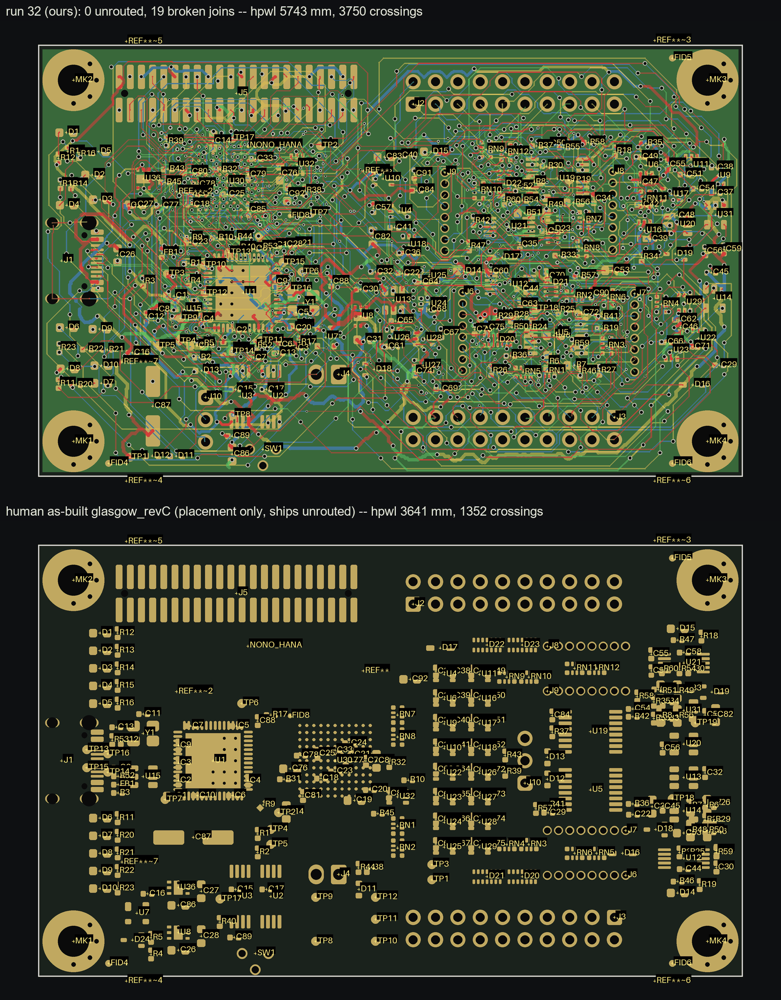
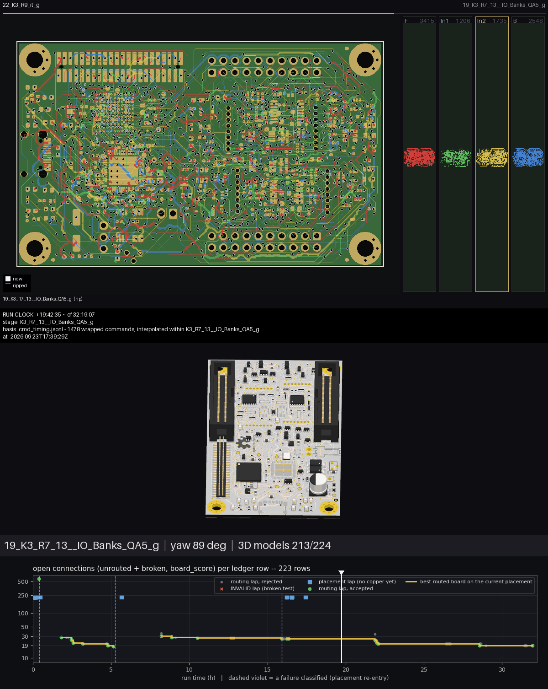

# Run 32: glasgow_revC placed and routed from an off-board pile

Discussion: #118 (run post and follow-ups). Issues filed from the run: #1031–#1040.
Fixture boards: `tests/fixtures/run32/`.

**Subject.** Glasgow Interface Explorer revC: 264 parts, 1149 pads, 251 nets, 4 layers,
80 × 49 mm. An iCE40 BGA-121 at 0.8 mm pitch (U30), a Cypress QFN-56 USB controller (U1),
and two level-shifted 2×10 I/O banks. 243 movable parts started piled south of the outline
with no copper; the 21 KiCad-locked parts stayed in place. Router: grid_router built from
main's source (0 commits after v0.22.1).

## Result: not finished

| shipped board `routed_c3` | value | instrument |
|---|---:|---|
| unrouted / broken | **0 / 19** joins over 17 nets | `kicad_unconnected.py --pairs-json` |
| DRC at the routed 0.1 mm | 0 | `check_drc --clearance 0.1 --baseline <input>` |
| assembly | buildable | `check_assembly --clearance 0.2` |
| `blocking` | 30 = broken 19 + floorplan 11 | `board_score --intent` |
| vias / copper / segments | 1271 / 9175 mm / 9065 | `board_score` |
| `check_complete` | UNSOUND: the BGA escape is below the declared floors (track 0.2→0.0889, via 0.5→0.25, hole 0.3→0.15) | `check_complete --authored-from` |

Stop token **BUDGET**: 223 ledger rows against a budget of 100. The independent verifier (a
fresh agent) failed connectivity (the 19 joins), DRC (2 TRACK-HOLE at J5 at the declared
0.25 mm, #1038) and spec (power nets under their requested width, #1033; 11 decap-proximity
errors). It passed the record check.

Open joins: +3V3 ×3, /D2, /~{ALERT}, /PKTEND, /xVBUS, Net-(U3-A1), Net-(U30A-IOT_172),
/IO_Banks/QA1, QA5, QB2, QB3, QB5, DA3, DB7, Z4_P, Z5_P, Z7_N.

## Against the human original

glasgow_revC ships **unrouted** (0 segments, 0 vias), so only placement can be compared.
Both sides below are measured with the same instrument, `render_placement --json-out`:

| | human as-built | run 32 |
|---|---:|---:|
| airwire crossings | **1352** | 3750 |
| hpwl | **3641 mm** | 5743 mm |
| courtyard overlap | 70.05 mm² | **23.69 mm²** |
| pad-conflict pairs | 10 | **6** |

The human puts U30 centre-left with U1 directly west of it, beside J1, and stacks the level
shifters in two columns next to their banks. Run 32 stacks U30 above U1, so their 27-net bus
(142 pin-order inversions, against the human's 96, from `board_context`) runs about 19 mm
through the densest window on the board. Every stranded pad is PASSABLE on the copper-free
board. Yet four full bulk routes each failed about 30 *different* nets, which points to a board
short of routing space overall rather than to particular blocked pads (#1040). Two attempts to
close the placement gap were measured and refused:
- local re-arrangement: at most −2.3 % hpwl, and it broke checks;
- four fresh seeds without the zone plan: 5952–6563 mm, all worse.

## How the loop turned

1. **Placement re-entry.** U30's dogbone escape vias landed in the pads of six back-side
   passives under the BGA (13 pad-to-via, 8 in contact). Re-seated; the fanout came out clean.
2. **Placement re-entry.** 17 signal pads sat in the board's F/B rule-area keepout band. No
   placement instrument models it (#1031).
3. **Placement lineage.** +3V3 as a solid In2 plane needed C79, C14 and C33 re-seated. It
   routed 6 joins worse at the same stage, so it was dropped.
4. **Routing.** Four bulk lineages and ~190 scoped laps. Routing the U1↔U30 bus before the diff
   pairs bought 3 joins. The lever that moved the endgame was ripping the single rail or
   protected pair each net's Hint names, in its own lap (27 → 21), then a `'*'` pass
   (21 → 19). Scoped laps must carry GND in `--nets` (#1032). One batch of 24 laps was an
   invalid test (shifted arguments) and is recorded as such (#1039).

## The movie

The placement glide, then routing step by step with the 3D view, with the run's progress graph
along the bottom. Each ledger row's open connections are plotted against run time. The gold
line is the best board on the current placement, violet lines mark placement re-entries, and a
white marker shows the frame's moment.

The GIF and MP4 (about 15 MB, rebuildable from boards) are on
`edgehero/KiCadRoutingTools@run32-assets`, under `media/run32/`: `run32_graph.gif`,
`run32_graph.mp4`, and `compose_graph.py`, the script that composes them. That branch also
holds the full report, `REPORT.md`, with waivers, audits and a cost table. Building the movie
hit #1035 and #1036.

## Cost

31 h 39 min wall clock and 39 h 30 min of summed tool time; the lineages ran in parallel
(`cmd_timing.py`). The three bulk routes took 2 h 25, 1 h 58 and 1 h 38. The ~190 scoped laps
took 5–20 min each (route, GND `repair_planes`, then the KiCad oracle).
