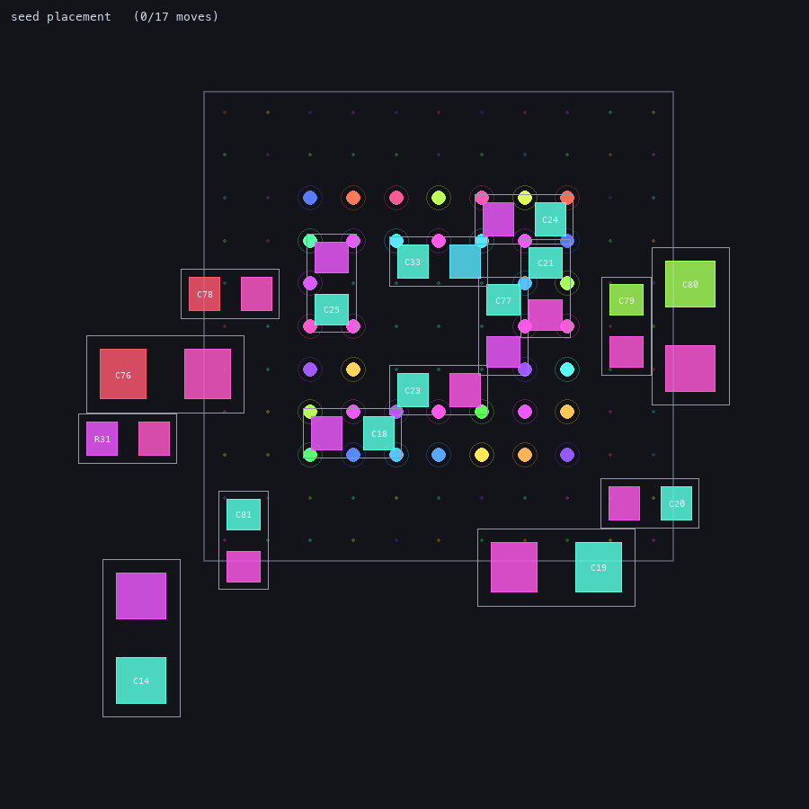

# Placement

Perturbative placement optimization for KiCad PCB files. Starts from an
existing (hand- or AI-made) placement and improves it for routability —
it does not place boards from scratch. Background research and experiment
results: [docs/placement-optimization.md](../docs/placement-optimization.md).

Two command-line tools sit on top of this module:

## place_optimize.py — greedy quench

Small nudges (capped by `--max-displacement`), 90° rotations, and
same-footprint swaps that reduce airwire length + crossings + a whitespace
(halo) penalty scaled by pin count + a soft board-edge margin. Locked
footprints never move.

```bash
# Conservative polish (recommended starting point)
python place_optimize.py input.kicad_pcb optimized.kicad_pcb \
    --max-displacement 3 --length-weight 0.3 --crossing-penalty 30 \
    --halo-coef 0.15 --halo-weight 2 --edge-halo 2 \
    --ignore-nets GND "+3.3V" \
    --lock "J*" "P30*" "*PORT*"
```

Key options:

| Option | Default | Description |
|--------|---------|-------------|
| `--max-displacement` | 10 mm | Max distance a part may move from its seed position (3 mm recommended; large values can destroy the placement's macro structure) |
| `--ignore-nets` | – | Net patterns excluded from airwire scoring (plane-routed power nets) |
| `--lock` | – | Reference patterns to pin in place (connectors, mounting-critical parts) |
| `--halo-coef` | 0.25 | Extra whitespace per √(pin count); keep modest (~0.15) on dense boards |
| `--no-rotate` / `--no-swap` | off | Disable rotation / swap moves |

## place_route_loop.py — router-in-the-loop repair

Routes the board with the real router, reads the failure diagnostics
(failed nets + the blocker nets named in the frontier analysis), and
micro-quenches only the small parts that could help those routes succeed.
Re-routes and keeps the new placement only if (failures, router effort)
actually improves; otherwise reverts and widens the search.

```bash
python place_route_loop.py input.kicad_pcb repaired.kicad_pcb \
    --route-args '--nets "/*" "Net-*" --track-width 0.2 --clearance 0.2 ...' \
    --ignore-nets GND "+3.3V" --lock "J*"
```

On the kit-dev-coldfire demo board this repaired the hand placement from
3 failed nets to 0 with 4.8× less router effort, moving only
resistors/caps/jumpers.

## place_fanout_clearance.py — decoupling-cap clearance repair (issue #130)

Run **after** `bga_fanout.py`. Nudges decoupling caps near a BGA so their
pads clear every foreign-net fanout via, every foreign track on the cap's
own copper side, and every foreign component pad (#130/#278/#275 — a graze
already present at the seed placement is a violation to fix, not a baseline
to preserve), and pulls each pad toward the nearest **same-net** ball — so
a power/GND via dropped at that ball later also lands on the cap pad (one
shared via connects ball + cap + plane). Caps move as little as possible
(90° rotations allowed), never overlap each other or a locked part, and a cap
that can't clear within the (auto-grown) displacement budget is reported
unresolved for a manual nudge.

It reads each via's actual size from the board, so the only setting that
matters is `--clearance`, which must match the fanout / DRC floor:

```bash
# after: bga_fanout.py board.kicad_pcb -o fanned.kicad_pcb --clearance 0.1 ...
python place_fanout_clearance.py fanned.kicad_pcb capclean.kicad_pcb --clearance 0.1
```

| Option | Default | Description |
|--------|---------|-------------|
| `--clearance` | 0.25 mm | DRC clearance; **set to the fanout/DRC floor** |
| `--cap-prefix` | `C,R` | Comma-separated reference prefix(es) for movable passives near a BGA (caps **and** resistors by default). Only 2-copper-pad parts move, so RN-style arrays are auto-excluded; paste-only apertures are ignored when counting pads. |
| `--capture-radius` | 2 mm | Max distance over which a same-net ball attracts a pad |
| `--max-displacement` / `--max-displacement-cap` | 2 / 3 mm | Initial and grown move budget per cap |
| `--default-via-size` | 0.3 mm | Fallback only, for vias with no readable size |
| `--lock` | – | Extra reference patterns to pin in place |

On ulx3s U1 (22×22, 0.8 mm) this took the fanned board from 4 PAD-VIA to
fully DRC-clean, tidying 19 caps toward same-net balls (all ≤1.9 mm). In the
GUI, the **"Optimize decoupling cap placement"** checkbox on the BGA fanout
tab runs the same engine automatically right after fanout (off by default).
The advanced knobs above (capture radius, near margin, search step, max
displacement / cap / growth, max passes, cap-ref prefix, allow-rotation) are
exposed in that tab's **"Cap Placement (advanced)"** box; `--clearance`,
`--grid-step`, and the via size come from the Basic tab.

### animate_fanout_clearance.py — visualize the repair as a GIF

`animate_fanout_clearance.py` (repo root) runs the **same** repair engine and
records every accepted cap move via the engine's optional `on_move` hook, then
renders an animated GIF of the caps gliding from their seed placement to their
final, via-clearing positions. The view is framed to the BGA ball field (not
the whole board); fanout vias appear as net-coloured disks with their keep-out
ring, cap pads are coloured by net, and a faint ghost rectangle marks each
cap's seed position. It accepts all of `place_fanout_clearance.py`'s repair
options plus `--size`, `--fps`, and `--sub-frames` (motion smoothness).



```bash
# after: bga_fanout.py board.kicad_pcb -o fanned.kicad_pcb --escape-method underpad \
#            --via-size 0.3 --via-drill 0.2 --track-width 0.1 --clearance 0.1
python animate_fanout_clearance.py fanned.kicad_pcb capmove.gif --clearance 0.1
```

This is a read-only visualization tool: the `on_move` hook defaults to `None`,
so `place_fanout_clearance.py`, the GUI, and the engine itself behave exactly
as before when it is unused. Requires `pygame` (render) and `Pillow` (GIF
encode) — both already used elsewhere in this repo; no matplotlib/ffmpeg.

## Module layout

| File | Purpose |
|------|---------|
| `quench.py` | The optimizer: cost terms, move generation, greedy quench |
| `fanout_clearance.py` | Post-fanout decoupling-cap clearance repair (#130) |
| `parser.py` | Courtyard boundary and locked-footprint extraction |
| `writer.py` | Writes new positions/rotations (rotates pad angles with the footprint, as KiCad stores pad angle = footprint + pad rotation) |
| `utility.py` | Shared utilities (bbox from pads, grid snapping) |

Note: an earlier from-scratch constructive placer (`place.py` +
`rust_placer/`) was removed after experiments showed hand placements beat it
by ~500× in router effort; see git history and
docs/placement-optimization.md for details.
